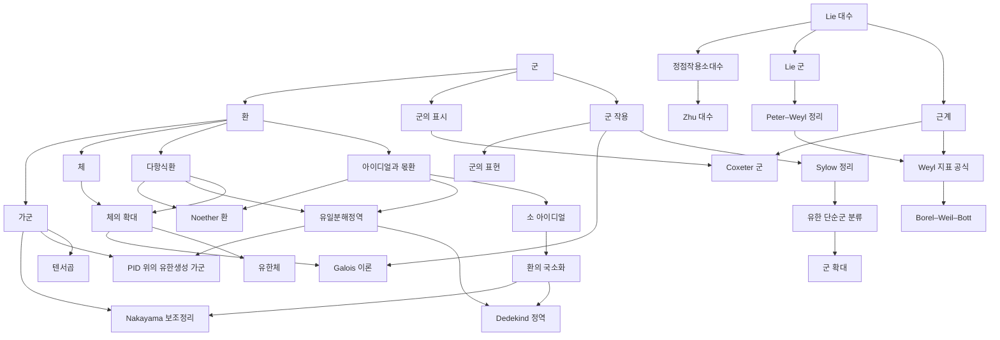

# 추상대수 개관

# 개요

추상대수는 연산의 규칙만 남기고 대상을 잊는다. 군은 대칭을, 환은 덧셈과 곱셈을, 체는 나눗셈까지를 공리화한다. 물음은 "이 공리만으로 무엇이 따라오는가" 와 "구체적 대상이 어느 공리계의 예인가" 다. 추상대수의 갈래는 네 줄기다. 군론, 환과 가군, 체와 Galois 이론, 그리고 Lie 이론과 표현론이다. 정수론으로 넘어가는 대수, 곧 유체론과 Iwasawa 이론은 [정수론 개관](number-theory-overview.md)에 있다.

시작은 [군](groups.md)이다. [군 작용](group-actions.md)에서 [Sylow 정리](sylow-theorems.md)와 [Galois 이론](galois-theory.md)이 갈라지고, [환](rings.md)에서 [아이디얼](ideals-quotient-rings.md)을 거쳐 [체](fields.md)와 [가군](modules.md)이 나온다. 연속적인 대칭은 [Lie 대수](lie-algebras.md)에서 시작한다.

# 지도

# 갈래

## 군론

- [군](groups.md) → [군 작용](group-actions.md): 대칭의 공리화와 궤도–안정자
- [Sylow 정리](sylow-theorems.md) → [유한 단순군 분류](finite-simple-groups.md) → [군 확대와 Jordan–Hölder 정리](group-extensions.md) → [군 코호몰로지](group-cohomology.md), [Schur 곱셈자](schur-multipliers.md)
- [군의 표현](group-representations.md): 군을 행렬로 보는 기본 도구
- [군의 표시](group-presentations.md): 생성원과 관계자로 군을 적는 방법, 낱말 문제
- [Coxeter 군](coxeter-groups.md): 반사로 생성된 군의 표시, 길이 함수와 Bruhat 순서
- [Mathieu 군과 Golay 부호](mathieu-groups.md), [땋임군](braid-groups.md): 조합론·위상과 맞닿은 군

## 환과 아이디얼

- [환](rings.md) → [아이디얼과 몫환](ideals-quotient-rings.md) → [소 아이디얼](prime-ideals.md) → [환의 국소화](localization-rings.md)
- [다항식환](polynomial-rings.md) → [유일분해정역](unique-factorization-domains.md): 환 위의 다항식과 나눗셈, 그리고 Euclid 정역(ED) $\subset$ 주아이디얼정역(principal ideal domain, PID) $\subset$ 유일분해정역(unique factorization domain, UFD) 사슬
- [Noether 환](noetherian-rings.md): 오름사슬 조건과 Hilbert 기저정리
- [Dedekind 정역](dedekind-domains.md): 정수론으로 가는 문

## 가군

- [가군](modules.md) → [텐서곱](tensor-products.md) → [유도 함자](derived-functors.md): 환 위의 벡터 공간과 완전성의 실패를 재는 Tor, Ext
- [PID 위의 유한생성 가군](finitely-generated-modules.md): 구조정리와 Smith 표준형
- [Nakayama 보조정리](nakayama-lemma.md): 국소환 위의 가군을 잉여체로 내려 읽기
- [대수적 K 이론](algebraic-k-theory.md): 환의 사영가군에서 나오는 고차 불변량

## 대수기하로 가는 문

- [대수다양체](algebraic-varieties.md): 다항식의 해집합, 영점정리가 잇는 근기 아이디얼과의 대응, Zariski 위상
- [사영다양체](projective-varieties.md): 동차좌표로 넓힌 공간 위의 대수적 집합, 완비성과 Bezout 정리

## 체와 Galois 이론

- [체](fields.md) → [체의 확대](field-extensions.md) → [유한체](finite-fields.md), [Galois 이론](galois-theory.md)
- [오류정정부호](error-correcting-codes.md): 유한체 위의 선형 부호, 대수가 통신에 쓰이는 첫 자리
- [p 진수](p-adic-numbers.md) → [Newton 다각형](newton-polygon.md): 완비화한 체
- [대수적 수체](algebraic-number-fields.md) → [유체론](class-field-theory.md): 이후는 정수론 개관

## Lie 이론과 표현론

- [Lie 대수](lie-algebras.md) → [근계](root-systems.md) → [Weyl 지표 공식과 최고무게 이론](weyl-character-formula.md)
- [Lie 군](lie-groups.md) → [Peter–Weyl 정리](peter-weyl.md) → [구면조화함수](spherical-harmonics.md)
- [Borel–Weil–Bott 정리](borel-weil-bott.md) → [Beilinson–Bernstein 국소화](beilinson-bernstein.md), [Kazhdan–Lusztig 다항식](kazhdan-lusztig.md) → [범주 O](category-o.md), [Schubert 계산](schubert-calculus.md)
- [Schur 다항식](schur-polynomials.md) → [Littlewood–Richardson 규칙](littlewood-richardson.md), [Schur–Weyl 쌍대성](schur-weyl-duality.md) → [Brauer 대수](brauer-algebras.md)

## 정점작용소대수와 달빛

- [정점작용소대수](vertex-operator-algebras.md) → [Zhu 대수와 모듈러 불변성](zhu-algebra.md) → [Schellekens 목록](schellekens-list.md), [모듈러 텐서범주](modular-tensor-categories.md)
- [Wess–Zumino–Witten 모형](wess-zumino-witten.md): 아핀 Lie 대수의 물리
- [괴물 달빛 추측](monstrous-moonshine.md) → [Umbral moonshine](umbral-moonshine.md)

# 연관 문서

## 선수지식

- [집합](sets.md)

## 더 알아보기

- [군](groups.md)
- [Lie 대수](lie-algebras.md)

#algebra #group_theory #ring_theory #field_theory #overview
