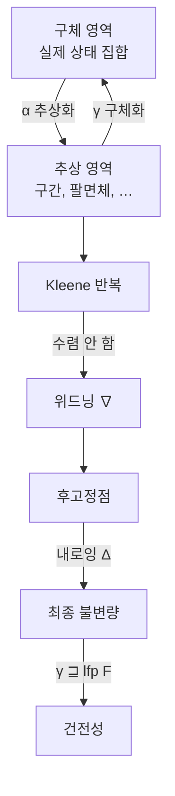

# 추상해석과 정적 분석의 건전성

# 개요

[Galois 연결](galois-connections.md)에서 두 부분순서 집합 사이의 $\alpha\dashv\gamma$ 짝이 "갔다 오면 커진다" 는 성질로 정보의 손실을 정확히 통제한다는 것을 보았다. 그 문서는 마지막에 추상해석을 응용으로 한 줄 언급하고 지나갔다. 이 문서가 그 한 줄을 펼친다.

프로그램의 성질을 실행하지 않고 판정하려는 시도는 Rice 정리에 막힌다. 비자명한 의미론적 성질은 결정 불가능하다. 그렇다면 정적 분석기는 무엇을 하는가. **답을 한쪽으로만 틀리게** 만든다. "이 배열 접근은 안전하다" 고 말할 때는 반드시 맞고, 위험하다고 말할 때는 틀릴 수 있게 설계하는 것이다.

Cousot 부부가 1977 년에 이 아이디어를 수학적으로 정리했다.[^1] 구체 의미론의 영역 $C$ 와 추상 영역 $A$ 를 Galois 연결

$$
\alpha\colon C\rightleftarrows A\colon\gamma,\qquad \alpha(c)\sqsubseteq_A a\iff c\sqsubseteq_C\gamma(a)
$$

로 잇고, 구체 전이함수 $F$ 를 추상 전이함수 $F^\sharp\sqsupseteq\alpha\circ F\circ\gamma$ 로 올린다. 그러면 Knaster–Tarski 정리가 양쪽에서 최소 고정점을 주고

$$
\gamma\bigl(\mathrm{lfp}\,F^\sharp\bigr)\;\sqsupseteq\;\mathrm{lfp}\,F
$$

가 자동으로 따라온다. 이것이 **건전성**이다. 분석기가 계산한 추상값을 구체화하면 실제 도달 가능한 상태를 모두 포함한다. 놓치는 오류가 없다는 보장이 순서론 정리 하나에서 나온다.

# 직관

## 손실을 설계한다

정확한 분석은 불가능하므로 무엇을 잃을지 먼저 정한다. 변수 $x$ 의 정확한 값 집합 $\{2,5,7\}$ 대신 구간 $[2,7]$ 만 기억하기로 하면, 집합의 격자에서 구간의 격자로 내려온 것이다. $\alpha(\{2,5,7\})=[2,7]$ 이고 $\gamma([2,7])=\{2,3,4,5,6,7\}$ 이라 원래보다 커진다. 커지는 방향이 항상 같다는 것이 요점이다. **과대근사만 하고 과소근사는 절대 하지 않는다.**

이 비대칭이 건전성의 전부다. 분석기가 $x\in[2,7]$ 이라 말하면 실제 값은 그 안에 있고, 그래서 $x\ne0$ 이라는 결론은 믿을 수 있다. 반대로 $x\in[-1,7]$ 이 나오면 $0$ 일지 아닐지 모른다고만 말한다. 거짓 경보는 나오지만 놓친 오류는 없다.

## 영역을 고르는 것이 분석기를 고르는 것

| 추상 영역 | 기억하는 것 | 비용 |
|---|---|---|
| 부호 $\{-,0,+\}$ | 부호만 | 아주 쌈 |
| 구간 $[l,u]$ | 변수별 범위 | 쌈 |
| 팔면체 $\pm x\pm y\le c$ | 변수 쌍의 관계 | 중간 |
| 다면체 $\sum a_ix_i\le b$ | 선형 관계 전부 | 비쌈 |

구간 영역은 변수 사이의 관계를 잊는다. $x=y$ 인 줄 알아도 $x-y=0$ 을 표현할 수 없어 $x-y\in[-\infty,\infty]$ 가 된다. 관계를 기억하려면 팔면체나 다면체로 올라가야 하고, 그만큼 각 연산이 비싸진다. 분석기 설계란 이 표에서 한 줄을 고르는 일이다.

## 고정점을 유한 번에 잡는다

루프의 불변량은 전이함수의 최소 고정점이다. Kleene 반복 $\bot,F(\bot),F^2(\bot),\dots$ 이 그것에 수렴하지만, 추상 영역이 무한 높이면 수렴이 끝나지 않거나 지나치게 느리다. 구간 영역이 정확히 그런 경우다.

```javascript
const BOT = 'bot';
const mk = (l, u) => (l > u ? BOT : [l, u]);
const join = (a, b) => a === BOT ? b : b === BOT ? a : mk(Math.min(a[0],b[0]), Math.max(a[1],b[1]));
const meet = (a, b) => a === BOT || b === BOT ? BOT : mk(Math.max(a[0],b[0]), Math.min(a[1],b[1]));
const add1 = (a) => a === BOT ? BOT : mk(a[0] + 1, a[1] + 1);
const eq = (a, b) => a === BOT || b === BOT ? a === b : a[0] === b[0] && a[1] === b[1];
const show = (a) => a === BOT ? '⊥' : `[${a[0] === -Infinity ? '-∞' : a[0]}, ${a[1] === Infinity ? '+∞' : a[1]}]`;

// 위드닝: 늘어나는 쪽 끝을 곧바로 무한으로 보낸다
const widen = (a, b) => a === BOT ? b : b === BOT ? a :
  mk(b[0] < a[0] ? -Infinity : a[0], b[1] > a[1] ? Infinity : a[1]);

// 분석 대상: x = 0; while (x < 100) x = x + 1;
// 루프 머리의 불변량은 X = [0,0] ⊔ ((X ⊓ [-∞,99]) + 1) 의 최소 고정점
const F = (X) => join(mk(0, 0), add1(meet(X, mk(-Infinity, 99))));

let X = BOT, n = 0;
while (true) { const Y = F(X); n++; if (eq(X, Y)) break; X = Y; }
console.log(`Kleene 반복: ${n} 단계, 결과 ${show(X)}`);       // 102 단계, [0, 100]

let W = BOT, m = 0;
while (true) { const Y = widen(W, F(W)); m++; if (eq(W, Y)) break; W = Y; }
console.log(`위드닝: ${m} 단계, 결과 ${show(W)}`);            // 3 단계, [0, +∞]

let N = W, k = 0;
while (true) { const Y = F(N); k++; if (eq(N, Y)) break; N = Y; }
console.log(`내로잉: ${k} 단계, 결과 ${show(N)}`);            // 2 단계, [0, 100]
```

순진한 반복은 $[0,0],[0,1],[0,2],\dots$ 로 한 칸씩 기어올라 $102$ 단계가 걸린다. 상한이 $100$ 이 아니라 $10^9$ 였다면 사실상 끝나지 않는다. **위드닝**은 두 번째 단계에서 상한이 늘어나는 것을 보고 곧바로 $+\infty$ 로 점프해 $3$ 단계에 멈춘다. 대신 $[0,+\infty]$ 는 너무 거칠다. 여기서 다시 $F$ 를 반복하는 **내로잉**이 $[0,100]$ 으로 정확한 답을 회복한다.

세 줄짜리 실험이지만 실제 분석기가 하는 일의 축소판이다. 위드닝으로 종료를 보장하고 내로잉으로 정밀도를 되찾는다.

## 왜 위드닝이 건전한가

위드닝은 임의로 크게 뛰므로 답이 부정확해질 수 있다. 그러나 **위로만** 뛰기 때문에 건전성은 깨지지 않는다.

$$
a\sqsubseteq a\,\nabla\,b,\qquad b\sqsubseteq a\,\nabla\,b
$$

를 요구하면 위드닝 수열은 항상 실제 고정점 위에 머문다. 여기에 "무한 상승 사슬을 만들지 않는다" 는 조건을 더하면 종료도 보장된다. 정밀도만 희생하고 두 가지 필수 성질을 모두 지키는 것이다.



# 정의

## 추상 영역과 Galois 연결

완비 격자 $(C,\sqsubseteq)$ 를 구체 영역, $(A,\sqsubseteq^\sharp)$ 를 추상 영역이라 하고 단조사상 쌍 $\alpha,\gamma$ 가 Galois 연결을 이룬다고 하자. $\alpha\circ\gamma=\mathrm{id}_A$ 이면 **Galois 삽입**이라 부르며, 이때 추상 영역에 같은 것을 두 번 표현하는 잉여가 없다.

Galois 연결의 판정 조건이 여기서 실무적으로 쓰인다. $\gamma$ 를 먼저 설계하고 그것이 하한을 보존하는지만 확인하면 $\alpha$ 는 자동으로 존재하고 유일하다. 두 사상을 각각 만들어 정합성을 맞출 필요가 없다.

## 건전한 추상 전이함수

구체 전이함수 $F\colon C\to C$ 에 대해 $F^\sharp\colon A\to A$ 가 **건전**하다는 것은

$$
\alpha\circ F\circ\gamma\;\sqsubseteq^\sharp\;F^\sharp
$$

즉 각 추상값에서 한 걸음 나아간 결과를 $F^\sharp$ 가 과대근사한다는 뜻이다. 등호가 성립하는 $F^\sharp=\alpha\circ F\circ\gamma$ 를 **최적 추상 전이함수**라 하고, 이는 존재하지만 계산 가능하지 않을 수 있어 실무에서는 더 거친 것을 쓴다.

## 고정점 전달 정리

$F^\sharp$ 가 건전하면

$$
\mathrm{lfp}\,F\;\sqsubseteq\;\gamma\bigl(\mathrm{lfp}\,F^\sharp\bigr)
$$

가 성립한다. 증명은 짧다. $\mathrm{lfp}\,F^\sharp$ 의 구체화가 $F$ 의 후고정점임을 확인하고 Knaster–Tarski 의 최소성을 쓰면 된다. 분석기의 건전성 증명이 통째로 이 한 줄로 환원되는 것이 이 이론의 실용적 가치다.

## 위드닝과 내로잉

연산자 $\nabla\colon A\times A\to A$ 가 **위드닝**이라 함은

1. $a\sqsubseteq a\nabla b$ 이고 $b\sqsubseteq a\nabla b$
2. 임의의 수열 $(b_n)$ 에 대해 $a_0=b_0$, $a_{n+1}=a_n\nabla b_{n+1}$ 로 정의한 수열이 유한 단계에 안정화

를 만족하는 것이다. 조건 2 가 종료를 강제한다. 대칭적으로 $\Delta$ 가 **내로잉**이라 함은 $b\sqsubseteq a$ 일 때 $b\sqsubseteq a\Delta b\sqsubseteq a$ 이고 하강 사슬이 안정화하는 것이다.

# 성질

## 정밀도와 비용의 교환

추상 영역을 정밀하게 할수록 거짓 경보가 줄지만 각 연산이 비싸진다. 다면체 영역은 볼록 껍질 계산이 지수적일 수 있어 큰 프로그램에 쓰기 어렵고, 팔면체는 $O(n^3)$ 의 최단경로 닫힘으로 균형점을 잡는다. 실무 분석기는 여러 영역을 곱해서 쓰거나(약한 곱, 축소된 곱) 프로그램 구간마다 다른 영역을 붙인다.

## 완전성은 드물다

건전성은 설계로 얻지만 **완전성**(거짓 경보가 전혀 없음)은 거의 얻지 못한다. 완전한 분석은 결정 불가능한 문제를 푸는 것이 되기 때문이다. 다만 특정 성질에 대해 특정 영역이 완전한 경우가 있고, 어떤 영역이 어떤 성질에 완전한지를 연구하는 완전성 이론이 따로 있다.

## 위드닝이 정밀도를 잃는 방식

위드닝 지점을 어디에 두느냐가 결과를 크게 바꾼다. 루프 머리마다 위드닝을 걸면 안전하지만 거칠고, 몇 번 반복한 뒤에 걸면(지연 위드닝) 정밀해지지만 느리다. 위 예제에서도 $F$ 를 두 번 돌린 다음 위드닝을 시작하면 $[0,+\infty]$ 를 거치지 않고 더 좋은 결과에 이른다. 이런 조율이 분석기 튜닝의 큰 부분을 차지한다.

## Rice 정리와의 관계

Rice 정리는 정확한 분석을 금지할 뿐, 한쪽으로 치우친 분석을 금지하지 않는다. 추상해석은 그 틈을 체계적으로 사용하는 방법론이다. 같은 구도가 형 검사기(형이 붙으면 안전, 안 붙어도 안전할 수 있음)와 모델 검사(추상 정련)에도 있고, 셋 모두 "결정 불가능성을 과대근사로 우회한다" 는 같은 전략을 쓴다.

# 활용

## 산업용 분석기

Astrée 는 이 이론 위에 세워져 항공 제어 소프트웨어에서 실행시간 오류가 없음을 증명했다. 부동소수점 연산까지 포함한 수십만 줄 코드에서 거짓 경보를 $0$ 으로 만든 것이 성과였고, 그것을 위해 대상 프로그램군에 특화된 추상 영역(등차수열 영역, 필터 영역)을 새로 설계했다. **영역을 문제에 맞춰 만드는 것**이 실전에서 이 이론을 쓰는 방식이다.

## 컴파일러 최적화

상수 전파, 범위 검사 제거, 별칭 분석이 모두 추상해석의 사례다. 최적화가 프로그램의 의미를 바꾸지 않으려면 분석이 건전해야 하므로, 여기서는 건전성이 정확성 요구 그 자체다.

## 다른 곳에 같은 구조

- **형 시스템.** 형은 값의 추상이고 형 규칙은 건전한 추상 전이함수다. 형 추론이 고정점 계산인 경우도 많다.
- **기계학습 모형 검증.** 신경망의 입력 구간을 추상 영역으로 전파해 출력 범위를 과대근사하면 견고성 증명이 된다. 구간, 다면체, zonotope 이 그대로 쓰인다.
- **확률 프로그램.** 분포의 상계를 전파하는 확률 추상 영역이 같은 틀에서 정의된다.

[^1]: P. Cousot, R. Cousot, *Abstract interpretation: a unified lattice model for static analysis of programs by construction or approximation of fixpoints*, POPL (1977), 238–252. 위드닝과 내로잉은 같은 저자의 *Comparing the Galois connection and widening/narrowing approaches to abstract interpretation*, PLILP (1992). Astrée 의 설계는 Blanchet 등, *A static analyzer for large safety-critical software*, PLDI (2003). 본문의 구간 분석 실험은 직접 한 것이다.

# 연관 문서

## 선수지식

- [Galois 연결과 완비 격자](galois-connections.md)

## 더 알아보기

아직 연결한 문서가 없다.

#order_theory #computation #logic
