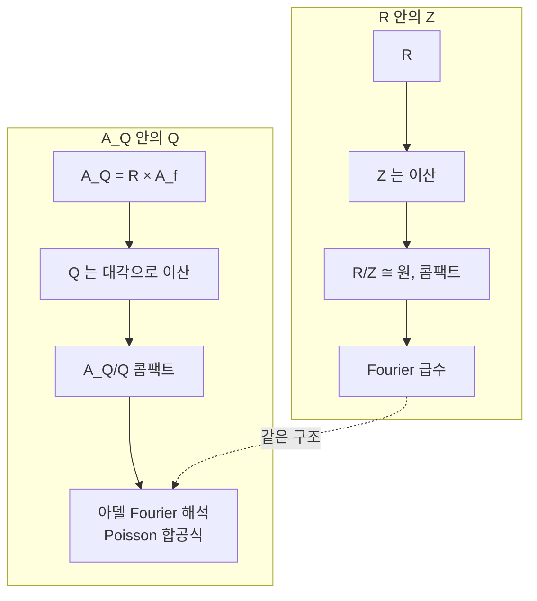

# 아델과 이델

# 개요

[p 진수](p-adic-numbers.md) 문서에서 $\mathbb Q$ 의 자리가 소수들과 무한 자리 하나로 전부라는 것을 보았다. 그리고 곱 공식 $\prod_v|x|_v=1$ 은 모든 자리를 동시에 봐야 의미를 갖는 등식이었다. 그렇다면 자리 전체를 한 덩어리로 묶은 대상을 만들어야 한다.

단순한 직적 $\prod_v K_v$ 는 너무 크다. 국소콤팩트성을 잃어 Haar 측도도 Fourier 해석도 할 수 없다. 직합은 너무 작아 $\mathbb Q$ 조차 담지 못한다. 올바른 중간이 **제한직적**이다. 거의 모든 자리에서 정수환 안에 있을 것만 요구한다.

$$
\mathbb A_K=\Big\{(x_v)\in\prod_vK_v:\text{거의 모든 } v \text{ 에서 } x_v\in\mathcal O_v\Big\}
$$

이렇게 만든 아델 환에서 놀라운 일이 일어난다. [수체](algebraic-number-fields.md) $K$ 가 $\mathbb A_K$ 안에 **이산 부분군**으로 들어가고 몫이 **콤팩트**해진다. $\mathbb Z\subset\mathbb R$ 와 똑같은 그림이다. 곱군 쪽으로 가면 유수의 유한성과 Dirichlet 단원 정리가 "노름 1 인 이델류군이 콤팩트하다" 는 한 문장으로 합쳐진다. 서로 다른 두 고전 정리가 사실 같은 콤팩트성이었던 것이다.

# 직관

## 중국인의 나머지 정리의 극한

$\mathbb Z/n\mathbb Z\cong\prod_{p^k\|n}\mathbb Z/p^k\mathbb Z$ 가 중국인의 나머지 정리다. $n$ 을 계속 키워 극한을 취하면

$$
\hat{\mathbb Z}=\varprojlim_n\mathbb Z/n\mathbb Z\cong\prod_p\mathbb Z_p
$$

가 된다. 모든 법에서의 나머지 정보를 한꺼번에 들고 있는 환이다. 여기에 $\mathbb Q$ 를 텐서해 분모를 허용하면 유한 아델 $\mathbb A_f$ 가 나오고, 무한 자리를 곱하면

$$
\mathbb A_{\mathbb Q}=\mathbb R\times\mathbb A_f,\qquad \mathbb A_f=\hat{\mathbb Z}\otimes_{\mathbb Z}\mathbb Q
$$

다. 아델 하나는 "실수 하나와 모든 법에서의 나머지 정보" 를 묶은 것이라고 읽으면 된다.

## 왜 하필 제한직적인가

$\prod_p\mathbb Z_p$ 는 콤팩트하다. 콤팩트 공간의 곱이 콤팩트라는 Tychonoff 정리 때문이다. 그런데 $\prod_p\mathbb Q_p$ 는 국소콤팩트조차 아니다. 각 $\mathbb Q_p$ 가 콤팩트하지 않아 무한 곱에서 콤팩트 근방을 만들 수 없다.

제한직적은 이 문제를 정확히 해결한다. $\prod_p\mathbb Z_p$ 라는 콤팩트 열린 부분군을 하나 심어 두고 그 평행이동으로 위상을 준다. 그러면 전체가 국소콤팩트가 되고 Haar 측도가 생긴다. Fourier 해석이 가능해지는 것이 결정적이다.

조건이 "거의 모든 자리에서 정수" 인 이유도 분명하다. 유리수 $x$ 의 분모에는 유한 개의 소수만 나오므로 $\mathbb Q$ 가 실제로 $\mathbb A_{\mathbb Q}$ 안에 들어간다. 직합이었다면 $x_v=x$ 인 대각 원소가 거의 모든 자리에서 0 이 아니라 들어가지 못한다.

## $\mathbb Q$ 는 아델 안의 격자다



$\mathbb A_{\mathbb Q}=\mathbb Q+\big([0,1)\times\hat{\mathbb Z}\big)$ 라는 분해가 성립한다. 아델 하나를 받으면, 유한 자리들의 분모를 유리수 하나로 털어내고(중국인의 나머지 정리) 실수 자리를 $[0,1)$ 로 밀어 넣을 수 있다. $\mathbb R=\mathbb Z+[0,1)$ 의 아델 판이며, $[0,1)\times\hat{\mathbb Z}$ 가 기본영역이다. 기본영역이 콤팩트하므로 몫이 콤팩트하다.

이 그림이 왜 중요한가. $\mathbb R/\mathbb Z$ 가 콤팩트라서 Fourier 급수가 있듯, $\mathbb A_{\mathbb Q}/\mathbb Q$ 가 콤팩트라서 아델 위의 Poisson 합공식이 성립한다. Tate 는 이 합공식 하나로 $\zeta$ 함수의 함수방정식을 유도했다.

# 정의

## 아델 환

$K$ 가 수체(또는 함수체)이고 $v$ 가 그 자리일 때, $K_v$ 를 완비화, $\mathcal O_v$ 를 그 정수환이라 하자(아르키메데스 자리에서는 $\mathcal O_v$ 조건을 붙이지 않는다).

$$
\mathbb A_K={\prod_v}'\,(K_v,\mathcal O_v)
=\Big\{(x_v):x_v\in\mathcal O_v \text{ for almost all } v\Big\}
$$

위상은 유한집합 $S$ (아르키메데스 자리를 모두 포함) 마다

$$
\mathbb A_{K,S}=\prod_{v\in S}K_v\times\prod_{v\notin S}\mathcal O_v
$$

를 열린 부분환으로 두고 그 곱위상의 합집합으로 준다. 결과는 국소콤팩트 위상환이며, 대각 매장 $K\hookrightarrow\mathbb A_K$ 가 정의된다.

## 이델군

곱군은 $\mathbb A_K^\times$ 인데, 여기에 $\mathbb A_K$ 의 부분공간 위상을 주면 안 된다. 역원 연산이 연속이 아니기 때문이다. 올바른 위상은 $x\mapsto(x,x^{-1})$ 로 $\mathbb A_K\times\mathbb A_K$ 에 매장해 얻는 것이고, 결과적으로

$$
\mathbb A_K^\times={\prod_v}'\,(K_v^\times,\mathcal O_v^\times)
$$

의 제한직적 위상과 같다. 이 군을 **이델군**이라 한다.

**이델 노름**은 자리별 절댓값의 곱이다.

$$
|x|_{\mathbb A}=\prod_v|x_v|_v
$$

거의 모든 자리에서 $|x_v|_v=1$ 이므로 유한 곱이라 잘 정의된다. 곱 공식은 정확히 $\alpha\in K^\times$ 마다 $|\alpha|_{\mathbb A}=1$ 이라는 것 라는 뜻이므로, $K^\times$ 가 노름 1 인 부분군 $\mathbb A_K^{\times,1}$ 안에 들어간다.

## 이델류군

$$
C_K=\mathbb A_K^\times/K^\times
$$

를 **이델류군**이라 한다. 이름대로 유수군을 품는다. 유한 자리의 $\mathcal O_v^\times$ 들과 아르키메데스 성분을 묶어 $U=\prod_{v\nmid\infty}\mathcal O_v^\times\times\prod_{v\mid\infty}K_v^\times$ 로 두면

$$
C_K/\,\overline{U}\ \cong\ \mathrm{Cl}(K)
$$

이고, 더 작은 열린 부분군으로 나누면 [광선유군](class-field-theory.md)이 나온다. 곧 $C_K$ 는 모든 모듈러스의 광선유군을 동시에 담는 대상이며, 유체론이 모듈러스를 하나씩 고르지 않고 한 줄로 서술되는 이유다.

# 성질

## 이산성과 콤팩트성

> **정리.** $K$ 는 $\mathbb A_K$ 의 이산 부분군이고 $\mathbb A_K/K$ 는 콤팩트하다.

증명의 뼈대는 $\mathbb Q$ 에서 본 분해와 같다. $\mathcal O_K$ 를 $\prod_{v\mid\infty}K_v$ 의 격자로 실현하는 Minkowski 논증에, 유한 자리에서 분모를 털어내는 중국인의 나머지 정리를 붙인다. 실제로 이 정리 하나가 격자 이론의 아델 판이다.

곱군 쪽이 더 깊다.

> **정리.** $\mathbb A_K^{\times,1}/K^\times$ 는 콤팩트하다.

이 한 문장이 두 고전 정리와 동치다. 콤팩트성을 유한 자리 쪽으로 밀면 **유수의 유한성**이 나오고, 아르키메데스 자리 쪽으로 밀면 **Dirichlet 단원 정리**가 나온다. 유수군과 단원군이 하나의 콤팩트 몫의 두 그림자였던 셈이다.

$|\cdot|_{\mathbb A}\colon C_K\to\mathbb R_{>0}$ 의 핵이 이 콤팩트군이므로 구조가 이렇게 정리된다.

$$
C_K\cong\mathbb R_{>0}\times C_K^1,\qquad C_K^1 \text{ 콤팩트}
$$

## 강근사

$K$ 가 $\mathbb A_K$ 에서 이산이므로 조밀할 수는 없다. 그런데 자리 하나를 빼면 이야기가 달라진다.

> **강근사 정리.** $S$ 가 비어 있지 않은 자리들의 집합이면, $K$ 는 $\mathbb A_K^S=\prod'_{v\notin S}K_v$ 에서 조밀하다.

$S=\{\infty\}$ 로 두면 "유한 개의 소수에서 원하는 합동조건을 지정하면 그것을 만족하는 유리수가 있다" 는 중국인의 나머지 정리가 된다. $S=\{p\}$ 로 두면 실수 근사와 나머지 소수에서의 합동조건을 동시에 만족시킬 수 있다는 뜻이 된다.

빼는 자리가 반드시 하나는 있어야 한다는 점이 핵심이다. 곱 공식이 모든 자리를 묶고 있으므로, 다른 자리를 다 지정하면 남은 자리의 절댓값이 강제된다. 근사의 대가를 어딘가에서 치러야 하고, $S$ 가 그 대가를 치르는 자리다.

## Tate 논문과 함수방정식

$\mathbb A_K$ 는 가법군으로서 자기쌍대다. 비자명한 가법 지표 $\psi$ 를 하나 고정하면 $x\mapsto\psi(xy)$ 가 쌍대군 전체를 준다. $K$ 가 이산이고 몫이 콤팩트하므로 Poisson 합공식이 성립한다.

$$
\sum_{\alpha\in K}f(\alpha)=\sum_{\alpha\in K}\hat f(\alpha)
$$

Tate 는 여기에 이델 위의 zeta 적분

$$
Z(f,s)=\int_{\mathbb A_K^\times}f(x)\,|x|_{\mathbb A}^s\,d^\times x
$$

를 얹었다. 적분이 국소 인자의 곱으로 쪼개져 Euler 곱이 나오고, Poisson 합공식이 $s\leftrightarrow1-s$ 대칭을 준다. Riemann 과 Hecke 가 theta 함수의 변환식으로 힘들게 얻었던 $\zeta_K(s)$ 의 해석적 접속과 함수방정식이, 감마 인자와 판별식까지 포함해 자동으로 따라 나온다.

이 논문이 자기동형 $L$ 함수의 표준 서술 방식을 정했다. $L$ 함수를 급수로 정의하지 않고 군 위의 적분으로 정의하면 해석적 성질이 표현론에서 나온다는 전략이며, [Langlands 강령](langlands-program.md)이 그대로 물려받았다.

## 자기동형 형식의 무대

$\mathrm{GL}_n(K)$ 는 $\mathrm{GL}_n(\mathbb A_K)$ 의 이산 부분군이므로 몫공간

$$
\mathrm{GL}_n(K)\backslash\mathrm{GL}_n(\mathbb A_K)
$$

위의 함수를 볼 수 있다. $n=1$ 이면 이델류군이고, $n=2$ 이면 [모듈러 형식](modular-forms.md)의 아델 판이다.

고전적 서술과의 번역이 유용하다. 레벨 $\Gamma_0(N)$ 이 유한 자리의 콤팩트 열린 부분군 $K_0(N)\subset\mathrm{GL}_2(\hat{\mathcal O})$ 에 대응하고, 강근사 정리가

$$
\mathrm{GL}_2(\mathbb Q)\backslash\mathrm{GL}_2(\mathbb A_{\mathbb Q})/K_0(N)\ \cong\ \Gamma_0(N)\backslash\mathbb H
$$

를 준다. Hecke 작용소는 이중 잉여류 $K_0(N)\,\mathrm{diag}(1,p)\,K_0(N)$ 이 된다. 레벨과 Hecke 작용소라는 다소 임의로 보이던 장치가 군론적으로 해명되는 것이다.

# 활용

## 강근사를 계산으로 확인한다

유한 개의 소수에서 $p$ 진 근사 조건을 주고, 동시에 실수 자리에서 $\pi$ 에 가까운 유리수를 실제로 만들어 본다. 빼는 자리는 $S=\{3\}$ 이다.

```python
from fractions import Fraction
import math

def v_p(x, p):
    if x == 0: return math.inf
    n, d, v = x.numerator, x.denominator, 0
    while n % p == 0: n //= p; v += 1
    while d % p == 0: d //= p; v -= 1
    return v

def crt(pairs):
    """[(법, 나머지)] 를 하나의 합동식으로. 법들은 서로소여야 한다."""
    M, a = 1, 0
    for m, r in pairs:
        t = ((r - a) * pow(M, -1, m)) % m
        a, M = a + M*t, M*m
    return a % M, M

# 국소 조건 : r ≡ 1/3 (mod 2⁵),  r ≡ 2 (mod 5³),  그리고 실수 자리에서 π 에 가깝게
conds = [(2, 5, Fraction(1, 3)), (5, 3, Fraction(2))]
a, M = crt([(p**k, (t.numerator * pow(t.denominator, -1, p**k)) % p**k)
            for p, k, t in conds])
print(f"유한 자리 조건을 모으면  r ≡ {a} (mod {M})")

# r = a + M·(n/3^j). 분모 3^j 는 2, 5 와 서로소라 위의 조건을 건드리지 않는다.
target, j = Fraction(math.pi), 30
n = round((target - a) / M * 3**j)
r = a + M * Fraction(n, 3**j)
print(f"r = {r.numerator} / {r.denominator}")
for p, k, t in conds:
    print(f"  v_{p}(r - {t}) = {v_p(r - t, p)}   (요구: ≥ {k})")
print(f"  |r - π| = {abs(float(r) - math.pi):.3e}")
print(f"  대가를 치르는 자리 : v_3(r) = {v_p(r, 3)}"
      f"   /  건드리지 않은 자리 : v_7 = {v_p(r, 7)}, v_11 = {v_p(r, 11)}")

# Ẑ = lim Z/n 과 ∏ Z_p 의 일치를 중국인의 나머지 정리로 확인
for N in (2**3 * 3**2 * 5, 2**4 * 3**2 * 5 * 7):
    fac, m = [], N
    for p in (2, 3, 5, 7, 11):
        k = 0
        while m % p == 0: m //= p; k += 1
        if k: fac.append((p, k))
    ok = all(crt([(p**k, x % p**k) for p, k in fac])[0] == x % N for x in range(N))
    print(f"Z/{N} ≅ ∏ Z/p^k  ({fac}) : {ok}")

# 유한 자리 조건을 모으면  r ≡ 3627 (mod 4000)
# r = 215608689342641 / 68630377364883
#   v_2(r - 1/3) = 7   (요구: ≥ 5)
#   v_5(r - 2) = 3   (요구: ≥ 3)
#   |r - π| = 4.277e-13
#   대가를 치르는 자리 : v_3(r) = -29   /  건드리지 않은 자리 : v_7 = 1, v_11 = 0
# Z/360 ≅ ∏ Z/p^k  ([(2, 3), (3, 2), (5, 1)]) : True
# Z/5040 ≅ ∏ Z/p^k  ([(2, 4), (3, 2), (5, 1), (7, 1)]) : True
```

유한 자리의 조건들은 중국인의 나머지 정리로 하나의 합동식이 되고, 실수 자리는 남은 자유도로 맞춘다. 대가는 $v_3(r)=-29$ 로 나타난다. 빼기로 한 자리에서 절댓값이 크게 튀는 것이 강근사의 정확한 값이며, 곱 공식이 그 크기를 강제한다.

## 왜 아델로 바꿔 쓰는가

같은 내용을 고전적으로도 쓸 수 있는데 굳이 아델을 쓰는 이유가 있다.

- **모듈러스가 사라진다.** 유체론을 광선유군으로 쓰면 모듈러스 $\mathfrak m$ 을 매번 고르고 정합성을 확인해야 한다. 이델류군은 모든 $\mathfrak m$ 을 동시에 담아 $C_K\to\mathrm{Gal}(K^{\mathrm{ab}}/K)$ 한 줄로 끝난다.
- **국소와 대역이 같은 언어가 된다.** 각 $K_v^\times$ 에서의 국소 유체론과 대역 유체론이 같은 그림의 부분과 전체가 된다. 국소 조건들을 붙여 대역 대상을 만드는 절차가 제한직적으로 형식화된다.
- **해석이 가능해진다.** 국소콤팩트라 Haar 측도와 Fourier 변환이 있다. Tate 논문이 그 첫 수확이고, 자기동형 형식의 스펙트럼 분해와 대각합 공식이 그 위에 세워진다.
- **군을 바꿔 끼울 수 있다.** $\mathrm{GL}_1$ 을 $\mathrm{GL}_n$ 이나 다른 환원군으로 바꾸는 것이 서술상 자명해진다. 고전적 언어로는 각 군마다 새 이론을 써야 한다.

## 수체와 함수체의 평행

함수체 $\mathbb F_q(X)$ 에도 자리가 있고 아델이 있다. 이쪽에서는 자리가 곡선의 닫힌 점이고, $\mathbb A/K$ 의 콤팩트성이 곡선의 사영성에 해당하며, 곱 공식이 인자의 차수가 0 이라는 사실이 된다. $\mathbb A_K^{\times}/K^\times\mathcal O^\times$ 가 Picard 군이고, 유수의 유한성이 Picard 군의 유한생성성이 된다.

수체에서 어렵게 증명되는 정리들이 함수체에서는 대수기하의 표준 도구로 나오는 경우가 많다. 아델은 두 세계를 같은 문장으로 서술하게 해 주는 언어이며, 이 유비를 따라가는 것이 Weil 이래 정수론의 일관된 전략이었다.

# 연관 문서

## 선수지식

- [p 진수와 부치](p-adic-numbers.md)
- [대수적 수체와 정수환](algebraic-number-fields.md)

## 더 알아보기

- [논문: Fourier Analysis in Number Fields and Hecke's Zeta-Functions](tate-thesis.md)
- [Brauer 군과 Hasse 원리](brauer-groups.md)

#number_theory #field_theory #analysis
