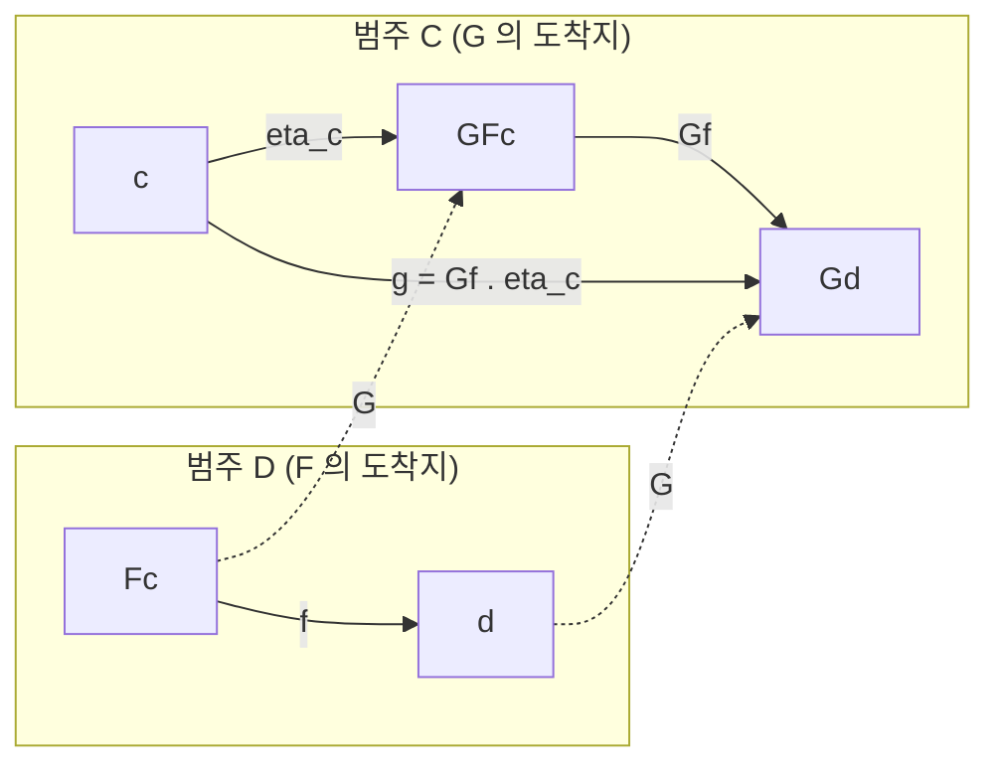

# Adjunction

# 개요

Adjunction은 두 [functor](functors.md) 사이의 관계다. 두 범주 사이를 오가는 functor $F$ , $G$ 가 있을 때, $F$ 를 보낸 뒤 잰 사상의 집합과 $G$ 로 되돌린 뒤 잰 사상의 집합이 자연스럽게 같다면 $F$ 는 $G$ 의 left adjoint다.

자유군 구성, 텐서곱, 지수 대상, 스칼라 확장, 논리의 한정기호가 모두 adjunction 으로 기술된다. adjoint functor 는 limit 과 colimit 의 보존 여부도 결정한다. left adjoint 가 colimit 을 보존하고 right adjoint 가 limit 을 보존한다.

# 직관

## 자유 구성과 망각

망각 functor $U$ 가 군을 그 바탕집합으로 보낸다고 하자. 집합 $S$ 에 대해 "군 구조를 억지로 얹되 아무 관계식도 추가하지 않는" 군이 자유군 $F(S)$ 다. 자유군의 정의적 성질은 다음과 같다.

- 집합 사상 $S\to U(H)$ 를 주는 것과 군 준동형 $F(S)\to H$ 를 주는 것이 같다.

$F(S)$ 에서 나가는 준동형이 $S$ 에서 나가는 집합 사상과 일대일 대응하므로, $F$ 는 관계식을 더하지 않는 생성이다. 이 쌍에서 $F$ 가 left adjoint 이고 망각 functor $U$ 가 right adjoint 다.

## Galois connection

[부분순서](partial-orders.md) 집합을 사상이 최대 하나뿐인 범주로 보면 adjunction은 Galois connection이 된다. 단조사상 $f$ , $g$ 에 대해

$$
f(x) \le y \iff x \le g(y)
$$

가 성립하는 상황이다. 여기서 $f(x)$ 는 $x$ 를 담는 가장 작은 원소, $g(y)$ 는 $y$ 안에 들어가는 가장 큰 원소라는 최적화 문제의 해로 읽힌다. 일반 범주의 adjunction은 이 부등식을 사상의 집합 사이 전단사로 승격시킨 것이다.

## 자연성 조건

hom-set 사이의 전단사가 존재하는 것만으로는 부족하다. 유한집합처럼 크기만 같아도 전단사는 생긴다. 전단사가 $c$ 와 $d$ 를 따라 사상과 호환된다는 조건, 즉 [자연변환](natural-transformations.md)으로서의 동형이라는 조건이 붙어야 unit·counit을 뽑아낼 수 있고 보존 정리가 따라온다.

# 정의

## hom-set 정의

범주 $\mathcal C$ , $\mathcal D$ 와 functor

$$
F : \mathcal{C} \to \mathcal{D}, \qquad G : \mathcal{D} \to \mathcal{C}
$$

가 주어졌다고 하자. $F$ 가 $G$ 의 left adjoint라는 것은 전단사족

$$
\varphi_{c,d} : \mathrm{Hom}_{\mathcal{D}}(Fc, d) \thickspace\xrightarrow{\ \sim\ }\thickspace \mathrm{Hom}_{\mathcal{C}}(c, Gd)
$$

이 존재하고, 이것이 $c$ 와 $d$ 양쪽에 대해 자연스럽다는 뜻이다. 자연성은 임의의 $u:c'\to c$ 와 $v:d\to d'$ 에 대해

$$
\varphi_{c',d'}(v \circ f \circ Fu) = Gv \circ \varphi_{c,d}(f) \circ u
$$

가 성립함을 말한다. 이 관계를 다음과 같이 적는다.

$$
F \dashv G
$$

범주론적으로 정확히 말하면, 두 functor

$$
\mathrm{Hom}_{\mathcal{D}}(F-, -), \quad \mathrm{Hom}_{\mathcal{C}}(-, G-) \thickspace : \thickspace \mathcal{C}^{\mathrm{op}} \times \mathcal{D} \to \mathbf{Set}
$$

사이의 자연동형을 주는 것이 adjunction이다.

## unit과 counit

$F\dashv G$ 이면 두 자연변환

$$
\eta : \mathrm{id}_{\mathcal{C}} \Rightarrow GF, \qquad \varepsilon : FG \Rightarrow \mathrm{id}_{\mathcal{D}}
$$

이 정해진다. $\eta_c = \varphi(\mathrm{id}\_{Fc})$ 와 $\varepsilon_d = \varphi^{-1}(\mathrm{id}\_{Gd})$ 로 두면 된다. 이들은 triangle identity를 만족한다.

$$
(\varepsilon F) \circ (F \eta) = \mathrm{id}_F, \qquad (G \varepsilon) \circ (\eta G) = \mathrm{id}_G
$$



그림의 아래쪽 경로가 전단사 $\varphi$ 그 자체다. $f : Fc \to d$ 를 $G$ 로 옮긴 뒤 unit과 합성하면 $g : c \to Gd$ 가 되고, 반대로 $g$ 에서 $f = \varepsilon_d \circ Fg$ 를 복원한다.

## 두 정의의 동치

**정리.** functor $F$ , $G$ 에 대해 다음은 동치다.

1. triangle identity를 만족하는 자연변환 쌍 $(\eta, \varepsilon)$ 이 존재한다.
2. $c$ 와 $d$ 에 대해 자연스러운 전단사 $\mathrm{Hom}(Fc, d) \cong \mathrm{Hom}(c, Gd)$ 가 존재한다.

*증명 스케치.* (1) → (2): $f : Fc \to d$ 에 $Gf \circ \eta_c$ 를 대응시키고, $g : c \to Gd$ 에 $\varepsilon_d \circ Fg$ 를 대응시킨다. 한쪽 합성을 계산하면

$$
\varepsilon_d \circ F(Gf \circ \eta_c) = \varepsilon_d \circ FGf \circ F\eta_c = f \circ \varepsilon_{Fc} \circ F\eta_c = f
$$

이고 여기서 두 번째 등호는 $\varepsilon$ 의 자연성이며 세 번째는 triangle identity다. 반대 방향도 대칭이다. 자연성은 $F$ 와 $G$ 가 functor이고 $\eta$ 와 $\varepsilon$ 이 자연변환이라는 데서 곧바로 나온다.

(2) → (1): 위에서처럼 항등사상의 상으로 $\eta$ 와 $\varepsilon$ 을 정의하면 전단사의 자연성이 곧 triangle identity가 된다. ∎

## 보편성질로서의 unit

$\eta_c : c \to GFc$ 는 다음 의미에서 보편적이다. 임의의 $d$ 와 $g : c \to Gd$ 에 대해

$$
g = G\tilde{g} \circ \eta_c
$$

를 만족하는 $\tilde g:Fc\to d$ 가 유일하게 존재한다. 이것이 자유 구성의 보편성질 그 자체다. 역으로 각 $c$ 마다 이런 보편 사상이 존재하면 $F$ 를 functor로 확장할 수 있고 $F\dashv G$ 가 된다. 즉 adjoint의 존재는 "대상별 보편성질" 을 모아 놓은 것과 같다.

# 성질

## 유일성

Right adjoint는 존재하면 자연동형을 제외하고 유일하다. $G$ , $G'$ 가 모두 $F$ 의 right adjoint이면

$$
\mathrm{Hom}_{\mathcal{C}}(c, Gd) \cong \mathrm{Hom}_{\mathcal{D}}(Fc, d) \cong \mathrm{Hom}_{\mathcal{C}}(c, G'd)
$$

가 $c$ 에 대해 자연스러우므로 [Yoneda lemma](yoneda-lemma.md)의 따름정리(Yoneda 매장의 충실충만성)에 의해 $Gd \cong G'd$ 이고, 이 동형은 $d$ 에 대해 자연스럽다. Left adjoint도 같은 이유로 유일하다.

## Yoneda lemma와의 관계

Adjunction은 표현가능성의 언어로 다시 쓸 수 있다.

- $G:\mathcal D\to\mathcal C$ 의 left adjoint가 존재할 필요충분조건은, 각 대상 $c$ 에 대해 functor $\mathrm{Hom}\_{\mathcal C}(c,G-):\mathcal D\to\mathbf{Set}$ 가 표현가능한 것이다. 그때 표현 대상이 $Fc$ 다.
- Yoneda lemma는 이 표현 대상이 유일하며 $c$ 에 대한 functor성이 공짜로 따라옴을 보장한다. Adjunction의 자연성 조건이 곧 Yoneda 매장이 충실충만하다는 사실의 응용이다.

달리 말해 adjunction은 "hom-functor를 통해 본 두 범주의 번역 사전" 이고, Yoneda lemma는 그 사전이 대상 자체를 결정한다는 진술이다.

## 극한과 여극한의 보존

**정리 (RAPL).** Right adjoint는 모든 극한을 보존하고, left adjoint는 모든 여극한을 보존한다.

*증명 스케치.* $\mathcal D$ 안의 도형 $d_i$ 가 극한 $\lim d_i$ 를 가진다고 하자. 임의의 $c$ 에 대해

$$
\mathrm{Hom}_{\mathcal{C}}(c, G(\lim_i d_i)) \cong \mathrm{Hom}_{\mathcal{D}}(Fc, \lim_i d_i) \cong \lim_i \mathrm{Hom}_{\mathcal{D}}(Fc, d_i) \cong \lim_i \mathrm{Hom}_{\mathcal{C}}(c, G d_i)
$$

이다. 가운데 등호는 hom-functor가 두 번째 변수에서 극한을 보존한다는 사실이고, 나머지는 adjunction이다. 오른쪽 끝은 $\mathrm{Hom}(c, \lim G d_i)$ 와 같으므로 Yoneda에 의해 $G(\lim d_i) \cong \lim G d_i$ 다. 여극한 쪽은 반대 범주에서 같은 논증을 한다. ∎

이 정리는 실전에서 부정 판정에 특히 강하다. 어떤 구성이 여극한(몫, 직합)을 깨뜨리면 그것은 right adjoint일 수 없다. 예를 들어 [가군](modules.md)에서 텐서곱은 직합을 보존하므로 left adjoint 후보이고, 실제로 Hom의 left adjoint다.

## 존재 정리

역방향 질문, 즉 "극한을 보존하는 functor는 adjoint를 가지는가" 는 크기 조건을 하나 더 요구한다.

**Freyd adjoint functor theorem (진술).** $\mathcal D$ 가 locally small, complete이고 $G:\mathcal D\to\mathcal C$ 가 모든 작은 극한을 보존하며 solution set condition을 만족하면 $G$ 는 left adjoint를 가진다.[^1]

solution set condition은 각 $c$ 마다 $c\to Gd$ 꼴 사상을 "충분히 대표하는" 작은 집합이 있다는 조건으로, 순수한 크기 문제를 막는 장치다.

## 합성과 동치

- $F\dashv G$ 이고 $F'\dashv G'$ 이며 합성이 정의되면 $F'F\dashv GG'$ 다. Adjunction은 합성에 닫혀 있다.
- 범주의 동치는 unit과 counit이 모두 동형인 adjunction과 같다. 이때 $F$ 는 좌우 양쪽 adjoint를 겸한다.
- Counit이 동형이면 $G$ 는 충실충만하다. 이 상황을 reflective subcategory라 부르고, 완비화·군화(group completion)·층화(sheafification)가 모두 여기에 속한다.

## Monad

$F\dashv G$ 에서 $T=GF:\mathcal C\to\mathcal C$ 를 만들면

$$
\eta : \mathrm{id} \Rightarrow T, \qquad \mu = G \varepsilon F : T^2 \Rightarrow T
$$

가 결합법칙과 단위법칙을 만족한다. 이 데이터 $(T, \eta, \mu)$ 가 monad다. 자유군 adjunction의 monad는 "집합에 형식적 낱말을 붙이는" 연산이고, 자유가군 adjunction의 monad는 "형식적 선형결합을 취하는" 연산이다.

역으로 모든 monad는 적어도 두 가지 adjunction에서 나온다. Eilenberg–Moore 범주(대수의 범주)와 Kleisli 범주가 각각 그 분해의 끝과 시작을 준다. 프로그래밍 언어에서 쓰는 monad는 후자 쪽 그림이다.

# 활용

## 자유-망각 쌍

가장 흔한 adjunction의 목록이다. 모두 오른쪽이 망각 functor다.

| left adjoint | right adjoint | unit이 주는 것 |
| --- | --- | --- |
| 자유 [군](groups.md) | 바탕집합 | 생성원 포함 |
| 자유 [가군](modules.md) | 바탕집합 | 기저 포함 |
| 자유 [벡터 공간](vector-spaces.md) | 바탕집합 | 기저 포함 |
| [다항식환](polynomial-rings.md) | 바탕 [환](rings.md) | 부정원 지정 |
| 아벨군화 | 아벨군 포함 | 교환자 몫으로 가는 사상 |

세 번째 줄 덕분에 "임의의 집합에서 벡터 공간으로의 확장" 이 유일하게 정해지고, 이것이 [선형사상](linear-maps.md)을 기저 위의 값만으로 정의할 수 있는 이유다.

## 곱-지수 adjunction

집합의 범주에서 고정된 $A$ 에 대해

$$
\mathrm{Hom}(X \times A, Y) \cong \mathrm{Hom}(X, Y^A)
$$

가 성립한다. 즉 $- \times A \dashv (-)^A$ 다. 이 성질을 가지는 범주를 cartesian closed category라 하고, 이것이 단순 타입 람다 계산의 의미론적 골격이다. 다음 코드가 전단사를 그대로 구현한다.

```python
def curry(f):
    """f : (X x A) -> Y  ==>  X -> (A -> Y)"""
    return lambda x: lambda a: f((x, a))

def uncurry(g):
    """g : X -> (A -> Y)  ==>  (X x A) -> Y"""
    return lambda pair: g(pair[0])(pair[1])

f = lambda xa: xa[0] ** xa[1]
assert uncurry(curry(f))((3, 4)) == f((3, 4))     # 왕복하면 제자리
assert curry(uncurry(curry(f)))(3)(4) == 81       # 반대 방향도 동일
```

Unit $\eta_X : X \to (X \times A)^A$ 는 $x$ 를 $a \mapsto (x, a)$ 로 보내는 사상이고, counit $\varepsilon_Y : Y^A \times A \to Y$ 는 평가 사상이다. Triangle identity는 "평가한 뒤 다시 묶으면 원래 함수" 라는 익숙한 등식이다.

## 확장과 제한

환 준동형 $f:R\to S$ 는 두 방향의 functor를 만든다.

- 제한(restriction) $f^\ast$ 는 $S$ 가군을 $R$ 가군으로 보낸다. 스칼라 곱을 $f$ 로 끌어온다.
- 확장(extension) $f_! = S \otimes_R -$ 는 $R$ 가군을 $S$ 가군으로 보낸다.

이때

$$
\mathrm{Hom}_{S}(S \otimes_R M, N) \cong \mathrm{Hom}_{R}(M, f^{*}N)
$$

이 성립하여 $S \otimes_R - \dashv f^\ast$ 다. 여기서 나오는 일반형이 tensor-hom adjunction

$$
\mathrm{Hom}_{S}(M \otimes_R N, P) \cong \mathrm{Hom}_{R}(M, \mathrm{Hom}_{S}(N, P))
$$

이고, 자세한 구성은 [텐서곱](tensor-products.md)에서 다룬다. 이 adjunction에서 곧바로 "텐서곱은 여극한을 보존하므로 우완전" 이라는 결론이 나온다. 반대로 Hom은 극한을 보존하므로 좌완전이다. 환의 [국소화](localization-rings.md) 역시 같은 틀에서 left adjoint로 나타난다.

## 논리와 기하

- 술어논리에서 변수 치환 functor의 left adjoint가 존재기호, right adjoint가 전칭기호다. 이 관점은 [1차 논리](first-order-logic.md)의 규칙을 범주적으로 재구성한다.
- 위상에서 부분공간 위상, 몫위상, 컴팩트화는 모두 adjoint 구성이다. Stone–Čech 컴팩트화는 컴팩트 Hausdorff 공간 포함 functor의 left adjoint다.
- [Galois 이론](galois-theory.md)의 대응은 부분체와 부분군 사이의 Galois connection, 즉 부분순서 범주 사이 adjunction의 전형이다.[^2]
- 이산 위상과 비이산 위상을 주는 functor는 망각 functor의 각각 left, right adjoint여서 "위상을 잊는 functor는 양쪽 adjoint를 가진다" 는 예가 된다.

[^1]: nLab, Adjoint functor theorem, https://ncatlab.org/nlab/show/adjoint+functor+theorem
[^2]: nLab, Galois connection, https://ncatlab.org/nlab/show/Galois+connection

# 연관 문서

## 선수지식

- [자연변환](natural-transformations.md)
- [Yoneda lemma](yoneda-lemma.md)

## 더 알아보기

- [Monad](monads.md)

#category_theory #algebra #logic
