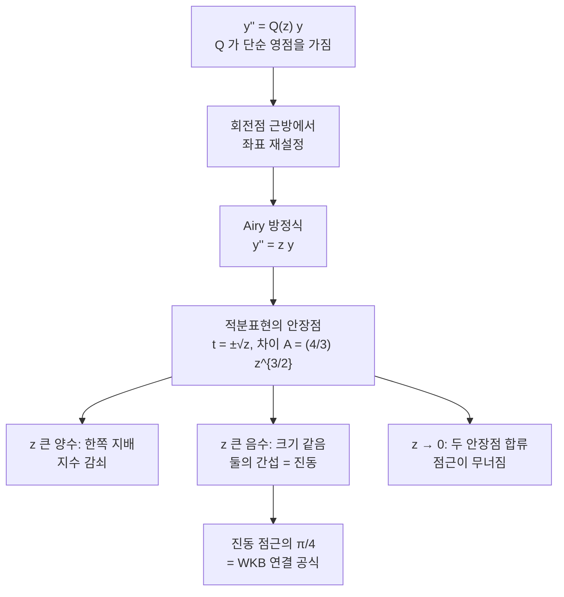

# Airy 함수와 회전점

# 개요

$$
y''(z) = z\thinspace y(z)
$$

는 계수가 가장 단순하게 부호를 바꾸는 2계 [상미분방정식](ordinary-differential-equations.md)이다. $z > 0$ 에서는 해가 지수적으로 감쇠하거나 증가하고, $z < 0$ 에서는 진동한다. 부호가 바뀌는 자리 $z = 0$ 이 **회전점**이고, 이 방정식은 회전점 하나를 가진 문제의 **표준형**이다. 계수가 단순 영점을 가지는 임의의 방정식은 회전점 근방에서 좌표를 다시 잡으면 이 방정식이 된다.

해 $\operatorname{Ai}$ 와 $\operatorname{Bi}$ 를 **Airy 함수**라 한다. 이들이 특별한 이유는 두 가지다. 첫째, 적분 표현의 안장점이 정확히 두 개이고 $z = 0$ 에서 그 둘이 합류한다. 둘째, 그 배치가 [Stokes 현상](stokes-phenomenon.md)이 일어날 수 있는 가장 작은 무대다. 지수적으로 작은 항이 켜지고 꺼지는 전 과정을 초등적인 식 하나로 끝까지 따라갈 수 있고, 그래서 [WKB 근사](wkb-approximation.md)의 연결 공식이 이 함수의 점근에서 그대로 읽힌다. 연결 공식에 나타나는 $\pi/4$ 는 $\operatorname{Ai}(-x)$ 의 진동 점근에 들어 있는 상수가 옮겨 간 것이다.

# 직관

## 왜 $z^{3/2}$ 인가

$y'' = z y$ 에서 해가 $e^{S(z)}$ 꼴이라면 $(S')^2 \approx z$ 이므로 $S \approx \pm\tfrac23 z^{3/2}$ 다. 계수가 상수인 방정식이면 지수가 $z$ 에 선형이겠지만, 계수 자체가 자라므로 지수도 $z$ 보다 빠르게 자란다. 이 $3/2$ 승이 Airy 함수의 모든 공식을 지배한다. 감쇠율, 진동 위상, 영점의 간격, Stokes 선의 각도가 전부 $z^{3/2}$ 하나에서 나온다.

각도를 보면 분명하다. $z^{3/2}$ 는 $z$ 평면을 세 바퀴가 아니라 $3/2$ 바퀴로 감으므로, 복소평면이 $2\pi/3$ 씩 세 부채꼴로 나뉜다. 세 부채꼴 각각에서 지수적으로 감쇠하는 해가 하나씩 있고, 그것이 $\operatorname{Ai}(z)$ 와 $\operatorname{Ai}(\omega z)$ 와 $\operatorname{Ai}(\omega^2 z)$ 다. 2차원 해공간에 감쇠해가 세 개 있으니 이들은 선형종속이어야 하고, 그 관계식이 곧 Airy 함수의 연결 공식이 된다.

## 두 안장점의 합류

$\operatorname{Ai}$ 의 적분 표현에서 지수는 $t^3/3 - zt$ 이고 안장점은 $t = \pm\sqrt{z}$ 두 개다. 두 안장점에서 지수의 값은 $\mp\tfrac23 z^{3/2}$ 이므로, 둘의 차이가 [Laplace 방법](laplace-method.md)에서 말하는 작용 차이

$$
A = \tfrac43 z^{3/2}
$$

다. $z$ 가 크면 두 안장점이 멀리 떨어져 하나가 압도적으로 지배하고, 점근급수는 그 하나만 본다. $z \to 0$ 에서 두 안장점이 원점으로 합류하면 어느 쪽도 지배하지 않고, 이때 근사가 무너진다. 회전점이 "근사가 깨지는 자리" 인 이유가 바로 이 합류다.



# 정의

## 방정식과 두 해

Airy 방정식 $y'' = zy$ 는 복소평면 전체에서 정칙인 계수를 가지므로 모든 해가 **정함수**다. 특이점은 무한대에만 있고, 그것이 비정칙 특이점이라 해의 점근이 방향에 의존한다. 표준 기저를 초기값으로 고정한다.

$$
\operatorname{Ai}(0) = \frac{3^{-2/3}}{\Gamma(2/3)}, \quad
\operatorname{Ai}'(0) = -\frac{3^{-1/3}}{\Gamma(1/3)}, \quad
\operatorname{Bi}(0) = \frac{3^{-1/6}}{\Gamma(2/3)}, \quad
\operatorname{Bi}'(0) = \frac{3^{1/6}}{\Gamma(1/3)}
$$

여기서 $\Gamma$ 는 [감마 함수](gamma-function.md)다. 수치로는 $\operatorname{Ai}(0) = 0.355028\ldots$ 이고 $\operatorname{Ai}'(0) = -0.258819\ldots$ 다. Taylor 급수는 $y'' = zy$ 를 계수별로 풀면 바로 나온다. $f(z) = \sum_k \frac{z^{3k}}{(3k)!}\prod_{j<k}(3j+1)$ 과 $g(z) = \sum_k \frac{z^{3k+1}}{(3k+1)!}\prod_{j<k}(3j+2)$ 가 각각 $y(0)=1,y'(0)=0$ 과 $y(0)=0,y'(0)=1$ 인 해이고

$$
\operatorname{Ai}(z) = \operatorname{Ai}(0)\thinspace f(z) + \operatorname{Ai}'(0)\thinspace g(z)
$$

다. 이 급수는 모든 $z$ 에서 수렴하지만 $\lvert z\rvert$ 가 조금만 커져도 항끼리 거대한 상쇄가 일어나 수치적으로는 쓸 수 없다. 큰 $z$ 에서는 수렴하지 않는 점근급수 쪽이 오히려 정확하다는 것이 이 함수의 대표적인 아이러니다.

## 적분 표현

실수 $x$ 에 대해

$$
\operatorname{Ai}(x) = \frac{1}{\pi}\int_0^{\infty}\cos\negthinspace\left(\frac{t^3}{3} + xt\right)dt
$$

이며, 복소평면에서는

$$
\operatorname{Ai}(z) = \frac{1}{2\pi i}\int_{\mathcal{C}} \exp\negthinspace\left(\frac{t^3}{3} - zt\right)dt
$$

로 쓴다. 경로 $\mathcal{C}$ 는 $\arg t = -\pi/3$ 방향의 무한대에서 들어와 $\arg t = +\pi/3$ 방향의 무한대로 나간다. 피적분함수가 그 두 부채꼴에서 급격히 감쇠하므로 적분이 수렴한다.

경로를 다른 두 부채꼴 쌍으로 잡으면 $\operatorname{Ai}(\omega z)$ 와 $\operatorname{Ai}(\omega^2 z)$ 를 얻는다. 여기서 $\omega = e^{2\pi i/3}$ 다. 세 경로의 합이 닫힌 경로이므로 적분이 0 이 되고, 여기서 곧바로

$$
\operatorname{Ai}(z) + \omega\operatorname{Ai}(\omega z) + \omega^2\operatorname{Ai}(\omega^2 z) = 0
$$

이 따라 나온다. 2차원 해공간에 놓인 감쇠해 셋 사이의 유일한 선형관계다. $\operatorname{Bi}$ 는 이 셋의 조합으로

$$
\operatorname{Bi}(z) = i\thinspace\omega\operatorname{Ai}(\omega z) - i\thinspace\omega^2\operatorname{Ai}(\omega^2 z)
$$

로 정의되며, 실축에서 실숫값을 가지고 $z \to +\infty$ 에서 지수적으로 증가하는 해다.

# 성질

## 두 방향의 점근

$x \to +\infty$ 에서 $\zeta = \tfrac23 x^{3/2}$ 로 두면

$$
\operatorname{Ai}(x) \sim \frac{e^{-\zeta}}{2\sqrt{\pi}\thinspace x^{1/4}}\sum_{k\ge0}\frac{(-1)^k u_k}{\zeta^k},
\qquad
\operatorname{Bi}(x) \sim \frac{e^{\zeta}}{\sqrt{\pi}\thinspace x^{1/4}}\sum_{k\ge0}\frac{u_k}{\zeta^k}
$$

이고, $x \to -\infty$ 에서 $\xi = \tfrac23\lvert x\rvert^{3/2}$ 로 두면

$$
\operatorname{Ai}(-\lvert x\rvert) \sim \frac{1}{\sqrt{\pi}\thinspace\lvert x\rvert^{1/4}}\sin\negthinspace\left(\xi + \frac{\pi}{4}\right),
\qquad
\operatorname{Bi}(-\lvert x\rvert) \sim \frac{1}{\sqrt{\pi}\thinspace\lvert x\rvert^{1/4}}\cos\negthinspace\left(\xi + \frac{\pi}{4}\right)
$$

다. 계수는 $u_0 = 1$ 과

$$
u_k = \frac{(6k-5)(6k-3)(6k-1)}{216\thinspace k\thinspace(2k-1)}\thinspace u_{k-1}
$$

로 정해진다. 앞인자 $x^{-1/4}$ 는 WKB 해의 $Q^{-1/4}$ 가 $Q = x$ 인 경우이고, 진동 쪽의 $\pi/4$ 는 연결 공식의 위상 이동 그 자체다. 두 방향의 점근이 같은 정함수의 두 얼굴이라는 사실이 연결 공식의 내용 전부다.

## Stokes 선의 배치

두 안장점의 지수항은 $e^{\mp\frac23 z^{3/2}}$ 이므로, 어느 항이 얼마나 큰지는 $z^{3/2}$ 의 실수부가 결정한다.

| 선 | 조건 | 각도 | 일어나는 일 |
|---|---|---|---|
| Stokes 선 | $z^{3/2}$ 가 실수 | $\arg z = 0,\ \pm\tfrac{2\pi}{3}$ | 작은 항의 계수가 켜지고 꺼진다 |
| anti-Stokes 선 | $\operatorname{Re} z^{3/2} = 0$ | $\arg z = \pm\tfrac{\pi}{3},\ \pi$ | 두 항의 크기가 뒤바뀐다 |

$\arg z = \pi$ 가 anti-Stokes 선이라는 점이 음의 실축에서 해가 진동하는 이유다. 두 지수항의 크기가 정확히 같아 어느 쪽도 지배하지 못하고, 둘의 간섭이 그대로 보인다. 반대로 $\arg z = 0$ 은 Stokes 선이라 $\operatorname{Ai}$ 의 점근에 $e^{+\zeta}$ 항이 조용히 붙어 있지만 $e^{-\zeta}$ 에 완전히 가려 보이지 않는다.

이 배치를 함수 관계로 쓴 것이

$$
\operatorname{Ai}\negthinspace\left(z\thinspace e^{\mp 2\pi i/3}\right) = \tfrac12 e^{\pm i\pi/3}\left[\operatorname{Ai}(z) \mp i \operatorname{Bi}(z)\right]
$$

이며, 계수 $\tfrac12$ 과 위상 $\pi/3$ 이 이 문제의 Stokes 상수다. $\operatorname{Ai}$ 하나만 알면 나머지가 전부 결정된다.

## 발산률이 가리키는 것

점근급수 계수 $u_k$ 는 $k$ 에 대해 계승 규모로 커진다. 점화식에서 $u_k/u_{k-1} \to k/2$ 이므로 $u_k$ 는 $\Gamma(k)/2^k$ 규모이고, $\zeta^k$ 로 나눈 항이 최소가 되는 지점은 $u_k/u_{k-1} = \zeta$ 를 만족하는 곳, 즉 $k \approx 2\zeta$ 부근이다. 거기서 잘랐을 때 남는 오차는 $e^{-2\zeta}$ 규모이며, $2\zeta = \tfrac43 z^{3/2} = A$ 이므로 이는 정확히 두 안장점의 크기 비 $e^{+\zeta}/e^{-\zeta}$ 다. 한 급수의 발산 속도가 보이지 않는 다른 해의 크기를 알려 준다는 resurgence 의 표본이다. $\zeta$ 가 클수록 최적 절단점이 멀어지고 도달 가능한 정밀도가 지수적으로 좋아지는데, 아래 코드에서 $x$ 가 커질수록 점근급수가 정확해지는 것이 이 때문이다.

## Wronskian 과 영점

$$
\operatorname{Ai}(z)\operatorname{Bi}'(z) - \operatorname{Ai}'(z)\operatorname{Bi}(z) = \frac{1}{\pi}
$$

이다. $y''=zy$ 에 1계 항이 없으므로 Wronskian 이 상수이고, $z=0$ 의 초기값과 $\Gamma(1/3)\Gamma(2/3) = 2\pi/\sqrt{3}$ 을 넣으면 값이 $1/\pi$ 로 떨어진다.

$\operatorname{Ai}$ 의 영점은 모두 음의 실축 위에 있다. 진동 점근의 사인이 0 이 되는 조건에서

$$
a_n \approx -\left(\frac{3\pi(4n-1)}{8}\right)^{2/3}
$$

를 얻는다. 영점 사이의 간격이 $\lvert a_n\rvert^{-1/2}$ 로 줄어드는 것은 파수 $\sqrt{\lvert x\rvert}$ 가 커지기 때문이다. 아래 코드에서 이 점근이 $n=1$ 에서 이미 0.8% 오차, $n=10$ 에서 $10^{-4}$ 이하로 맞는 것을 확인한다.

## 퇴화 정상점의 균등 표준형

같은 보편성이 미분방정식이 아니라 적분 쪽에서도 나타난다. [정상위상법](stationary-phase.md)은 정상점마다 $\lambda^{-1/2}$ 크기의 기여를 주지만 $\varphi''(x_0)=0$ 이면 그 공식이 무너진다. 매개변수 $\mu$ 를 따라 정상점 두 개가 다가와 충돌하는 상황이 전형적이고, 그 국소 표준형이 3 차식이다.

$$
I(\lambda,\mu)=\int_{-\infty}^{\infty}e^{i\lambda(x^3/3-\mu x)}\thinspace dx
=\frac{2\pi}{\lambda^{1/3}}\operatorname{Ai}\negthinspace\big(-\mu\lambda^{2/3}\big)
$$

$x=\lambda^{-1/3}s$ 로 두면 그대로 적분 표현이 되어 나오는 **정확한 항등식**이다. 여기서 두 가지를 읽는다.

- **합류점의 스케일.** $\mu=0$ 에서 크기가 $\lambda^{-1/3}$ 이다. 정상점이 분리되어 있을 때의 $\lambda^{-1/2}$ 보다 크다. 퇴화한 임계점이 더 넓은 영역을 간섭 없이 더하기 때문이다.
- **두 영역을 잇는다.** $\mu>0$ 을 고정하고 $\lambda\to\infty$ 로 보내면 $\operatorname{Ai}(-\mu\lambda^{2/3})$ 의 진동 점근이 $\lambda^{-1/6}$ 를 내놓아 전체가 $\lambda^{-1/3}\cdot\lambda^{-1/6}=\lambda^{-1/2}$ 로 돌아간다. $\mu<0$ 이면 감쇠 점근이 지수적으로 작은 값을 준다. 곧 $\operatorname{Ai}$ 한 함수가 **진동 영역과 지수 영역, 그리고 그 사이의 전이층**을 하나의 식으로 덮는다.

일반적인 위상 $\varphi(x,\mu)$ 에 대해서도 $\varphi$ 를 3 차 표준형으로 옮기는 좌표변환을 잡으면

$$
I\sim 2\pi e^{i\lambda\eta}\Big[\frac{p_0}{\lambda^{1/3}}\operatorname{Ai}\big(\lambda^{2/3}\zeta\big)+\frac{i\thinspace q_0}{\lambda^{2/3}}\operatorname{Ai}'\big(\lambda^{2/3}\zeta\big)\Big]
$$

가 되고, $\zeta$ 는 두 임계값의 차이 $\tfrac43|\zeta|^{3/2}=|\varphi(x_1)-\varphi(x_2)|$ 로 정해진다. 이것이 Chester–Friedman–Ursell 의 균등 점근이다. 이 $\zeta$ 는 위 「두 안장점의 합류」에서 본 작용 차이 $A$ 와 같은 양이고, 미분방정식 쪽 회전점과 적분 쪽 퇴화 정상점이 같은 대상의 두 얼굴이라는 점이 여기서 드러난다.

# 활용

## 세 가지 계산법의 역할 분담

같은 함수를 급수, 적분, 점근급수로 계산해 각각이 잘 듣는 구간을 확인한다.

```python
import math

def ai_series(x, N=60):
    """Taylor 급수. 작은 |x| 에서만 신뢰할 수 있다."""
    c1, c2 = 3 ** (-2 / 3) / math.gamma(2 / 3), 3 ** (-1 / 3) / math.gamma(1 / 3)
    f, t = 0.0, 1.0
    for k in range(N):
        if k:
            t *= x ** 3 / ((3 * k - 1) * (3 * k))
        f += t
    g, t = 0.0, x
    for k in range(N):
        if k:
            t *= x ** 3 / ((3 * k) * (3 * k + 1))
        g += t
    return c1 * f - c2 * g

def ai_integral(x, T=60.0, n=400000):
    """(1/pi) int_0^inf cos(t^3/3 + x t) dt 를 사다리꼴로."""
    h, s = T / n, 0.0
    for k in range(n + 1):
        t = k * h
        s += (1.0 if 0 < k < n else 0.5) * math.cos(t ** 3 / 3 + x * t)
    return s * h / math.pi

def ai_asymptotic(x, N=6):
    """x > 0 에서의 점근급수. 항이 최소가 되기 전에 끊어야 한다."""
    z, u = 2 / 3 * x ** 1.5, [1.0]
    for k in range(1, N):
        u.append(u[-1] * (6 * k - 5) * (6 * k - 3) * (6 * k - 1) / (216 * k * (2 * k - 1)))
    s = sum((-1) ** k * u[k] / z ** k for k in range(N))
    return math.exp(-z) / (2 * math.sqrt(math.pi) * x ** 0.25) * s

print("   x        급수             적분            점근급수       급수의 최대항")
for x in (0.5, 1.0, 2.0, 5.0, 8.0):
    t, peak = 1.0, 1.0
    for k in range(1, 40):
        t *= x ** 3 / ((3 * k - 1) * (3 * k))
        peak = max(peak, abs(t))
    print(f"{x:5.1f}   {ai_series(x):.3e}   {ai_integral(x):.3e}   "
          f"{ai_asymptotic(x):.3e}   {peak:.1e}")

# Ai 의 영점 점근을 급수 계산의 부호 변화로 검증
def zero_asym(n):
    return -((3 * math.pi * (4 * n - 1)) / 8) ** (2 / 3)

def zero_exact(n, w=0.5):
    """점근값 주변에서 이분법."""
    c = zero_asym(n)
    lo, hi = c - w, c + w
    flo = ai_series(lo)
    for _ in range(200):
        mid = (lo + hi) / 2
        if (ai_series(mid) < 0) == (flo < 0):
            lo = mid
        else:
            hi = mid
    return (lo + hi) / 2

print("\n n     점근 a_n        실제 a_n       상대오차")
for n in (1, 2, 3, 10):
    a, e = zero_asym(n), zero_exact(n)
    print(f"{n:2d}   {a:12.8f}   {e:12.8f}   {abs(a - e) / abs(e):.2e}")
```

셋의 담당 구간이 뚜렷하게 갈린다.

- $x = 0.5$ 에서 점근급수는 $-37.75$ 라는 무의미한 값을 낸다. $\zeta = 0.24$ 라 최적 절단점 $k \approx 2\zeta$ 가 1 보다 작고, 여섯 항이면 이미 한참 지나쳤다. 반면 급수는 정확하다.
- $x = 5$ 에서는 급수와 점근급수가 상대오차 $10^{-6}$ 으로 만난다. 두 방법의 교대 지점이다.
- $x = 8$ 에서 급수의 최대항은 $2\times10^{5}$ 인데 답은 $4.7\times10^{-8}$ 이다. $10^{12}$ 배의 상쇄를 배정밀도, 곧 $10^{-16}$ 수준으로 감당해야 하니 유효숫자가 두어 자리밖에 남지 않고, 급수가 준 $4.715\times10^{-8}$ 은 셋째 자리부터 이미 틀렸다. 정답은 점근급수 쪽의 $4.692\times10^{-8}$ 이다.

적분 표현만 어중간하다. $x=5$ 에서 절반 가까이 틀리고 $x=8$ 에서는 부호마저 뒤집히는데, 이는 알고리즘이 아니라 절단 때문이다. $t$ 가 클 때 피적분함수는 $\cos(t^3/3)$ 처럼 빠르게 진동하므로 $T$ 이후의 꼬리가 부분적분으로 대략 $1/(\pi T^2)$ 규모로 남고, $T=60$ 에서 그 값이 $8.8\times10^{-5}$ 로 답 자체와 맞먹는다. 실제로 $T$ 를 두 배로 늘리면 오차가 정확히 4분의 1로 줄어든다. 진동적분을 다룰 때는 경로를 안장점을 지나는 방향으로 돌려 피적분함수를 감쇠시켜야 한다.

수렴하는 급수가 큰 $x$ 에서 무용지물이 되고 발산하는 급수가 정확해지는 이 역전이 점근해석의 존재 이유다.

## 선형 퍼텐셜의 정확한 준위

[WKB 근사](wkb-approximation.md)는 $V(x) = \lvert x\rvert$ 의 바닥 준위를 $0.8853$ 으로 주고 정확값이 $0.8086$ 이라고만 적었다. 그 정확값이 어디서 오는지가 여기서 보인다. $\hbar = m = 1$ 에서 방정식은 $y'' = 2(\lvert x\rvert - E)y$ 이고, $x>0$ 에서 $u = 2^{1/3}(x - E)$ 로 두면 그대로 $y_{uu} = u\thinspace y$ 다. 무한대에서 감쇠해야 하므로 해는 $\operatorname{Ai}$ 뿐이고, 원점에서의 대칭성이 조건을 준다.

| 대칭 | 원점 조건 | 준위 | 값 |
|---|---|---|---|
| 짝 | $y'(0)=0$ | $E = -a'_n / 2^{1/3}$ | $E_0 = 1.018793/1.259921 = 0.808617$ |
| 홀 | $y(0)=0$ | $E = -a_n / 2^{1/3}$ | $E_1 = 2.338107/1.259921 = 1.855757$ |

$a_n$ 은 $\operatorname{Ai}$ 의 영점, $a'_n$ 은 $\operatorname{Ai}'$ 의 영점이다. WKB 가 9% 어긋난 바닥 준위가 Airy 함수의 도함수 첫 영점으로 정확히 결정되고, 준위가 올라갈수록 영점 점근이 좋아지면서 두 값이 만난다. 근사와 정확해가 같은 함수의 두 극한이라는 점이 이 표에 그대로 드러난다.

## 초점과 무지개

Airy 는 1838년 무지개의 **과잉 아치**(supernumerary arc)를 설명하려고 이 적분을 도입했다. 기하광학은 무지개 각도에서 세기가 발산한다고 말하지만 실제로는 유한하고, 안쪽에 옅은 띠가 여러 줄 따라붙는다. 광선 두 개가 합류하는 **초곡선**(caustic) 근방에서 위상차가 편각의 3차식이 되고, 그 적분이 정확히 $\int\cos(t^3/3 + xt)\thinspace dt$ 이기 때문이다. 밝은 쪽의 진동이 과잉 아치이고 어두운 쪽의 지수적 꼬리가 그림자로의 스밈이다.

초곡선 회절, 직선 모서리 근처의 빛의 세기, 전리층에서 되돌아오는 전파, 균일한 힘을 받는 입자의 파동함수가 모두 같은 형태다. "두 해가 합류하는 자리" 라는 조건만 같으면 세부 사정과 무관하게 Airy 함수가 나온다는 보편성이 이 함수의 값어치다.[^1]

## 무작위 행렬의 가장자리

큰 무작위 행렬의 고윳값 분포는 가장자리에서 반원법칙의 제곱근으로 끊기는데, 그 근방을 $N^{2/3}$ 배로 확대하면 Airy 핵 $\bigl(\operatorname{Ai}(x)\operatorname{Ai}'(y) - \operatorname{Ai}'(x)\operatorname{Ai}(y)\bigr)/(x-y)$ 가 나타나고 최대 고윳값의 극한분포가 Tracy–Widom 분포가 된다. 분포의 밀도가 Painlevé II 방정식으로 기술되고 그 해의 경계조건이 $\operatorname{Ai}$ 라는 점에서, 회전점 근방의 보편성이 확률론까지 이어진다.

[^1]: M. V. Berry, C. Upstill, *Catastrophe optics: morphologies of caustics and their diffraction patterns*, Progress in Optics XVIII (1980). 초곡선의 분류와 각 유형에 대응하는 회절 적분. 접힘(fold) 초곡선의 표준 적분이 Airy 함수다.

# 연관 문서

## 선수지식

- [상미분방정식](ordinary-differential-equations.md)
- [Stokes 현상과 재합산](stokes-phenomenon.md)
- [정상위상법과 안장점 근사](stationary-phase.md)

## 더 알아보기

- [WKB 근사와 연결 공식](wkb-approximation.md)
- [Painlevé 방정식과 등모노드로미 변형](painleve-equations.md)

#analysis #complex_analysis #computation
