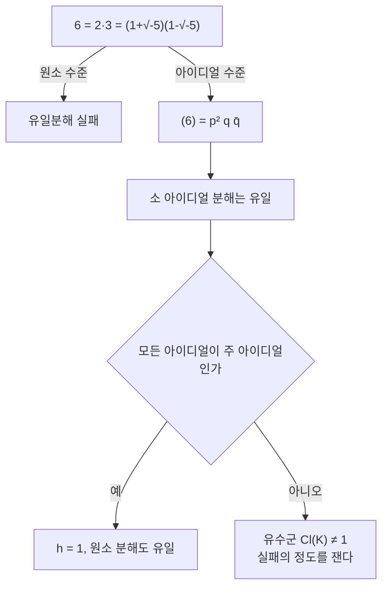

# 대수적 수체와 정수환

# 개요

`\mathbb Z` 에서 소인수분해가 유일하다는 사실은 정수론의 토대다. 그런데 정수론의 문제를 풀려면 정수 밖으로 나가야 할 때가 많다. `x^2+y^2=p` 를 다루려면 `x^2+y^2=(x+iy)(x-iy)` 로 쪼개는 것이 자연스럽고, 그러려면 `\mathbb Z[i]` 를 봐야 한다. `x^n+y^n=z^n` 이라면 `\mathbb Z[\zeta_n]` 이다.

문제는 이렇게 넓힌 환에서 유일분해가 깨질 수 있다는 것이다. `\mathbb Z[\sqrt{-5}]` 에서 `6=2\cdot3=(1+\sqrt{-5})(1-\sqrt{-5})` 이고 네 인수가 모두 더 쪼개지지 않는다. 19 세기에 Fermat 마지막 정리의 증명이라고 제출된 논증들이 바로 이 지점에서 무너졌다.

Dedekind 의 해결책은 원소 대신 [아이디얼](prime-ideals.md)을 분해하는 것이었다. 원소의 분해는 깨져도 아이디얼의 소 아이디얼 분해는 언제나 유일하다. 깨진 정도를 재는 유한군이 유수군이고, 그 크기인 유수가 수체의 가장 기본적인 불변량이 된다.

수체가 [Galois 확대](galois-theory.md)면 Galois 군이 소 아이디얼들에 작용하고, 각 소수가 어떻게 쪼개지는지가 군론의 언어로 서술된다. 이 대응이 유체론의 출발점이며, [이차 상호법칙](quadratic-reciprocity.md)이 그 가장 작은 사례였다.

# 직관

## 유일분해는 왜 깨지는가

`\mathbb Z[\sqrt{-5}]` 에서 노름 `N(x+y\sqrt{-5})=x^2+5y^2` 는 곱셈적이다. `N(2)=4`, `N(3)=9`, `N(1\pm\sqrt{-5})=6` 이고, 노름이 2 나 3 인 원소가 없으므로 넷 다 기약원이다. 그런데 `2\cdot3=(1+\sqrt{-5})(1-\sqrt{-5})=6` 이다.

무엇이 잘못되었나. `2` 는 기약이지만 소원이 아니다. `2` 가 곱 `(1+\sqrt{-5})(1-\sqrt{-5})` 를 나누는데 어느 인수도 나누지 않는다. `\mathbb Z` 에서는 기약과 소원이 같은 것이지만 일반 환에서는 다르다.

## 잃어버린 인수를 되찾는다

직관적으로는 `2` 를 더 쪼개고 싶다. `2=\mathfrak p^2` 이고 `1+\sqrt{-5}=\mathfrak p\mathfrak q` 처럼 쪼개진다면 두 분해가 사실은 같은 것이 된다. 그런 `\mathfrak p` 가 환 안에 원소로는 없지만, 아이디얼로는 있다.

$$
(2)=(2,1+\sqrt{-5})^2,\qquad
(3)=(3,1+\sqrt{-5})(3,1-\sqrt{-5})
$$

`(1+\sqrt{-5})=(2,1+\sqrt{-5})(3,1+\sqrt{-5})` 이므로 두 분해가 같은 소 아이디얼 넷의 곱으로 합쳐진다. 아이디얼 수준에서는 애초에 모순이 없었던 것이다.



## 유수는 실패의 크기다

아이디얼 중에는 `(\alpha)` 꼴인 주 아이디얼이 있고 그렇지 않은 것이 있다. 주 아이디얼만 있다면 아이디얼의 분해가 곧 원소의 분해라 유일분해가 회복된다.

그래서 전체 아이디얼을 주 아이디얼로 나눈 몫을 보면 된다. 그것이 유수군이고, 자명군일 때만 유일분해가 성립한다. 놀라운 사실은 이 군이 언제나 유한하다는 것이다. 실패가 아무리 심해도 유한 개의 유형으로 분류된다.

증명은 Minkowski 의 [격자](lattices.md) 논증이다. 수체의 정수환을 `\mathbb R^n` 의 격자로 실현하면, 각 유수류에 노름이 어떤 상계 이하인 아이디얼이 반드시 있음을 볼록체 정리가 보장한다. 그런 아이디얼은 유한 개뿐이다. "짧은 벡터가 존재한다" 는 기하적 사실이 "유수가 유한하다" 는 대수적 사실로 번역된다.

# 정의

## 수체와 정수환

`\mathbb Q` 의 유한 확대체 `K` 를 대수적 수체라 하고 `n=[K:\mathbb Q]` 를 차수라 한다.

`\alpha\in K` 가 `\mathbb Z` 계수 일계수 다항식의 근이면 대수적 정수라 한다. 그런 원소 전체가 부분환을 이루며 이를 `\mathcal O_K` 로 쓴다. `K=\mathbb Q` 면 `\mathcal O_K=\mathbb Z` 다.

일계수라는 조건이 중요하다. `1/2` 은 `2x-1` 의 근이지만 일계수 다항식의 근은 아니라 대수적 정수가 아니다. 반면 `\frac{1+\sqrt5}2` 은 `x^2-x-1` 의 근이라 대수적 정수다. 그래서 `\mathcal O_{\mathbb Q(\sqrt5)}=\mathbb Z[\frac{1+\sqrt5}2]` 이고 `\mathbb Z[\sqrt5]` 가 아니다.

`\mathcal O_K` 는 계수 `n` 인 자유 `\mathbb Z` 가군이고, 그 기저를 정수기저라 한다.

## 노름, 대각합, 판별식

`K` 의 `\mathbb Q` 로의 매장 `\sigma_1,\dots,\sigma_n` 에 대해

$$
N(\alpha)=\prod_i\sigma_i(\alpha),\qquad \mathrm{Tr}(\alpha)=\sum_i\sigma_i(\alpha)
$$

둘 다 유리수이고, `\alpha\in\mathcal O_K` 면 정수다. 정수기저 `\omega_1,\dots,\omega_n` 에 대해

$$
d_K=\det\big(\mathrm{Tr}(\omega_i\omega_j)\big)=\det(\sigma_i(\omega_j))^2
$$

를 판별식이라 한다. 정수기저의 선택에 무관하며 `K` 의 불변량이다. 이차체 `\mathbb Q(\sqrt m)`(`m` 은 제곱인수 없음)에서 `d_K=m` (`m\equiv1\bmod4`) 또는 `4m` (그 외)이다.

## Dedekind 정역과 아이디얼 분해

`\mathcal O_K` 는 Dedekind 정역이다. 즉 Noether 정역이고, 정수적으로 닫혀 있고, 0 이 아닌 모든 소 아이디얼이 극대다.

Dedekind 정역의 핵심 성질이 아이디얼의 유일분해다. 0 이 아닌 모든 아이디얼 `\mathfrak a` 가

$$
\mathfrak a=\mathfrak p_1^{e_1}\cdots\mathfrak p_k^{e_k}
$$

로 순서를 빼고 유일하게 쓰인다. 원소의 유일분해는 성립하지 않아도 이것은 언제나 성립한다.

아이디얼의 노름은 `N(\mathfrak a)=|\mathcal O_K/\mathfrak a|` 이고 곱셈적이며, 주 아이디얼에서는 `N((\alpha))=|N(\alpha)|` 다.

## 유수군

분수 아이디얼 전체가 곱에 대해 군을 이루고, 주 분수 아이디얼이 그 부분군이다. 몫

$$
\mathrm{Cl}(K)=\frac{\{\text{분수 아이디얼}\}}{\{\text{주 분수 아이디얼}\}}
$$

이 유수군이고 `h_K=|\mathrm{Cl}(K)|` 가 유수다. `h_K=1` 인 것과 `\mathcal O_K` 가 주 아이디얼 정역인 것과 유일분해 정역인 것이 모두 동치다. 일반 환에서는 주 아이디얼 정역이 유일분해 정역보다 강한 조건인데, Dedekind 정역에서는 둘이 같아진다.

## 소수의 분해

소수 `p` 에 대해 `p\mathcal O_K=\prod\mathfrak p_i^{e_i}` 로 쓰고, `f_i=[\mathcal O_K/\mathfrak p_i:\mathbb F_p]` 를 잉여차수라 한다. 언제나

$$
\sum_i e_if_i=n
$$

이 성립한다. `e_i>1` 인 경우를 분기라 하고, `d_K` 를 나누는 유한 개의 소수에서만 일어난다. 모든 `e_i=f_i=1` 이면 완전분해, `k=1,e=1,f=n` 이면 관성이라 한다.

# 성질

## Minkowski 상계와 유수의 유한성

`K` 가 실매장 `r_1` 개와 복소매장 쌍 `r_2` 개를 가지면, 모든 유수류에 다음을 만족하는 아이디얼이 있다.

$$
N(\mathfrak a)\le\Big(\frac4\pi\Big)^{r_2}\frac{n!}{n^n}\sqrt{|d_K|}
$$

노름이 유계인 아이디얼은 유한 개이므로 유수가 유한하다. 부수적으로 `n>1` 이면 우변이 1 보다 커야 하므로 `|d_K|>1` 이 나온다. 곧 `\mathbb Q` 가 아닌 모든 수체에는 분기하는 소수가 반드시 있다(Minkowski 정리).

상계가 작으면 유수 계산이 끝난다. `\mathbb Q(\sqrt{-5})` 에서 상계가 약 `2.8` 이므로 노름 1, 2 인 아이디얼만 확인하면 되고, `\mathfrak p=(2,1+\sqrt{-5})` 가 주 아이디얼이 아님을 보이면 `h=2` 다.

## Dirichlet 단원 정리

`\mathcal O_K^\times` 의 구조가 완전히 결정된다.

$$
\mathcal O_K^\times\cong\mu_K\times\mathbb Z^{r_1+r_2-1}
$$

`\mu_K` 는 `K` 안의 단위근으로 이루어진 유한 순환군이다. 허이차체(`r_1=0,r_2=1`)에서는 계수가 0 이라 단원이 유한 개뿐이고, 실이차체(`r_1=2,r_2=0`)에서는 계수가 1 이라 기본단원 하나가 무한히 많은 단원을 생성한다.

`\mathbb Q(\sqrt2)` 의 기본단원이 `1+\sqrt2` 이고, 그 거듭제곱이 Pell 방정식 `x^2-2y^2=\pm1` 의 해 전체를 준다. 고전적인 Pell 방정식 이론이 단원 정리의 한 사례로 흡수된다.

증명 역시 격자 논증이다. 단원을 로그 좌표로 보내면 초평면 안의 완전계수 격자가 되고, 그 계수가 `r_1+r_2-1` 임을 Minkowski 정리로 보인다.

## Galois 확대에서의 분해

`K/\mathbb Q` 가 Galois 면 `\mathrm{Gal}(K/\mathbb Q)` 가 `p` 위의 소 아이디얼들에 추이적으로 작용한다. 따라서 모든 `e_i` 가 같고 모든 `f_i` 가 같아

$$
efg=n
$$

가 된다(`g` 는 소 아이디얼의 개수). 분기하지 않는 `p` 에 대해 각 `\mathfrak p` 의 분해군이 잉여체 확대의 Galois 군과 동형이고, 그 생성원이 Frobenius 원소 `\mathrm{Frob}_{\mathfrak p}` 다.

아벨 확대에서는 Frobenius 가 `\mathfrak p` 의 선택에 무관해 `p` 만의 함수가 된다. 이것이 Artin 사상이며, 유체론은 이 사상이 유수군의 일반화를 Galois 군에 동형으로 대응시킨다고 말한다.

`K=\mathbb Q(\zeta_m)` 에서 `\mathrm{Gal}\cong(\mathbb Z/m\mathbb Z)^\times` 이고 `\mathrm{Frob}_p=p \bmod m` 이다. `p` 가 완전분해할 조건이 `p\equiv1\pmod m` 이라는 결론이 바로 나오고, 이차 부분체로 내려가면 이차 상호법칙이 된다.

## 유수 공식

해석과 대수를 잇는 등식이다. Dedekind zeta 함수 `\zeta_K(s)=\sum_{\mathfrak a}N(\mathfrak a)^{-s}` 의 `s=1` 에서의 유수가

$$
\lim_{s\to1}(s-1)\zeta_K(s)=\frac{2^{r_1}(2\pi)^{r_2}h_KR_K}{w_K\sqrt{|d_K|}}
$$

이다. `R_K` 는 단원 격자의 조절자, `w_K` 는 단위근의 개수다. 이차체에서 `\zeta_K(s)=\zeta(s)L(s,\chi_{d_K})` 로 분해되므로, [Dirichlet L 함수](dirichlet-l-functions.md) 문서에서 본 `L(1,\chi_d)=2\pi h/(w\sqrt{|d|})` 가 이 공식의 특수한 경우다.

유수를 해석적으로 계산할 수 있다는 뜻이며, 동시에 `L(1,\chi)\ne0` 의 증명이기도 하다. 좌변이 양수임이 자명하기 때문이다.

## 유수 계산

허이차체의 유수는 판별식 `D` 인 이차형식의 축약형 개수와 같다. Gauss 의 형식류 이론이 Dedekind 의 아이디얼류 이론과 같은 것을 세고 있었다는 사실이다.

```python
from math import gcd

def reduced_forms(D):
    """판별식 D<0 인 원시 이차형식의 축약형 목록. 그 개수가 유수 h(D)."""
    out, a = [], 1
    while 3 * a * a <= -D:                            # |b| <= a <= c 에서 a <= sqrt(|D|/3)
        for b in range(-a + 1, a + 1):
            if (b * b - D) % (4 * a): continue
            c = (b * b - D) // (4 * a)
            if c < a: continue
            if (a == c or b == a) and b < 0: continue  # 동치인 대표원 하나만
            if gcd(gcd(a, b), c) != 1: continue        # 원시형식만
            out.append((a, b, c))
        a += 1
    return out

for D in (-4, -8, -20, -23, -24, -47, -163):
    f = reduced_forms(D)
    print(f"D={D:>5}: h={len(f)}, 축약형 {f}")

N = lambda x, y: x * x + 5 * y * y                     # Z[√-5] 의 노름
print("\nN(2)  =", N(2, 0), "  N(3) =", N(3, 0), "  N(1±√-5) =", N(1, 1))
print("노름이 2 또는 3 인 원소:",
      [(x, y) for x in range(-4, 5) for y in range(-4, 5) if N(x, y) in (2, 3)])

# D=   -4: h=1, 축약형 [(1, 0, 1)]
# D=   -8: h=1, 축약형 [(1, 0, 2)]
# D=  -20: h=2, 축약형 [(1, 0, 5), (2, 2, 3)]
# D=  -23: h=3, 축약형 [(1, 1, 6), (2, -1, 3), (2, 1, 3)]
# D=  -24: h=2, 축약형 [(1, 0, 6), (2, 0, 3)]
# D=  -47: h=5, 축약형 [(1, 1, 12), (2, -1, 6), (2, 1, 6), (3, -1, 4), (3, 1, 4)]
# D= -163: h=1, 축약형 [(1, 1, 41)]
#
# N(2)  = 4   N(3) = 9   N(1±√-5) = 6
# 노름이 2 또는 3 인 원소: []
```

`D=-4` 는 `\mathbb Z[i]` 로 유일분해 정역이고, 축약형이 `x^2+y^2` 하나뿐이다. `D=-20` 의 두 형식 `x^2+5y^2` 과 `2x^2+2xy+3y^2` 이 `\mathbb Q(\sqrt{-5})` 의 두 유수류에 대응하며, 앞의 것이 주 아이디얼류, 뒤의 것이 `\mathfrak p=(2,1+\sqrt{-5})` 의 류다. 노름이 2 나 3 인 원소가 없다는 마지막 출력이 그 아이디얼이 주 아이디얼이 아니라는 확인이다.

`D=-163` 에서 `h=1` 인 것이 `e^{\pi\sqrt{163}}` 이 정수에 극도로 가까운 이유다. 판별식이 음수이고 유수가 1 인 것은 아홉 개 뿐이며(Heegner 수), 그 마지막이 `-163` 이다. 이 목록이 완전하다는 증명은 1960 년대에야 완결되었다.

## 남은 어려움

허이차체에서는 `|d_K|\to\infty` 일 때 `h_K\to\infty` 이므로 유수가 작은 경우가 유한하다. 반면 실이차체에서는 `h_K=1` 이 무한히 많다고 추측될 뿐 증명되지 않았다. 조절자 `R_K` 가 커질 수 있어 유수 공식이 `h_K` 를 통제하지 못하기 때문이다.

효과적인 계산도 문제다. 유수를 다항시간에 계산하는 고전 알고리즘은 알려져 있지 않고, 일반 Riemann 가설을 가정해야 준지수 시간이 나온다. 양자 알고리즘은 이 문제를 다항시간에 푼다. 유수군 계산이 아벨 숨은 부분군 문제로 환원되기 때문이며, 이것이 [후양자 암호](post-quantum-cryptography.md)에서 구조화된 격자를 경계하는 이유이기도 하다.

# 활용

## Fermat 마지막 정리의 첫 진전

`x^p+y^p=z^p` 를 `\mathbb Z[\zeta_p]` 에서 `\prod(x+\zeta_p^iy)=z^p` 로 쪼개는 것이 Lamé 의 착상이었다. 유일분해가 성립한다면 각 인수가 `p` 제곱이어야 하고 거기서 모순이 나온다. Kummer 가 `p=23` 에서 유일분해가 깨짐을 지적해 이 논증을 무너뜨렸다.

Kummer 자신이 대안을 내놓았다. `p` 가 유수를 나누지 않는 정규소수면 논증이 복구된다. 이것이 100 개 이하의 거의 모든 지수에서 정리를 증명했고, 완전한 증명까지 150 년이 더 걸렸지만 아이디얼 이론이라는 분야가 여기서 태어났다.

## 어떤 소수가 어떤 형식으로 표현되는가

`p=x^2+ny^2` 이 풀리는지는 `p` 가 `\mathbb Q(\sqrt{-n})` 에서 완전분해하는지, 그리고 그때 나오는 소 아이디얼이 주 아이디얼인지에 달렸다.

`h=1` 이면 두 조건이 같아져 답이 순수한 합동조건이 된다. `p=x^2+y^2\iff p\equiv1\pmod4` 가 그 예다. `h>1` 이면 합동조건만으로는 부족하고, `p=x^2+5y^2\iff p\equiv1,9\pmod{20}` 처럼 유수류를 구별하는 추가 조건이 필요하다. 유수군이 비순환이면 합동조건으로 아예 서술되지 않고 특정 다항식의 근이 존재하는지를 물어야 한다.

## 디오판토스 방정식

`y^2=x^3-2` 의 정수해를 구할 때 `\mathbb Z[\sqrt{-2}]` 에서 `(y+\sqrt{-2})(y-\sqrt{-2})=x^3` 으로 쪼갠다. 이 환은 유일분해 정역이고 두 인수가 서로소이므로 각각이 세제곱이어야 하며, 전개하면 `(x,y)=(3,\pm5)` 만 남는다.

이런 논증이 통하려면 유수와 단원군을 알아야 한다. 유수가 3 의 배수가 아니어야 "세제곱이므로 각 인수가 세제곱" 이 성립하고, 단원이 어떤 것인지 알아야 경우를 나눌 수 있다. 현대의 계산 정수론 소프트웨어가 하는 일의 상당 부분이 이 두 불변량의 계산이다.

## 암호와 계산

수체 체 거름법은 현재 가장 빠른 소인수분해 알고리즘이고, 수체에서 노름이 매끄러운 원소를 찾아 관계를 모으는 방식으로 작동한다. [RSA](rsa-cryptosystem.md) 의 키 길이가 이 알고리즘의 준지수 복잡도 `\exp(O((\log N)^{1/3}))` 로 정해진다.

원분체와 그 정수환은 격자 암호의 무대이기도 하다. Ring-LWE 가 쓰는 `\mathbb Z[x]/(x^n+1)` 이 `\mathbb Z[\zeta_{2n}]` 이며, 이 환의 산술 구조가 효율을 주는 동시에 잠재적 공격 표면이 된다. 수체의 단원군과 유수군을 계산하는 양자 알고리즘이 특정 구성에 실제 위협이 된 전례가 있어, 표준화 과정에서 구조를 얼마나 넣을지가 핵심 쟁점이었다.

# 연관 문서

## 선수지식

- [Dedekind 정역과 아이디얼의 유일분해](dedekind-domains.md)
- [Galois 이론](galois-theory.md)

## 더 알아보기

아직 연결한 문서가 없다.

#number_theory #ring_theory #field_theory
