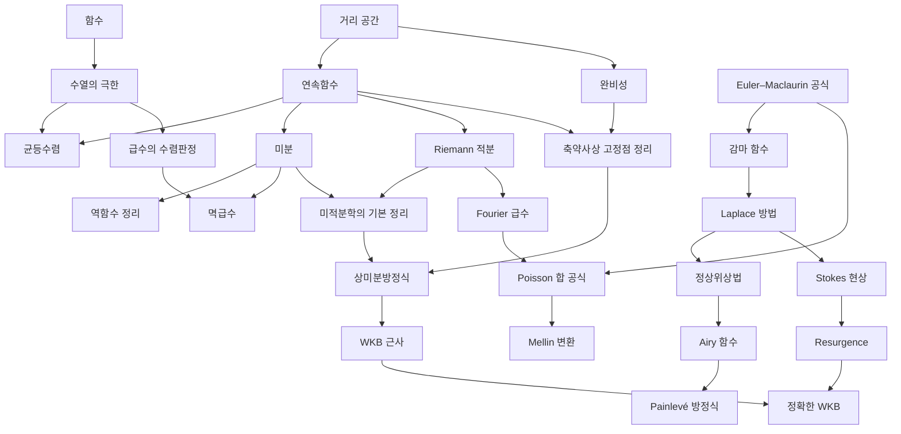

# 해석학 개관

# 개요

해석학은 극한으로 정의되는 대상을 다룬다. 물음은 "이 근사가 무엇으로 수렴하고, 그 극한이 원래의 성질을 보존하는가" 이고, 답은 수렴의 종류를 구분하는 데서 나온다. 점별수렴은 연속성을 보존하지 않고 균등수렴은 보존한다는 사실이 이 분야의 첫 분기점이다.

해석학의 갈래는 네 줄기다. 극한과 연속, 미분과 적분, 급수와 적분변환, 그리고 발산급수를 다루는 점근해석이다. 측도론으로 적분을 다시 세우는 갈래는 [Lebesgue 적분](lebesgue-integral.md)에서, 복소평면으로 넘어가는 갈래는 [정칙함수](holomorphic-functions.md)에서, 무한차원 공간의 선형해석은 [Hilbert 공간](hilbert-spaces.md)과 [Banach 공간](banach-spaces.md)에서 이어진다.

시작은 [수열의 극한](limits.md)과 [연속함수](continuity.md)다. 거기서 [미분](derivative.md)과 [Riemann 적분](riemann-integral.md)이 갈라지고 [미적분학의 기본 정리](fundamental-calculus.md)에서 다시 만난다. [완비성](completeness.md)은 극한의 존재를 보장하는 축이고, [축약사상 고정점 정리](banach-fixed-point.md)를 거쳐 미분방정식의 해의 존재로 이어진다.

# 지도

# 갈래

## 극한과 연속

- [수열의 극한](limits.md): 수렴의 정의와 극한의 사칙연산
- [완비성](completeness.md): 극한값을 모르고도 수렴을 판정하는 조건
- [연속함수](continuity.md): $\varepsilon\text{-}\delta$ 정의와 열린집합 정의의 동치
- [균등연속](uniform-continuity.md): $\delta$ 를 점에 의존하지 않게 고른 조건, Heine–Cantor 정리
- [균등수렴](uniform-convergence.md): 연속성과 적분을 극한과 바꿔 쓸 수 있게 하는 조건
- [Arzelà–Ascoli 정리](arzela-ascoli.md): 함수족이 균등수렴하는 부분열을 가질 조건, 동등연속
- [Stone–Weierstrass 정리](stone-weierstrass.md): 점을 분리하는 부분대수의 균등근사, Weierstrass 근사정리
- [Lipschitz 사상](lipschitz-maps.md): 거리를 상수배 이내로 옮기는 조건, McShane 확장
- [축약사상 고정점 정리](banach-fixed-point.md): 완비성이 해의 존재와 유일성을 주는 첫 사례
- [Baire 범주 정리](baire-category.md): 완비 공간이 성긴 집합 가산 개로 덮이지 않는다는 정리, 구성 없는 존재 증명
- [Rademacher 정리](rademacher-theorem.md): Lipschitz 사상이 거의 모든 점에서 미분가능하다는 정리

## 미분과 적분

- [미분](derivative.md): 국소 선형근사
- [역함수 정리](inverse-function-theorem.md): 전미분과 연쇄법칙, 역함수 정리와 음함수 정리
- [Riemann 적분](riemann-integral.md): 분할과 상하합, 적분 가능성의 판정
- [미적분학의 기본 정리](fundamental-calculus.md): 미분과 적분의 역관계
- [상미분방정식](ordinary-differential-equations.md): Picard–Lindelöf 존재 정리와 선형 이론
- [변분법](calculus-of-variations.md): 범함수의 정류 조건과 Euler–Lagrange 방정식
- [Sturm–Liouville 이론](sturm-liouville.md): 2 계 고유값 문제의 직교성과 완전성, Sturm 진동정리
- [Peano 존재정리](peano-existence-theorem.md): 연속성만으로 얻는 해의 존재, 유일성의 실패와 Osgood 조건

## 급수와 변환

- [급수의 수렴판정](series-convergence.md): 비교, 비율, 근, 적분, 교대급수 판정과 재배열
- [멱급수](power-series.md): 수렴반경과 해석성
- [Fourier 급수](fourier-series.md): 직교계 전개와 $L^2$ 수렴
- [이산 Fourier 변환](fourier.md): 유한 순환군 위의 Fourier 해석
- [Euler–Maclaurin 공식과 점근급수](euler-maclaurin.md): 합과 적분의 차이를 Bernoulli 수로 전개
- [감마 함수와 Stirling 근사](gamma-function.md): 계승의 해석적 연속
- [Poisson 합 공식](poisson-summation.md): 격자 합과 쌍대격자 합의 등식
- [Mellin 변환](mellin-transform.md): 곱셈적 구조 위의 적분변환

## 점근해석과 재합산

- [Laplace 방법](laplace-method.md): 지수적으로 집중된 적분의 주항
- [정상위상법과 안장점 근사](stationary-phase.md): 진동적분의 위상이 멈추는 자리
- [Stokes 현상과 재합산](stokes-phenomenon.md): 점근전개의 계수가 불연속으로 바뀌는 선
- [Padé 근사와 Borel 재합산](borel-pade.md): 발산급수에 값을 주는 두 방법
- [Resurgence 와 alien 미분](resurgence.md): 섭동급수와 비섭동 효과의 연결
- [Airy 함수](airy-functions.md): 회전점 근방의 표준형
- [WKB 근사와 연결 공식](wkb-approximation.md)(Wentzel–Kramers–Brillouin): 작은 매개변수를 가진 방정식의 지수적 해
- [정확한 WKB 와 Voros 기호](exact-wkb.md): WKB 급수를 Borel 재합산으로 엄밀화
- [Painlevé 방정식과 등모노드로미 변형](painleve-equations.md): 가동 특이점이 극뿐인 비선형 방정식

## 작용소와 함수해석

- [유계 작용소와 스펙트럼](bounded-operators.md): 작용소 노름, 스펙트럼과 분해 스펙트럼
- [비유계 작용소와 Stone 정리](unbounded-operators.md): 조밀한 정의역, 자기수반성, 한 모수 유니터리 군
- [Fredholm 작용소](fredholm-operators.md): 핵과 여핵이 유한차원인 작용소의 정수 불변량
- [Fredholm 행렬식](fredholm-determinant.md): 핵 작용소의 행렬식과 적분방정식
- [Peter–Weyl 정리](peter-weyl.md): 콤팩트군 위 $L^2$ 의 기약표현 분해

## 다른 분야와의 접점

- [Lobachevsky 함수](lobachevsky-function.md): Fourier 급수가 쌍곡 부피를 계산한다
- [Lebesgue 적분](lebesgue-integral.md): 적분을 측도로 다시 세운다
- [정칙함수와 Cauchy 적분 정리](holomorphic-functions.md): 복소미분이 해석성을 강제한다
- [Hilbert 공간](hilbert-spaces.md), [Banach 공간](banach-spaces.md): 완비성을 무한차원 선형공간으로
- [비표준 해석학](nonstandard-analysis.md): 무한소를 원소로 갖는 순서체에서 극한을 계산으로 바꾼다

# 연관 문서

## 선수지식

- [집합](sets.md)

## 더 알아보기

- [수열의 극한](limits.md)
- [완비성](completeness.md)
- [연속함수](continuity.md)
- [이산 Fourier 변환](fourier.md)

#analysis #complex_analysis #overview
