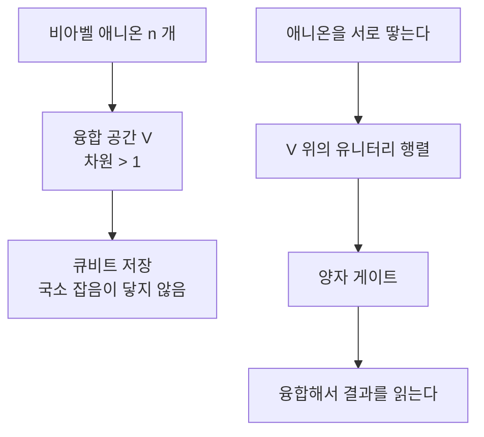

# 애니온과 위상적 양자계산

# 개요

애니온은 2 차원에서 교환 통계가 땋임군의 표현으로 주어지는 준입자다. 3 차원에서 같은 입자 둘을 맞바꾸면 파동함수가 $+1$ 배(보손) 또는 $-1$ 배(페르미온) 되고, 교환을 두 번 하면 제자리로 돌아온다. 2 차원에서는 두 입자를 맞바꾸는 경로가 평면에서 서로 풀리지 않아 교환의 이력이 **땋임군** $B_n$ 의 원소로 남는다.

$$
\text{3 차원: } S_n\ \text{의 표현}
\qquad\longrightarrow\qquad
\text{2 차원: } B_n\ \text{의 표현}
$$

$B_n$ 은 무한군이라 표현이 풍부하다. 위상 인자 하나만 얻는 경우가 **아벨 애니온**, 상태 공간이 여러 차원이라 땋기가 행렬로 작용하는 경우가 **비아벨 애니온**이다.

[모듈러 텐서범주](modular-tensor-categories.md)가 이 구조의 수학적 정의다. 단순대상이 애니온의 종류, 융합 규칙이 두 애니온을 합쳤을 때 나올 수 있는 결과, 땋임이 교환, $S$ 와 $T$ 행렬이 원환면 위 상태 공간의 모듈러 작용이다. 범주 하나가 애니온 모형 하나다.

정보를 애니온의 **융합 채널**에 저장하고 계산을 **땋기**로 수행하면 국소적인 잡음이 위상적 정보를 건드리지 못한다. 오류 정정을 소프트웨어가 아니라 물질의 위상으로 얻는 것이 **위상적 양자계산**이다.

# 직관

## 융합 공간

비아벨 애니온 $n$ 개를 평면에 놓고 전체가 융합되는 애니온을 고정해도 상태가 하나로 정해지지 않는다. 중간 융합 경로가 여럿이고 그 경로들이 벡터공간의 기저를 이룬다.

$$
V^{c}_{a_1\cdots a_n}=\mathrm{Hom}(a_1\otimes\cdots\otimes a_n,\ c)
$$

이 공간이 큐비트를 담는다. 어느 애니온도 혼자서는 상태를 알지 못한다. 정보는 애니온들 사이의 전역적 관계에 있어, 한 애니온 근처의 국소 연산으로는 읽거나 망가뜨릴 수 없다.

## 양자 차원

융합 공간의 차원 증가율이 애니온 하나가 담는 정보량이다. 이를 **양자 차원** $d_a$ 라 하고, 융합 규칙 행렬 $N_a$ 의 최대 고윳값으로 얻는다.

Fibonacci 모형의 차원은 $1,2,3,5,8,13,\dots$ 로 Fibonacci 수열이고 비가 황금비 $\varphi=1.6180\ldots$ 로 수렴한다. Ising 모형은 두 걸음마다 두 배라 한 걸음당 $\sqrt2$ 다.

$$
d_\tau=\varphi=\frac{1+\sqrt5}2,\qquad d_\sigma=\sqrt2
$$

양자 차원이 무리수인 것이 비아벨성의 표지다. 정수이면 애니온 하나가 정수 개의 상태를 담고, 무리수이면 정보가 개별 애니온에 나눠 담기지 않는다.

# 정의

## 애니온 모형

모듈러 텐서범주 $\mathcal C$ 하나가 애니온 모형이다.

- 단순대상 $\lbrace a\rbrace$ 는 애니온의 종류이고 유한 개다.
- 융합 규칙은 $a\otimes b\cong\bigoplus_c N_{ab}^c\thinspace c$ 다.
- $F$ 행렬은 결합자이며 융합 순서를 바꾸는 기저 변환이다.
- $R$ 행렬은 땋임이며 두 애니온을 맞바꾸는 연산이다.
- $S,T$ 는 원환면 위 상태공간에 대한 $\mathrm{SL}_2(\mathbb Z)$ 작용이다.

$F$ 와 $R$ 은 오각형 항등식과 육각형 항등식을 만족해야 한다. 이 방정식들의 해가 유한 개라 애니온 모형의 분류가 가능하다.

## 두 모형

**Fibonacci** 모형은 대상이 $\lbrace\mathbf 1,\tau\rbrace$ 이고 융합이 $\tau\otimes\tau=\mathbf 1\oplus\tau$ 다.

**Ising** 모형은 대상이 $\lbrace\mathbf 1,\sigma,\psi\rbrace$ 이고 융합이 다음과 같다.

$$
\sigma\otimes\sigma=\mathbf 1\oplus\psi,\qquad
\sigma\otimes\psi=\sigma,\qquad
\psi\otimes\psi=\mathbf 1
$$

$\psi$ 는 스스로와 융합해 사라지는 페르미온이고 $\sigma$ 가 비아벨 애니온이다.

## 계산 모형

큐비트를 융합 공간에 두고 게이트를 땋임 표현 $\rho:B_n\to U(V)$ 의 상으로 구현한다. 측정은 애니온 쌍을 융합해 결과를 읽는 것이다. 근사 가능한 유니터리의 범위는 $\rho(B_n)$ 이 $U(V)$ 에서 얼마나 큰가에 달렸다.

# 성질

## Fibonacci 모형의 보편성

Freedman, Larsen, Wang 은 Fibonacci 애니온의 땋임 표현의 상이 $\mathrm{SU}(V)$ 에서 조밀함을 증명했다. 임의의 유니터리를 원하는 정확도로 근사할 수 있으므로 땋기만으로 보편 양자계산이 된다. 증명은 상이 되는 부분군이 닫힌 리 부분군을 생성함을 보이고 그 리 대수가 전체임을 확인한다.

Solovay–Kitaev 정리에 따라 오차 $\varepsilon$ 을 얻는 데 $O(\log^c(1/\varepsilon))$ 개의 교차면 충분하다.

## Ising 모형의 한계

$\sigma$ 애니온의 땋임은 **Clifford 군**만 생성한다. Gottesman–Knill 정리에 따라 Clifford 회로는 고전 컴퓨터로 효율적으로 흉내 낼 수 있으므로 Ising 애니온을 땋는 것만으로는 양자 우위가 없다.

부족한 것은 $T$ 게이트다. **마법 상태 주입**은 잡음에 노출된 방식으로 마법 상태를 준비한 뒤 증류해 정제하고 위상적으로 보호된 Clifford 연산과 결합한다. 보호 범위 밖의 자원을 하나 들여오는 대가로 보편성을 얻는다.

| 모형 | 양자 차원 | 땋임이 생성하는 군 | 보편성 |
| --- | --- | --- | --- |
| Fibonacci | $\varphi$ | $\mathrm{SU}(V)$ 에서 조밀 | 땋기만으로 보편 |
| Ising | $\sqrt2$ | Clifford 군 | 마법 상태 필요 |
| 아벨 곧 $\mathbb Z_n$ | $1$ | 위상 인자뿐 | 계산 불가 |

## 총 양자 차원

$$
\mathcal D=\sqrt{\sum_a d_a^2}
$$

를 총 양자 차원이라 한다. Fibonacci 는 $\mathcal D^2=1+\varphi^2$ 이고 Ising 은 $\mathcal D^2=4$ 다. 위상적으로 정렬된 2 차원 계의 얽힘 엔트로피는 경계 길이에 비례하는 항에 더해 $-\log\mathcal D$ 라는 보정을 가지며, 이를 **위상적 얽힘 엔트로피**라 한다. 범주의 불변량이 실험에서 측정되는 예다.

# 활용

## 분수 양자 홀 효과

강한 자기장 아래 2 차원 전자계에서 홀 전도도가 분수 $\nu$ 로 양자화된다. $\nu=1/3$ 의 Laughlin 상태는 준입자가 전하 $e/3$ 을 갖는 아벨 애니온이다. 위상적 계산에는 부족하지만 애니온의 존재를 보인 자리다.

$\nu=5/2$ 의 Moore–Read 상태는 준입자가 Ising 유형일 것으로 예상되며, 확인되면 비아벨 애니온의 첫 실현이 된다.

## Majorana 준입자

초전도체와 결합한 반도체 나노선의 끝에 Majorana 영모드가 생기고, 이것이 Ising 애니온의 $\sigma$ 처럼 행동한다. 실험적으로 접근하기 쉬워 여러 연구 그룹이 추적해 왔으나 보고된 신호의 위상적 기원을 두고 논쟁이 이어졌다.

## 매듭 불변량 계산

땋임 표현의 대각합이 매듭 불변량이다. Fibonacci 애니온에서 그 값은 Jones 다항식을 1 의 5 제곱근에서 평가한 것이며, Reshetikhin–Turaev 불변량의 특수한 경우다. 방향을 뒤집으면 Jones 다항식의 근사 계산이 BQP 완전 문제라는 Freedman–Kitaev–Wang 의 정리가 된다.[^1]

[^1]: 개관은 C. Nayak, S. Simon, A. Stern, M. Freedman, S. Das Sarma, *Non-Abelian anyons and topological quantum computation*, Rev. Mod. Phys. **80** (2008), 1083. 보편성 증명은 M. Freedman, M. Larsen, Z. Wang, *A modular functor which is universal for quantum computation*, Comm. Math. Phys. **227** (2002). 매듭 불변량과의 동치는 M. Freedman, A. Kitaev, Z. Wang, *Simulation of topological field theories by quantum computers*, Comm. Math. Phys. **227** (2002). 범주론적 배경은 B. Bakalov, A. Kirillov, *Lectures on Tensor Categories and Modular Functors* (2001).

# 연관 문서

## 선수지식

- [모듈러 텐서범주와 3 차원 TQFT](modular-tensor-categories.md)

## 더 알아보기

아직 연결한 문서가 없다.

#category_theory #topology #computation
