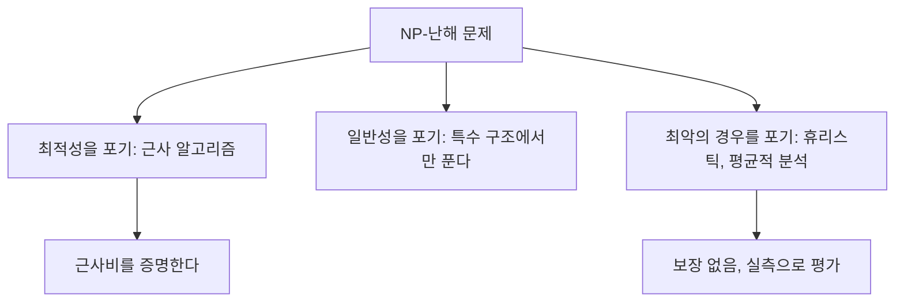

# 근사 알고리즘

# 개요

[NP-완전](np-completeness.md) 문제를 만났다는 것은 최적해를 항상 빠르게 구하는 알고리즘을 기대하지 말라는 뜻이다. 그렇다고 문제가 사라지지는 않으므로 무언가를 포기해야 한다. 최적성을 포기하되 얼마나 포기하는지를 증명과 함께 밝히는 것이 근사 알고리즘이다.

근사비 `ρ` 를 보장한다는 말은 모든 입력에 대해 다음이 성립한다는 뜻이다(최소화 문제 기준).

$$
\mathrm{ALG}(x)\le\rho\cdot\mathrm{OPT}(x)
$$

최적해를 모르는 채로 이런 부등식을 증명해야 한다는 점이 이 분야의 기술적 핵심이다. 답은 하한을 주는 대리물을 찾는 것이다. 최적해의 값을 직접 계산하는 대신 "최적해라도 이것보다 작을 수 없다" 는 양을 찾아 그것과 비교한다.

# 직관

## 최적해를 모르면서 비교하기

정점 덮개 문제에서 서로 변을 공유하지 않는 간선들을 모으면(매칭), 그 간선 하나마다 적어도 한 끝점이 덮개에 들어가야 한다. 따라서 최적 덮개의 크기는 매칭의 크기 이상이다. 이제 매칭에 쓰인 간선의 양 끝점을 모두 넣으면 덮개가 되고 크기는 매칭의 두 배다. 최적해를 전혀 몰라도 근사비 2 가 증명된다.

$$
\lvert M\rvert\le\mathrm{OPT}\le\mathrm{ALG}=2\lvert M\rvert
$$

## 무엇을 포기할지 고르기

NP-난해 문제를 다루는 방법은 셋 중 하나를 포기하는 것이다.



세 번째 길이 실무에서 흔하지만 보장이 없다. 근사 알고리즘은 첫 번째 길을 택하고, 그 대가로 "얼마나 나쁠 수 있는가" 에 답을 붙인다.

# 정의

## 근사비

최소화 문제의 알고리즘이 모든 입력에서 `ALG ≤ ρ·OPT` 를 만족하면 `ρ`-근사라 한다. 최대화 문제에서는 `ALG ≥ OPT/ρ` 로 쓰거나 `ρ ≤ 1` 인 비율로 쓴다. `ρ` 는 상수일 수도 있고 입력 크기에 따라 커질 수도 있다.

## 근사 가능성의 단계

| 등급 | 뜻 | 예 |
|---|---|---|
| FPTAS | 임의의 `ε` 에 대해 `1+ε` 근사를 `1/ε` 의 다항시간에 | 배낭 문제 |
| PTAS | 임의의 `ε` 에 대해 `1+ε` 근사, 시간은 `ε` 에 지수적이어도 됨 | 유클리드 TSP |
| APX | 어떤 상수 `ρ` 로 근사 가능 | 정점 덮개, 최대 절단 |
| 로그 근사 | `Θ(log n)` 이 최선 | 집합 덮개 |
| 근사 불가 | 어떤 상수배로도 근사 불가(`P ≠ NP` 가정) | 일반 TSP, 최대 클릭 |

같은 문제라도 조건을 조금 바꾸면 등급이 달라진다. 삼각부등식을 만족하는 TSP 는 상수 근사가 가능하지만 일반 TSP 는 상수 근사조차 불가능하다. 상수 근사가 있다면 그것으로 Hamilton 회로의 존재를 판정할 수 있기 때문이다.

# 성질

## 정점 덮개: 2-근사와 그 한계

위의 매칭 논증이 주는 2-근사는 매우 단순하지만 수십 년째 본질적으로 개선되지 않았다. 유일 게임 추측을 가정하면 `2−ε` 근사는 불가능하고, 가정 없이도 1.36 보다 나은 근사는 `P = NP` 를 함의한다. 아래 실험에서 보듯 근사비 2 는 실제로 달성되는 값이며 분석이 헐렁해서 생긴 여유가 아니다.

## 집합 덮개: 탐욕과 로그 인자

남은 원소를 가장 많이 덮는 집합을 반복해서 고르는 탐욕 알고리즘은 `H_n ≈ ln n` 근사를 준다. 각 단계에서 남은 원소 수가 `1 − 1/OPT` 배 이하로 줄어들기 때문이다.

$$
r_{t+1}\le r_t\Big(1-\frac{1}{\mathrm{OPT}}\Big)\ \Rightarrow\ \text{단계 수}\le\mathrm{OPT}\cdot\ln n
$$

이 로그 인자는 없앨 수 없다. `(1−o(1))\ln n` 보다 나은 근사는 `P = NP` 를 함의한다는 것이 알려져 있다. 즉 탐욕 알고리즘이 이미 최선이다.

## 기법의 목록

- **탐욕과 국소 탐색.** 집합 덮개, 최대 절단의 1/2 근사.
- **LP 완화와 반올림.** 정수 제약을 풀어 [선형계획법](linear-programming.md)으로 푼 뒤 반올림한다. 최적 LP 값과 정수 최적값의 비(적분성 간극)가 근사비의 한계를 준다.
- **원시-쌍대.** LP 쌍대해를 함께 키우며 해를 구성한다. [Lagrange 쌍대성](lagrange-duality.md)의 조합적 판본이다.
- **무작위화와 비무작위화.** 각 변수를 확률로 정하면 기댓값 보장이 쉽게 나오고, 조건부 기댓값을 따라가면 결정적 알고리즘으로 바꿀 수 있다. 최대 절단의 0.878 근사는 반정부호 계획법을 반올림해 얻는다.

## 하한은 어디서 오는가

근사 불가능성 증명은 PCP 정리에 기댄다. 모든 NP 문제의 증명을 상수 개의 비트만 무작위로 읽고 검증할 수 있다는 이 정리는, "간극이 있는" 판정 문제로 번역된다. 참인 사례와 거짓인 사례 사이에 값의 간극이 생기도록 환원을 만들면, 그 간극보다 정밀한 근사 알고리즘은 판정 문제를 풀어 버리므로 존재할 수 없다.

## 두 알고리즘을 실험으로

정점 덮개의 근사비가 실제로 2 에 도달하는지, 탐욕 집합 덮개가 최적보다 얼마나 나빠질 수 있는지 확인한다.

```python
from itertools import combinations
import math, random

def vc_matching(V, E):                      # 덮이지 않은 간선의 양 끝을 모두 넣는다
    cover = set()
    for u, v in E:
        if u not in cover and v not in cover:
            cover |= {u, v}
    return cover

def vc_opt(V, E):                           # 작은 그래프에서 전수 탐색
    for k in range(len(V) + 1):
        for S in combinations(V, k):
            if all(u in set(S) or v in set(S) for u, v in E):
                return set(S)

rng = random.Random(5)
worst = 0
for _ in range(300):
    V = list(range(8))
    E = [(u, v) for u, v in combinations(V, 2) if rng.random() < 0.3]
    if E:
        worst = max(worst, len(vc_matching(V, E)) / len(vc_opt(V, E)))
print(round(worst, 3))                      # 2.0  분석의 상한이 실제로 달성된다

U = list(range(16))                         # 탐욕이 나쁘게 동작하도록 만든 사례
T = [set(range(0, 8)), set(range(8, 12)), set(range(12, 14)), {14}, {15}]
A, B = {x for x in U if x % 2 == 0}, {x for x in U if x % 2 == 1}
S = T + [A, B]                              # 최적해는 A 와 B 둘뿐

def sc_greedy(U, S):
    rem, pick = set(U), []
    while rem:
        best = max(S, key=lambda s: len(rem & s))
        pick.append(best)
        rem -= best
    return pick

def sc_opt(U, S):
    for k in range(1, len(S) + 1):
        for C in combinations(S, k):
            if set().union(*C) == set(U):
                return C

print(len(sc_greedy(U, S)), len(sc_opt(U, S)), round(math.log(16), 3))
# 5 2 2.773     탐욕은 절반씩 줄어드는 집합을 차례로 집어 ln n 배만큼 손해를 본다
```

집합 덮개 사례의 구조가 로그 인자의 정체를 보여 준다. 각 단계에서 탐욕은 "지금 가장 이득인" 집합을 고르지만, 그 선택이 다음 단계의 선택지를 나쁘게 만든다. 남은 원소가 절반씩 줄어드는 사슬이 만들어지면 `log n` 단계가 필요하고, 최적해는 두 집합으로 끝난다.

# 활용

## 규모가 큰 최적화

시설 배치, 차량 경로, 작업 스케줄링, 광고 배분은 모두 NP-난해지만 실제로 매일 풀어야 하는 문제다. 근사 알고리즘은 "이 답은 최적의 두 배를 넘지 않는다" 는 보장을 주므로, 비용을 계획할 때 최악의 경우를 계산에 넣을 수 있다. 보장 없는 휴리스틱과 결합해 초기해로 쓰는 방식도 흔하다.

## 근사비는 설계 지표가 된다

어떤 문제를 상수 근사할 수 있는지, 로그 인자가 불가피한지, 아예 근사 불가인지를 알면 문제 정의 자체를 바꿀 근거가 생긴다. 일반 TSP 가 근사 불가라는 사실은 삼각부등식을 만족하는 거리 함수를 쓰도록 모형을 고치는 이유가 되고, 집합 덮개의 로그 하한은 "더 나은 알고리즘을 찾겠다" 는 계획을 접고 문제의 특수 구조를 찾도록 방향을 돌린다.

## 온라인과 스트리밍으로의 확장

입력을 미리 다 볼 수 없는 상황에서도 같은 형식의 보장을 쓴다. 온라인 알고리즘의 경쟁비, 스트리밍 알고리즘의 근사 인자가 모두 "최적과의 비율" 이라는 같은 틀이며, 하한 증명의 기법만 정보이론 쪽으로 바뀐다.

# 연관 문서

## 선수지식

- [NP-완전성과 Cook–Levin 정리](np-completeness.md)

## 더 알아보기

- [LP 완화와 반올림](lp-rounding.md)

#complexity #algorithms
