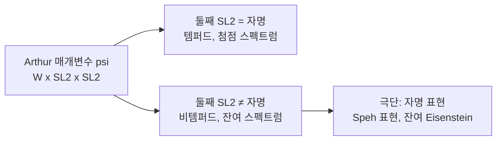

# Arthur 매개변수와 비템퍼드 표현

# 개요

[Vogan 꾸러미](vogan-packets.md)는 L 매개변수 $\varphi:W_F\times\mathrm{SL}_2(\mathbb C)\to{}^LG$ 로 표현에 이름표를 붙인다. 이 틀은 템퍼드 표현에서 잘 작동하지만, 자기동형 형식의 이산 스펙트럼 전체를 다루기에는 모자란다. **잔여 스펙트럼**에 사는 비템퍼드 표현들이 빠지기 때문이다.

Arthur 의 해결책은 $\mathrm{SL}_2$ 를 하나 더 붙이는 것이다.

$$
\psi:\ W_F\times\mathrm{SL}_2(\mathbb C)\times\mathrm{SL}_2(\mathbb C)\longrightarrow{}^LG
$$

첫째 $\mathrm{SL}_2$ 는 여전히 국소 분기 정보(Deligne 의 멱단 부분)를 담고, **둘째 $\mathrm{SL}_2$ 가 비템퍼드성을 담는다**. 자명하면 템퍼드로 돌아오고, 자명하지 않으면 그만큼 Satake 매개변수가 유니터리 축에서 밀려난다.

이 매개변수가 정의하는 **Arthur 꾸러미** $\Pi_\psi$ 는 L 꾸러미보다 크고, 성질도 더 미묘하다. 그 대가로 얻는 것이 전역 **중복도 공식**이다. 자기동형 표현이 이산 스펙트럼에 몇 번 나타나는지가 국소 지표들의 곱 하나로 결정된다.

$$
m(\pi)=\bigl|\{\text{국소 지표의 곱이 }\psi\text{ 의 지표와 맞는 경우}\}\bigr|
$$

Langlands 강령이 "어떤 표현이 존재하는가"를 예측한다면, Arthur 의 분류는 "몇 개 있는가"까지 답한다.

# 직관

## 왜 하나로는 부족한가

Ramanujan 추측은 $\mathrm{GL}_n$ 의 첨점 표현이 템퍼드라고 예측한다. 곧 Satake 매개변수의 절댓값이 1 이다. 그런데 자기동형 스펙트럼 전체를 보면 템퍼드가 아닌 것이 실제로 있다. 가장 단순한 예가 **자명 표현**이다. $\mathrm{GL}_1$ 의 자명 지표는 템퍼드지만, $\mathrm{GL}_2$ 의 자명 표현은 잔여 스펙트럼에 살고 Satake 매개변수가 $\{q^{1/2},q^{-1/2}\}$ 라 절댓값이 1 이 아니다.

이런 표현에 L 매개변수를 억지로 붙이면 유니터리가 아닌 상으로 가야 해서 이론이 망가진다. 둘째 $\mathrm{SL}_2$ 는 이 밀림을 **구조 안에서** 처리하는 장치다. $\mathrm{SL}_2(\mathbb C)$ 의 $d$ 차원 표현을 통해 들어오면 매개변수가

$$
w\ \longmapsto\ \varphi(w)\otimes\begin{pmatrix}|w|^{1/2}&\\&|w|^{-1/2}\end{pmatrix}^{\!\oplus}
$$

꼴로 $q^{\pm(d-1)/2}$ 만큼 벌어진다. 벌어진 양이 곧 비템퍼드성의 크기다.

## 첨점성과 잔여성의 사전

둘째 $\mathrm{SL}_2$ 가 자명한 매개변수가 템퍼드에 대응하고, 클수록 스펙트럼의 더 "얕은" 곳에 있는 표현이 나온다. 극단이 자명 표현으로, 첫째 $\mathrm{SL}_2$ 가 자명하고 둘째가 전체를 차지하는 경우다.

$\mathrm{GL}_n$ 에서 이 사전은 완전히 알려져 있다. Mœglin–Waldspurger 가 이산 스펙트럼을 분류했고, 답은 "첨점 표현 하나와 정수 $d$ 의 짝"으로 매개되는 **Speh 표현**들이다. 둘째 $\mathrm{SL}_2$ 의 차원이 정확히 그 $d$ 다.

## 왜 중복도 공식이 가능한가

전역 표현 $\pi=\otimes\pi_v$ 를 놓으면 각 자리에서 $\pi_v$ 가 국소 Arthur 꾸러미의 원소이고, [성분군](vogan-packets.md)의 지표 $\chi_{\pi_v}$ 를 갖는다. 전역 성분군 $\mathcal S_\psi$ 가 모든 국소 성분군으로 대각 사상을 가지므로, 국소 지표들을 곱해 전역 성분군 위의 지표 하나를 얻는다.

$$
\chi_\pi=\prod_v\chi_{\pi_v}\ \in\ \mathrm{Irr}(\mathcal S_\psi)
$$

중복도 공식은 이 곱이 특정 지표 $\epsilon_\psi$ 와 같을 때만 $\pi$ 가 이산 스펙트럼에 나타난다고 말한다. $\epsilon_\psi$ 자체는 대칭 거듭제곱 $L$ 함수의 부호로 정의되는 명시적 지표다. **유한군의 지표 하나를 계산하면 무한차원 공간에서의 중복도가 나온다.** 이것이 Arthur 분류의 실질적 내용이고, 안정화된 [대각합 공식](fundamental-lemma.md)이 그 증명 도구다.

# 정의

## Arthur 매개변수

$$
\psi:\ W_F\times\mathrm{SL}_2(\mathbb C)\times\mathrm{SL}_2(\mathbb C)\to{}^LG
$$

에서 $W_F$ 로의 제한이 유계 상을 갖고, 두 $\mathrm{SL}_2$ 로의 제한이 대수적이어야 한다. 대응하는 L 매개변수는

$$
\varphi_\psi(w)=\psi\!\left(w,\ \begin{pmatrix}|w|^{1/2}&\\&|w|^{-1/2}\end{pmatrix},\ 1\right)
$$

로 정의된다. 둘째 인자에 절댓값이 들어가면서 유계성이 깨지고, 그 깨짐이 비템퍼드성이다.

## 성분군과 부호 지표

$S_\psi=\mathrm{Cent}(\psi,\widehat G)$ 에서 $\mathcal S_\psi=\pi_0(S_\psi/Z(\widehat G)^\Gamma)$ 를 만든다. 전역 상황에서는 $\epsilon_\psi:\mathcal S_\psi\to\{\pm1\}$ 를 다음 꼴로 정의한다.

$$
\epsilon_\psi(s)=\prod_i\varepsilon\!\left(\tfrac12,\ \pi_i\times\pi_j\right)^{\cdots}
$$

곧 매개변수를 쪼갠 조각들의 Rankin–Selberg $\varepsilon$ 인자로 만든 부호다. 중심값의 부호가 다시 등장한다는 점에서 [GGP 지표 공식](gan-gross-prasad.md)과 같은 자리에 있다.

## 중복도 공식

$G$ 를 고전군이라 하고 $\psi$ 를 이산 전역 Arthur 매개변수라 하자. $\pi=\otimes\pi_v$ 가 $\Pi_\psi=\otimes\Pi_{\psi_v}$ 의 원소이면

$$
m(\pi)=
\begin{cases}
1,&\chi_\pi=\epsilon_\psi\\
0,&\text{그 외}
\end{cases}
$$

이다. 곧 이산 스펙트럼은 **중복도 1** 이고, 어느 원소가 나타나는지는 국소 지표의 곱으로 판정된다.

# 성질

## $\mathrm{GL}_n$ 의 경우

$\mathrm{GL}_n$ 에서는 성분군이 언제나 자명하므로 중복도 공식이 "모든 $\pi\in\Pi_\psi$ 가 정확히 한 번 나타난다"로 단순해진다. 이산 스펙트럼의 분류는 다음과 같다.

$$
n=dm,\qquad
\psi=\sigma\boxtimes[d],\qquad
\sigma\ \text{는 }\mathrm{GL}_m\text{ 의 첨점 표현}
$$

$d=1$ 이 첨점 표현이고, $d>1$ 이면 잔여 스펙트럼의 Speh 표현이다. $m=1,d=n$ 이면 자명 표현이 나온다. 이 목록이 전부라는 것이 Mœglin–Waldspurger 의 정리다.

## 고전군의 분류

Arthur 는 유사분열 고전군의 이산 스펙트럼을 $\mathrm{GL}_N$ 의 자기쌍대 첨점 표현으로 매개했다. 매개변수는

$$
\psi=\boxplus_i\ \sigma_i\boxtimes[d_i],
\qquad
\sigma_i\ \text{는 }\mathrm{GL}_{m_i}\text{ 의 자기쌍대 첨점 표현}
$$

꼴이고, 각 $\sigma_i\boxtimes[d_i]$ 가 $G$ 의 쌍대군이 보존하는 형식과 맞는 부호를 가져야 한다. 조건을 만족하는 조합을 세는 것이 고전군 표현을 세는 일이 된다. 증명은 안정화된 대각합 공식과 $\mathrm{GL}_N$ 으로의 이전을 쓰고, [기본 보조정리](fundamental-lemma.md)가 그 밑에 깔려 있다.

## Arthur 꾸러미의 미묘함

L 꾸러미와 달리 Arthur 꾸러미에는 불편한 성질이 있다.

- 원소가 **기약이 아닐** 수 있고, 유니터리가 아닌 표현이 섞일 수 있다.
- 서로 다른 매개변수의 꾸러미가 **겹칠** 수 있다.
- 꾸러미 안의 표현이 중복도를 갖고 나타날 수 있다.

그래서 "꾸러미"라는 말이 L 꾸러미만큼 깔끔하지 않다. 그럼에도 이 틀을 쓰는 이유는 전역 중복도 공식이 오직 이 언어로만 적히기 때문이다. 국소적 불편을 감수하고 전역적 명료함을 얻는 거래다.

## 일반화 Ramanujan 추측과의 관계

$\mathrm{GL}_n$ 의 첨점 표현이 템퍼드라는 추측은 Arthur 의 언어로 "첨점 매개변수의 둘째 $\mathrm{SL}_2$ 는 자명하다"가 된다. 고전군에서는 이 추측이 거짓이다. 둘째 $\mathrm{SL}_2$ 가 자명하지 않은 첨점 표현(CAP 표현)이 실제로 존재하고, Saito–Kurokawa 올림이 대표적인 예다. **Ramanujan 추측이 $\mathrm{GL}_n$ 의 성질이지 자기동형 형식 일반의 성질이 아니라는 사실**이 Arthur 매개변수를 통해 구조적으로 설명된다.

# 활용

## 이산 스펙트럼을 센다

가장 직접적인 쓸모는 세기다. 주어진 레벨과 무게에서 어떤 자기동형 표현이 몇 개 있는지를, 매개변수 조합을 나열하고 각각에 대해 지표 조건을 확인하는 유한 계산으로 바꾼다. 차원 공식을 표현론적으로 설명하는 일이 여기서 이루어진다.

## 올림의 예측

Saito–Kurokawa, Ikeda, Miyawaki 올림처럼 한 군의 형식에서 다른 군의 형식을 만드는 구성들이, Arthur 매개변수 수준에서는 매개변수를 다시 조립하는 것으로 보인다. 어떤 올림이 존재할 수 있고 그 상이 무엇인지를 매개변수의 모양으로 예측할 수 있다.

## 산술적 응용의 입력

고전군의 자기동형 표현을 Galois 표현과 잇는 작업(Shimura 다양체의 코호몰로지 분해)은 어떤 표현이 이산 스펙트럼에 있는지 알아야 시작된다. Arthur 의 분류가 그 입력을 공급하고, 그래서 최근의 모듈러성 올림 정리와 Langlands 상호성의 부분적 결과들이 이 분류 위에 서 있다.

# 연관 문서

## 선수지식

- [Vogan L 꾸러미와 순수 내부형식](vogan-packets.md)
- [기본 보조정리와 대각합 공식의 안정화](fundamental-lemma.md)

## 더 알아보기

아직 연결한 문서가 없다.

#number_theory #group_theory #field_theory
