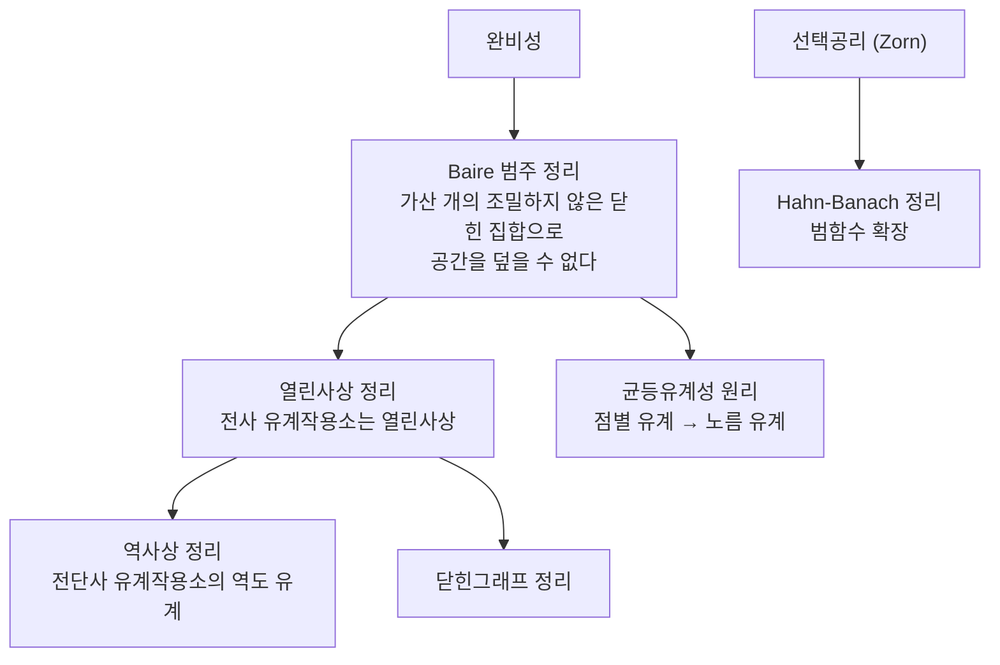

# Banach 공간과 세 기본정리

# 개요

무한차원 [벡터 공간](vector-spaces.md)에서는 유한차원에서 당연하던 것들이 무너진다. 선형사상이 연속이 아닐 수 있고, 부분공간이 닫히지 않을 수 있으며, 수렴하는 것처럼 보이는 급수가 수렴하지 않을 수 있다.

Banach 공간은 이 혼란을 다룰 수 있는 최소한의 구조다. 벡터의 크기를 재는 노름이 있고, 그 노름으로 [완비](completeness.md)하다. 완비성 덕분에 Cauchy 수열이 수렴하고, 절대수렴하는 급수가 수렴하며, 근사로 만든 대상이 실제로 존재한다.

이 구조 위에서 세 정리가 이론 전체를 떠받친다. Hahn–Banach 정리는 선형범함수가 충분히 많음을 보장하고, 열린사상 정리는 전사인 유계 작용소의 역이 유계임을 말하며, 균등유계성 원리는 점별 유계에서 균등 유계를 끌어낸다. 뒤의 둘은 완비성에서 Baire 범주 정리를 거쳐 나오고, 앞의 하나는 [선택공리](axiom-of-choice.md)에서 나온다.

# 직관

## 완비성이 존재를 만든다

해를 직접 쓸 수 없을 때 근사열을 만들어 극한을 취하는 것이 해석학의 표준 전략이다. 이 전략이 성립하려면 극한이 공간 안에 있어야 한다.

유리수에서 $\sqrt2$ 를 근사하는 수열이 수렴하지 않는 것과 같은 일이 함수공간에서도 일어난다. 연속함수들의 열이 균등수렴하면 극한이 연속이므로 $C[0,1]$ 은 완비지만, 같은 열을 적분 노름으로 재면 극한이 연속이 아닐 수 있어 완비가 아니다. 어떤 노름을 쓰느냐가 공간의 성질을 결정한다.

## 범함수가 많다는 것의 의미

유한차원에서 벡터를 좌표로 나눠 보는 일은 당연하다. 무한차원에서는 좌표가 없을 수 있고, 애초에 0 이 아닌 연속 선형범함수가 존재하는지도 자명하지 않다.

Hahn–Banach 정리가 이 걱정을 없앤다. 작은 부분공간에서 정의된 범함수를 노름을 키우지 않고 전체로 확장할 수 있으므로, 어떤 벡터도 범함수로 "볼" 수 있다.

$$
x\ne0\ \Longrightarrow\ \exists f\in X^*:\ \lVert f\rVert=1,\ f(x)=\lVert x\rVert
$$

쌍대공간이 충분히 크다는 이 사실이 볼록집합의 분리, 약한 위상, 쌍대성 이론 전체의 출발점이다.

## 완비성이 강제하는 것들

열린사상 정리와 균등유계성 원리는 둘 다 "완비 공간은 얇은 조각들로 덮이지 않는다" 는 Baire 범주 정리에서 나온다.

세 정리 가운데 둘이 같은 뿌리를 가지고, 나머지 하나는 전혀 다른 뿌리를 가진다는 점이 이 이론의 구조를 보여 준다.

# 정의

## 노름공간과 Banach 공간

벡터공간 $X$ 위의 노름은 $\lVert\cdot\rVert:X\to[0,\infty)$ 로 다음을 만족하는 것이다.

$$
\lVert x\rVert=0\iff x=0,\qquad
\lVert\alpha x\rVert=|\alpha|\lVert x\rVert,\qquad
\lVert x+y\rVert\le\lVert x\rVert+\lVert y\rVert
$$

$d(x,y)=\lVert x-y\rVert$ 가 거리를 주고, 이 거리에 대해 완비이면 Banach 공간이라 한다.

| 공간 | 노름 | 완비인가 |
|---|---|---|
| $\mathbb R^n$ | 임의의 노름 | 예 |
| $C[0,1]$ | $\sup\|f\|$ | 예 |
| $C[0,1]$ | $\int\|f\|$ | 아니오 |
| $1\le p\le\infty$ 의 $\ell^p$ 와 $L^p$ | $(\sum\|x_n\|^p)^{1/p}$ | 예 |
| $c_0$ | $\sup\|x_n\|$ | 예 |
| 다항식 전체 | $\sup_{[0,1]}\|f\|$ | 아니오 |

$p=2$ 인 경우만 노름이 내적에서 나오며, 그때가 Hilbert 공간이다. 평행사변형 법칙이 성립하는지가 판정 기준이다.

## 쌍대공간

$X^*$ 는 $X$ 위의 유계 선형범함수 전체이며, 작용소 노름을 준다.

$$
\lVert f\rVert=\sup_{\lVert x\rVert\le1}|f(x)|
$$

$X$ 가 완비가 아니어도 $X^*$ 는 항상 Banach 공간이다. $\mathbb R$ 이 완비이기 때문이다.

$1<p<\infty$ 에서 $1/p+1/q=1$ 이면 $(\ell^p)^\ast\cong\ell^q$ 이고, $(\ell^1)^\ast\cong\ell^\infty$ 지만 $(\ell^\infty)^*$ 는 $\ell^1$ 보다 크다.

# 성질

## Hahn–Banach 정리

$p:X\to\mathbb R$ 가 열등선형이고 $f$ 가 부분공간 $M$ 위의 선형범함수로 $f\le p$ 를 만족하면, $f$ 를 $X$ 전체로 확장하되 $f\le p$ 를 유지할 수 있다.

증명은 한 차원씩 확장하고 Zorn 보조정리로 극대 확장을 잡는다. 한 차원 확장에서 새 값을 넣을 구간이 비지 않는다는 것이 유일한 계산이고, 열등선형성이 그것을 보장한다.

노름공간에서 $p(x)=\lVert f\rVert_M\lVert x\rVert$ 로 두면 노름을 키우지 않는 확장이 나온다. 따름정리로 쌍대공간이 점을 분리하고, 볼록집합을 초평면으로 분리할 수 있으며, $\lVert x\rVert=\sup_{\lVert f\rVert\le1}|f(x)|$ 가 성립한다.

이 정리는 선택공리에 의존한다. 정확히는 초필터 보조정리보다 약간 약한 세기로, ZF 만으로는 증명되지 않는다.

## 균등유계성 원리

$X$ 가 Banach, $\{T_\alpha\}\subset\mathcal B(X,Y)$ 가 모든 $x$ 에서 $\sup_\alpha\lVert T_\alpha x\rVert<\infty$ 를 만족하면 $\sup_\alpha\lVert T_\alpha\rVert<\infty$ 다.

$E_n=\{x:\sup_\alpha\lVert T_\alpha x\rVert\le n\}$ 이 닫힌 집합이고 합집합이 $X$ 이므로, Baire 범주 정리에 의해 어떤 $E_n$ 이 내부를 가진다. 그 공에서의 유계성을 평행이동과 스칼라배로 옮기면 결론이 나온다.

응용이 즉각적이다. 작용소 열이 점별로 수렴하면 노름이 균등 유계이고 극한도 유계 작용소다. 또 Fourier 급수가 발산하는 연속함수의 존재가 이 원리로 증명된다. 부분합 작용소의 노름이 발산한다는 계산 하나로 반례의 존재가 따라온다.

## 열린사상 정리와 그 따름

$T\in\mathcal B(X,Y)$ 가 전사이면 $T$ 는 열린사상이다. 특히 전단사이면 $T^{-1}$ 도 유계다.

증명은 $Y=\bigcup_n T(nB_X)$ 에 Baire 를 적용해 $\overline{T(B_X)}$ 가 내부를 가짐을 얻고, 완비성으로 폐포를 벗겨 내는 두 단계다. 둘째 단계에서 절대수렴 급수의 수렴을 쓰므로 $X$ 의 완비성이 본질적이다.

닫힌그래프 정리가 따라온다. $T:X\to Y$ 가 선형이고 그래프가 닫혀 있으면 $T$ 는 유계다. 유계성을 직접 보이는 대신 $x_n\to x$ 이고 $Tx_n\to y$ 이면 $y=Tx$ 라는 것만 확인하면 되므로 실전에서 훨씬 쓰기 쉽다.

## 유한차원과의 결별

유한차원에서 참이지만 무한차원에서 거짓인 것들을 모아 두면 이론의 성격이 드러난다.

- 모든 노름이 동치다. 무한차원에서는 거짓이다.
- 닫힌 유계집합이 콤팩트다. Riesz 보조정리로 단위구가 콤팩트인 것은 유한차원과 동치임이 나온다.
- 모든 선형사상이 연속이다. 미분 작용소가 반례다.
- 모든 부분공간이 닫혀 있다. 다항식들은 $C[0,1]$ 에서 조밀하지만 닫히지 않았다.
- 대수적 기저가 유용하다. 무한차원 Banach 공간의 Hamel 기저는 비가산이며 Baire 범주 정리로 그 사실이 증명된다.

## 반사성과 약한 위상

자연스러운 매장 $J:X\to X^{**}$ 가 전사이면 $X$ 를 반사적이라 한다. $1<p<\infty$ 의 $L^p$ 는 반사적이고 $L^1$ 과 $L^\infty$ 와 $C[0,1]$ 은 아니다.

반사성이 중요한 이유는 콤팩트성이다. 노름 위상에서 단위구는 절대 콤팩트하지 않지만, 약한 위상에서는 반사적일 때 콤팩트하다. 그래서 최소화 문제에서 유계인 수열이 약수렴하는 부분열을 가지고, 이것이 변분법의 직접법이 작동하는 이유다.

Banach–Alaoglu 정리는 $X^*$ 의 단위구가 약\*위상에서 항상 콤팩트하다고 말한다. 이 정리는 Tychonoff 정리를 통해 선택공리에 의존한다.

# 활용

## 미분방정식의 해의 존재

해를 적분방정식으로 바꾸어 적당한 Banach 공간 위의 작용소 방정식으로 쓴 뒤 고정점이나 열린사상 정리를 적용한다. [축약사상 고정점 정리](banach-fixed-point.md)가 완비성만으로 작동하는 가장 단순한 예이며, Picard–Lindelöf 정리가 그 직접적 결과다.

선형 편미분방정식에서는 닫힌그래프 정리와 열린사상 정리가 선험적 부등식을 존재 정리로 바꾸는 데 쓰인다. 해의 크기를 자료의 크기로 제어하는 부등식이 있으면 해의 존재가 따라오는 구조다.

## 수치해석의 안정성

균등유계성 원리는 근사 방법의 수렴을 판정하는 도구다. 수치 적분 공식들이 모든 연속함수에 대해 수렴하려면 가중치 합이 균등 유계여야 한다는 Polya 의 정리가 그 예다. 노름이 발산하는 방법은 어떤 함수에서 반드시 실패한다.

## 최적화와 변분법

에너지 범함수를 최소화하는 함수를 찾을 때, 반사적 Banach 공간에서 약수렴 부분열을 뽑고 범함수의 약하한반연속성을 확인하는 것이 표준 절차다. 어떤 함수공간을 고르느냐가 이 두 조건의 성립 여부를 결정하므로 공간 선택이 문제의 일부가 된다.

## 왜 Hilbert 공간이 특별한가

Banach 공간에는 직교성이 없고 사영 정리가 없으며 쌍대공간이 자기 자신과 동일시되지 않는다. 이 세 가지를 되찾는 것이 내적이며, 그래서 가능한 곳에서는 $L^2$ 를 쓰는 것이 압도적으로 편하다. 그럼에도 $L^1$ 이나 $L^\infty$ 를 피할 수 없는 문제들이 있고, 거기서 이 절의 세 정리가 유일한 도구가 된다.

# 연관 문서

## 선수지식

- [Cauchy 수열과 완비성](completeness.md)
- [벡터 공간](vector-spaces.md)

## 더 알아보기

아직 연결한 문서가 없다.

#functional_analysis #analysis
