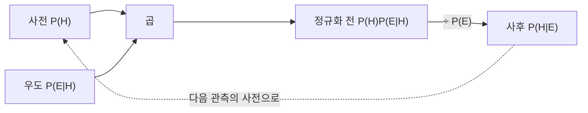

# Bayes 정리

# 개요

관측이 가설에 대해 무엇을 말해 주는가. 이 질문의 답은 반대 방향의 확률, 곧 "가설이 참이라면 이 관측이 나올 확률" 로부터 계산된다. 두 방향을 잇는 항등식이 Bayes 정리다.

증명은 [조건부 확률](probability.md)의 정의를 두 번 쓰는 한 줄이다. 내용이 얕은데도 중요한 이유는, 사람의 직관이 두 방향을 체계적으로 혼동하기 때문이다. "결함 부품은 대부분 검사에 걸린다" 와 "검사에 걸린 부품은 대부분 결함이다" 는 전혀 다른 진술인데 일상에서 뒤섞여 쓰인다. 정리는 두 값의 관계를 정확히 알려 주고, 그 차이가 얼마나 클 수 있는지도 알려 준다.

이 갱신 규칙을 확률 모형 전반으로 확장한 것이 [Bayes 추론](bayesian-inference.md)이며, 분류기·필터·진단 시스템의 기초가 된다.

# 직관

## 기저율을 잊지 않기

검사가 아무리 정확해도 찾으려는 대상이 드물면 양성 판정의 상당수가 오탐이다. 드문 사건의 참 양성보다 흔한 사건의 거짓 양성이 수적으로 많기 때문이다.

이 현상을 무시하는 오류를 기저율 무시라 한다. 정리의 분모 $P(E)$ 가 두 경로의 합으로 계산된다는 사실이 이 오류를 막아 준다. 계산의 요령은 확률이 아니라 개수로 바꿔 생각하는 것이다. 부품 $10000$ 개 중 결함이 $100$ 개이고 그중 $90$ 개가 걸린다. 정상 $9900$ 개 중 $495$ 개가 잘못 걸린다. 걸린 $585$ 개 중 결함은 $90$ 개이므로 약 15% 다.

## 사전, 우도, 사후

정리는 세 부분으로 읽는다. 사전확률은 관측 전의 믿음, 우도는 각 가설이 그 관측을 얼마나 잘 설명하는지, 사후확률은 갱신 후의 믿음이다.



마지막 점선이 중요하다. 사후를 다음 관측의 사전으로 쓰면 갱신이 이어지고, 관측 순서를 바꿔도 결과가 같다. 이 일관성이 Bayes 갱신을 순차적 학습의 규칙으로 만든다.

## 승산으로 보면 더 간단하다

두 가설을 비교할 때는 정규화 상수가 필요 없다.

$$
\frac{P(H_1\mid E)}{P(H_2\mid E)}=\frac{P(E\mid H_1)}{P(E\mid H_2)}\cdot\frac{P(H_1)}{P(H_2)}
$$

사후 승산은 우도비 곱하기 사전 승산이다. 증거가 승산을 몇 배로 바꾸는지만 보면 되므로, 로그를 취하면 증거들이 더해진다. 로그 우도비를 증거의 세기로 다루는 관행과 [정보량](entropy.md)의 단위가 여기서 만난다.

# 정의

## 정리

확률 공간에서 $H$ 를 가설 사건, $E$ 를 관측 사건이라 하고 두 확률이 모두 양수라 하자.

$$
P(H\mid E)=\frac{P(E\mid H)\,P(H)}{P(E)}
$$

$P(H)$ 는 사전확률, $P(E|H)$ 는 우도, $P(H|E)$ 는 사후확률이며 분모는 정규화 상수다.

## 전체 확률 공식

사건 $H_1, \dots, H_m$ 이 전체를 서로 겹치지 않게 분할하고 각 확률이 양수이면

$$
P(E)=\sum_{i=1}^{m}P(E\mid H_i)P(H_i)
$$

로 분모를 계산한다. 가설이 배타적이고 남김없이 나열되어야 한다는 조건이 실무에서 자주 어겨진다. "그 밖의 경우" 를 빼먹으면 사후확률이 부풀려진다.

# 성질

## 증명

교집합의 확률을 두 방향으로 쓰면 된다.

$$
P(H\cap E)=P(E\mid H)P(H)=P(H\mid E)P(E)
$$

양변을 $P(E)$ 로 나누면 정리가 나온다. 조건부 확률의 정의 외에는 아무것도 쓰지 않는다.

## 방향을 바꿔 쓸 수 없다

$P(E|H)$ 와 $P(H|E)$ 는 다르다. 결함률이 1% 이고, 결함 부품이 검사에 걸릴 확률이 90% 이며, 정상 부품이 잘못 걸릴 확률이 5% 라 하면

$$
P(H\mid E)=\frac{0.90\times0.01}{0.90\times0.01+0.05\times0.99}\approx0.154
$$

검사에 걸렸어도 결함 확률은 약 15.4% 다. 정상 부품의 수가 많아 오탐의 기여가 크기 때문이다. 두 방향의 확률이 $0.90$ 과 $0.154$ 로 여섯 배 가까이 차이 난다. 예시 수치는 설명을 위해 정한 값이다.

```python
def posterior(prior, sens, fpr):
    """prior: P(H), sens: P(E|H), fpr: P(E|not H)."""
    num = sens * prior
    return num / (num + fpr * (1 - prior))


for prior in (0.5, 0.1, 0.01, 0.001):
    print(f"사전 {prior:<6} -> 사후 {posterior(prior, 0.90, 0.05):.4f}")

# 같은 검사를 독립적으로 두 번 시행 (가설 조건부 독립 가정 필요)
p = 0.01
for step in range(1, 4):
    p = posterior(p, 0.90, 0.05)
    print(f"양성 {step}회 후: {p:.4f}")
```

사전확률이 $0.001$ 이면 한 번 양성이어도 사후는 1.8% 에 그친다. 반면 사전 $0.01$ 에서 양성이 세 번 반복되면 $0.15$ 와 $0.77$ 과 $0.98$ 로 올라간다. 한 번의 검사 성능보다 사전확률과 증거의 누적이 결론을 지배한다는 점이 수치로 드러난다. 다만 아래에서 보듯 반복 갱신은 조건부 독립을 전제한다.

## 반복 갱신의 조건

여러 관측의 우도를 단순히 곱하려면 가설을 조건으로 한 독립성이 필요하다.

$$
P(E_1,E_2\mid H)=P(E_1\mid H)P(E_2\mid H)
$$

Bayes 정리 자체는 이 독립성을 제공하지 않는다. 같은 검사를 반복하면 같은 방향으로 틀리는 경향이 있어 조건부 독립이 깨지고, 그때 우도를 곱하면 확신이 과장된다. 스팸 필터의 단순 Bayes 분류기가 조건부 독립을 가정하는 것도 같은 맥락이며, 가정이 거짓인데도 분류 성능은 쓸 만한 경우가 많다는 것이 경험적으로 알려져 있다. 다만 그때 출력되는 확률값 자체는 신뢰할 수 없다.

## 확률 0 의 가설

사전에 확률 $0$ 을 준 가설은 양의 확률 사건으로 유한 번 조건화해도 양의 확률을 얻지 못한다. 분자가 $0$ 이기 때문이다.

따라서 모형에서 무엇을 가능하다고 두었는지가 결론을 직접 제한한다. 고려하지 않은 가설은 아무리 많은 증거가 쌓여도 등장하지 않는다. 이를 Cromwell 의 규칙이라 하며, 논리적으로 불가능한 것이 아니라면 사전확률을 $0$ 으로 두지 말라는 실무 지침으로 통한다.

## 연속판

밀도가 있는 경우에도 같은 형태가 성립한다.

$$
p(\theta\mid x)=\frac{p(x\mid\theta)\,p(\theta)}{\int p(x\mid\theta')p(\theta')\,d\theta'}
$$

분모의 적분이 대개 닫힌 형태로 계산되지 않는다는 것이 계산 베이즈 통계의 출발점이며, 켤레 사전분포, Markov 연쇄 몬테카를로, 변분 근사가 그 대응책이다. 조건화가 확률 $0$ 인 사건에 대해서도 잘 정의되려면 [조건부 기댓값](conditional-expectation.md)의 측도론적 정의가 필요하다.

# 활용

## 진단과 분류

의학 검사, 결함 검출, 스팸 분류, 침입 탐지가 모두 같은 구조다. 민감도와 특이도가 좋아도 유병률이 낮으면 양성예측도가 낮다는 사실이 검사 설계와 선별 정책의 핵심 고려사항이 된다. 드문 대상을 찾을 때는 이 단계 검사로 사전확률을 높인 뒤 정밀 검사를 하는 전략이 나오는 이유다.

## 순차적 추론

로봇의 위치 추정, 칼만 필터, 온라인 학습은 관측이 들어올 때마다 사후를 갱신하고 그것을 다음 사전으로 쓴다. 갱신이 순서에 무관하고 결합적이라는 성질이 이런 재귀적 구현을 가능하게 한다.

## 증거의 해석

법정의 증거, 실험 결과의 해석, 모형 비교에서 우도비가 "이 증거가 가설들 사이의 승산을 몇 배 바꾸는가" 를 말해 준다. 우도비만으로 결론을 내릴 수 없고 사전 승산이 필요하다는 점이 자주 간과되며, 그 결과가 검사 결과를 그대로 확률로 읽는 오류다. 정리가 하는 일은 새 정보를 주는 것이 아니라 기존 정보와 새 정보를 결합하는 방법을 정하는 것이다.[^1]

[^1]: MIT 6.042J, *Conditional Probability*, Chapter 17.1–17.5. 조건부 확률, 전체 확률 공식과 Bayes 규칙. https://ocw.mit.edu/courses/6-042j-mathematics-for-computer-science-spring-2015/mit6_042js15_session29.pdf

# 연관 문서

## 선수지식

- [유한 확률 공간](probability.md)

## 더 알아보기

- [Bayes 추론과 사후분포](bayesian-inference.md)

#probability #theorem
