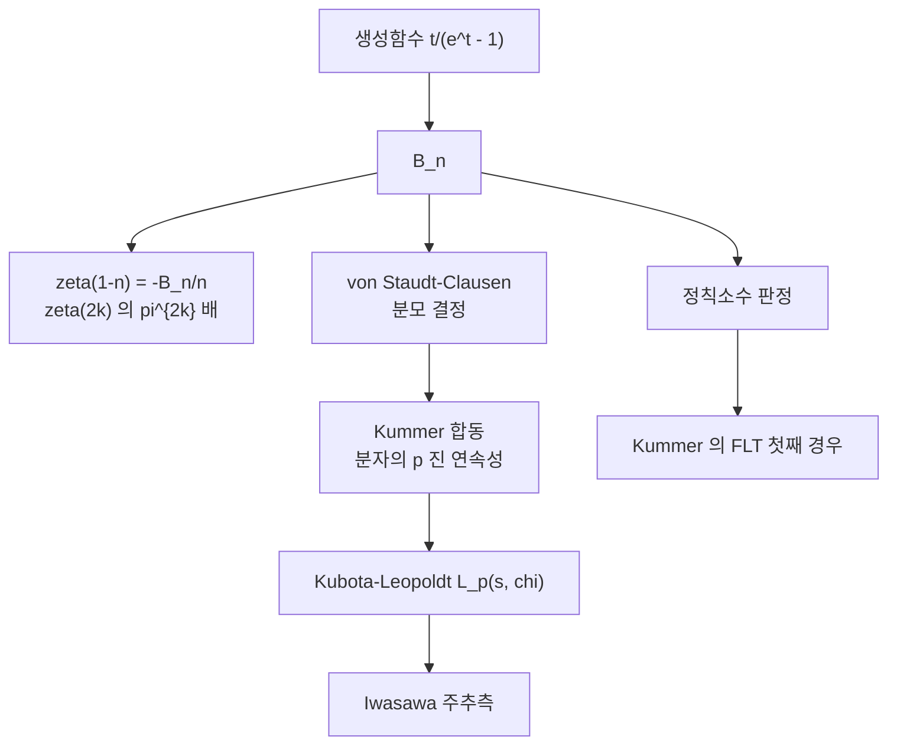

# Bernoulli 수와 von Staudt–Clausen 정리

# 개요

Bernoulli 수는 거듭제곱의 합을 닫힌 꼴로 쓰려는 아주 구체적인 물음에서 나왔다.

$$
\sum_{a=0}^{n-1}a^{k}=\frac1{k+1}\sum_{j=0}^{k}\binom{k+1}{j}B_j\,n^{\,k+1-j}
$$

여기 나오는 유리수 $B_j$ 가 Bernoulli 수다. 정의는 초등적이지만 이 수열이 나타나는 자리는 초등적이지 않다.

- $\zeta(2k)$ 의 값. $\zeta(2)=\pi^2/6$ 부터 모든 짝수 zeta 값이 $B_{2k}$ 로 쓰인다.
- $\zeta(1-k)=-B_k/k$ 다. 함수방정식으로 옮기면 **음의 정수에서의 zeta 값이 곧 Bernoulli 수**다.
- $p$ 가 $B_2,\dots,B_{p-3}$ 중 하나를 나누는지가 순환체의 류수가 $p$ 로 나뉘는지를 결정한다(Kummer 의 기준).

세 번째 항목이 이 문서가 그래프에서 차지하는 자리다. [Stickelberger](stickelberger.md) 원소의 계수도, Kubota–Leopoldt $p$ 진 $L$ 함수의 보간값도, [Iwasawa 주추측](iwasawa-main-conjecture.md)의 해석적 변도 전부 $B_{n,\chi}$ 로 쓰인다. 그 모든 것의 바닥에 두 개의 고전 정리가 있다. 분모를 완전히 결정하는 **von Staudt–Clausen** 정리와, 분자를 $p$ 진적으로 이어 붙이는 **Kummer 합동**이다. 앞의 것이 $B_n$ 의 $p$ 진 극점을 통제하고, 뒤의 것이 $p$ 진 보간을 가능하게 한다.

# 직관

## 생성함수가 정의를 대신한다

$$
\frac{t}{e^{t}-1}=\sum_{n\ge0}B_n\frac{t^{n}}{n!}
$$

를 정의로 삼으면 거듭제곱 합 공식이 자동으로 나온다. $\sum_a e^{at}$ 를 등비급수로 더한 뒤 $t$ 의 계수를 비교하면 끝이다. [멱급수](power-series.md)로 정의하는 편이 점화식보다 다루기 쉬운 이유는 대칭성이 바로 보이기 때문이다.

$$
\frac{t}{e^{t}-1}+\frac t2=\frac t2\coth\frac t2
$$

는 짝함수이므로 $B_1=-\tfrac12$ 을 빼면 홀수 번째가 모두 0 이다. 그러므로 실질적으로 볼 것은 $B_2,B_4,B_6,\dots$ 뿐이다.

## 분모는 완전히 알려져 있다

$B_n$ 의 값을 늘어놓으면 분자는 불규칙하게 커지지만 분모는 놀랄 만큼 규칙적이다.

$$
B_2=\tfrac16,\quad B_4=-\tfrac1{30},\quad B_6=\tfrac1{42},\quad B_8=-\tfrac1{30},\quad B_{10}=\tfrac5{66}
$$

$6=2\cdot3$ 과 $30=2\cdot3\cdot5$ 와 $42=2\cdot3\cdot7$ 에 대해 **von Staudt–Clausen 정리**가 규칙을 말해 준다. $p-1$ 이 $n$ 을 나누는 소수 $p$ 가 정확히 분모에 한 번씩 나타난다.

$$
B_{n}+\sum_{(p-1)\mid n}\frac1p\ \in\ \mathbb Z\qquad(n\ \text{짝수})
$$

$p$ 진으로 읽으면 이 정리는 "$(p-1)\mid n$ 이면 $B_n$ 의 $p$ 부치가 정확히 $-1$ 이고, 아니면 $0$ 이상" 이라는 말이다. 곧 $B_n$ 은 $p$ 진 정수이거나 기껏해야 1 차 극점을 갖는다. 극점의 위치가 $n\bmod(p-1)$ 로만 결정된다는 사실이 $p$ 진 해석의 문을 연다.

## 분자는 이어 붙는다

von Staudt–Clausen 이 분모를 치우고 나면 $B_n/n$ 을 $p$ 진수로 볼 수 있다. **Kummer 합동**은 이 값이 $n$ 에 대해 연속적이라고 말한다.

$$
m\equiv n\pmod{p-1},\quad (p-1)\nmid m
\ \Longrightarrow\
\frac{B_m}{m}\equiv\frac{B_n}{n}\pmod p
$$

$\bmod\ p^{k}$ 판본까지 성립한다. $n\mapsto B_n/n$ 이 $\mathbb Z/(p-1)$ 의 각 잉여류 위에서 $p$ 진 연속함수로 확장되고, 그 확장이 Kubota–Leopoldt 의 $L_p(s,\chi)$ 다. **정수에서만 정의된 수열을 $p$ 진 해석함수로 잇는 작업**이 여기서 시작된다.

```python
# von Staudt-Clausen 과 Kummer 합동을 직접 확인한다
from fractions import Fraction as F
from math import comb
isprime = lambda n: n > 1 and all(n % d for d in range(2, int(n ** 0.5) + 1))

N = 80
B = [F(0)] * (N + 1); B[0] = F(1)
for n in range(1, N + 1):                      # sum_{k<n} C(n+1,k) B_k = 0
    B[n] = -sum(comb(n + 1, k) * B[k] for k in range(n)) / F(n + 1)

for m in range(2, N + 1, 2):                   # von Staudt-Clausen
    s = B[m] + sum(F(1, p) for p in range(2, m + 2) if isprime(p) and m % (p - 1) == 0)
    assert s.denominator == 1

for p in [5, 7, 11, 13, 17, 19]:               # Kummer 합동
    for m in range(2, N + 1, 2):
        for n in range(2, N + 1, 2):
            if m == n or (m - n) % (p - 1) or m % (p - 1) == 0: continue
            d = B[m] / m - B[n] / n
            assert d.numerator % p == 0 and d.denominator % p

print([p for p in range(3, 61) if isprime(p)
       and any(B[k].numerator % p == 0 for k in range(2, p - 2, 2))])
# [37, 59]   <- 60 이하의 비정칙 소수
```

마지막 줄이 이 문서의 요점을 한 줄로 보여 준다. $B_k$ 의 분자에 $p$ 가 숨어 있는 일은 드물지만 실제로 일어나고, 그런 $p$ 에서 순환체의 산술이 달라진다.

## 왜 $p-1$ 이 계속 나오는가

$(\mathbb Z/p)^{\times}$ 의 위수가 $p-1$ 이기 때문이다. $\sum_{a=1}^{p-1}a^{n}$ 은 $(p-1)\mid n$ 일 때만 $\bmod p$ 에서 $-1$ 이고 아니면 $0$ 이다. 거듭제곱 합 공식의 $\bmod p$ 판이 곧 von Staudt–Clausen 이고, Kummer 합동의 $p-1$ 주기도 같은 직교성에서 온다. **Bernoulli 수의 $p$ 진 성질은 전부 유한군 $(\mathbb Z/p)^{\times}$ 의 지표 직교성의 그림자다.**



# 정의

## Bernoulli 수와 Bernoulli 다항식

$$
\frac{t}{e^{t}-1}=\sum_{n\ge0}B_n\frac{t^{n}}{n!},
\qquad
\frac{t\,e^{xt}}{e^{t}-1}=\sum_{n\ge0}B_n(x)\frac{t^{n}}{n!}
$$

$B_n=B_n(0)$ 이다. 점화식은 $n\ge1$ 에서 $\sum_{k=0}^{n}\binom{n+1}{k}B_k=0$ 이고 위 코드가 쓰는 것이 이 식이다. $B_1=-\tfrac12$ 이며 $n\ge3$ 이 홀수면 $B_n=0$ 이다.

## 일반화 Bernoulli 수

도체 $f$ 인 지표 $\chi$ 에 대해

$$
\sum_{a=1}^{f}\chi(a)\frac{t\,e^{at}}{e^{ft}-1}=\sum_{n\ge0}B_{n,\chi}\frac{t^{n}}{n!},
\qquad
B_{1,\chi}=\frac1f\sum_{a=1}^{f}\chi(a)\,a
$$

로 정의한다. $\chi$ 가 자명하면 원래의 $B_n$ 으로 돌아온다. [Dirichlet $L$ 함수](dirichlet-l-functions.md)와의 관계는

$$
L(1-n,\chi)=-\frac{B_{n,\chi}}{n}
$$

이고, 특히 $L(0,\chi)=-B_{1,\chi}$ 가 [Stickelberger](stickelberger.md) 원소의 지표 성분으로 나타나는 바로 그 값이다.

## zeta 값

$$
\zeta(2k)=\frac{(-1)^{k+1}B_{2k}(2\pi)^{2k}}{2\,(2k)!},
\qquad
\zeta(1-n)=-\frac{B_n}{n}
$$

두 식은 함수방정식으로 서로 옮겨진다. 앞의 것이 [Riemann zeta](prime-number-theorem.md)의 짝수 값, 뒤의 것이 음의 정수 값이다. 홀수 $\zeta(3),\zeta(5),\dots$ 에 대응하는 초등적 표현이 없는 것이 이 대칭의 빈 곳이다.

# 성질

## von Staudt–Clausen 정리

**정리.** $n\ge2$ 가 짝수면

$$
B_n+\sum_{(p-1)\mid n}\frac1p\in\mathbb Z
$$

**따름.** $B_n$ 의 분모는 $\prod_{(p-1)\mid n}p$ 이고 제곱인수가 없다. $p$ 진 부치로는

$$
v_p(B_n)=\begin{cases}-1,&(p-1)\mid n\\ \ \ge0,&\text{그 외}\end{cases}
$$

**증명의 착상.** $\sum_{a=0}^{N-1}a^{n}$ 을 두 방식으로 $\bmod p$ 계산한다. 한쪽은 거듭제곱 합 공식, 다른 쪽은 $(\mathbb Z/p)^{\times}$ 의 직교성이다. 두 계산을 맞추면 $pB_n\equiv-1$ 또는 $0$ 이 나온다. $\square$

## Kummer 합동

**정리.** $(p-1)\nmid m$ 이고 $m\equiv n\pmod{(p-1)p^{k-1}}$ 이면

$$
\big(1-p^{m-1}\big)\frac{B_m}{m}\equiv\big(1-p^{n-1}\big)\frac{B_n}{n}\pmod{p^{k}}
$$

$p$ 인자 $(1-p^{m-1})$ 는 Euler 인자를 제거한 것이고, $k=1$ 이면 이 인자가 $\bmod p$ 에서 1 이므로 직관 절의 단순한 꼴이 된다.

**의미.** $\mathbb Z_{\ge2}$ 의 각 잉여류가 $\mathbb Z_p$ 에서 조밀하므로, 위 합동은 함수

$$
n\ \longmapsto\ \big(1-p^{n-1}\big)\frac{B_n}{n}
$$

가 $p$ 진 균등연속임을 뜻하고, 따라서 $\mathbb Z_p$ 전체로 유일하게 연장된다. 그 연장이 $L_p(1-s,\omega^{n})$ 다. **$p$ 진 $L$ 함수는 새로 정의된 것이 아니라 Bernoulli 수열의 완비화다.**

## 정칙소수

홀소수 $p$ 가 **정칙**이라는 것은 $p$ 가 $\mathbb Q(\mu_p)$ 의 류수를 나누지 않는다는 뜻이다.

**Kummer 의 기준.** $p$ 가 정칙일 필요충분조건은

$$
p\nmid B_2\,B_4\cdots B_{p-3}\ \text{의 분자}
$$

앞의 코드가 찾은 $37,59$ 가 60 이하의 비정칙 소수이고, 다음은 $67,101,103,\dots$ 이다. 비정칙 소수의 밀도는 $1-e^{-1/2}\approx39.3\%$ 로 추정되며 수치와 잘 맞는다. **정칙소수가 무한히 많은지는 미해결이고, 비정칙 소수가 무한히 많다는 것은 증명되어 있다**(Jensen). 쉬운 쪽과 어려운 쪽이 뒤바뀐 드문 예다.

기준의 두 방향은 성격이 다르다. $p\nmid B_k$ 에서 류군의 성분이 0 임을 얻는 쪽은 [Stickelberger](stickelberger.md) 의 소멸 정리에서 곧바로 나오지만, 반대쪽은 Ribet 의 정리가 필요하다.

## 점근 크기

$$
|B_{2n}|=\frac{2\,(2n)!}{(2\pi)^{2n}}\zeta(2n)\ \sim\ 4\sqrt{\pi n}\left(\frac{n}{\pi e}\right)^{2n}
$$

계승보다 빠르게 자란다. 그러므로 $B_n$ 을 유리수로 그대로 다루는 계산은 금방 한계에 부딪히고, 실제 계산은 von Staudt–Clausen 으로 분모를 알아낸 뒤 여러 소수를 법으로 분자를 구해 중국인의 나머지 정리로 복원하는 방식을 쓴다.

# 활용

## Kummer 의 Fermat 정리

$p$ 가 정칙이면 $x^{p}+y^{p}=z^{p}$ 에 $p\nmid xyz$ 인 해가 없다. 증명의 핵심은 $\mathbb Q(\mu_p)$ 에서 좌변을 인수분해한 뒤, 유일분해가 깨지는 정도를 류군으로 재고 $p\nmid h$ 를 써서 각 인자가 주 아이디얼이 되게 만드는 것이다. Bernoulli 수는 $p\nmid h$ 를 **계산 가능한 조건으로 번역**하는 역할을 한다. 류수를 직접 계산하는 것은 어렵지만 $B_k$ 를 $\bmod p$ 로 보는 것은 쉽다.

## $p$ 진 $L$ 함수와 Iwasawa 이론

Kummer 합동이 $L_p(s,\chi)$ 의 존재를 주고, 그 함수의 $\Lambda$ 원소로서의 실현이 [Iwasawa 주추측](iwasawa-main-conjecture.md)의 해석적 변이 된다. 주추측을 $T=0$ 에서 읽은 것이 Herbrand–Ribet 이고, 그 진술이 다시 $p\mid B_k$ 라는 조건으로 쓰인다. 이 문서의 두 정리가 없으면 그 사슬의 첫 고리가 없다.

## 수치해석: Euler–Maclaurin

$$
\sum_{a=M}^{N}f(a)=\int_M^{N}f+\frac{f(M)+f(N)}2+\sum_{k=1}^{K}\frac{B_{2k}}{(2k)!}\Big(f^{(2k-1)}(N)-f^{(2k-1)}(M)\Big)+R_K
$$

합과 적분의 차이를 Bernoulli 수로 전개하는 공식이다. $\zeta(s)$ 와 $\Gamma(s)$ 의 고정밀 계산, Stirling 급수가 모두 여기서 나온다. $B_{2k}$ 가 발산하므로 급수는 점근급수일 뿐이고, $K$ 를 최적점에서 끊어야 한다. 자세한 것은 [Euler–Maclaurin 공식과 점근급수](euler-maclaurin.md)에 있다.

## 조합론과 위상

$B_n$ 은 Todd 류의 계수로 나타나 Hirzebruch–Riemann–Roch 공식에 들어가고, $\zeta(1-n)=-B_n/n$ 을 통해 구면의 안정 호모토피군의 위수, 곧 Adams 의 $\mathrm{im}\,J$ 부분에도 나타난다. 초등적 점화식으로 정의된 수열이 왜 이렇게 멀리까지 가는지는, 결국 모두 $\zeta$ 의 특수값을 계산하고 있기 때문이라고 답할 수 있다.

[^1]: 표준 참고는 K. Ireland, M. Rosen, *A Classical Introduction to Modern Number Theory* (2판) 15 장과 L. Washington, *Introduction to Cyclotomic Fields* (2판) 5 장. 비정칙 소수의 밀도 추정은 C. L. Siegel 의 발상이며, 비정칙 소수의 무한성은 K. L. Jensen (1915). 본문의 수치 확인은 직접 계산한 것이다.

# 연관 문서

## 선수지식

- [멱급수와 Taylor 급수](power-series.md)
- [소수 정리와 Riemann zeta 함수](prime-number-theorem.md)

## 더 알아보기

- [Stickelberger 원소와 Gauss 합](stickelberger.md)
- [Euler–Maclaurin 공식과 점근급수](euler-maclaurin.md)
- [질량 공식과 격자의 류](mass-formula.md)

#number_theory #analysis #computation
