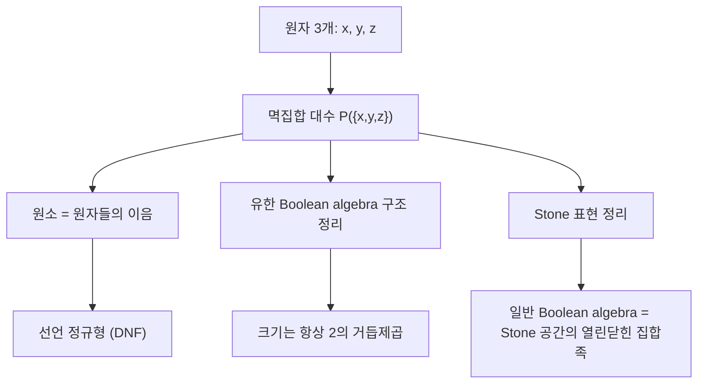

# Boolean algebra

# 개요

Boolean algebra 는 "합집합, 교집합, 여집합"의 규칙만 뽑아낸 대수 구조다. 집합 연산, 고전 명제논리의 연결사, 논리회로의 게이트가 모두 같은 법칙을 따른다는 관찰에서 출발한다.

이 구조는 두 방향에서 볼 수 있다. 하나는 항등식 목록으로 정의된 대수이고, 다른 하나는 보수를 가지는 분배 [부분순서](partial-orders.md), 즉 격자다. 두 정의는 동치이며, 순서 쪽이 "정보의 강약"이라는 직관을 준다.

핵심 결과는 Stone 표현 정리다. 모든 Boolean algebra 는 어떤 [집합](sets.md)의 부분집합족과 동형이다. 유한 경우에는 그 집합이 원자들의 집합이고, 무한 경우에는 위상공간(Stone 공간)의 열린닫힌 집합족이 된다. 즉 이 구조의 추상적 공리들은 결국 집합 연산 이상도 이하도 아니다.

# 직관

Boolean algebra 는 "예 또는 아니오"가 항상 결정되는 세계의 대수다. 원소를 명제로 읽으면 $a \vee \neg a = 1$ 은 모든 명제가 참이거나 거짓이라는 선언이고, $\neg\neg a = a$ 는 부정을 두 번 하면 제자리로 온다는 선언이다.

이 두 요구는 강하다. [Heyting algebra](heyting-algebras.md)에서 보듯이 함의가 있는 격자라고 해서 이것이 따라오지는 않는다. 열린집합 격자처럼 "여집합이 구조 밖으로 나가는" 모형에서는 보수가 존재하지 않는다. Boolean algebra 는 보수의 존재를 공리로 요구해 이 가능성을 처음부터 잘라낸다.

순서로 보면 $a \le b$ 는 " $a$ 가 $b$ 보다 더 강한 주장"이다. 바닥 $0$ 은 모순이고 꼭대기 $1$ 은 항진명제다. 만남은 "둘 다 주장하기", 이음은 "둘 중 하나를 주장하기"다. 원자는 더 이상 쪼갤 수 없는 최소의 참된 주장, 즉 "세계를 완전히 지정하는 서술"에 해당한다. 유한 세계에서는 모든 주장이 그것과 양립하는 세계들의 나열로 환원되는데, 이 나열이 논리회로의 선언 정규형(DNF)이다.

# 정의

## 공리적 정의

**정의.** Boolean algebra 는 집합 $B$ 와 이항연산 $\wedge$ , $\vee$ , 단항연산 $\neg$ , 상수 $0$ , $1$ 의 조합으로, 모든 원소에 대해 다음이 성립하는 것이다.

$$
a \vee b = b \vee a, \qquad a \wedge b = b \wedge a
$$

$$
a \vee (b \wedge c) = (a \vee b) \wedge (a \vee c), \qquad a \wedge (b \vee c) = (a \wedge b) \vee (a \wedge c)
$$

$$
a \vee 0 = a, \qquad a \wedge 1 = a
$$

$$
a \vee \neg a = 1, \qquad a \wedge \neg a = 0
$$

이 목록(Huntington 공리계)에서 결합법칙, 멱등법칙, 흡수법칙, de Morgan 법칙, 보수의 유일성이 모두 따라 나온다. 특히 보수는 유일하므로 $\neg$ 는 다른 연산들에 의해 결정된다.

## 격자로서의 정의

**정의(동치).** Boolean algebra 는 보수를 가지는 유계 분배격자다. 여기서 순서는 다음으로 정의된다.

$$
a \le b \iff a \wedge b = a \iff a \vee b = b
$$

이 순서에 대해 $a \wedge b$ 는 하한, $a \vee b$ 는 상한이다. 함의는 다음처럼 정의할 수 있고, 이렇게 정의하면 Boolean algebra 는 $\neg\neg a = a$ 를 만족하는 Heyting algebra 와 같아진다.

$$
a \to b \thickspace:=\thickspace \neg a \vee b
$$

## 예

**멱집합 대수.** 집합 $X$ 에 대해 $P(X)$ 는 합집합, 교집합, 여집합으로 Boolean algebra 다. 이것이 원형이다. 더 일반적으로 $X$ 의 부분집합들 중 합집합, 교집합, 여집합에 닫힌 족을 field of sets 라 하며, 이것도 Boolean algebra 다. 유한집합과 여유한집합들만 모은 족이 대표적인 부분 예다.

**Lindenbaum–Tarski 대수.** 고전 명제논리의 논리식들을 논리적 동치로 나눈 몫은 Boolean algebra 다. 연산은 연결사에서 유도되고 순서는 도출 가능성이다.

$$
[\varphi] \le [\psi] \iff \varphi \vdash \psi
$$

변수가 $n$ 개면 이 대수는 크기 $2$ 의 $2^n$ 거듭제곱, 즉 $n$ 개 생성원 위의 자유 Boolean algebra 다. 변수가 가산무한이면 원자가 하나도 없는 무한 대수가 된다.

**Boolean ring.** 모든 원소가 멱등인 [환](rings.md), 즉 모든 $x$ 에 대해 $x$ 의 제곱이 $x$ 인 단위원 있는 가환환을 Boolean ring 이라 한다. 두 구조는 다음 번역으로 서로 옮겨진다.

$$
x \wedge y = xy, \qquad x \vee y = x + y + xy, \qquad \neg x = 1 + x
$$

$$
x + y = (x \wedge \neg y) \vee (\neg x \wedge y)
$$

덧셈은 대칭차집합이다. 이 번역은 두 개념이 사실상 같은 것임을 보여 주며, 덕분에 [아이디얼과 몫환](ideals-quotient-rings.md)의 언어를 그대로 쓸 수 있다.

## 필터, 아이디얼, 초필터

**정의.** $B$ 의 부분집합 $F$ 가 필터라 함은 $1 \in F$ 이고, 위로 닫혀 있고, 유한 만남에 닫혀 있다는 뜻이다. $0$ 을 포함하지 않는 극대 필터를 초필터(ultrafilter)라 한다.

$F$ 가 초필터일 필요충분조건은 모든 $a$ 에 대해 $a \in F$ 와 $\neg a \in F$ 중 정확히 하나가 성립하는 것이다. 초필터는 두 원소 Boolean algebra 로 가는 준동형과 일대일 대응하고, Boolean ring 의 언어로는 [극대 아이디얼](prime-ideals.md)의 여집합이다.

# 성질

## 유한 Boolean algebra 의 구조

**정의.** $0$ 이 아닌 원소 $a$ 가 원자(atom)라 함은 $0 \lt x \le a$ 인 $x$ 가 $a$ 뿐이라는 뜻이다.

**정리.** 유한 Boolean algebra $B$ 는 원자들의 집합 $\mathrm{At}(B)$ 의 멱집합 대수와 동형이다. 따라서 유한 Boolean algebra 의 크기는 항상 2의 거듭제곱이며, 크기가 같으면 동형이다.

*증명 스케치.* 각 $a$ 에 대해 $a$ 아래의 원자들을 모으는 사상 $a \mapsto \lbrace p \in \mathrm{At}(B) : p \le a\rbrace$ 를 본다. 유한성에서 $a$ 는 자기 아래 원자들의 이음과 같다(아니라면 차이 부분에 더 작은 원소가 계속 생겨 무한 하강열이 만들어진다). 분배성에서 이 사상이 연산을 보존하고, 보수의 존재에서 단사임이 나온다. 전사성은 원자들의 임의의 부분집합의 이음을 취하면 된다.

무한에서는 이것이 깨진다. 가산 생성 자유 Boolean algebra 처럼 원자가 전혀 없는 무한 대수(atomless)가 존재한다.

## Stone 표현 정리

**정리(Stone, 1936).** 모든 Boolean algebra $B$ 는 어떤 field of sets 와 동형이다. 더 정확히, $B$ 의 초필터 전체에 적절한 위상을 주면 compact Hausdorff 이고 완전분리된 공간 $S(B)$ 가 되고, $B$ 는 $S(B)$ 의 열린닫힌 집합들이 이루는 대수와 동형이다[^1].

*증명 스케치.* 각 $a$ 에 대해 $U_a$ 를 $a$ 를 포함하는 초필터들의 집합이라 하자. 이 집합들을 기저로 삼아 [위상](topology.md)을 준다. 사상 $a \mapsto U_a$ 가 연산을 보존함은 초필터의 성질에서 바로 나온다. 단사성이 핵심인데, $a \ne b$ 이면 어느 한쪽만 포함하는 초필터가 존재해야 한다. 이것이 Boolean 소 아이디얼 정리이며, [선택공리](axiom-of-choice.md)보다 약하지만 ZF 만으로는 증명되지 않는다.

이 대응은 Boolean algebra 의 범주와 Stone 공간의 범주 사이의 쌍대 동치로 확장된다. 대수의 질문이 위상의 질문으로 바뀌며, 예를 들어 $S(B)$ 의 [콤팩트성](compactness.md)는 명제논리의 compactness 정리와 같은 사실이다.

## 완전성과 고전 명제논리

Lindenbaum–Tarski 대수를 쓰면 다음이 나온다.

$$
\vdash \varphi \iff v(\varphi) = 1 \ \text{for every Boolean algebra valuation } v
$$

두 원소 대수만으로도 충분하다는 점이 Heyting 경우와 크게 다르다. 임의의 Boolean algebra 에서 값이 1이 아니면 초필터를 하나 잡아 두 원소 대수로 보내면 되기 때문이다. 그래서 고전 명제논리는 진리표로 결정 가능하다.

# 활용

## 집합 연산과 확률

멱집합 대수는 집합론의 기본 계산 도구다. 사건들의 족이 합집합·여집합에 닫혀 있다는 요구가 [측도](measure.md)에서의 대수(algebra of sets) 개념이고, 여기에 가산 연산을 요구하면 sigma-대수가 된다. 측도를 영집합으로 나눈 몫인 measure algebra 는 원자가 없는 완비 Boolean algebra 의 대표적 예이며, [유한 확률 공간](probability.md)에서는 원자가 표본점이 된다. [포함배제 원리](inclusion-exclusion.md)도 이 대수 안의 항등식으로 읽을 수 있다.

## 논리회로와 최적화

디지털 회로의 게이트는 Boolean 연산이고, 회로 최소화는 같은 원소를 더 짧은 항으로 표현하는 문제다. 선언 정규형(disjunctive normal form, DNF)은 항상 존재하지만 크기가 지수적일 수 있고, 최소 크기 표현을 찾는 문제는 계산적으로 어렵다. 충족가능성 판정(satisfiability, SAT)은 Lindenbaum 대수에서 "주어진 원소가 $0$ 이 아닌가"를 묻는 것과 같으며, 이 문제가 [NP-완비](np-completeness.md)이고, 계산 복잡도 이론은 이것을 기준 문제로 삼는다.

## 모형론과 집합론

초필터는 모형을 만드는 도구다. 첨자 집합 위의 초필터로 구조들의 곱을 나누면 ultraproduct 가 되고, 이것이 [1차 논리](first-order-logic.md)의 compactness 정리에 대한 대수적 증명을 준다. 집합론에서는 Boolean 값 모형이 forcing 의 한 형태로 쓰여, [ZFC 공리계](zfc-axioms.md)에서 증명되지 않는 문장들의 독립성을 보이는 데 사용된다.

## 순서론에서의 위치

Boolean algebra 는 격자 이론의 여러 계층 중 가장 강한 조건을 만족하는 층에 있다. 분배성만 요구하면 분배격자, 여기에 상대 의사보수를 요구하면 Heyting algebra, 보수까지 요구하면 Boolean algebra 다. 이 계층은 각각 고전논리 이하의 논리 체계들과 정확히 대응하며, 어떤 법칙을 포기하면 어떤 구조가 남는지를 보여 준다[^2].

[^1]: Stanford Encyclopedia of Philosophy, "The Mathematics of Boolean Algebra", https://plato.stanford.edu/entries/boolalg-math/
[^2]: Stanford Encyclopedia of Philosophy, "Intuitionistic Logic", https://plato.stanford.edu/entries/logic-intuitionistic/

# 연관 문서

## 선수지식

- [순서론의 격자](order-lattices.md)
- [집합](sets.md)

## 더 알아보기

아직 연결한 문서가 없다.

#order_theory #logic
