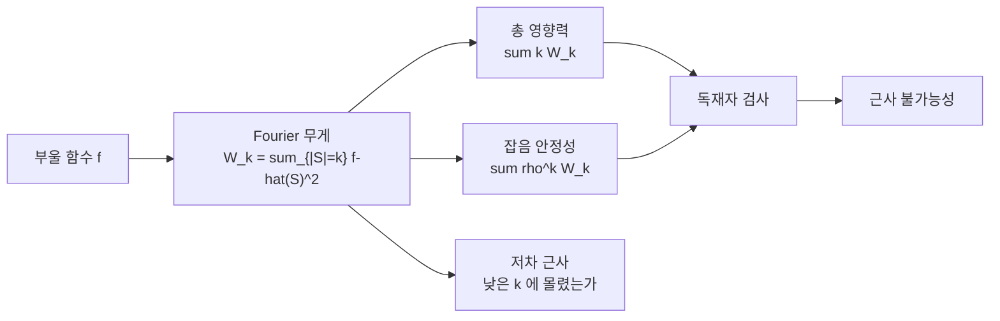

# 부울 함수의 Fourier 해석

# 개요

$n$ 개의 비트를 받아 참 거짓 하나를 뱉는 함수 $f\colon\{-1,1\}^n\to\{-1,1\}$ 은 조합적 대상으로 보이지만, 정의역이 군 $(\mathbb Z/2)^n$ 이므로 [Fourier 변환](fourier.md)을 그대로 쓸 수 있다. 이 군의 지표는 부분집합 $S\subseteq[n]$ 마다 하나씩 있고 아주 단순하다.

$$
\chi_S(x)=\prod_{i\in S}x_i
$$

그러므로 모든 $f$ 는 $2^n$ 개의 단항식의 실계수 결합으로 유일하게 쓰인다. 이 전개가 **부울 함수의 Fourier 전개**이고, 계수 $\hat f(S)$ 의 분포가 함수의 조합적 성질을 거의 전부 지고 있다. 어떤 좌표가 얼마나 중요한지(영향력), 입력에 잡음을 섞으면 값이 얼마나 유지되는지(잡음 안정성), 함수가 몇 개의 좌표로 근사되는지가 모두 계수의 이차식으로 표현된다.

[유한 확률 공간](probability.md)의 언어가 필수적이다. 정의역에 균등분포를 주면 $\{\chi_S\}$ 가 정규직교기저가 되고, Parseval 항등식이 $\sum_S\hat f(S)^2=1$ 이 된다. 그러면 $\hat f(S)^2$ 가 확률분포가 되어 "무게가 어느 준위에 실려 있는가" 를 물을 수 있고, 이 질문 하나로 이론의 거의 모든 정리가 진술된다.

이 도구가 계산복잡도에서 결정적인 이유는 근사 불가능성 때문이다. [PCP 정리](pcp-theorem.md)의 검증자를 설계할 때 필요한 것이 **독재자 검사** — 함수가 한 좌표에만 의존하는지를 상수 개의 질의로 판정하는 절차 — 이고, 그 검사의 완전성과 건전성이 정확히 잡음 안정성의 부등식으로 계산된다. [유일게임 추측](unique-games.md) 아래에서 최대 절단의 최적 근사비를 정하는 **Majority is Stablest** 정리가 이 계통의 정점이다.

# 직관

## 다항식으로 보기

$x_i\in\{-1,1\}$ 이므로 $x_i^2=1$ 이고, 따라서 어떤 다변수 다항식도 각 변수의 차수를 $1$ 이하로 줄일 수 있다. 자유도가 $2^n$ 이고 함수의 개수도 $2^n$ 개 점에서의 값으로 결정되므로, **모든 부울 함수는 중복차수 $1$ 의 다항식으로 유일하게 표현된다**. 이것이 전개의 존재와 유일성이고, 증명은 차원 세기 한 줄이다.

몇 가지 예가 감각을 준다.

$$
\mathrm{Dict}_i(x)=x_i,\qquad
\mathrm{XOR}(x)=x_1x_2\cdots x_n,\qquad
\mathrm{AND}_2(x)=\tfrac{-1+x_1+x_2+x_1x_2}{2}
$$

독재자는 준위 $1$ 에 무게를 전부 싣고, XOR 은 준위 $n$ 에 전부 싣는다. 두 극단 사이에 나머지 함수가 놓인다. 무게가 낮은 준위에 몰려 있으면 함수가 "매끄럽고", 높은 준위에 몰려 있으면 "요동친다".

## 영향력은 준위의 기댓값

좌표 $i$ 의 **영향력**은 $i$ 를 뒤집었을 때 값이 바뀔 확률이다. 이것을 Fourier 로 쓰면

$$
\mathrm{Inf}_i[f]=\sum_{S\ni i}\hat f(S)^2,\qquad
\mathbf I[f]=\sum_i\mathrm{Inf}_i[f]=\sum_S|S|\,\hat f(S)^2
$$

가 된다. 총 영향력은 확률분포 $\hat f(S)^2$ 아래에서 준위 $|S|$ 의 **기댓값**이다. 그래서 "무게가 낮은 준위에 있다" 와 "총 영향력이 작다" 가 같은 말이 된다.

## 잡음은 계수를 감쇠시킨다

입력 $x$ 의 각 비트를 확률 $\frac{1-\rho}{2}$ 로 독립적으로 뒤집어 $y$ 를 만들자. 그러면 $\mathbb E[y_i\mid x]=\rho x_i$ 이고, 지표에 대해서는 곱으로 풀려

$$
\mathbb E[\chi_S(y)\mid x]=\rho^{|S|}\chi_S(x)
$$

이 된다. 잡음 연산자 $T_\rho$ 는 **준위 $k$ 의 계수를 $\rho^k$ 배 하는 대각 연산자**다. 이보다 간단한 작용은 없다. 여기서 잡음 안정성이 곧바로 나온다.

$$
\mathrm{Stab}_\rho[f]=\mathbb E[f(x)f(y)]=\sum_S\rho^{|S|}\hat f(S)^2
$$



높은 준위의 계수는 $\rho^{|S|}$ 로 빠르게 죽는다. 그러므로 안정성이 크다는 것은 무게가 낮은 준위에 있다는 것이고, 극단적으로 $\mathrm{Stab}_\rho=\rho$ 를 달성하는 것은 준위 $1$ 에 무게를 몰아 준 독재자뿐이다. **검사하고 싶은 성질이 부등식의 등호 조건으로 나타난다**는 이 구조가 독재자 검사를 가능하게 한다.

## 왜 이것이 근사 불가능성을 준다

최대 절단 같은 문제의 근사 알고리즘을 막으려면, 참인 해와 거짓인 해를 구별하기 어렵게 만드는 검사를 설계해야 한다. PCP 의 검사자는 증명의 몇 비트만 읽고 판정하는데, 증명을 부울 함수로 보면 "이 함수가 독재자인가" 를 묻는 것이 그 판정에 해당한다.

- 독재자라면 반드시 통과해야 한다(완전성).
- 좌표 몇 개에 의존하지 않는 함수는 낮은 확률로만 통과해야 한다(건전성).

두 조건을 잡음 안정성의 언어로 쓰면, 필요한 것은 "영향력이 모두 작은 함수의 안정성 상한" 이다. 그 상한을 정확히 준 것이 Majority is Stablest 이고, 상한이 $1-\frac2\pi\arccos\rho$ 라서 Goemans–Williamson 의 [반정부호 계획법](semidefinite-programming.md) 근사비 $0.878\ldots$ 와 정확히 맞아떨어진다. 알고리즘과 하한이 같은 상수에서 만나는 드문 사례다.

# 정의

## Fourier 전개

정의역 $\{-1,1\}^n$ 에 균등분포를 주고 내적을 $\langle f,g\rangle=\mathbb E_x[f(x)g(x)]$ 로 둔다. 지표 $\chi_S(x)=\prod_{i\in S}x_i$ 는 정규직교기저를 이루고

$$
f=\sum_{S\subseteq[n]}\hat f(S)\,\chi_S,\qquad \hat f(S)=\mathbb E_x\bigl[f(x)\chi_S(x)\bigr]
$$

가 유일하게 성립한다. **Parseval**은 $\sum_S\hat f(S)^2=\mathbb E[f^2]$ 이고, 값이 $\pm1$ 이면 우변이 $1$ 이다. $\hat f(\emptyset)=\mathbb E[f]$ 이므로 분산은 $\sum_{S\ne\emptyset}\hat f(S)^2$ 다.

준위별 무게를 $W^k[f]=\sum_{|S|=k}\hat f(S)^2$ 로 쓴다.

## 영향력과 잡음

$$
\mathrm{Inf}_i[f]=\Pr_x\bigl[f(x)\ne f(x^{\oplus i})\bigr]=\sum_{S\ni i}\hat f(S)^2
$$

$x^{\oplus i}$ 는 $i$ 번째 좌표를 뒤집은 것이다. 잡음 연산자는

$$
T_\rho f(x)=\mathbb E_{y\sim N_\rho(x)}[f(y)]=\sum_S\rho^{|S|}\hat f(S)\chi_S,
\qquad
\mathrm{Stab}_\rho[f]=\langle f,T_\rho f\rangle=\sum_S\rho^{|S|}\hat f(S)^2
$$

이다. 여기서 $y\sim N_\rho(x)$ 는 각 좌표가 독립적으로 확률 $\frac{1+\rho}{2}$ 로 $x_i$ 와 같은 분포다.

## 초축약성

**정리(Bonami–Beckner).** $1\le p\le q$ 이고 $\rho\le\sqrt{(p-1)/(q-1)}$ 이면 모든 $f$ 에 대해

$$
\|T_\rho f\|_q\le\|f\|_p
$$

특히 준위 $k$ 이하의 함수에 대해 $\|f\|_4\le\sqrt3^{\,k}\|f\|_2$ 가 나온다. 저차 다항식의 값이 크게 흩어질 수 없다는 뜻이고, 이 한 줄이 이 분야 정리 대부분의 해석적 엔진이다. KKL 정리도 여기서 나온다.

## Majority is Stablest

**정리(Mossel–O'Donnell–Oleszkiewicz, 2010).** $\rho\in[0,1)$ 과 $\varepsilon>0$ 에 대해 $\tau>0$ 이 있어, $\mathbb E[f]=0$ 이고 모든 $i$ 에서 $\mathrm{Inf}_i[f]\le\tau$ 이면

$$
\mathrm{Stab}_\rho[f]\;\le\;1-\frac2\pi\arccos\rho+\varepsilon
$$

이다. 우변은 $n\to\infty$ 에서 다수결 함수의 안정성의 극한값이다. 즉 **어느 좌표도 특별하지 않은 함수 중에서는 다수결이 가장 안정하다**.

증명은 불변 원리를 쓴다. $\pm1$ 입력을 Gauss 입력으로 바꿔도 저차 다항식의 분포가 거의 변하지 않음을 보이고, Gauss 쪽에서는 Borell 의 등주부등식이 이미 답을 알고 있다는 구조다. 이산 문제를 연속으로 옮겨 푸는 전형적 수법이고, 옮기는 것을 정당화하는 것이 초축약성이다.

# 성질

## 무게가 어디 실리는지가 전부다

| 함수 | 무게 분포 | 총 영향력 | $\mathrm{Stab}_\rho$ |
|---|---|---|---|
| $\mathrm{Dict}_i$ | 준위 $1$ 에 전부 | $1$ | $\rho$ |
| $\mathrm{XOR}_n$ | 준위 $n$ 에 전부 | $n$ | $\rho^n$ |
| $\mathrm{Maj}_n$ | 홀수 준위에 $\Theta(k^{-3/2})$ | $\sim\sqrt{2n/\pi}$ | $\to1-\frac2\pi\arccos\rho$ |

독재자와 XOR 이 두 극단이고 다수결이 그 사이의 기준점이다. 다수결의 총 영향력이 $\sqrt n$ 규모라는 것은 무게가 낮은 준위에 몰려 있되 독재자만큼은 아니라는 뜻이다.

## 주요 정리

- **KKL.** $\mathbb E[f]$ 가 상수에서 떨어져 있으면 어떤 좌표는 영향력이 $\Omega(\log n/n)$ 이상이다. 모든 좌표가 고르게 약할 수는 없다. 증명이 초축약성의 첫 큰 응용이었다.
- **Friedgut.** 총 영향력이 $k$ 이면 $f$ 는 $2^{O(k/\varepsilon)}$ 개 좌표에만 의존하는 함수로 $\varepsilon$ 근사된다. 영향력이 작으면 사실상 저차원 함수라는 것이다.
- **FKN.** 무게가 거의 전부 준위 $1$ 에 있으면 $f$ 는 독재자에 가깝다. 독재자 검사의 안정성 보증이 이 형태다.
- **Kindler–Safra.** 무게가 거의 준위 $k$ 이하에 있으면 $f$ 는 차수 $k$ 의 junta 에 가깝다.
- **Arrow 의 정리와 Kalai 의 증명.** 세 후보 선거에서 순환하지 않는 집계 규칙은 독재자뿐이라는 결론을, 순환 확률을 Fourier 로 계산해 얻는다. 사회선택이론의 결과가 이 언어로 한 줄 계산이 된다.

## 복잡도에서의 위치

- **독재자 검사.** 잡음 안정성의 등호 조건이 독재자라는 사실이 검사의 설계 원리다. 완전성은 $\mathrm{Stab}_\rho[\mathrm{Dict}]=\rho$ 에서, 건전성은 Majority is Stablest 에서 나온다.
- **최적 근사비.** [유일게임 추측](unique-games.md) 아래에서 최대 절단의 근사 임계가 $\alpha_{\mathrm{GW}}=0.878\ldots$ 로 확정된다. 같은 틀이 최대 $k$ 절단과 여러 제약 만족 문제에도 적용되어, 반정부호 완화의 값이 곧 최적 근사비라는 일반 정리(Raghavendra)로 이어진다.
- **학습.** 무게가 낮은 준위에 몰린 함수는 낮은 준위 계수만 추정하면 배울 수 있다. Low-Degree 알고리즘과 Goldreich–Levin 이 이 관찰의 알고리즘적 구현이다.
- **회로 하한.** $\mathsf{AC}^0$ 회로가 계산하는 함수는 낮은 준위에 무게가 몰린다는 Linial–Mansour–Nisan 의 정리가 있고, XOR 이 준위 $n$ 에 무게를 전부 싣는다는 사실과 합치면 패리티가 $\mathsf{AC}^0$ 밖임이 따라온다.

# 활용

## 다수결의 안정성이 $\arccos$ 공식으로 수렴한다

Walsh–Hadamard 변환으로 $2^n$ 개 계수를 $O(n2^n)$ 에 뽑고, Parseval 과 총 영향력과 잡음 안정성을 계수에서 직접 읽는다.

```python
from math import acos, pi, sqrt

def wht(a):
    """빠른 Walsh-Hadamard 변환. 결과를 2^n 으로 나누면 Fourier 계수가 된다."""
    a = a[:]; N = len(a); h = 1
    while h < N:
        for i in range(0, N, h * 2):
            for j in range(i, i + h):
                a[j], a[j + h] = a[j] + a[j + h], a[j] - a[j + h]
        h *= 2
    return a

def coeffs(f, n):
    """진리표를 받아 f-hat(S) 를 준다. 비트 b 는 (-1)^b, 첨자 S 는 비트마스크."""
    N = 1 << n
    return [c / N for c in wht([f(x, n) for x in range(N)])]

def bit_values(x, n):
    return [1 - 2 * ((x >> i) & 1) for i in range(n)]      # 비트 b -> (-1)^b

majority = lambda x, n: 1 if sum(bit_values(x, n)) > 0 else -1   # n 은 홀수로 쓴다
dictator = lambda x, n: bit_values(x, n)[0]
parity   = lambda x, n: 1 if bin(x).count('1') % 2 == 0 else -1

popcount = lambda S: bin(S).count('1')
parseval = lambda fh: sum(c * c for c in fh)
influence = lambda fh: sum(c * c * popcount(S) for S, c in enumerate(fh))
stability = lambda fh, r: sum(c * c * r ** popcount(S) for S, c in enumerate(fh))

n = 3
for name, f in [("Dict_1", dictator), ("Maj_3", majority), ("XOR_3", parity)]:
    fh = coeffs(f, n)
    support = sorted((popcount(S), round(c, 3)) for S, c in enumerate(fh) if abs(c) > 1e-12)
    print(f"{name:>7} : Parseval={parseval(fh):.3f}  I[f]={influence(fh):.3f}  (준위, 계수)={support}")

print("\nMaj_n 의 잡음 안정성이 1 - (2/pi) arccos(rho) 로 수렴하는가")
print(f"{'n':>3} {'I[Maj]':>8} {'sqrt(2n/pi)':>12} |" + "".join(f"{f'rho={r}':>16}" for r in (0.2, 0.5, 0.8)))
prev = None
for n in (3, 7, 11, 15):
    fh = coeffs(majority, n)
    assert abs(parseval(fh) - 1) < 1e-9                      # 값이 +-1 이면 Parseval = 1
    row, gaps = "", []
    for r in (0.2, 0.5, 0.8):
        s, lim = stability(fh, r), 1 - 2 / pi * acos(r)
        gaps.append(s - lim)
        row += f"{s:>9.5f}(+{s - lim:.3f})"
    assert all(g > 0 for g in gaps)                           # 유한 n 에서는 늘 극한보다 크다
    if prev:
        assert all(g < p for g, p in zip(gaps, prev))         # 차이는 단조 감소
    prev = gaps
    print(f"{n:>3} {influence(fh):>8.4f} {sqrt(2 * n / pi):>12.4f} |" + row)
print("\n차이가 단조로 줄어든다. 극한값 1 - (2/pi) arccos(rho) 가 Majority is Stablest 의 상한이다.")

#  Dict_1 : Parseval=1.000  I[f]=1.000  (준위, 계수)=[(1, 1.0)]
#   Maj_3 : Parseval=1.000  I[f]=1.500  (준위, 계수)=[(1, 0.5), (1, 0.5), (1, 0.5), (3, -0.5)]
#   XOR_3 : Parseval=1.000  I[f]=3.000  (준위, 계수)=[(3, 1.0)]
#
# Maj_n 의 잡음 안정성이 1 - (2/pi) arccos(rho) 로 수렴하는가
#   n   I[Maj]  sqrt(2n/pi) |         rho=0.2         rho=0.5         rho=0.8
#   3   1.5000       1.3820 |  0.15200(+0.024)  0.40625(+0.073)  0.72800(+0.138)
#   7   2.1875       2.1110 |  0.13784(+0.010)  0.36221(+0.029)  0.66423(+0.074)
#  11   2.7070       2.6463 |  0.13424(+0.006)  0.35096(+0.018)  0.63713(+0.047)
#  15   3.1421       3.0902 |  0.13260(+0.004)  0.34605(+0.013)  0.62339(+0.033)
#
# 차이가 단조로 줄어든다. 극한값 1 - (2/pi) arccos(rho) 가 Majority is Stablest 의 상한이다.
```

세 함수의 대비가 이론 전체의 축약판이다. 독재자는 준위 $1$ 에 계수 하나를 두고, XOR 은 준위 $n$ 에 계수 하나를 두며, 다수결은 홀수 준위에 퍼져 있되 준위 $1$ 이 지배한다. 총 영향력이 $1$ 과 $n$ 과 $\sqrt{2n/\pi}$ 로 갈리는 것이 그 차이를 하나의 수로 요약한다.

수렴표는 Majority is Stablest 를 수치로 확인한다. 유한 $n$ 에서 $\mathrm{Maj}_n$ 의 안정성은 언제나 극한값보다 크지만 차이가 단조로 줄어든다. 정리가 말하는 것은 **영향력이 모두 작은 함수는 이 극한값을 ($\varepsilon$ 을 빼면) 넘을 수 없다**는 것이다. $\mathrm{Maj}_n$ 자신은 각 좌표의 영향력이 $\Theta(1/\sqrt n)$ 이라 $n$ 이 크면 조건을 만족하고, 극한에서 상한을 달성하므로 정리는 개선될 수 없다.

$\rho$ 가 $1$ 에 가까울수록 수렴이 느린 것도 눈에 띈다. 높은 준위 계수가 $\rho^{|S|}$ 로 충분히 죽지 않아 $\mathrm{Maj}_n$ 의 꼬리가 오래 남기 때문이다. 이 꼬리를 통제하는 것이 초축약성의 역할이다.

## 어디에 쓰이는가

- **근사 불가능성 증명의 표준 부품.** 독재자 검사를 설계하고 완전성과 건전성을 Fourier 로 계산하는 절차가 정형화되어 있다.
- **속성 검사.** 선형성 검사(BLR)는 $\Pr[f(x)f(y)=f(xy)]$ 를 Fourier 로 쓰면 $\sum_S\hat f(S)^3$ 이 되어, 통과 확률이 큰 것과 어떤 $\chi_S$ 에 가까운 것이 같은 말이 된다. 두 줄 계산이다.
- **사회선택이론.** Arrow, Gibbard–Satterthwaite 계열의 정리와 그 정량적 판본이 Fourier 계산으로 증명된다.
- **학습이론과 회로 하한.** 저차 근사 가능성이 학습 알고리즘과 하한 증명을 동시에 낳는다.

[^1]: R. O'Donnell, *Analysis of Boolean Functions*, Cambridge University Press (2014). 이 문서의 정의와 정리 진술은 이 책의 1–11 장을 따른다. 저자 공개본이 있다.

[^2]: E. Mossel, R. O'Donnell, K. Oleszkiewicz, *Noise stability of functions with low influences: invariance and optimality*, Ann. of Math. **171** (2010), 295–341. Majority is Stablest 와 불변 원리.

[^3]: J. Kahn, G. Kalai, N. Linial, *The influence of variables on Boolean functions*, FOCS (1988). KKL 정리와 초축약성의 첫 응용.

[^4]: S. Khot, G. Kindler, E. Mossel, R. O'Donnell, *Optimal inapproximability results for MAX-CUT and other 2-variable CSPs?*, SIAM J. Comput. **37** (2007), 319–357. 유일게임 추측 아래 $0.878\ldots$ 가 최적임.

# 연관 문서

## 선수지식

- [이산 Fourier 변환](fourier.md)
- [유한 확률 공간](probability.md)

## 더 알아보기

- [유일게임 추측과 2-to-2 정리](unique-games.md)

#combinatorics #complexity #analysis #computation
