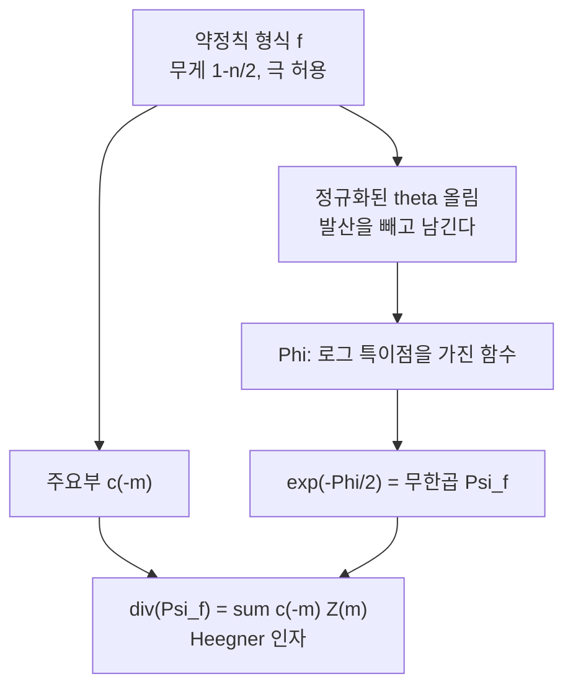

# Borcherds 곱과 특이 theta 올림

# 개요

[Mock 모듈러 형식](mock-modular-forms.md)에서 **약정칙 형식** $M^!_k$ 가 나왔다. 첨점에서 극을 허용하는 모듈러 형식들이고, 조화 Maass 형식의 $\xi$ 사상의 핵으로 등장했다. 극을 허용한다는 것은 $q$ 전개에 음수 차수 항이 있다는 뜻이라 계수가 빠르게 자란다.

Borcherds 는 이 계수들이 **무한곱의 지수**가 될 수 있음을 발견했다. 무게 $1-n/2$ 의 약정칙 형식

$$
f=\sum_{m\gg-\infty}c(m)\,q^m
$$

이 주어지면, 계수 $c(m)$ 을 지수로 삼은 무한곱이 서명 $(2,n)$ 직교군의 자기동형 형식이 된다. 가장 유명한 경우가 괴물 Lie 대수의 분모 공식이다.

$$
j(\sigma)-j(\tau)=p^{-1}\prod_{m>0,\ n\in\mathbb Z}\bigl(1-p^mq^n\bigr)^{c(mn)},
\qquad j-744=\sum_{k\ge-1}c(k)q^k
$$

**$j$ 함수의 계수가 $j$ 함수 자신에 대한 항등식의 지수로 되돌아온다.** 좌변은 두 변수의 유리형 함수, 우변은 무한곱이고, 둘이 같다는 것이 정리다.

구성의 핵심 장치는 **특이 theta 올림**이다. 약정칙 형식과 theta 급수를 곱해 모듈러 곡선 위에서 적분하는데, $f$ 의 극 때문에 적분이 발산한다. Harvey–Moore 식으로 정규화하면 유한한 값이 나오고, 그 결과 함수가 특이점을 갖는다. 특이점이 놓인 자리가 **Heegner 인자**이고, 지수를 취하면 위의 무한곱이 나온다.

# 직관

## 지수가 계수에서 온다

무한곱을 하나 펼쳐 보면 구조가 보인다. 가장 단순한 예는 모든 지수가 상수 24 인 경우로, 판별식 함수가 나온다.

```python
N = 12
def mul(a, b):
    c = [0]*N
    for i, x in enumerate(a):
        if x == 0: continue
        for j, y in enumerate(b):
            if i+j < N: c[i+j] += x*y
    return c

P = [0]*N; P[0] = 1
for n in range(1, N):
    f = [0]*N; f[0] = 1
    if n < N: f[n] = -1
    for _ in range(24):
        P = mul(P, f)

print('Delta = q * prod (1-q^n)^24 의 계수 tau(n):')
print(' ', [P[n-1] for n in range(1, 11)])
print('알려진 값        :')
print(' ', [1,-24,252,-1472,4830,-6048,-16744,84480,-113643,-115920])
```

```
Delta = q * prod (1-q^n)^24 의 계수 tau(n):
  [1, -24, 252, -1472, 4830, -6048, -16744, 84480, -113643, -115920]
알려진 값        :
  [1, -24, 252, -1472, 4830, -6048, -16744, 84480, -113643, -115920]
```

Ramanujan 의 $\tau$ 가 그대로 나온다. Borcherds 곱이 하는 일은 이 상수 24 를 **약정칙 형식의 계수 $c(m)$ 으로 바꾸는 것**이다. 지수가 $n$ 에 따라 달라지는데도 곱이 여전히 모듈러 형식이 된다는 점이 놀랍고, 그 이유를 설명하는 것이 특이 theta 올림이다.

## 발산하는 적분을 쓰는 이유

보통의 theta 올림은

$$
\Phi(v,f)=\int_{\mathrm{SL}_2(\mathbb Z)\backslash\mathbb H}f(\tau)\,\overline{\Theta(\tau,v)}\ \frac{du\,dv}{v^2}
$$

꼴이고, $f$ 가 첨점형식이면 수렴한다. $f$ 가 첨점에서 극을 가지면 발산한다. 그런데 **발산이야말로 원하는 것**이다.

절단한 영역 $\mathcal F_T$ 위에서 적분하고 $T\to\infty$ 에서 발산하는 부분을 빼면 유한한 $\Phi$ 가 남는다. 이 $\Phi$ 는 매끄러운 함수가 아니라 특정 부분다양체를 따라 로그 특이점을 갖는다. 특이점의 위치와 무게는 $f$ 의 **주요부**, 곧 음수 차수 계수 $c(-m)$ 이 결정한다.

$$
\mathrm{div}\bigl(\Psi_f\bigr)=\sum_{m>0}c(-m)\,Z(m),
\qquad \Psi_f=\text{Borcherds 곱}
$$

$Z(m)$ 은 판별식 $m$ 의 Heegner 인자다. 정리의 핵심은 "곱이 모듈러 형식이다"가 아니라 **"인자를 미리 지정해서 모듈러 형식을 만들 수 있다"**는 데 있다.



## 주요부가 곧 인자다

이 대응이 양방향이다. 어떤 Heegner 인자를 갖는 모듈러 형식이 존재하려면, 그 인자를 주요부로 갖는 약정칙 형식이 있어야 한다. 그리고 약정칙 형식의 주요부가 만족해야 하는 조건은 **첨점형식과의 짝이 0 이 되는 것**뿐이다(Serre 쌍대성).

$$
\sum_{m>0}c(-m)\,a_g(m)=0\quad\text{for all }g\in S_{1+n/2}
$$

결과적으로 "인자가 모듈러 형식의 인자인가"라는 기하 문제가 **유한 개의 선형 조건**으로 환원된다. Gross–Kohnen–Zagier 정리의 Borcherds 판 증명이 이 관찰에서 나온다.

# 정의

## 입력

$L$ 을 서명 $(2,n)$ 의 짝수 격자, $f\in M^!_{1-n/2}\bigl(\rho_L\bigr)$ 를 Weil 표현 $\rho_L$ 에 대한 벡터값 약정칙 형식이라 한다. $f$ 의 주요부 계수 $c(\gamma,-m)$ 이 정수라고 가정한다.

## Borcherds 곱

정규화된 theta 올림 $\Phi(v,f)$ 에 대해

$$
\Psi_f(v)=e^{-\Phi(v,f)/2}
$$

가 무게 $c(0,0)/2$ 의 직교군 $\mathrm O(2,n)$ 자기동형 형식이고, 근방에서

$$
\Psi_f(v)=q^{\rho}\prod_{\lambda>0}\bigl(1-q^{\lambda}\bigr)^{c(\lambda,\,\langle\lambda,\lambda\rangle/2)}
$$

꼴의 무한곱으로 전개된다. 인자는 $\sum_{m>0}c(-m)Z(m)$ 이다.

## Heegner 인자

$Z(m)$ 은 노름 $-m$ 벡터의 직교여공간들이 이루는 부분다양체의 합이다. 모듈러 곡선의 경우 판별식 $-m$ 의 CM 점들, 곧 Heegner 점들이다.

# 성질

## 몇 가지 고전 항등식

| 입력 $f$ | 출력 $\Psi_f$ |
| --- | --- |
| $j-744$ | 괴물 Lie 대수 분모 공식 |
| 무게 $1/2$, 주요부 $q^{-1}$ | $j(\tau)-1728$ 계열의 무한곱 |
| $\eta$ 몫 계열 | Siegel 모듈러 형식 $\Delta_5$ (Igusa) |
| 무게 $0$, 상수 | $\Delta(\tau)^{k}$ 형태 |

한 이론이 흩어져 있던 무한곱 항등식들을 한꺼번에 설명한다는 것이 이 정리의 성격이다.

## 지수의 부호가 인자의 부호다

$c(-m)>0$ 이면 $\Psi_f$ 가 $Z(m)$ 에서 영점을, $c(-m)<0$ 이면 극을 갖는다. 주요부를 자유롭게 설계할 수 없다는 제약이 여기서 중요해진다. 모든 $c(-m)$ 을 양수로 만들 수는 없고, 첨점형식과의 짝 조건이 부호의 조합을 제한한다.

## 무엇이 어렵게 남는가

Borcherds 곱은 **인자가 Heegner 인자인 형식**만 만든다. 일반적인 자기동형 형식은 이 방법으로 나오지 않는다. 그리고 곱이 수렴하는 영역이 제한적이라, 전체 정의역으로의 확장은 별도의 논증을 요구한다. 서명 $(2,n)$ 이라는 조건도 필수적이다. 그 밖의 서명에서는 대칭공간이 에르미트가 아니라 정칙 형식을 말할 수 없다.

# 활용

## Gross–Kohnen–Zagier 정리

모듈러 곡선 $X_0(N)$ 의 Jacobian 안에서 Heegner 점들 $y_m$ 을 모으면

$$
\sum_{m\ge1}y_m\,q^m
$$

이 무게 $3/2$ 의 모듈러 형식처럼 행동한다. 원래 증명은 높이 계산이었는데, Borcherds 는 위의 선형 조건만으로 이를 다시 증명했다. 어떤 $\sum c(-m)Z(m)$ 이 주인자(principal divisor)인지를 알면, Jacobian 안의 관계식이 전부 읽히기 때문이다. **기하적 관계식이 모듈러 형식 공간의 쌍대성으로 환원된다.**

## Kudla 강령

Heegner 인자들의 산술적 교차수가 Eisenstein 급수의 Fourier 계수와 같으리라는 것이 Kudla 의 추측이다. Borcherds 곱은 이 그림에서 "인자가 주인자가 되는 경우"를 다루는 부분이고, 산술적 판본에서는 $\log\|\Psi_f\|$ 가 Arakelov 이론의 Green 함수 노릇을 한다. 인자, $L$ 함수, 교차수를 한 줄에 놓으려는 시도의 출발점이다.

## 달빛과 Lie 대수

괴물 Lie 대수의 분모 공식이 Borcherds 곱이라는 사실이 괴물 달빛 추측 증명의 마지막 조각이었다. 무한곱의 지수가 $j$ 의 계수이므로, 곱을 전개해 얻은 항등식이 Hecke 작용소가 주는 재귀식과 같아진다. 그 재귀식이 계수를 유일하게 결정하고, 따라서 괴물군의 지표와 일치함이 확인된다. **무한곱 하나가 대수, 조합, 군론을 잇는다.**

[^1]: R. Borcherds, *Automorphic forms with singularities on Grassmannians*, Invent. Math. **132** (1998), 491–562. 분모 공식과 달빛은 같은 저자의 *Monstrous moonshine and monstrous Lie superalgebras*, Invent. Math. **109** (1992). 해설과 조화 Maass 형식과의 관계는 J. Bruinier, J. Funke, *On two geometric theta lifts*, Duke Math. J. **125** (2004), 그리고 K. Ono, *Unearthing the visions of a master: harmonic Maass forms and number theory* (2009). Gross–Kohnen–Zagier 의 원논문은 *Heegner points and derivatives of L-series II*, Math. Ann. **278** (1987). 본문의 전개는 직접 한 것이다.

# 연관 문서

## 선수지식

- [Mock 모듈러 형식과 Zwegers 이론](mock-modular-forms.md)

## 더 알아보기

아직 연결한 문서가 없다.

#number_theory #complex_analysis #construction
