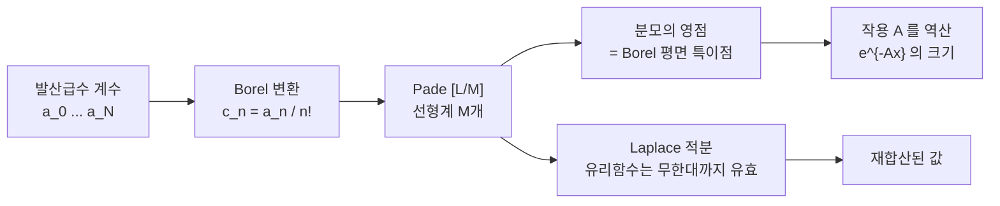

# Padé 근사와 Borel 재합산

# 개요

Padé 근사는 급수의 계수로 유리함수를 맞춰 수렴 반경 너머의 값과 특이점 배치를 얻는 방법이며, Borel 재합산의 실행 단계를 담당한다.

[Stokes 현상](stokes-phenomenon.md)의 Borel 합

$$
\mathcal S_\theta \tilde f(x) = \int_0^{e^{i\theta}\infty} e^{-x\zeta}\thinspace\hat f(\zeta)\thinspace d\zeta
$$

에서 Borel 변환 $\hat f$ 는 수렴 반경이 유한한데 적분은 무한대까지 가므로 $\hat f$ 를 해석적으로 연장해야 한다. 실제로 가진 것은 계수 몇십 개로 끊긴 Taylor 급수뿐이다.

Padé 근사가 만든 유리함수는 수렴 반경 너머에서도 값을 주고, 분모의 영점이 원래 함수의 특이점을 가리킨다. 절단선처럼 극점이 아닌 특이성도 극점을 줄지어 세워 흉내낸다.

# 직관

## 유리함수와 분지점

$\sqrt{1+\zeta}$ 는 $\zeta = -1$ 에서 시작하는 절단선을 가지고, 유리함수에는 절단선이 없다. 극점을 절단선 위에 촘촘히 늘어놓고 각 유수를 작게 잡으면 멀리서 볼 때 그 열은 절단선과 구별되지 않는다. 극점열의 극한이 절단선이며 Padé 근사가 이 극한을 찾아간다.

차수를 올릴수록 극점이 촘촘해지고 절단선의 시작점에 가까워진다. 가장 가까운 극점이 분지점 위치를, 극점열이 뻗는 방향이 절단선의 방향을 알려 준다.

## 계수와 특이점의 위치

Taylor 계수의 성장률은 수렴 반경, 곧 가장 가까운 특이점까지의 거리를 담고 있으나 방향은 담지 않는다. Padé 는 계수들의 비 대신 계수들 사이의 선형관계(Hankel 행렬식)를 쓰므로 복소평면에서의 위치를 복원하고, 특이점이 여럿이면 차례로 드러난다.



# 정의

## Padé 근사

급수 $c(\zeta) = \sum_{n\ge0}c_n\zeta^n$ 에 대해 $[L/M]$ **Padé 근사**는

$$
[L/M](\zeta) = \frac{P_L(\zeta)}{Q_M(\zeta)}, \qquad \deg P_L \le L,\ \deg Q_M \le M,\ Q_M(0)=1
$$

이면서 $c(\zeta) - P_L/Q_M = O(\zeta^{L+M+1})$ 인 것이다. 조건을 $Q_M c - P_L = O(\zeta^{L+M+1})$ 로 바꿔 쓰면 계수 비교가 선형이 된다. 분모 계수 $q_1,\dots,q_M$ 은

$$
\sum_{j=0}^{M} q_j\thinspace c_{L+k-j} = 0, \qquad k = 1,\dots,M \quad (q_0 = 1)
$$

이라는 Toeplitz 선형계로 결정되고, 분자는 $p_k = \sum_{j\le\min(k,M)}q_j c_{k-j}$ 다. 선형계의 행렬이 특이하면 그 자리의 Padé 표가 **비정규**이며, 낮은 차수의 근사가 이미 정확한 경우에 일어난다.

## Borel–Padé 절차

1. 발산급수 $\tilde f(x) = \sum a_n x^{-n-1}$ 의 계수를 $N$ 개까지 구한다.
2. $c_n = a_n/n!$ 로 Borel 변환하고 이 계수로 $[L/M]$ Padé 근사를 만든다. $L + M + 1 \le N$ 이고 보통 대각 $L=M$ 을 쓴다.
3. 분모의 영점을 구해 특이점 배치를 읽는다. 가장 가까운 영점이 $\zeta = A$ 면 지수적으로 작은 항의 크기가 $e^{-Ax}$ 다.
4. 유리함수를 특이 방향을 피해 무한대까지 적분해 $\mathcal S_\theta\tilde f(x)$ 를 얻는다. 특이 방향의 좌우로 각각 적분하면 두 측면 합이 나오고 차이가 Stokes 상수를 준다.

3 번과 4 번은 독립적으로 쓸모가 있다.

# 성질

## 수렴이 보장되는 경우

$$
f(z) = \int_0^{\infty}\frac{d\mu(t)}{1 + zt}
$$

꼴로 쓰이는 **Stieltjes 급수**에서는 모멘트가 Carleman 조건을 만족할 때 대각 Padé 수열 $[M/M]$ 이 절단면 밖에서 수렴한다. 극점이 모두 음의 실축 위에 놓이고 유수가 모두 양수이며, $[M/M]$ 과 $[M+1/M]$ 이 참값을 위아래에서 조이므로 오차 한계가 나온다. Euler 급수와 무조화 진동자의 바닥 준위가 이 부류다.

일반적인 경우에는 보장이 없다. Padé 수열은 대개 수렴하지만 측도 0 의 예외 집합에서 어긋날 수 있고(Baker–Gammel–Wills 반례), 실무에서는 차수를 바꿔 가며 결과의 안정성을 본다.

## 가짜 극점

극점 하나가 영점 하나와 거의 겹쳐 서로 상쇄하는 쌍을 **Froissart doublet** 이라 하며, 계수의 반올림 오차나 수치 잡음이 만든 허상이다.

구별법은 세 가지다. 차수를 바꾸면 위치가 크게 흔들리고, 분자의 영점 하나가 옆에 붙어 있으며, 계수를 더 높은 정밀도로 다시 계산하면 사라진다.

## 등각사상 재합산

절단선의 위치를 이미 안다면 극점열로 흉내내는 대신 미리 제거하는 편이 낫다. Borel 평면에서 절단선을 뺀 영역을 단위원판으로 보내는 등각사상 $\zeta \mapsto u$ 를 잡고 급수를 $u$ 로 다시 전개하면 새 급수가 원판 전체에서 수렴하고 필요한 계수 수가 줄어든다. 특이점이 반직선 하나에 몰려 있으면 $\zeta = 4u/(1-u)^2$ 류의 사상이 표준이며, Padé 를 뒤에 이어 붙일 수 있다.

# 활용

## 계수에서 특이점 읽기

세 급수에 같은 절차를 적용한다. 첫째는 Borel 변환이 유리함수인 경우, 둘째는 분지점인 경우, 셋째는 [Airy 함수](airy-functions.md)의 점근급수다.

```python
import math

def solve(A, b):
    """부분 피벗 가우스 소거. 복소수 지원."""
    n = len(b)
    M = [row[:] + [b[i]] for i, row in enumerate(A)]
    for c in range(n):
        p = max(range(c, n), key=lambda r: abs(M[r][c]))
        M[c], M[p] = M[p], M[c]
        for r in range(c + 1, n):
            f = M[r][c] / M[c][c]
            for k in range(c, n + 1):
                M[r][k] -= f * M[c][k]
    x = [0j] * n
    for r in reversed(range(n)):
        x[r] = (M[r][n] - sum(M[r][k] * x[k] for k in range(r + 1, n))) / M[r][r]
    return x

def pade(c, L, M):
    """급수 계수 c 로부터 [L/M] Pade. 분모 상수항은 1."""
    A = [[c[L + k - j] for j in range(1, M + 1)] for k in range(1, M + 1)]
    q = [1] + list(solve(A, [-c[L + k] for k in range(1, M + 1)]))
    p = [sum(q[j] * c[k - j] for j in range(min(k, M) + 1)) for k in range(L + 1)]
    return p, q

def roots(q):
    """Durand-Kerner 로 다항식 q[0] + q[1] z + ... 의 근을 전부."""
    n = len(q) - 1
    q = [t / q[n] for t in q]
    ev = lambda z: sum(q[k] * z ** k for k in range(n + 1))
    z = [(0.4 + 0.9j) ** k for k in range(n)]
    for _ in range(500):
        for i in range(n):
            d = 1.0
            for j in range(n):
                if i != j:
                    d *= z[i] - z[j]
            z[i] -= ev(z[i]) / d
    return sorted(z, key=abs)

def show(name, c, orders):
    for LM in orders:
        r = roots(pade(c, LM, LM)[1])
        print(f"  {name} [{LM}/{LM}]: " +
              "  ".join(f"{x.real:+.4f}{x.imag:+.4f}j" for x in r[:4]))

# 1) Euler 급수: Borel 변환이 1/(1+zeta), 극점 하나
show("", [(-1.0) ** n for n in range(6)], [1])

# 2) Borel 변환이 (1+zeta)^{-1/2}: 분지점 zeta = -1 에서 시작하는 절단선
show("", [math.comb(2 * n, n) / 4 ** n * (-1) ** n for n in range(30)], [5, 10, 14])

# 3) Airy 점근급수: 작용 차이 A = 2 를 계수만으로 역산
N = 30
u = [1.0]
for k in range(1, N):
    u.append(u[-1] * (6 * k - 5) * (6 * k - 3) * (6 * k - 1) / (216 * k * (2 * k - 1)))
show("", [(-1) ** k * u[k] / math.gamma(k + 1) for k in range(N)], [6, 10, 14])
```

Euler 급수는 $[1/1]$ 이 이미 정확하다. 극점이 $-1.0000$ 이고, 차수를 올리면 선형계가 특이해져 풀리지 않는다.

분지점 예는 극점이 $-1.0035, -1.032, -1.094, -1.196$ 처럼 줄지어 선다. 차수를 $5 \to 14$ 로 올리면 첫 극점이 $-1.021$ 에서 $-1.0035$ 로 참값에 다가간다. 극점 네 개는 물리적 특이점이 아니라 한 개의 분지점이다.

Airy 는 음의 실축에서 가장 가까운 극점이 $[6/6]$ 에서 $-2.068$ , $[14/14]$ 에서 $-2.014$ 다. 급수 계수 서른 개만으로 두 안장점의 작용 차이 $A = 2$ 를 세 자리까지 복원했고, $\mathrm{Ai}$ 의 점근에 숨은 항의 크기가 $e^{-2\zeta}$ 임을 알아낸 것이다. $[14/14]$ 목록 맨 앞의 $+1.269$ 는 가짜다. 분자의 영점이 같은 자리에 $1.26921$ 로 소수점 다섯 자리까지 겹치고 낮은 차수에는 없던 것이다.

## 쓰임과 한계

섭동급수의 계수를 수십 개 계산할 수 있으면 이 절차가 비섭동 정보를 준다. 임계지수 계산에서 $\epsilon$ 전개나 고온 전개의 Padé–Borel 합이 표준 도구이고, 양자역학의 무조화 진동자 준위는 Stieltjes 성질 덕분에 오차 한계가 붙는다. 격자 통계모형의 급수 해석에서도 임계점의 위치와 지수를 극점과 유수에서 읽는다.

계수의 정밀도가 결과의 정밀도이고, 가짜 극점이 진짜 구조를 가릴 수 있으며, 특이점이 여러 방향에 흩어져 있으면 대각 Padé 하나로 부족하다. 실무에서는 등각사상으로 아는 구조를 먼저 덜어 내고 남은 것을 Padé 에 맡긴다.[^1]

[^1]: George A. Baker Jr., Peter Graves-Morris, *Padé Approximants*, 2nd ed., Cambridge (1996), 제1부 §1–2 및 제2부 §14 (Stieltjes 급수와 수렴 정리), §17 (수치적 실행과 가짜 극점).

# 연관 문서

## 선수지식

- [Stokes 현상과 재합산](stokes-phenomenon.md)

## 더 알아보기

- [정확한 WKB 와 Voros 기호](exact-wkb.md)

#analysis #complex_analysis #computation
