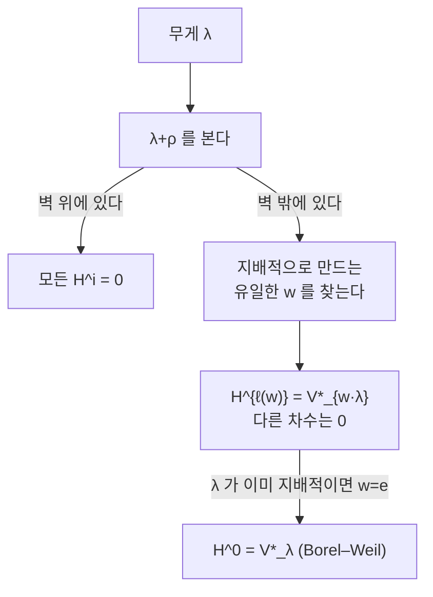

# Borel–Weil–Bott 정리와 깃발다양체

# 개요

[Weyl 지표 공식](weyl-character-formula.md)은 컴팩트 Lie 군의 기약표현을 최고무게로 분류하고 그 지표를 닫힌 식으로 준다. 분류는 완결되지만 표현이 어디에 사는지는 말해 주지 않는다. 최고무게 $\lambda$ 를 주면 차원이 얼마인지는 알아도, 그 벡터공간을 자연스럽게 만드는 방법은 공식 밖에 있다.

Borel–Weil 정리가 그 자리를 채운다. 답은 기하적이다.

> 표현은 **깃발다양체** $G/B$ 위 직선다발의 정칙 단면 공간이다.

$G$ 를 복소 반단순군, $B$ 를 Borel 부분군이라 하자. 지배적 무게 $\lambda$ 는 $B$ 의 일차원 표현을 주고, 그것으로 $G/B$ 위에 직선다발 $\mathcal L_\lambda$ 를 꼬아 만든다. 그러면

$$
H^0(G/B,\mathcal L_\lambda)\cong V_\lambda^{*}
$$

가 $G$-가군으로 성립한다. 표현론의 대상이 대수기하의 대상으로 옮겨졌고, 차원 계산은 [Riemann–Roch](riemann-roch.md) 유형의 코호몰로지 계산이 된다.

Bott 가 1957 년에 붙인 나머지 절반은 $\lambda$ 가 지배적이지 **않을** 때 무슨 일이 생기는가에 답한다. 답이 놀랍다. 코호몰로지가 전부 사라지거나, 아니면 정확히 한 차수에서만 살아남되 그 차수와 나타나는 표현이 $\lambda$ 를 **$\rho$ 이동한 Weyl 군 작용**으로 결정된다. 지표 공식에서 $\rho$ 이동이 왜 필요한지에 대한 가장 명확한 설명이 여기서 나온다. 이동은 계산 편의가 아니라 코호몰로지 차수를 세는 기하적 양이다.

# 직관

## 왜 몫공간이 나오는가

$G$ 의 표현 $V_\lambda$ 안에서 최고무게 벡터 $v_\lambda$ 는 상수배를 빼면 유일하다. 사영공간 $\mathbb P(V_\lambda)$ 에서 그 점 $[v_\lambda]$ 를 잡고 $G$ 로 궤도를 돌리면, 안정자가 바로 $\lambda$ 를 정의하는 포물형 부분군이다. 일반적인 $\lambda$ 에서는 안정자가 정확히 $B$ 이고 궤도는

$$
G/B\hookrightarrow\mathbb P(V_\lambda)
$$

로 닫힌 매장이 된다. 즉 $G/B$ 는 표현 바깥에서 억지로 가져온 공간이 아니라, 최고무게 벡터가 이미 그리고 있던 궤도다. 직선다발 $\mathcal L_\lambda$ 는 이 매장에서 $\mathcal O(1)$ 을 당긴 것이고, 단면이 $V_\lambda^*$ 인 것은 사영공간의 일차형식이 좌표를 되찾아 주는 것과 같은 현상이다.

$G/B$ 를 **깃발다양체**라 부르는 것은 $G=\mathrm{GL}_n$ 에서 $G/B$ 가 $\mathbb C^n$ 의 완전 깃발 $0\subset V_1\subset\cdots\subset V_{n-1}\subset\mathbb C^n$ 들의 공간이기 때문이다. $B$ 는 표준 깃발의 안정자이고, $G$ 가 깃발 전체에 추이적으로 작용한다.

## Bott 의 이동 규칙

$\lambda$ 가 지배적이지 않으면 단면이 없다($H^0=0$). 그런데 높은 차수 코호몰로지는 살아 있을 수 있고, 규칙은 다음과 같다. Weyl 군의 **점 작용**

$$
w\cdot\lambda=w(\lambda+\rho)-\rho
$$

을 쓴다. $\rho$ 는 양근 합의 절반이다.

- $\lambda+\rho$ 가 어떤 벽 위에 놓이면(즉 어떤 근 $\alpha$ 에 대해 $\langle\lambda+\rho,\alpha^\vee\rangle=0$) 모든 차수의 코호몰로지가 $0$ 이다.
- 그렇지 않으면 $w(\lambda+\rho)$ 를 지배적으로 만드는 $w\in W$ 가 유일하게 있고,

$$
H^{\ell(w)}(G/B,\mathcal L_\lambda)\cong V_{w\cdot\lambda}^{*},\qquad H^{i}=0\ (i\ne\ell(w))
$$

여기서 $\ell(w)$ 는 $w$ 의 길이, 곧 단순반사로 쓴 최단 단어의 길이다.

읽는 법은 이렇다. $\lambda+\rho$ 를 Weyl 방(chamber)들 사이에서 지배적 방으로 밀어 넣는 데 **벽을 몇 번 넘었는가**가 코호몰로지가 사는 차수다. 벽 위에 걸리면 밀어 넣을 수 없고 답은 $0$ 이다. $\lambda$ 가 이미 지배적이면 $w=e$, $\ell(e)=0$ 이고 Borel–Weil 로 되돌아온다.



$\rho$ 이동이 왜 필요한지가 여기서 드러난다. 무게 $\lambda$ 자체의 Weyl 대칭은 벽 위의 무게를 고정점으로 갖지만, $\lambda+\rho$ 로 옮기면 지배적 방의 **내부**로 들어가 정칙(regular) 여부가 깨끗하게 갈린다. 코호몰로지가 사라지는 경우와 살아나는 경우의 경계선이 $\rho$ 만큼 어긋나 있고, 지표 공식의 분모 $\sum_w(-1)^{\ell(w)}e^{w(\lambda+\rho)}$ 에 붙은 $(-1)^{\ell(w)}$ 가 바로 이 코호몰로지 차수의 부호다.

## 지표 공식이 Euler 표수로 환원된다

Bott 정리의 각 $\lambda$ 에 대해 Euler 표수를 쓰면

$$
\chi(G/B,\mathcal L_\lambda)=\sum_i(-1)^i\operatorname{ch}H^i(G/B,\mathcal L_\lambda)=(-1)^{\ell(w)}\operatorname{ch}V_{w\cdot\lambda}^*
$$

이고, 왼쪽은 Atiyah–Bott 고정점 공식이나 등변 Riemann–Roch 로 독립적으로 계산된다. 계산 결과가 Weyl 지표 공식의 우변이다. 즉 지표 공식은 "깃발다발 위 직선다발의 지표 정리" 이고, 교대합 $\sum_w(-1)^{\ell(w)}$ 은 고정점 $wB\in(G/B)^T$ 들의 기여를 모은 것이다. 대수적 항등식으로 보이던 것이 기하적 계산의 그림자가 된다.

# 정의

## 깃발다양체

$G$ 를 복소 반단순 대수군, $B\le G$ 를 Borel 부분군(극대 연결 가해 부분군), $T\le B$ 를 극대 원환면이라 하자. 몫 $X=G/B$ 는 매끄러운 사영 대수다양체이고 **깃발다양체**라 한다. 차원은 양근의 개수다.

$$
\dim_{\mathbb C}G/B=|\Phi^+|=\frac{\dim G-\operatorname{rank}G}{2}
$$

$G=\mathrm{SL}_2$ 면 $G/B=\mathbb P^1$, $G=\mathrm{SL}_3$ 면 $G/B$ 는 $\mathbb P^2$ 안의 깃발들이 이루는 3 차원 다양체다.

## 직선다발 $\mathcal L_\lambda$

무게 $\lambda\in X^*(T)$ 는 $B\to T\to\mathbb C^\times$ 로 확장되어 $B$ 의 일차원 표현 $\mathbb C_\lambda$ 를 준다. 연관다발

$$
\mathcal L_\lambda=G\times^B\mathbb C_{-\lambda}=(G\times\mathbb C)/\{(g,z)\sim(gb,\lambda(b)z)\}
$$

가 $G/B$ 위의 $G$-등변 직선다발이다. 부호 규약이 문헌마다 갈리는데, 여기서는 $\lambda$ 지배적일 때 $\mathcal L_\lambda$ 가 매우 풍부(very ample)해지도록 잡았다. 그러면 $\mathcal L_\lambda$ 의 단면이 $\mathbb P(V_\lambda)$ 로의 매장을 준다.

## Schubert 세포와 Bruhat 순서

$B$ 가 $G/B$ 에 왼쪽에서 작용하고 궤도는 Weyl 군으로 색인된다. 이것이 **Bruhat 분해**다.

$$
G=\bigsqcup_{w\in W}BwB,\qquad G/B=\bigsqcup_{w\in W}C_w,\quad C_w=BwB/B\cong\mathbb C^{\ell(w)}
$$

$C_w$ 를 Schubert 세포, 그 닫힘 $X_w=\overline{C_w}$ 를 Schubert 다양체라 한다. 닫힘 관계가 **Bruhat 순서**를 정의한다.

$$
X_w=\bigsqcup_{v\le w}C_v
$$

세포가 전부 짝수 실차원이므로 세포 호몰로지의 경계사상이 모두 $0$ 이고, 따라서

$$
H^{2k}(G/B,\mathbb Z)=\bigoplus_{\ell(w)=k}\mathbb Z[X_w],\qquad H^{\text{홀}}=0
$$

이다. Poincaré 다항식이 Weyl 군의 길이 생성함수가 된다.

$$
\sum_k \dim H^{2k}(G/B)\,q^{k}=\sum_{w\in W}q^{\ell(w)}=\prod_{i=1}^{r}\frac{1-q^{d_i}}{1-q}
$$

$d_i$ 는 $W$ 의 기본 불변식 차수다. $\mathrm{SL}_n$ 에서 $W=S_n$ 이고 우변은 $q$-계승 $[n]_q!$ 이다.

# 성질

## 정리 (Borel–Weil–Bott)

$\lambda\in X^*(T)$ 에 대해 다음이 성립한다.

1. $\langle\lambda+\rho,\alpha^\vee\rangle=0$ 인 양근 $\alpha$ 가 있으면 모든 $i$ 에 대해 $H^i(G/B,\mathcal L_\lambda)=0$.
2. 아니면 $w(\lambda+\rho)$ 가 지배적 정칙이 되는 $w\in W$ 가 유일하게 존재하고, $H^{\ell(w)}(G/B,\mathcal L_\lambda)\cong V_{w\cdot\lambda}^{*}$ 이며 나머지 차수는 $0$.

증명의 뼈대는 $\mathrm{SL}_2$ 로 환원하는 것이다. 단순반사 $s_\alpha$ 하나에 대응하는 포물형 부분군 $P_\alpha$ 를 잡으면 $G/B\to G/P_\alpha$ 가 $\mathbb P^1$ 다발이고, 이 다발을 따라 Leray 스펙트럼열을 쓰면 $\mathbb P^1$ 위 $\mathcal O(n)$ 의 코호몰로지만 알면 된다. 거기서는 답이 초등적이다. $n\ge0$ 이면 $H^0$ 만, $n\le-2$ 이면 $H^1$ 만, $n=-1$ 이면 둘 다 $0$ 이다. 마지막 경우가 "벽 위" 조건의 국소 판본이고, $\ell(w)$ 가 하나씩 오르는 것이 다발을 하나씩 통과할 때마다 차수가 하나씩 밀리는 것이다.

## 표수 $p$ 에서 무너진다

Borel–Weil 의 $H^0$ 부분은 표수 $p$ 인 체 위에서도 성립한다. $H^0(G/B,\mathcal L_\lambda)$ 는 여전히 기약가군의 쌍대가 아니라 **Weyl 가군**의 쌍대를 주고, 기약가군은 그 안의 부분가군으로 나타난다. 그러나 Bott 의 소멸 부분은 무너진다. 지배적이지 않은 $\lambda$ 에 대해 여러 차수에서 동시에 코호몰로지가 살아남는 일이 $p$ 가 작을 때 실제로 일어난다.

이 실패가 현대 표현론의 큰 줄기를 열었다. 기약가군의 지표를 묻는 Lusztig 추측, 그 반례를 준 Williamson 의 계산, 그리고 Schubert 다양체의 교차 코호몰로지를 다루는 Kazhdan–Lusztig 이론이 전부 "Bott 정리가 $p$ 에서 어떻게 틀리는가" 를 재는 작업이다.

## 포물형 판본

$B$ 대신 포물형 부분군 $P$ 를 쓰면 $G/P$ 도 사영다양체이고 같은 정리가 $W$ 를 $W_P$ 로 나눈 잉여류 대표들로 성립한다. $G=\mathrm{GL}_n$, $P$ 가 $k$ 차원 부분공간의 안정자이면 $G/P$ 는 Grassmann 다양체 $\mathrm{Gr}(k,n)$ 이고, Schubert 세포 분해는 고전적인 Schubert 계산이 된다. 이 경우 코호몰로지환의 구조상수가 Littlewood–Richardson 계수이고, [Schur 다항식](schur-polynomials.md) 쪽 조합론과 정확히 같은 표를 만든다.

## 무한차원 확장

$G$ 를 아핀 Kac–Moody 군으로 바꾸면 $G/B$ 가 무한차원 아핀 깃발다양체가 되고, 같은 정리가 성립한다. 여기서 얻는 표현이 아핀 Lie 대수의 적분 최고무게 표현이고, 그 지표가 [모듈러 형식](modular-forms.md)의 성질을 갖는 Weyl–Kac 지표 공식으로 나온다. [기하학적 Satake 대응](geometric-satake.md)은 이 방향을 더 밀어 아핀 Grassmann 다양체 위 층으로 표현범주 전체를 복원한다.

# 활용

## SL(3) 에서 Bott 규칙을 직접 돌린다

$A_2$ 근계에서 무게를 기본무게 좌표 $(a,b)$ 로 쓰고, 지배적이지 않은 $\lambda$ 마다 $\lambda+\rho$ 를 지배적 방으로 미는 $w$ 를 찾아 코호몰로지가 사는 차수와 표현을 계산한다. 차원은 $A_2$ 의 Weyl 차원 공식

$$
\dim V_{(a,b)}=\tfrac12(a+1)(b+1)(a+b+2)
$$

로 대조한다.

```python
from itertools import product

# A_2 : 기본무게 좌표 (a,b) = (<λ,α1^∨>, <λ,α2^∨>).  ρ = (1,1)
# 단순반사의 작용 : s_i 는 i 번째 좌표의 부호를 뒤집고 이웃에 그만큼 더한다
def s1(v): a, b = v; return (-a, a + b)
def s2(v): a, b = v; return (a + b, -b)
GENS = [(s1, 1), (s2, 2)]

def weyl_elements():
    """(원소로서의 무게작용, 길이) 를 BFS 로 생성. S_3 이라 6 개."""
    seen = {(1, 0, 0, 1): ((1, 0, 0, 1), 0)}   # 2x2 행렬을 튜플로
    def mul(m, n):
        a, b, c, d = m; e, f, g, h = n
        return (a * e + b * g, a * f + b * h, c * e + d * g, c * f + d * h)
    M1, M2 = (-1, 0, 1, 1), (1, 1, 0, -1)      # s1, s2 의 기본무게 좌표 행렬
    frontier = [(1, 0, 0, 1)]
    length = {(1, 0, 0, 1): 0}
    while frontier:
        nxt = []
        for m in frontier:
            for g in (M1, M2):
                p = mul(g, m)
                if p not in length:
                    length[p] = length[m] + 1
                    nxt.append(p)
        frontier = nxt
    return length

def act(m, v):
    a, b, c, d = m; x, y = v
    return (a * x + b * y, c * x + d * y)

def dim_A2(a, b):
    return (a + 1) * (b + 1) * (a + b + 2) // 2

LEN = weyl_elements()
RHO = (1, 1)

def bott(lam):
    """무게 lam 에 대해 (차수, 결과 최고무게) 또는 None(전부 소멸) 을 준다."""
    shifted = (lam[0] + RHO[0], lam[1] + RHO[1])
    if shifted[0] == 0 or shifted[1] == 0:      # 벽 위 : λ+ρ 가 정칙이 아니다
        return None
    for m, l in LEN.items():
        t = act(m, shifted)
        if t[0] > 0 and t[1] > 0:               # 지배적 정칙으로 밀렸다
            return l, (t[0] - RHO[0], t[1] - RHO[1])
    return None

print(" λ        결과")
for lam in product(range(-4, 3), repeat=2):
    r = bott(lam)
    if r is None:
        print(f"{str(lam):>9}   모든 H^i = 0")
    else:
        l, mu = r
        print(f"{str(lam):>9}   H^{l} = V*_{mu},  dim {dim_A2(*mu)}")

# 지배적 λ 는 반드시 차수 0 에서 나오고 자기 자신을 준다
assert all(bott(l) == (0, l) for l in product(range(0, 5), repeat=2))
# 벽 위 무게는 반드시 전부 소멸한다
assert all(bott(l) is None for l in [(-1, 0), (0, -1), (-1, 3), (2, -1), (-1, -1)])
print("\n검증 통과")
```

출력에서 자명표현이 나오는 자리만 뽑으면 규칙이 한눈에 보인다.

```
  (0, 0)    H^0 = V*_(0, 0),  dim 1
 (-2, 1)    H^1 = V*_(0, 0),  dim 1
 (-3, 0)    H^2 = V*_(0, 0),  dim 1
 (-2, -2)   H^3 = V*_(0, 0),  dim 1
 (-1, 0)    모든 H^i = 0
 (-1, k)    모든 H^i = 0        (모든 k)
 (-4, -4)   H^3 = V*_(2, 2),  dim 27
```

같은 표현 $V_0=\mathbb C$ 가 $\ell(w)=0,1,2,3$ 네 차수에서 각각 한 번씩 나타나고, 그때의 $\lambda$ 는 $w\cdot 0=w(\rho)-\rho$ 로 주어진 네 무게다. $\lambda=(-1,k)$ 는 $\lambda+\rho$ 의 첫 좌표가 $0$ 이라 항상 벽 위이고, 그래서 $k$ 와 무관하게 전부 소멸한다.

차수의 상한은 $\dim G/B=|\Phi^+|=3$ 이고 $\lambda=(-2,-2)=-2\rho$ 에서 처음 도달한다. 이것은 우연이 아니다. $\mathcal L_{-2\rho}$ 가 $G/B$ 의 표준다발이고, $H^3(G/B,K)\cong\mathbb C$ 는 Serre 쌍대성이 보장하는 값이다. Bott 규칙이 쌍대성과 자동으로 맞아떨어진다.

## 어디에 쓰이는가

- **표현의 실현**: 추상적으로 분류된 $V_\lambda$ 를 구체적 함수공간으로 얻는다. 물리에서 스핀 $j$ 표현을 $\mathbb P^1$ 위 $\mathcal O(2j)$ 의 단면으로 보는 것이 $\mathrm{SU}(2)$ 판본이다.
- **Schubert 계산**: $G/P$ 의 코호몰로지환에서 Schubert 류의 곱을 계산하는 것이 고전 열거기하의 문제들("일반 위치의 네 직선과 만나는 직선의 개수는 2") 을 푼다.
- **Kazhdan–Lusztig 이론**: Schubert 다양체는 일반적으로 특이점을 가지며, 그 특이점의 국소 구조를 재는 것이 KL 다항식이다. 표수 $p$ 에서 Bott 정리가 깨지는 방식이 이 다항식으로 기술된다.
- **기하학적 표현론의 출발점**: "표현을 공간 위 층으로 실현한다" 는 강령의 최초이자 가장 깨끗한 사례다. [기하학적 Satake](geometric-satake.md)와 국소화 정리(Beilinson–Bernstein)가 이 길을 잇는다.

[^1]: R. Bott, *Homogeneous vector bundles*, Ann. of Math. 66 (1957). 소멸 정리와 이동 규칙의 원전.
[^2]: J. C. Jantzen, *Representations of Algebraic Groups*, 2nd ed., AMS, 2003. 표수 $p$ 에서 무엇이 남고 무엇이 깨지는지에 대한 표준 참고서.

# 연관 문서

## 선수지식

- [Weyl 지표 공식과 최고무게 이론](weyl-character-formula.md)
- [Riemann–Roch 정리](riemann-roch.md)

## 더 알아보기

- [Schubert 계산과 Grassmann 다양체](schubert-calculus.md)
- [Kazhdan–Lusztig 다항식](kazhdan-lusztig.md)

#algebra #group_theory #differential_geometry #theorem
