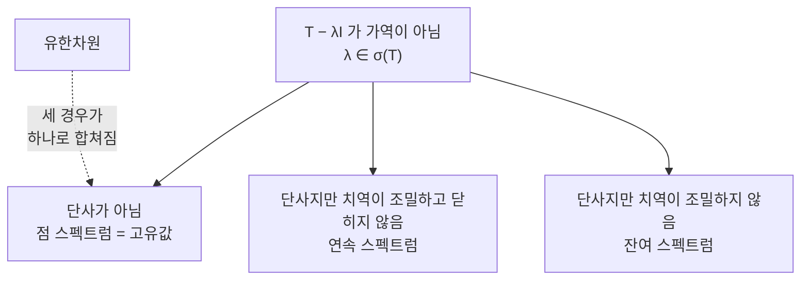

# 유계 작용소와 스펙트럼

# 개요

유한차원에서 [스펙트럼 정리](spectral-theorem.md)는 자기수반 행렬을 고유벡터의 정규직교기저로 대각화한다. 모든 정보가 고유값에 들어 있고, 고유값은 특성다항식의 근이므로 반드시 존재한다.

무한차원 [Hilbert 공간](hilbert-spaces.md)에서는 이 그림이 무너진다. 특성다항식이 없고, 고유값이 하나도 없는 자기수반 작용소가 존재한다. `L^2[0,1]` 에서 `f(x)\mapsto xf(x)` 가 그런 예다. 이 작용소는 명백히 자기수반이지만 `xf = \lambda f` 를 만족하는 0 이 아닌 `f` 가 없다.

그래서 고유값 대신 스펙트럼을 쓴다. `T-\lambda I` 가 가역이 아닌 `\lambda` 들의 집합이며, 유한차원에서는 고유값 집합과 일치하지만 무한차원에서는 더 넓다. 위의 곱셈 작용소에서 스펙트럼은 `[0,1]` 전체가 된다. 고유값이 없어도 스펙트럼은 비어 있지 않다는 것이 이 이론의 출발점이며, 양자역학의 관측량과 연속 스펙트럼이 여기에 대응한다.

# 직관

## 유계는 연속이다

선형사상에서 연속성과 유계성이 같은 뜻이다. 유한차원에서는 모든 선형사상이 자동으로 연속이지만 무한차원에서는 그렇지 않다. 미분 작용소가 대표적으로 유계가 아니다. 고주파 진동 `\sin(nx)` 는 크기가 1 인데 미분하면 크기가 `n` 이 되므로 아무리 큰 상수로도 잡히지 않는다.

그래서 무한차원 작용소 이론은 처음부터 두 갈래로 나뉜다. 유계 작용소는 전 공간에서 정의되고 다루기 쉽다. 미분 작용소 같은 비유계 작용소는 조밀한 부분공간에서만 정의되며 정의역을 어떻게 잡느냐가 이론의 일부가 된다. 이 문서는 유계 쪽을 다룬다.

## 가역성이 고유값을 대신한다

유한차원에서 `T-\lambda I` 가 단사가 아니면 전사도 아니다. 그래서 고유값과 비가역성이 같은 것이었다.

무한차원에서는 이 동치가 깨진다. 단사이면서 전사가 아닌 작용소, 치역이 조밀하지만 닫히지 않은 작용소가 있다. 오른쪽 이동 작용소는 단사지만 전사가 아니고, 왼쪽 이동은 전사지만 단사가 아니다.

## 콤팩트 작용소는 유한차원에 가깝다

유한계수 작용소들의 극한으로 얻어지는 작용소를 콤팩트 작용소라 한다. 이들은 무한차원에 있으면서도 유한차원처럼 행동한다. 0 이 아닌 스펙트럼이 고유값뿐이고, 각 고유공간이 유한차원이며, 고유값이 0 으로만 모인다.

그래서 유한차원 스펙트럼 정리가 콤팩트 자기수반 작용소로 거의 그대로 확장된다. 적분 작용소 대부분이 콤팩트이므로 적분방정식 이론이 여기서 나온다.

# 정의

## 유계 작용소

Hilbert 공간 `H`, `K` 사이의 선형사상 `T:H\to K` 가 유계라는 것은 다음이 유한하다는 뜻이다.

$$
\lVert T\rVert=\sup_{\lVert x\rVert\le1}\lVert Tx\rVert
$$

이 조건은 `T` 가 연속인 것, `0` 에서 연속인 것과 동치다. `\mathcal B(H)` 는 `H` 위의 유계 작용소 전체이며, 이 노름과 합성 곱에 대해 완비 대수를 이룬다.

## 수반작용소

[Riesz 표현 정리](hilbert-spaces.md)에서 각 `T\in\mathcal B(H)` 에 대해 다음을 만족하는 유일한 `T^*\in\mathcal B(H)` 가 존재한다.

$$
\langle Tx,y\rangle=\langle x,T^*y\rangle\qquad\forall x,y\in H
$$

`\lVert T^*\rVert=\lVert T\rVert` 이고 `\lVert T^*T\rVert=\lVert T\rVert^2` 다. 마지막 등식이 `C^*` 대수를 정의하는 성질이며, 작용소 이론이 대수적으로 다뤄지는 출발점이다.

| 부류 | 조건 | 유한차원 대응 |
|---|---|---|
| 자기수반 | `T=T^*` | 대칭/에르미트 행렬 |
| 유니터리 | `T^*T=TT^*=I` | 직교/유니터리 행렬 |
| 정규 | `T^*T=TT^*` | 정규행렬 |
| 사영 | `T=T^*=T^2` | 직교사영 |
| 콤팩트 | 유계집합의 상이 상대적으로 콤팩트 | 모든 행렬 |

## 스펙트럼

$$
\sigma(T)=\{\lambda\in\mathbb C:\ T-\lambda I\ \text{가 }\mathcal B(H)\text{ 에서 가역이 아니다}\}
$$

여집합을 분해집합이라 하고, 그 위에서 `R(\lambda)=(T-\lambda I)^{-1}` 을 분해작용소라 한다.

스펙트럼은 세 부분으로 나뉜다. `T-\lambda I` 가 단사가 아니면 점 스펙트럼, 단사이고 치역이 조밀하지만 닫히지 않으면 연속 스펙트럼, 치역이 조밀하지 않으면 잔여 스펙트럼이다.

# 성질

## 스펙트럼은 공집합이 아닌 콤팩트 집합

`\sigma(T)` 는 `\{|\lambda|\le\lVert T\rVert\}` 에 포함되는 닫힌 집합이며 비어 있지 않다.

유계성은 `|\lambda|>\lVert T\rVert` 일 때 Neumann 급수 `\sum \lambda^{-n-1}T^n` 이 수렴해 역작용소를 준다는 데서 나온다. 닫힘은 가역 작용소들이 열린 집합을 이룬다는 사실이다. 비공집합성은 복소해석의 논증이다. `\sigma(T)` 가 비었다면 `R(\lambda)` 가 전해석이고 무한대에서 0 으로 가므로 Liouville 정리에 의해 항등적으로 0 이 되어 모순이다.

스펙트럼 반지름은 다음 공식으로 주어진다.

$$
r(T)=\max_{\lambda\in\sigma(T)}|\lambda|=\lim_{n\to\infty}\lVert T^n\rVert^{1/n}
$$

정규작용소에서는 `r(T)=\lVert T\rVert` 지만 일반적으로는 더 작을 수 있다. 멱영행렬에서 `r=0<\lVert T\rVert` 인 것이 그 예다.

## 자기수반이면 스펙트럼이 실수

`T=T^*` 이면 `\sigma(T)\subset\mathbb R` 이고, 나아가 `\sigma(T)\subset[m,M]` 이다. 여기서 `m=\inf_{\lVert x\rVert=1}\langle Tx,x\rangle`, `M=\sup_{\lVert x\rVert=1}\langle Tx,x\rangle` 이며 양 끝점이 모두 스펙트럼에 속한다.

`\lambda=a+bi` 에 `b\ne0` 이면 `\lVert(T-\lambda)x\rVert\ge|b|\lVert x\rVert` 가 직접 계산으로 나오고, 이것이 단사성과 치역의 닫힘을 동시에 준다.

## 고유값 없는 자기수반 작용소

`H=L^2[0,1]` 에서 `(Mf)(x)=xf(x)` 를 보자. 자기수반이고 `\lVert M\rVert=1` 이다.

`\lambda\in[0,1]` 에 대해 `(M-\lambda)f=g` 를 풀면 `f(x)=g(x)/(x-\lambda)` 인데, `\lambda` 근처에서 이 함수가 제곱적분가능하지 않을 수 있으므로 역작용소가 유계가 아니다. 따라서 `[0,1]\subset\sigma(M)`. 반대로 `\lambda\notin[0,1]` 이면 `1/(x-\lambda)` 가 유계이므로 가역이다. 즉 `\sigma(M)=[0,1]` 이다.

그런데 `xf(x)=\lambda f(x)` 는 `x\ne\lambda` 인 거의 모든 곳에서 `f=0` 을 강제하므로 `f=0` 이다. 고유값이 하나도 없다. 스펙트럼 전체가 연속 스펙트럼이며, 이것이 무한차원에서 새로 나타나는 현상이다.

## 콤팩트 자기수반 작용소의 스펙트럼 정리

`T` 가 콤팩트이고 자기수반이면 정규직교기저 `\{e_n\}` 과 실수 `\lambda_n\to0` 이 존재해

$$
Tx=\sum_n\lambda_n\langle x,e_n\rangle e_n
$$

가 성립한다. 유한차원 대각화가 그대로 확장된 형태다.

증명의 핵심은 `\lVert T\rVert` 또는 `-\lVert T\rVert` 가 고유값이라는 것이다. `\langle Tx,x\rangle` 를 단위구에서 최대화하는 수열을 잡으면, 콤팩트성이 부분수열의 수렴을 보장해 최대점이 실제로 존재하고 그것이 고유벡터가 된다. 그 고유벡터의 직교여공간으로 제한해 같은 논증을 반복한다.

고유값이 0 으로 수렴해야 한다는 것도 콤팩트성에서 나온다. 크기가 `\epsilon` 이상인 고유값이 무한히 많으면 대응 고유벡터들이 서로 `\sqrt2\epsilon` 이상 떨어져 있어 수렴 부분수열을 가질 수 없다.

## 일반 자기수반 작용소: 스펙트럼 측도

콤팩트가 아니면 합이 적분으로 바뀐다. 자기수반 `T` 에 대해 사영값 측도 `E` 가 유일하게 존재해

$$
T=\int_{\sigma(T)}\lambda\,dE(\lambda)
$$

가 성립한다. `E(B)` 는 Borel 집합 `B` 에 대응하는 직교사영이며, 고유공간의 일반화다. 위의 곱셈 작용소에서 `E(B)` 는 `B` 의 지시함수를 곱하는 작용소다.

실제로 모든 자기수반 작용소가 어떤 측도공간 위의 곱셈 작용소와 유니터리 동치라는 것이 정리의 다른 형태다. 즉 곱셈 작용소가 자기수반 작용소의 보편적인 모형이다.

## 함수 계산

스펙트럼 측도가 있으면 함수를 작용소에 적용할 수 있다.

$$
f(T)=\int_{\sigma(T)}f(\lambda)\,dE(\lambda)
$$

`f` 가 다항식이면 보통의 다항식 계산과 일치하고, `f(\lambda)=e^{it\lambda}` 이면 유니터리군 `e^{itT}` 가 나온다. 대응 `f\mapsto f(T)` 가 대수 준동형이므로, 함수 사이의 항등식이 작용소 사이의 항등식으로 그대로 옮겨진다.

이것이 양자역학의 시간 발전과 편미분방정식의 반군 이론이 서 있는 기반이다.

## Fredholm 대안

`T` 가 콤팩트이고 `\lambda\ne0` 이면 `T-\lambda I` 에 대해 다음 중 정확히 하나가 성립한다. 모든 `y` 에 대해 `(T-\lambda)x=y` 가 유일한 해를 가지거나, 동차방정식 `(T-\lambda)x=0` 이 0 이 아닌 해를 가지고 그 해공간이 유한차원이거나다.

유한차원 선형대수의 "단사이면 전사" 가 콤팩트 섭동 아래에서 살아남는다는 진술이며, 적분방정식의 가해성 판정에 그대로 쓰인다.

# 활용

## 양자역학

관측량은 자기수반 작용소이고, 측정 결과의 가능한 값이 스펙트럼이다. 위치와 운동량처럼 연속 스펙트럼을 가지는 관측량이 고유값을 가지지 않는다는 사실이 물리적으로 중요하다. 위치의 정확한 고유상태가 존재하지 않는다는 것이 수학적으로는 위의 곱셈 작용소 예와 같은 내용이다.

상태의 시간 발전은 `\psi(t)=e^{-itH/\hbar}\psi(0)` 이며, 함수 계산이 이 지수를 정의한다. Stone 정리가 유니터리군과 자기수반 생성원의 일대일 대응을 준다.

## 적분방정식

핵 `k(x,y)` 가 제곱적분가능하면 `(Tf)(x)=\int k(x,y)f(y)\,dy` 가 콤팩트 작용소다. 그래서 `f-\lambda Tf=g` 꼴의 방정식에 Fredholm 대안이 적용되고, 핵이 대칭이면 고유함수 전개로 해를 쓸 수 있다.

Sturm–Liouville 문제의 고유함수 전개가 이 구조의 고전적 사례다. 미분방정식을 Green 함수로 적분방정식으로 바꾸면 비유계 미분 작용소가 콤팩트 적분 작용소로 바뀐다.

## 수치 계산과의 관계

무한차원 작용소를 유한차원으로 잘라 수치적으로 다룰 때, 잘라 낸 행렬의 고유값이 원래 스펙트럼을 얼마나 잘 근사하는지가 문제가 된다. 콤팩트 작용소에서는 잘 되지만 연속 스펙트럼이 있으면 위험하다. 유한 행렬은 늘 고유값만 가지므로 연속 스펙트럼을 흉내 내지 못하고, 스펙트럼 오염이라 부르는 가짜 고유값이 나타난다.

## 작용소 대수

`\mathcal B(H)` 의 부분대수로 노름 닫힌 것을 `C^*` 대수, 약작용소 위상에서 닫힌 것을 von Neumann 대수라 한다. Gelfand–Naimark 정리에 의해 모든 가환 `C^*` 대수는 콤팩트 Hausdorff 공간 위의 연속함수 대수와 동형이므로, 작용소 대수를 "비가환 위상공간" 으로 읽는 관점이 나온다. 비가환 기하학과 양자장론의 대수적 접근이 이 위에 서 있다.

# 연관 문서

## 선수지식

- [Hilbert 공간](hilbert-spaces.md)
- [스펙트럼 정리](spectral-theorem.md)

## 더 알아보기

- [비유계 작용소와 Stone 정리](unbounded-operators.md)

#functional_analysis #analysis #linear_algebra
