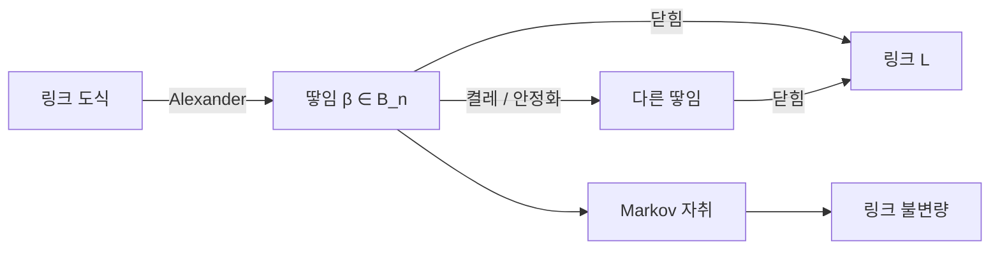

# 땋임군과 Alexander–Markov 정리

# 개요

[매듭 불변량](knot-invariants.md)은 도식과 Reidemeister 이동으로 정의된다. 도식은 그림이고 이동은 국소적인 손질이라, 불변량을 만들 때마다 "세 이동 아래 값이 변하지 않는가" 를 손으로 확인해야 한다. 이 확인이 불변량 구성의 병목이다.

땋임군이 그 병목을 대수로 옮긴다. `n` 가닥 땋임군 `B_n` 은 생성원과 관계식이 명시된 유한표시군이고, 두 정리가 매듭 이론과 이 군을 잇는다.

- **Alexander 정리.** 모든 링크는 어떤 땋임의 닫힘으로 얻어진다.
- **Markov 정리.** 두 땋임의 닫힘이 같은 링크인 것은, 두 땋임이 켤레 이동과 안정화 이동의 유한 열로 연결되는 것과 같다.

둘을 합치면 링크의 분류가 `\bigsqcup_n B_n` 을 두 관계로 나눈 몫집합의 분류가 된다. 그림 위의 세 이동이 군 위의 두 이동으로 바뀌는 것이다. 그리고 결정적으로, 그 두 이동을 견디는 함수를 만드는 조리법이 있다. **Markov 자취**를 하나 찾으면 링크 불변량이 하나 나온다. Jones 다항식이 그렇게 태어났다.

# 직관

## 가닥을 꼬는 조작이 군을 이룬다

`n` 개의 점을 위아래 두 줄로 놓고 가닥으로 잇되, 가닥이 아래로만 진행하고 서로 교차할 때 위아래를 기억한다. 이런 그림을 세로로 이어 붙이는 것이 곱이고, 위아래를 뒤집은 그림이 역원이다. 생성원은 `i` 번째와 `i+1` 번째 가닥을 한 번 꼬는 `\sigma_i` 이며 관계식은 둘뿐이다.

$$
\sigma_i\sigma_j=\sigma_j\sigma_i\ \ (|i-j|\ge2),\qquad
\sigma_i\sigma_{i+1}\sigma_i=\sigma_{i+1}\sigma_i\sigma_{i+1}
$$

첫 관계는 멀리 떨어진 꼬임이 서로 간섭하지 않는다는 뜻이고, 둘째는 Reidemeister 3 이동 그 자체다. `\sigma_i^2=1` 을 더하면 대칭군 `S_n` 이 되므로, **땋임군은 대칭군에서 "되돌아옴" 관계만 뺀 군**이다. 그 하나를 뺐을 뿐인데 유한군이 무한군이 되고 꼬임 정보 전체가 살아남는다.

`B_n` 은 원판에서 `n` 개의 구멍을 뚫은 곡면의 사상류군으로도 실현되며, 이 관점에서 `B_n` 의 원소는 구멍들을 서로 지나가며 제자리로 되돌리는 방법이 된다.

## 닫으면 링크가 된다

땋임 `\beta\in B_n` 의 위쪽 `i` 번째 점과 아래쪽 `i` 번째 점을 바깥으로 돌려 이으면 닫힌 곡선들의 모임, 곧 링크 `\hat\beta` 가 나온다. Alexander 정리는 이 조작이 **전사**임을 말한다. 임의의 링크 도식을 잡고 어떤 축을 중심으로 모든 가닥이 같은 방향으로 돌도록 고치면 되며, 도식을 자르고 다시 잇는 유한 절차로 항상 가능하다.

전사이므로 정보를 잃지 않지만 단사는 아니다. 서로 다른 땋임이 같은 링크를 줄 수 있고, 심지어 가닥 수가 달라도 그렇다. 그 겹침을 정확히 기술하는 것이 Markov 정리다.

## 두 이동만으로 충분하다

$$
\text{켤레}\ \colon\ \beta\sim\gamma\beta\gamma^{-1}\ (\gamma\in B_n),\qquad
\text{안정화}\ \colon\ \beta\sim\beta\sigma_n^{\pm1}\ (\beta\in B_n\subset B_{n+1})
$$

켤레는 닫힘을 취하면 앞뒤가 이어지므로 그림이 변하지 않는다는 사실이고, 안정화는 가닥을 하나 늘리면서 Reidemeister 1 이동으로 없앨 수 있는 꼬임을 붙이는 것이다. Markov 정리는 이 둘 **말고는 없다**고 말한다.



## 불변량 만드는 기계

`B_n` 의 표현족 `\rho_n\colon B_n\to A_n` 과 자취 `\mathrm{tr}` 이 있고, 그것이

1. `\mathrm{tr}(ab)=\mathrm{tr}(ba)` (자취이므로 켤레 불변)
2. `\mathrm{tr}(\beta\sigma_n^{\pm1})=z^{\pm1}\,\mathrm{tr}(\beta)` (안정화에서 정해진 상수배)

를 만족하면, 적당히 정규화한 `\mathrm{tr}(\rho(\beta))` 가 링크 불변량이 된다. 조건 1 은 대수에서 거의 공짜이고 조건 2 만 확인하면 된다. 그림 위 세 이동을 확인하던 일이 대수 등식 하나로 줄었다.

Jones 는 `\mathrm{II}_1` 인자의 부분인자를 연구하다 Temperley–Lieb 대수 `TL_n(\delta)` 위에서 정확히 이 성질을 가진 자취를 발견했다. `B_n\to TL_n` 은

$$
\sigma_i\longmapsto A+A^{-1}e_i,\qquad e_i^2=\delta e_i,\ e_ie_{i\pm1}e_i=e_i
$$

로 주어지고, `\delta=-A^2-A^{-2}` 라는 제약이 자취의 존재를 보장한다. 이 값이 부분인자 지표가 `4\cos^2(\pi/n)` 만 가질 수 있다는 정리와 같은 사실의 두 얼굴이다.

## Burau 표현으로 직접 계산한다

가장 오래된 표현은 Burau 표현이다. 감소 Burau `\bar\rho\colon B_n\to\mathrm{GL}_{n-1}(\mathbb Z[t^{\pm1}])` 를 쓰면 Alexander 다항식이 행렬식 하나로 나온다.

$$
\Delta_{\hat\beta}(t)\;\doteq\;\det\bigl(I-\bar\rho(\beta)\bigr)\cdot\frac{1-t}{1-t^{n}}
$$

`\doteq` 는 `\pm t^k` 배를 무시한다는 뜻이다. 수치로 확인해 보자.

```javascript
const mul = (A, B) => A.map(r => B[0].map((_, j) => r.reduce((s, v, k) => s + v * B[k][j], 0)));
const id = n => Array.from({length: n}, (_, i) => Array.from({length: n}, (_, j) => +(i === j)));
const inv = (M) => {                                  // 가우스–조던
  const n = M.length, A = M.map((r, i) => [...r, ...id(n)[i]]);
  for (let c = 0; c < n; c++) {
    let p = c; while (Math.abs(A[p][c]) < 1e-12) p++;
    [A[c], A[p]] = [A[p], A[c]];
    const d = A[c][c]; A[c] = A[c].map(v => v / d);
    for (let r = 0; r < n; r++) if (r !== c) { const f = A[r][c]; A[r] = A[r].map((v, k) => v - f * A[c][k]); }
  }
  return A.map(r => r.slice(n));
};
const det = (M) => {
  const n = M.length, A = M.map(r => [...r]); let d = 1;
  for (let c = 0; c < n; c++) {
    let p = c; for (let r = c; r < n; r++) if (Math.abs(A[r][c]) > Math.abs(A[p][c])) p = r;
    if (Math.abs(A[p][c]) < 1e-14) return 0;
    if (p !== c) { [A[c], A[p]] = [A[p], A[c]]; d = -d; }
    d *= A[c][c];
    for (let r = c + 1; r < n; r++) { const f = A[r][c] / A[c][c]; for (let k = c; k < n; k++) A[r][k] -= f * A[c][k]; }
  }
  return d;
};
const gen = (i, n, t) => {                            // 감소 Burau 의 σ_i
  if (n === 2) return [[-t]];
  const m = id(n - 1);
  if (i === 1) { m[0][0] = -t; m[0][1] = 1; }
  else if (i === n - 1) { m[i-1][i-2] = t; m[i-1][i-1] = -t; }
  else { m[i-1][i-2] = t; m[i-1][i-1] = -t; m[i-1][i] = 1; }
  return m;
};
const alexander = (word, n, t) => {                   // word: +i 는 σ_i, -i 는 σ_i^{-1}
  let M = id(n - 1);
  for (const w of word) M = mul(M, w > 0 ? gen(w, n, t) : inv(gen(-w, n, t)));
  const D = det(id(n - 1).map((r, i) => r.map((v, j) => v - M[i][j])));
  return D * (1 - t) / (1 - Math.pow(t, n));
};

for (const t of [1.3, 2.0, 3.0])
  console.log(`t=${t}`,
    '삼엽', alexander([1,1,1], 2, t).toFixed(4), '기대', (t*t - t + 1).toFixed(4),
    '| 8자', alexander([1,-2,1,-2], 3, t).toFixed(4), '기대', (-(t*t - 3*t + 1)/(t*t)).toFixed(4));
// t=1.3 삼엽 1.3900 기대 1.3900 | 8자 0.7160 기대 0.7160
// t=2   삼엽 3.0000 기대 3.0000 | 8자 0.2500 기대 0.2500
// t=3   삼엽 7.0000 기대 7.0000 | 8자 -0.1111 기대 -0.1111
```

삼엽매듭 `\hat{\sigma_1^3}` 에서 `t^2-t+1`, 8 자 매듭 `\widehat{\sigma_1\sigma_2^{-1}\sigma_1\sigma_2^{-1}}` 에서 `t^2-3t+1` 이 `\pm t^{k}` 배까지 나온다. 8 자 쪽 출력이 `-t^{-2}` 배로 나오는 것이 그 정규화 자유도이며, Alexander 다항식이 애초에 그만큼의 애매함을 갖고 정의된다.

# 정의

## 땋임군

$$
B_n=\bigl\langle \sigma_1,\dots,\sigma_{n-1}\;\bigm|\;\sigma_i\sigma_j=\sigma_j\sigma_i\ (|i-j|\ge2),\ \ \sigma_i\sigma_{i+1}\sigma_i=\sigma_{i+1}\sigma_i\sigma_{i+1}\bigr\rangle
$$

`\sigma_i\mapsto(i\ i{+}1)` 은 전사 준동형 `B_n\to S_n` 을 주고 그 핵을 **순수 땋임군** `P_n` 이라 한다. `P_n` 은 자유군들의 반직접곱으로 분해되고(Artin), 그 결과 `B_n` 은 꼬임 없는 무한군이며 낱말 문제가 다항시간에 풀린다.

## 닫힘과 지표

`\beta\in B_n` 의 닫힘 `\hat\beta` 는 위아래 끝점을 짝지어 이어 만든 링크다. `\hat\beta` 를 주는 최소의 `n` 을 `\hat\beta` 의 **땋임 지표**라 하고, 이는 링크 불변량이다. Morton–Franks–Williams 부등식이 HOMFLY 다항식의 차수로 그 하계를 준다.

## Markov 정리

`\hat\beta=\hat\gamma`(같은 링크) `\iff` `\beta` 와 `\gamma` 가 다음 두 이동의 유한 열로 옮겨진다.

$$
\text{M1}\colon\ \beta\mapsto\gamma\beta\gamma^{-1},\qquad
\text{M2}\colon\ \beta\in B_n\ \mapsto\ \beta\sigma_n^{\pm1}\in B_{n+1}
$$

두 방향 모두 증명이 필요하고, 어려운 쪽은 "이 둘로 충분하다" 이다.[^1]

## Markov 자취

대수족 `\{A_n\}` 과 준동형 `\rho_n\colon B_n\to A_n^\times`, 선형범함수 `\mathrm{tr}_n\colon A_n\to R` 이 위 두 조건을 만족하면 `\mathrm{tr}` 을 Markov 자취라 한다. 이때 `w(\beta)` 를 지수합, `n` 을 가닥 수라 하고 적절한 상수 `a,b` 를 잡으면

$$
X(\hat\beta)=a^{\,w(\beta)}b^{\,n-1}\,\mathrm{tr}_n\bigl(\rho_n(\beta)\bigr)
$$

가 링크 불변량이 된다. `TL_n` 과 Jones 자취를 넣으면 Jones 다항식, Hecke 대수 `H_n(q)` 와 Ocneanu 자취를 넣으면 HOMFLY 다항식이 나온다.

# 성질

## 왜 두 이동으로 충분한가

증명의 골자는 링크 도식을 축 주위로 감기게 고치는 과정에서 생기는 모든 선택지가 M1 과 M2 로 흡수된다는 것이다. Reidemeister 이동 셋 가운데 R2 와 R3 은 땋임 관계식 자체에 이미 들어 있고, R1 만 가닥 수를 바꾸는 이동을 요구한다. 그래서 M2 는 정확히 R1 의 대수적 잔재다. 불변량을 만들 때 지수합 `w(\beta)` 로 보정하는 것도 R1 을 다루는 일과 같다.

## Burau 표현의 충실성

`B_3` 에서 Burau 표현은 충실하고 `B_n` (`n\ge5`) 에서는 충실하지 않다는 것이 알려져 있다(Bigelow, Long–Paton). `n=4` 는 열려 있다. 충실하지 않다는 사실은 Alexander 다항식이 매듭을 완전히 구별하지 못하는 이유의 대수적 판본이다.

한편 `B_n` 전체가 어떤 유한차원 표현에서도 충실하지 않은 것은 아니다. Lawrence–Krammer 표현이 모든 `n` 에 대해 충실함이 증명되어(Bigelow, Krammer) 땋임군이 **선형군**임이 확정되었다. 사상류군 가운데 선형성이 알려진 드문 예다.

## 낱말 문제와 켤레 문제

`B_n` 의 낱말 문제는 Garside 구조(양의 땋임 반군과 기본 땋임 `\Delta`)로 다항시간에 풀린다. 켤레 문제도 초정상형(super summit set)으로 풀리지만 복잡도가 크고, 이 난이도가 한때 땋임군 기반 암호의 근거로 제안되었다. 이후 길이 기반 공격 등이 개발되어 실용적인 안전성은 부정적으로 평가된다.

## 매듭 이론 밖에서

`\sigma_i\sigma_{i+1}\sigma_i=\sigma_{i+1}\sigma_i\sigma_{i+1}` 는 Yang–Baxter 방정식의 군론적 형태다. 그래서 땋임군의 표현은 적분가능 격자모형의 전달행렬, 양자군의 `R` 행렬, 등각장론의 융합 규칙에서 같은 모양으로 나타난다. [Reshetikhin–Turaev 불변량](reshetikhin-turaev.md)은 이 관점을 끝까지 밀어 양자군의 표현범주 하나에서 링크와 3 다양체 불변량을 동시에 뽑아낸다.

# 활용

## 불변량의 공장

Markov 자취라는 틀 덕분에 "대수 하나를 고르면 불변량 하나" 라는 생산 방식이 가능해졌다.

| 대수 | 자취 | 불변량 |
|---|---|---|
| `\mathbb Z[t^{\pm1}]` 위 Burau | 행렬식 | Alexander 다항식 |
| Temperley–Lieb `TL_n(\delta)` | Jones 자취 | Jones 다항식 |
| Hecke 대수 `H_n(q)` | Ocneanu 자취 | HOMFLY 다항식 |
| BMW 대수 | Markov 자취 | Kauffman 다항식 |

표의 각 행이 하나의 논문이었고, 공통 구조가 드러난 뒤에는 양자군의 표현으로 통일되었다.

## 물리와 계산

애니온의 세계선이 시공간에서 땋임을 이루므로 위상적 양자계산의 게이트가 곧 `B_n` 의 표현이다. 계산이 게이트의 정확도가 아니라 땋임의 위상에만 의존하므로 국소 잡음에 강하고, `\rho(B_n)` 의 상이 조밀한지가 그 모형의 계산 보편성을 결정한다.

## 곡면과 사상류군

`B_n` 이 구멍 뚫린 원판의 사상류군이라는 사실은 [곡면의 분류](classification-of-surfaces.md)와 이어진다. 땋임의 Nielsen–Thurston 분류(주기적, 가약, 유사 Anosov)가 매듭 보완공간의 기하화와 직접 대응하고, 유사 Anosov 인 땋임의 팽창률이 그 매듭의 쌍곡 부피와 연결된다. 대수, 조합, 기하가 같은 대상을 세 방식으로 보는 자리다.

[^1]: J. Birman, *Braids, Links, and Mapping Class Groups*, Ann. of Math. Studies 82 (1974) 가 표준 참고서다. Markov 정리의 현대적 증명은 P. Traczyk 과 N. Weinberg 의 짧은 논법이 널리 쓰인다. 선형성은 S. Bigelow, *Braid groups are linear*, J. Amer. Math. Soc. **14** (2001) 와 D. Krammer, *Braid groups are linear*, Ann. of Math. **155** (2002). 본문의 Burau 계산은 직접 한 것이다.

# 연관 문서

## 선수지식

- [매듭 불변량과 Jones 다항식](knot-invariants.md)

## 더 알아보기

아직 연결한 문서가 없다.

#topology #group_theory #algebra
