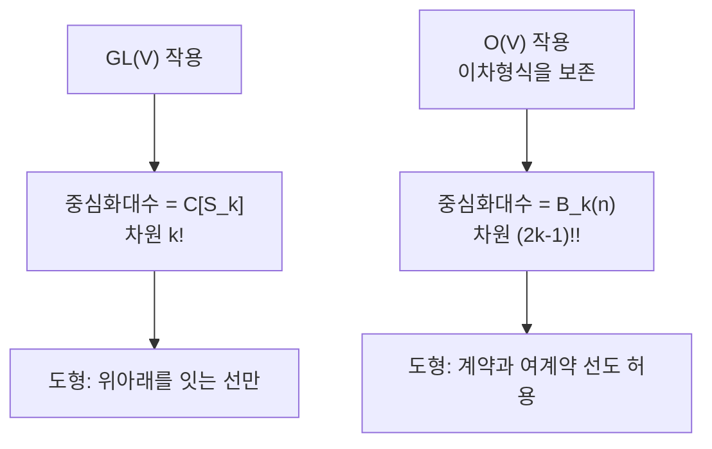

# Brauer 대수와 직교군 쌍대성

# 개요

Brauer 대수 $B_k(\delta)$ 는 $2k$ 개 점의 완전 짝짓기 도형을 기저로 갖는 대수이며, 직교군과 심플렉틱군의 텐서 표현에서 중심화대수 노릇을 한다.

$$
\mathrm{End}_{\mathrm O(n)}\bigl(V^{\otimes k}\bigr)=B_k(n),
\qquad
\mathrm{End}_{\mathrm{Sp}(2m)}\bigl(V^{\otimes k}\bigr)=B_k(-2m)
$$

[Schur–Weyl 쌍대성](schur-weyl-duality.md)은 $\mathrm{End}_{\mathrm{GL}(V)}(V^{\otimes k})=\mathbb C[S_k]$ 를 준다. $\mathrm{GL}(V)$ 를 직교군으로 줄이면 불변량이 늘어나고 중심화대수도 커지며, 늘어난 만큼을 Brauer 대수가 기술한다. 두 군이 각각 대칭 쌍선형형식과 교대 쌍선형형식을 보존한다는 차이가 매개변수 $\delta$ 의 부호로 압축된다.

Brauer 대수는 군의 군대수가 아니다. 원소가 치환이 아니라 도형이고 곱셈이 도형을 쌓는 것이다.

# 직관

## 계약과 여계약

$\mathrm{GL}(V)$ 불변인 $V^{\otimes k}\to V^{\otimes k}$ 사상은 텐서 자리를 섞는 것뿐이라 $S_k$ 가 답이었다.

$\mathrm O(n)$ 은 불변 이차형식 $\langle\thinspace,\rangle$ 을 보존하므로 연산 두 개가 더 불변이 된다.

$$
\text{계약}:\ v\otimes w\ \mapsto\ \langle v,w\rangle,
\qquad
\text{여계약}:\ 1\ \mapsto\ \sum_i e_i\otimes e_i
$$

두 자리를 지워 스칼라로 만들고, 아무것도 없는 데서 두 자리를 만든다. 치환으로는 얻을 수 없는 연산이며, 이것들을 합성해 얻는 모든 사상이 중심화대수를 채운다.

## 도형과 곱셈

위에 점 $k$ 개, 아래에 점 $k$ 개를 놓고 전체 $2k$ 개 점을 완전히 짝짓는다. 위와 아래를 잇는 선은 텐서 자리를 옮기는 것, 위끼리 잇는 선은 계약, 아래끼리 잇는 선은 여계약이다. 치환은 위아래를 잇는 선만 쓰는 도형이다.

곱셈은 도형 두 개를 세로로 쌓고 가운데 점들을 지우는 것이다. 어디에도 닿지 않는 닫힌 고리가 생기면 그 개수만큼 $\delta$ 를 곱한다. $\delta=n$ 일 때 고리 하나가 $\sum_i\langle e_i,e_i\rangle=n$ 이다.

$B_k$ 의 차원은 $(2k-1)!!$ 이고 $k=7$ 에서 $135135$ 로 $k!=5040$ 의 27 배다.

# 정의

## Brauer 대수

$\delta\in\mathbb C$ 에 대해 $B_k(\delta)$ 는 $\lbrace 1,\dots,k\rbrace\sqcup\lbrace 1',\dots,k'\rbrace$ 의 완전 짝짓기들을 기저로 갖는 $\mathbb C$ 대수다. 두 도형 $d_1,d_2$ 의 곱은 $d_1$ 아래에 $d_2$ 를 붙여 얻은 도형 $d$ 와 생긴 닫힌 고리 수 $c$ 에 대해 다음과 같다.

$$
d_1\cdot d_2=\delta^{\thinspace c}\thinspace d
$$

차원은 $(2k-1)!!$ 이고 $\mathbb C[S_k]$ 를 부분대수로 포함한다.

## 쌍대성

$V=\mathbb C^n$ 에 표준 이차형식을 주면 $B_k(n)\to\mathrm{End}(V^{\otimes k})$ 가 정의되고 상이 $\mathrm{End}_{\mathrm O(n)}(V^{\otimes k})$ 다. 심플렉틱 쪽은 $\delta=-2m$ 으로 같은 진술이 성립한다. $k\le n$ 이면 사상이 단사이고 $k>n$ 이면 핵이 생긴다.

## 제 1 기본정리

$$
\mathrm{End}_{\mathrm O(n)}\bigl(V^{\otimes k}\bigr)\ \text{는 계약과 치환으로 생성된다}
$$

고전 불변론의 언어로는 $\mathrm O(n)$ 의 벡터 불변량이 내적 $\langle v_i,v_j\rangle$ 들의 다항식이라는 진술이며, 도형 언어로는 모든 도형이 기저라는 진술이다.

# 성질

## 반단순성의 조건

$\delta$ 가 정수가 아니거나 충분히 크면 $B_k(\delta)$ 는 반단순이고, 기약 표현이 $0\le r\le k/2$ 인 분할 $\lambda\vdash k-2r$ 로 매개된다. $r$ 이 계약선의 쌍 개수다.

$\delta=n$ 이 작은 정수이고 $k$ 가 크면 반단순성이 깨진다. 이 경우 $\mathrm O(n)$ 텐서곱에 나타나는 기약 성분의 중복도가 비반단순 대수의 분해 행렬로 기술된다. Brauer 대수가 **세포대수(cellular algebra)** 이므로 세포 구조가 항상 있고 기약 가군은 세포 가군의 머리로 얻어진다.

## Temperley–Lieb 대수

도형에서 선이 교차하지 않는 것만 남기면 **Temperley–Lieb 대수** $TL_k(\delta)$ 가 된다. $B_k(\delta)$ 의 몫이고 차원이 Catalan 수 $C_k$ 다. $\mathrm{SL}_2$ 의 텐서 범주와 매듭 불변량에 쓰이는 대수가 여기서 갈라진다.

## 도형 대수의 가족

| 대수 | 쌍대 군 | 차원 |
| --- | --- | --- |
| $\mathbb C[S_k]$ | $\mathrm{GL}_n$ | $k!$ |
| $B_k(\delta)$ | $\mathrm O_n$ 과 $\mathrm{Sp}_{2m}$ | $(2k-1)!!$ |
| 벽 있는 Brauer | $\mathrm{GL}_n$ (혼합 텐서) | 조합적 |
| 분할 대수 | $S_n$ | Bell 수 |

군을 줄이면 중심화대수가 커지고, 커진 만큼이 도형으로 기술된다.

# 활용

## 불변론의 계산

$\mathrm O(n)$ 불변 텐서를 적을 때 도형 기저가 답의 목록이다. 물리의 지표 계산이나 기계학습의 동변 신경망 설계에서 허용되는 선형 사상을 전부 나열하는 문제의 답이 Brauer 도형이고, 차원 공식 $(2k-1)!!$ 이 매개변수 개수를 준다.

## 분할 대수와 대칭군

$S_n$ 이 $(\mathbb C^n)^{\otimes k}$ 에 작용할 때의 중심화대수가 분할 대수 $P_k(n)$ 이다. 그래프 신경망의 표현력을 논할 때 등장하며, 색 세분 알고리즘이 구별할 수 있는 그래프의 범위와 직결된다.

## 범주로의 확장

Brauer 도형들을 한 대수가 아니라 범주의 사상으로 보면 $k$ 를 고정하지 않아도 된다. 대상이 자연수, 사상이 도형인 이 범주가 Deligne 의 $\mathrm{Rep}(\mathrm O_\delta)$ 구성의 재료다. $\delta$ 를 복소수로 두면 정수가 아닌 차원의 직교군 표현 범주가 정의되고, $\delta$ 가 정수일 때 실제 $\mathrm O(n)$ 의 범주로 특수화된다.

[^1]: 원논문은 R. Brauer, *On algebras which are connected with the semisimple continuous groups*, Ann. of Math. **38** (1937), 857–872. 세포대수 구조와 표현론은 J. Graham, G. Lehrer, *Cellular algebras*, Invent. Math. **123** (1996), 그리고 H. Wenzl, *On the structure of Brauer's centralizer algebras*, Ann. of Math. **128** (1988). 도형 대수 전반은 T. Halverson, A. Ram, *Partition algebras*, European J. Combin. **26** (2005). Deligne 의 범주는 P. Deligne, *La catégorie des représentations du groupe symétrique* $S_t$ (2007).

# 연관 문서

## 선수지식

- [Schur–Weyl 쌍대성](schur-weyl-duality.md)

## 더 알아보기

아직 연결한 문서가 없다.

#algebra #group_theory #combinatorics
