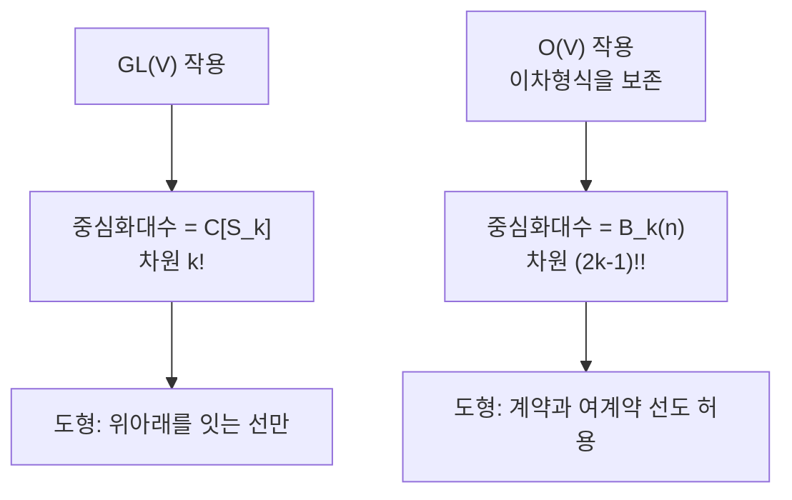

# Brauer 대수와 직교군 쌍대성

# 개요

[Schur–Weyl 쌍대성](schur-weyl-duality.md)은 $V=\mathbb C^n$ 의 텐서곱 위에서 두 군이 서로의 중심화대수라고 말한다.

$$
\mathrm{GL}(V)\ \curvearrowright\ V^{\otimes k}\ \curvearrowleft\ S_k,
\qquad
\mathrm{End}_{\mathrm{GL}(V)}\bigl(V^{\otimes k}\bigr)=\mathbb C[S_k]
$$

$\mathrm{GL}(V)$ 를 직교군 $\mathrm O(V)$ 로 줄이면 무슨 일이 생기는가. 군이 작아졌으니 불변량은 늘어나고, 중심화대수도 $\mathbb C[S_k]$ 보다 커져야 한다. 늘어난 만큼이 무엇인지에 답하는 것이 **Brauer 대수** $B_k(\delta)$ 다.

$$
\mathrm{End}_{\mathrm O(n)}\bigl(V^{\otimes k}\bigr)=B_k(n),
\qquad
\mathrm{End}_{\mathrm{Sp}(2m)}\bigl(V^{\otimes k}\bigr)=B_k(-2m)
$$

직교군과 심플렉틱군이 매개변수 $\delta$ 의 부호만 다른 같은 대수를 준다는 점이 인상적이다. 두 군이 각각 대칭 쌍선형형식과 교대 쌍선형형식을 보존한다는 사실이 부호 하나로 압축된다.

Brauer 대수는 군의 군대수가 아니다. 원소가 치환이 아니라 **도형**이고, 곱셈이 도형을 쌓는 것이다. 표현론에 조합적 대상이 본격적으로 들어오는 첫 자리 가운데 하나다.

# 직관

## 계약이 새로 생긴다

$\mathrm{GL}(V)$ 불변인 $V^{\otimes k}\to V^{\otimes k}$ 사상은 텐서 자리를 섞는 것뿐이다. 그래서 $S_k$ 가 답이었다.

$\mathrm O(n)$ 은 여기에 더해 불변 이차형식 $\langle\,,\rangle$ 을 보존한다. 그러면 새로운 연산 두 개가 불변이 된다.

$$
\text{계약}:\ v\otimes w\ \mapsto\ \langle v,w\rangle,
\qquad
\text{여계약}:\ 1\ \mapsto\ \sum_i e_i\otimes e_i
$$

두 자리를 지워 스칼라로 만들고, 아무것도 없는 데서 두 자리를 만들어낸다. 치환으로는 흉내 낼 수 없는 연산이고, 이것들을 합성해 얻는 모든 사상이 중심화대수를 채운다.

## 도형이 곧 원소다

이 연산들을 그림으로 그리면 관리하기 쉬워진다. 위에 점 $k$ 개, 아래에 점 $k$ 개를 놓고 전체 $2k$ 개 점을 **완전히 짝짓는다**. 위와 아래를 잇는 선은 텐서 자리를 옮기는 것, 위끼리 잇는 선은 계약, 아래끼리 잇는 선은 여계약이다. 치환은 위아래를 잇는 선만 쓰는 특수한 도형이다.

곱셈은 도형 두 개를 세로로 쌓고 가운데 점들을 지우는 것이다. 이때 어디에도 닿지 않는 **닫힌 고리**가 생기면 그 개수만큼 $\delta$ 를 곱한다. $\delta=n$ 일 때 고리 하나가 $\sum_i\langle e_i,e_i\rangle=n$ 을 뜻하기 때문이다.

차원이 얼마나 커지는지 직접 셀 수 있다.

```python
from math import factorial

def matchings(points):
    """점 집합의 완전 짝짓기 개수"""
    if not points: return 1
    a, rest = points[0], points[1:]
    return sum(matchings([x for x in rest if x != b]) for b in rest)

print(' k   S_k 의 차원 k!   B_k 의 차원 (2k-1)!!   직접 센 도형 수')
for k in range(1, 8):
    d = factorial(2*k) // (2**k * factorial(k))
    print(f'{k:2d}   {factorial(k):10d}   {d:14d}   {matchings(list(range(2*k))):12d}')
```

```
 k   S_k 의 차원 k!   B_k 의 차원 (2k-1)!!   직접 센 도형 수
 1            1                1              1
 2            2                3              3
 3            6               15             15
 4           24              105            105
 5          120              945            945
 6          720            10395          10395
 7         5040           135135         135135
```

닫힌 식 $(2k-1)!!$ 과 직접 센 값이 일치한다. $k!$ 과 비교하면 $k=7$ 에서 이미 27 배다. **직교군으로 줄인 대가로 중심화대수가 이만큼 커진다.**



# 정의

## Brauer 대수

$\delta\in\mathbb C$ 에 대해 $B_k(\delta)$ 는 $\{1,\dots,k\}\sqcup\{1',\dots,k'\}$ 의 완전 짝짓기들을 기저로 갖는 $\mathbb C$ 대수다. 두 도형 $d_1,d_2$ 의 곱은 $d_1$ 아래에 $d_2$ 를 붙여 얻은 도형 $d$ 와 생긴 닫힌 고리 수 $c$ 에 대해

$$
d_1\cdot d_2=\delta^{\,c}\,d
$$

이다. 차원은 $(2k-1)!!$ 이고, $\mathbb C[S_k]$ 를 부분대수로 포함한다.

## 쌍대성

$V=\mathbb C^n$ 에 표준 이차형식을 주면 $B_k(n)\to\mathrm{End}(V^{\otimes k})$ 가 정의되고, 상이 정확히 $\mathrm{End}_{\mathrm O(n)}(V^{\otimes k})$ 다. 심플렉틱 쪽은 $\delta=-2m$ 으로 같은 진술이 성립한다. $k\le n$ 이면 사상이 단사이고, $k>n$ 이면 핵이 생긴다.

## 제 1 기본정리

$$
\mathrm{End}_{\mathrm O(n)}\bigl(V^{\otimes k}\bigr)\ \text{는 계약과 치환으로 생성된다}
$$

고전 불변론의 언어로는 "$\mathrm O(n)$ 의 벡터 불변량은 내적 $\langle v_i,v_j\rangle$ 들의 다항식"이라는 진술이다. 도형 언어는 이 정리를 "모든 도형이 기저다"로 다시 쓴 것이다.

# 성질

## 반단순성은 매개변수에 달렸다

$\delta$ 가 정수가 아니거나 충분히 크면 $B_k(\delta)$ 는 반단순이고, 기약 표현이 분할 $\lambda\vdash k-2r$ ($0\le r\le k/2$) 로 매개된다. $r$ 이 계약선의 쌍 개수다.

$\delta=n$ 이 작은 정수이고 $k$ 가 크면 반단순성이 깨진다. 이 경우가 실제로 중요한 경우인데, $\mathrm O(n)$ 쪽 텐서곱에 나타나는 기약 성분의 중복도가 비반단순 대수의 분해 행렬로 기술된다. Brauer 대수가 **세포대수(cellular algebra)** 라는 사실이 이 상황을 다루는 표준 틀을 준다. 세포 구조가 항상 있고, 기약 가군은 세포 가군의 머리로 얻어진다.

## Temperley–Lieb 는 몫이다

도형에서 선이 교차하지 않는 것만 남기면 **Temperley–Lieb 대수** $TL_k(\delta)$ 가 된다. $B_k(\delta)$ 의 몫이고 차원이 Catalan 수 $C_k$ 다. $\mathrm{SL}_2$ 의 텐서 범주와 매듭 불변량 쪽에서 쓰이는 대수가 여기서 갈라져 나온다.

## 도형 대수의 가족

| 대수 | 쌍대 군 | 차원 |
| --- | --- | --- |
| $\mathbb C[S_k]$ | $\mathrm{GL}_n$ | $k!$ |
| $B_k(\delta)$ | $\mathrm O_n$, $\mathrm{Sp}_{2m}$ | $(2k-1)!!$ |
| 벽 있는 Brauer | $\mathrm{GL}_n$ (혼합 텐서) | 조합적 |
| 분할 대수 | $S_n$ | Bell 수 |

같은 발상의 되풀이다. **군을 줄이면 중심화대수가 커지고, 커진 만큼이 도형으로 기술된다.**

# 활용

## 불변론의 계산

$\mathrm O(n)$ 불변 텐서를 구체적으로 적어야 할 때 도형 기저가 곧 답의 목록이다. 물리의 지표 계산이나 기계학습의 동변 신경망 설계에서 "허용되는 선형 사상을 전부 나열하라"는 문제가 나오는데, 그 답이 정확히 Brauer 도형이다. 차원 공식 $(2k-1)!!$ 이 매개변수 개수를 준다.

## 분할 대수와 대칭군

$S_n$ 이 $(\mathbb C^n)^{\otimes k}$ 에 작용할 때의 중심화대수가 분할 대수 $P_k(n)$ 이다. 그래프 신경망의 표현력을 논할 때 등장하는 대수가 이것이고, 색 세분 알고리즘이 구별할 수 있는 그래프의 범위와 직결된다. 도형 대수의 계산이 알고리즘의 한계를 재는 도구가 되는 자리다.

## 범주로 올리기

Brauer 도형들을 한 대수가 아니라 **범주**의 사상으로 보면 $k$ 를 고정하지 않아도 된다. 대상이 자연수, 사상이 도형인 이 범주가 Deligne 의 $\mathrm{Rep}(\mathrm O_\delta)$ 구성의 재료다. $\delta$ 를 복소수로 두면 정수가 아닌 "차원"의 직교군 표현 범주가 정의되고, $\delta$ 가 정수일 때 실제 $\mathrm O(n)$ 의 범주로 특수화된다. 도형이 대수를 넘어 범주가 되는 순간 매개변수를 연속적으로 움직일 수 있게 된다.

[^1]: 원논문은 R. Brauer, *On algebras which are connected with the semisimple continuous groups*, Ann. of Math. **38** (1937), 857–872. 세포대수 구조와 표현론은 J. Graham, G. Lehrer, *Cellular algebras*, Invent. Math. **123** (1996), 그리고 H. Wenzl, *On the structure of Brauer's centralizer algebras*, Ann. of Math. **128** (1988). 도형 대수 전반은 T. Halverson, A. Ram, *Partition algebras*, European J. Combin. **26** (2005). Deligne 의 범주는 P. Deligne, *La catégorie des représentations du groupe symétrique* $S_t$ (2007). 본문의 차원 계산은 직접 한 것이다.

# 연관 문서

## 선수지식

- [Schur–Weyl 쌍대성](schur-weyl-duality.md)

## 더 알아보기

아직 연결한 문서가 없다.

#algebra #group_theory #combinatorics
