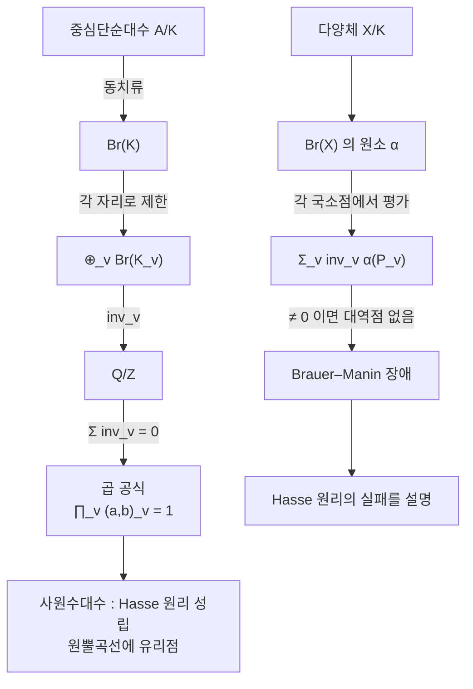

# Brauer 군과 Hasse 원리

# 개요

디오판토스 방정식을 풀 때 가장 먼저 하는 일은 국소적으로 보는 것이다. 모든 법에서 풀리는지, 실수에서 풀리는지를 확인한다. 국소적으로 안 풀리면 대역적으로도 안 풀리므로 이것은 필요조건이다. **Hasse 원리**는 그 역, 곧 국소적으로 다 풀리면 유리수해가 있다는 진술이다.

이차형식에서는 이 원리가 정리다. 그런데 차수가 올라가면 깨진다. Selmer 의 $3x^3+4y^3+5z^3=0$ 은 모든 자리에서 풀리지만 유리수해가 없다. 그러면 자연스러운 질문이 생긴다. **무엇이 장애물인가.**

답의 중심에 **Brauer 군**이 있다. 체 $K$ 위의 중심단순대수를 분류하는 군이며, [유체론](class-field-theory.md)이 이 군을 완전히 계산한다.

$$
0\longrightarrow\mathrm{Br}(K)\longrightarrow\bigoplus_v\mathrm{Br}(K_v)\xrightarrow{\ \sum\mathrm{inv}_v\ }\mathbb Q/\mathbb Z\longrightarrow0
$$

가운데 사상이 [아델](adeles.md)적이다. 각 자리의 불변량을 모두 더하면 $0$ 이라는 이 완전열이 유체론의 가장 압축된 형태이고, 동시에 Hasse 원리가 언제 성립하고 언제 깨지는지를 재는 자가 된다.

# 직관

## 사원수대수 하나가 원뿔곡선 하나다

$a,b\in K^\times$ 에 대해 사원수대수를 정의한다.

$$
(a,b)_K=K\langle i,j\rangle/(i^2=a,\ j^2=b,\ ij=-ji)
$$

$K=\mathbb R$ 이고 $a=b=-1$ 이면 Hamilton 의 사원수다. 이 4 차원 대수는 두 가지 중 하나다. $2\times2$ 행렬대수 $M_2(K)$ 와 동형이거나(**분해**), 나눗셈대수이거나다.

어느 쪽인지가 기하 문제로 번역된다.

$$
(a,b)_K\cong M_2(K)\quad\Longleftrightarrow\quad ax^2+by^2=z^2\ \text{가 }K\text{ 에서 자명하지 않은 해를 갖는다}
$$

대수의 노름형식이 정확히 이 이차형식이기 때문이다. 곧 **원뿔곡선에 점이 있는가** 라는 질문과 **대수가 분해되는가** 라는 질문이 같다. 국소적으로만 점이 있고 대역적으로는 없다면, 그것은 모든 $K_v$ 에서 분해되지만 $K$ 에서는 분해되지 않는 대수가 있다는 뜻이다.

## 국소 불변량과 곱 공식

국소체 $K_v$ 위에서 Brauer 군은 유체론이 완전히 계산해 준다.

$$
\mathrm{inv}_v\colon\mathrm{Br}(K_v)\xrightarrow{\ \sim\ }
\begin{cases}\mathbb Q/\mathbb Z&v\ \text{유한}\\ \tfrac12\mathbb Z/\mathbb Z&v\ \text{실수}\\ 0&v\ \text{복소}\end{cases}
$$

사원수대수는 위수 2 의 원소이므로 불변량이 $0$ 아니면 $1/2$ 이고, $1/2$ 인 자리를 **분기 자리**라 한다. 그리고 대역적으로 정의된 대수는 분기 자리가 유한 개이며 불변량의 합이 $0$ 이다.

$$
\sum_v\mathrm{inv}_v(A)=0\quad\text{in }\mathbb Q/\mathbb Z
$$

사원수대수에서 이 진술은 Hilbert 기호의 곱 공식 $\prod_v(a,b)_v=1$ 이다. 부호가 $-1$ 인 자리의 개수가 반드시 짝수라는 것이며, 이차 상호법칙을 자리 전체에 걸친 대칭으로 다시 쓴 형태다.

여기서 핵심적인 따름정리가 나온다. **한 자리에서만 분기하는 대수는 없다.** 한 자리만 $1/2$ 이면 합이 $1/2\ne0$ 이기 때문이다. 그래서 모든 자리에서 분해되면 전체가 분해되고, 사원수대수에 대해서는 Hasse 원리가 성립한다.



## 장애물은 어떻게 생기는가

$X$ 가 $K$ 위의 다양체라 하자. $X$ 에 $K$ 유리점 $P$ 가 있으면, $X$ 위의 Brauer 군 원소 $\alpha$ 를 $P$ 에서 평가해 $\alpha(P)\in\mathrm{Br}(K)$ 를 얻고 불변량의 합이 $0$ 이어야 한다.

이제 $X$ 가 모든 자리에서 국소점을 갖는다고 하자. 국소점들의 모음 $(P_v)_v$ 마다 합 $\sum_v\mathrm{inv}_v\alpha(P_v)$ 를 계산할 수 있다. 이 합이 **모든** 국소점 모음에 대해 $0$ 이 아니면, 어떤 국소점 모음도 대역점에서 오지 않는다. 곧 $X(K)=\emptyset$ 이다.

이것이 **Brauer–Manin 장애**다. Hasse 원리가 깨지는 이유를 "어떤 대수가 대역적으로 균형을 못 맞춘다" 로 설명하며, Selmer 의 반례를 포함한 알려진 반례 대부분이 이 장애로 설명된다.

# 정의

## 중심단순대수와 Brauer 군

$K$ 위의 유한차원 대수 $A$ 가 **중심단순**이라는 것은 중심이 정확히 $K$ 이고 양쪽 아이디얼이 $0$ 과 $A$ 뿐이라는 뜻이다. Wedderburn 정리에 따라 $A\cong M_n(D)$ 이고 $D$ 는 $K$ 위의 나눗셈대수로 유일하게 정해진다.

두 중심단순대수 $A,B$ 가 **Brauer 동치**라는 것은 $M_m(A)\cong M_n(B)$ 인 $m,n$ 이 있다는 뜻이다. 곧 같은 $D$ 를 갖는다는 뜻이다. 동치류 전체에 텐서곱으로 군 구조가 들어간다.

$$
[A]\cdot[B]=[A\otimes_KB],\qquad [A]^{-1}=[A^{\mathrm{op}}],\qquad 1=[M_n(K)]
$$

이 군이 **Brauer 군** $\mathrm{Br}(K)$ 다. 코호몰로지로는 $\mathrm{Br}(K)\cong H^2(\mathrm{Gal}(\bar K/K),\bar K^\times)$ 이고, 이 동형이 유체론의 계산과 대수의 분류를 잇는 다리다.

## Hilbert 기호

$K_v$ 위에서 사원수대수의 분해 여부를 $\pm1$ 로 적은 것이 **Hilbert 기호**다.

$$
(a,b)_v=\begin{cases}+1&ax^2+by^2=z^2\ \text{가 }K_v\ \text{에서 자명하지 않게 풀린다}\\-1&\text{그렇지 않다}\end{cases}
$$

$\mathbb Q$ 위에서는 명시적 공식이 있다. $a=p^\alpha u$ 와 $b=p^\beta v$ 로 쓰면 홀수 소수 $p$ 에서

$$
(a,b)_p=(-1)^{\alpha\beta\varepsilon(p)}\left(\frac up\right)^{\!\beta}\left(\frac vp\right)^{\!\alpha},\qquad
\varepsilon(p)=\frac{p-1}2\bmod2
$$

이고, $p=2$ 에서는 $\varepsilon(u)=\frac{u-1}2$ 와 $\omega(u)=\frac{u^2-1}8$ 로 $(a,b)_2=(-1)^{\varepsilon(u)\varepsilon(v)+\alpha\omega(v)+\beta\omega(u)}$ 다. 실수 자리에서는 $a,b$ 가 둘 다 음수일 때만 $-1$ 이다.

## 불변량 사상과 기본 완전열

> **유체론(Brauer 군 판).** 대역체 $K$ 에 대해 다음이 완전열이다.
> $$
> 0\to\mathrm{Br}(K)\to\bigoplus_v\mathrm{Br}(K_v)\xrightarrow{\ \sum\mathrm{inv}_v\ }\mathbb Q/\mathbb Z\to0
> $$

왼쪽의 단사성이 **Albert–Brauer–Hasse–Noether 정리**다[^1]. 모든 자리에서 분해되는 중심단순대수는 분해된다는 뜻이며, 중심단순대수에 대한 Hasse 원리다. 가운데의 완전성이 불변량 합 공식이고, 오른쪽의 전사성은 불변량을 미리 정해 대수를 만들 수 있다는 존재정리다.

# 성질

## 원뿔곡선의 Hasse 원리

> **Hasse–Minkowski.** $K$ 위의 이차형식 $q$ 가 $q=0$ 의 자명하지 않은 해를 $K$ 에서 갖는 것과 모든 $K_v$ 에서 갖는 것이 동치다.

세 변수 대각형식 $ax^2+by^2+cz^2=0$ 으로 좁히면 이것이 곧 사원수대수 $(-ac,-bc)$ 의 Hasse 원리다. 실제 판정은 Hilbert 기호 계산이고, 이 계산은 유한하다. $a,b,c$ 를 나누는 소수와 $2$ 와 실수 자리만 보면 되기 때문이다.

Legendre 의 고전적 판정법도 같은 내용이다. $a,b,c$ 가 제곱인자가 없고 서로소이면, 해가 있을 필요충분조건은 부호가 모두 같지 않고 $-bc$ 와 $-ac$ 와 $-ab$ 가 각각 $|a|,|b|,|c|$ 를 법으로 이차잉여인 것이다.

## 노름 정리와의 관계

$L/K$ 가 차수 $n$ 의 순환확대면 $a\in K^\times$ 가 $L$ 에서의 노름인지 여부가 순환대수의 분해 여부와 같다. 그래서 **Hasse 노름 정리**가 따라 나온다.

$$
a\in N_{L/K}L^\times\quad\Longleftrightarrow\quad a\in N_{L_w/K_v}L_w^\times\ \ \text{(모든 }v\text{)}
$$

순환이 아니면 깨진다. $L=\mathbb Q(\sqrt{13},\sqrt{17})$ 처럼 Galois 군이 $(\mathbb Z/2)^2$ 인 경우 반례가 있다. 깨짐의 크기를 재는 것이 $\mathrm{Sha}$ 류의 군이고, 그것 역시 Brauer 군의 언어로 표현된다.

## Brauer–Manin 장애

$X/K$ 가 매끄러운 사영다양체일 때 아델 점 집합 $X(\mathbb A_K)$ 안에 부분집합을 정의한다.

$$
X(\mathbb A_K)^{\mathrm{Br}}=\Big\{(P_v)\in X(\mathbb A_K)\ :\ \sum_v\mathrm{inv}_v\,\alpha(P_v)=0\ \ \text{모든 }\alpha\in\mathrm{Br}(X)\Big\}
$$

$X(K)\subset X(\mathbb A_K)^{\mathrm{Br}}\subset X(\mathbb A_K)$ 가 항상 성립한다. 가운데가 비어 있는데 오른쪽이 비어 있지 않으면 Hasse 원리가 깨지고, 그 깨짐이 Brauer 군으로 설명된 것이다.

- 원뿔곡선과 이차형식에서는 $\mathrm{Br}(X)=\mathrm{Br}(K)$ 라 장애가 없다. 그래서 Hasse 원리가 성립한다.
- 유리곡면과 여러 종류의 곡면에서는 장애가 실제로 나타나고, Colliot-Thélène 과 Sansuc 의 추측은 유리 연결 다양체에서 이 장애가 유일한 장애라고 말한다.
- 곡선에서는 이 장애가 충분하지 않을 수 있고, Skorobogatov 가 그런 예를 만들었다. 하강을 결합한 더 정교한 장애가 필요하다.

# 활용

## 곱 공식과 Hasse 원리를 계산으로 확인한다

세 가지를 확인한다. Hilbert 기호의 곱 공식, Hasse–Minkowski 정리, 그리고 사원수대수의 분기 자리가 항상 짝수 개라는 사실이다. 마지막이 곧 불변량의 합이 $0$ 이라는 진술의 위수 2 판이다.

Hasse–Minkowski 의 확인에는 완전한 전수탐색이 필요한데, Holzer 의 정리가 그것을 유한하게 만들어 준다. $ax^2+by^2+cz^2=0$ 에 해가 있으면 $|x|\le\sqrt{|bc|}$ 와 $|y|\le\sqrt{|ac|}$ 와 $|z|\le\sqrt{|ab|}$ 를 만족하는 해가 있다는 정리다.

```python
from math import gcd, isqrt
from itertools import combinations

def val(n, p):
    a = 0
    while n % p == 0:
        n //= p; a += 1
    return a, n

def legendre(u, p):                      # (u/p), p 홀수 소수
    u %= p
    return 0 if u == 0 else (1 if pow(u, (p - 1) // 2, p) == 1 else -1)

def hilbert(a, b, p):
    """Hilbert 기호 (a,b)_p ∈ {1,-1}. p = 0 은 실수 자리."""
    if p == 0:
        return -1 if a < 0 and b < 0 else 1
    al, u = val(a, p)
    be, v = val(b, p)
    if p != 2:
        e = ((p - 1) // 2) % 2
        s = (-1) ** (al * be * e)
        return s * legendre(u, p) ** be * legendre(v, p) ** al
    eu, ev = ((u - 1) // 2) % 2, ((v - 1) // 2) % 2
    wu, wv = ((u * u - 1) // 8) % 2, ((v * v - 1) // 8) % 2
    return (-1) ** (eu * ev + al * wv + be * wu)

def primes_of(n):
    out, n = set(), abs(n)
    d = 2
    while d * d <= n:
        while n % d == 0:
            out.add(d); n //= d
        d += 1
    if n > 1: out.add(n)
    return out

def places(a, b):
    return [0] + sorted(primes_of(a) | primes_of(b) | {2})

# 1) 곱 공식 ∏_v (a,b)_v = 1
bad = []
for a in range(-30, 31):
    for b in range(-30, 31):
        if a == 0 or b == 0: continue
        pr = 1
        for p in places(a, b):
            pr *= hilbert(a, b, p)
        if pr != 1: bad.append((a, b))
print("곱 공식 ∏_v (a,b)_v = 1  (a,b ∈ [-30,30]) :", not bad)

# 2) Hasse 원리 : 원뿔곡선 ax²+by²+cz²=0 의 국소 가해성 ⟺ 유리해
def local_ok(a, b, c):
    # 대각 이차형식의 국소 가해 조건은 Hilbert 기호로 (-a c, -b c)_v = 1
    return all(hilbert(-a * c, -b * c, p) == 1 for p in places(-a * c, -b * c))

def rational_ok(a, b, c):
    # Holzer 경계 안의 전수탐색이면 완전하다
    X, Y, Z = isqrt(abs(b * c)), isqrt(abs(a * c)), isqrt(abs(a * b))
    for x in range(-X, X + 1):
        for y in range(-Y, Y + 1):
            for z in range(-Z, Z + 1):
                if (x or y or z) and a * x * x + b * y * y + c * z * z == 0:
                    return True
    return False

def squarefree(n):
    n = abs(n)
    return all(n % (d * d) for d in range(2, isqrt(n) + 1))

cases, mismatch = 0, []
vals = [v for v in range(-12, 13) if v and squarefree(v)]
for a, b, c in combinations(vals, 3):
    if gcd(a, b) != 1 or gcd(b, c) != 1 or gcd(a, c) != 1: continue
    cases += 1
    if local_ok(a, b, c) != rational_ok(a, b, c):
        mismatch.append((a, b, c))
print(f"Hasse 원리 : {cases} 개의 (a,b,c) 에서 국소 가해 ⟺ 유리해 :", not mismatch)

# 3) 국소 불변량의 합 : 사원수대수 (a,b/Q) 가 분기하는 자리
for a, b in [(-1, -1), (2, 3), (-1, 3), (5, 7), (-6, -11)]:
    ram = [p for p in places(a, b) if hilbert(a, b, p) == -1]
    inv = " + ".join("1/2" for _ in ram) or "0"
    print(f"  (a,b) = ({a:>3},{b:>3})  분기 자리 {str(ram):<16} 개수 {len(ram)}  "
          f"Σ inv_v = {inv} ≡ 0")

# 곱 공식 ∏_v (a,b)_v = 1  (a,b ∈ [-30,30]) : True
# Hasse 원리 : 270 개의 (a,b,c) 에서 국소 가해 ⟺ 유리해 : True
#   (a,b) = ( -1, -1)  분기 자리 [0, 2]           개수 2  Σ inv_v = 1/2 + 1/2 ≡ 0
#   (a,b) = (  2,  3)  분기 자리 [2, 3]           개수 2  Σ inv_v = 1/2 + 1/2 ≡ 0
#   (a,b) = ( -1,  3)  분기 자리 [2, 3]           개수 2  Σ inv_v = 1/2 + 1/2 ≡ 0
#   (a,b) = (  5,  7)  분기 자리 [5, 7]           개수 2  Σ inv_v = 1/2 + 1/2 ≡ 0
#   (a,b) = ( -6,-11)  분기 자리 [0, 2]           개수 2  Σ inv_v = 1/2 + 1/2 ≡ 0
```

첫 줄이 $\prod_v(a,b)_v=1$ 의 확인이다. 각 기호는 다른 소수의 정보를 보는데 곱이 항상 $1$ 이라는 것은, 자리들이 서로 독립이 아니라는 뜻이다. 이차 상호법칙이 바로 이 의존성이다.

둘째 줄이 Hasse 원리다. $270$ 개의 삼중항 전부에서 Hilbert 기호 몇 개의 계산이 전수탐색의 결과를 정확히 예측한다. 국소 정보만으로 대역적 해의 존재를 결정할 수 있다는 것이 계산으로 확인된다.

셋째 묶음에서 분기 자리가 언제나 짝수 개다. Hamilton 사원수 $(-1,-1)$ 은 실수 자리와 $2$ 에서 분기한다. $\mathbb R$ 에서 나눗셈대수라는 익숙한 사실이 실수 자리의 불변량 $1/2$ 이며, 그 $1/2$ 를 상쇄하기 위해 유한 자리 하나가 반드시 분기해야 한다. 한 자리에서만 분기하는 대수는 만들 수 없다.

## 어디에 쓰이는가

- **이차형식의 분류.** 대역체 위의 이차형식은 차원, 판별식, Hasse 불변량으로 완전히 분류된다. 그 Hasse 불변량이 Hilbert 기호의 곱이다.
- **타원곡선의 하강.** Selmer 군과 Tate–Shafarevich 군이 모두 아델적 코호몰로지로 정의되며, $\mathrm{Sha}$ 의 원소가 곧 Hasse 원리를 깨는 주동차공간이다. Cassels–Tate 쌍대성이 Brauer 군의 곱 공식과 같은 구조를 갖는다.
- **유리점의 존재 판정.** 곡면이나 고차원 다양체에 유리점이 있는지 판정하는 실용적 알고리즘이 국소 조건과 Brauer–Manin 계산을 결합한다.
- **나눗셈대수의 분류.** $K$ 위의 나눗셈대수 전체를 불변량의 모음으로 적을 수 있다는 것이 위 완전열의 내용이다. 표현론과 정수론 양쪽에서 쓰이는 사전이다.

[^1]: 완전열과 Albert–Brauer–Hasse–Noether 정리는 Cassels–Fröhlich, *Algebraic Number Theory* (1967) 의 6장과 7장. Hilbert 기호의 명시적 공식과 Hasse–Minkowski 정리는 J.-P. Serre, *A Course in Arithmetic* (1973) 3장과 4장. Brauer–Manin 장애는 Yu. Manin 의 1970년 ICM 강연에서 도입되었고, Skorobogatov, *Torsors and Rational Points* (2001) 가 표준 참고서다. 본문의 계산은 직접 한 것이다.

# 연관 문서

## 선수지식

- [유체론](class-field-theory.md)
- [아델과 이델](adeles.md)

## 더 알아보기

- [Selmer 군과 Tate–Shafarevich 군](selmer-groups.md)
- [Deuring 대응과 사원수 알고리즘](deuring-correspondence.md)

#number_theory #ring_theory #algebra
