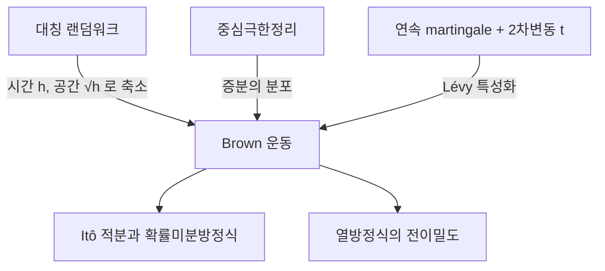

# Brown 운동

# 개요

Brown 운동은 연속시간 확률과정의 원형이다. 시작점이 원점이고, 겹치지 않는 시간 구간의 증분이 독립이며, 길이 `t−s` 인 구간의 증분이 평균 0 분산 `t−s` 인 정규분포를 따르고, 경로가 연속인 과정으로 정의된다.

이 정의가 자연스러운 이유는 두 방향에서 나온다. 하나는 [중심극한정리](central-limit-theorem.md)다. 작은 독립 충격을 아주 많이 더하면 그 합은 분포에서 정규분포로 가고, 시간 눈금을 공간 눈금의 제곱으로 줄여 가며 랜덤워크의 극한을 취하면 정확히 Brown 운동이 나온다. 다른 하나는 [martingale](martingales.md) 구조다. Brown 운동은 연속경로를 가진 martingale 이고, 2차변동이 `t` 인 연속 martingale 은 Brown 운동밖에 없다. 이산시간에서 배운 선택적 정지, 최대부등식, 수렴 정리가 이 과정 위에서 그대로 쓰인다.

# 직관

## 랜덤워크를 줄여 나가기

시간 간격 $h$ 마다 $\pm\sqrt{h}$ 만큼 움직이는 대칭 랜덤워크를 생각하자. 시각 $t$ 까지의 위치는 약 $t/h$ 번의 독립 걸음의 합이므로 분산이 $(t/h) \cdot h = t$ 로 $h$ 와 무관하다. 걸음 크기를 $h$ 가 아니라 $\sqrt{h}$ 로 잡는 이 선택이 핵심이고, 중심극한정리에 의해 극한 분포는 $N(0, t)$ 가 된다. 이 극한이 분포 수준이 아니라 경로 수준에서도 존재한다는 것이 Donsker 불변원리다.

여기서 눈금의 비대칭이 생긴다. 시간을 $c$ 배 늘리면 공간은 $\sqrt{c}$ 배 늘어난다. 그래서 확대해서 보아도 같은 그림이 나오고(자기유사성), 아주 짧은 시간에도 거리는 시간의 제곱근만큼 움직여 속도가 무한대로 발산한다. 경로가 연속이면서 어디서도 미분 불가능한 이유가 이것이다.

## 두 종류의 변동

구간을 잘게 쪼개 증분의 절댓값을 더하면(1차변동) $n$ 개 조각에서 각각 $1/\sqrt{n}$ 규모이므로 합이 $\sqrt{n}$ 으로 발산한다. 반면 증분의 제곱을 더하면(2차변동) 각 조각이 $1/n$ 규모여서 합이 유한한 값 $t$ 로 수렴한다.

$$
\sum_i\lvert B_{t_{i+1}}-B_{t_i}\rvert\to\infty,\qquad \sum_i(B_{t_{i+1}}-B_{t_i})^2\to t
$$

보통의 미적분은 1차변동이 유한한 곡선 위에서 만들어졌으므로 이 경로에는 쓸 수 없다. 대신 2차변동이 살아남기 때문에, 2차항을 버리지 않는 새 미적분이 필요해진다. Itô 적분이 그 답이다.



# 정의

## 표준 Brown 운동

확률공간 위의 과정 $(B_t)_{t \ge 0}$ 이 다음 네 조건을 만족하면 표준 Brown 운동이라 한다.

1. `B_0 = 0`.
2. 독립증분: $0 \le t_0 < \cdots < t_k$ 에 대해 $B_{t_1}-B_{t_0}, \dots, B_{t_k}-B_{t_{k-1}}$ 이 독립이다.
3. 정상 정규증분: `s < t` 이면 증분의 분포가 다음과 같다.

$$
B_t-B_s\sim N(0,\,t-s)
$$

4. 거의 모든 표본점에서 $t \mapsto B_t$ 가 연속이다.

유한차원 분포만으로는 3번까지가 정해지고, 4번을 만족하는 판본이 실제로 존재한다는 것은 따로 증명해야 한다. Kolmogorov 확장정리로 과정을 만든 뒤 연속 판본을 고르거나, 구간 `[0,1]` 위에서 Haar 기저에 독립 정규 계수를 붙여 급수로 직접 구성하는 Lévy–Ciesielski 방법을 쓴다. 후자는 균등수렴하는 급수를 주므로 연속성이 구성에서 바로 따라온다.

## 전이밀도

`B_t` 의 밀도는 열핵과 같다.

$$
p_t(x)=\frac{1}{\sqrt{2\pi t}}\exp\!\Big(-\frac{x^2}{2t}\Big)
$$

이 함수는 $\partial_t p = \tfrac12 \partial_x^2 p$ 를 만족한다. Brown 운동과 열방정식이 같은 대상의 두 얼굴이라는 사실이 여기서 시작된다.

# 성질

## martingale 구조

자연스러운 filtration 에 대해 다음 세 과정이 모두 martingale 이다.

$$
B_t,\qquad B_t^2-t,\qquad \exp\!\Big(\theta B_t-\frac{\theta^2t}{2}\Big)
$$

첫째는 독립증분과 평균 0 에서, 둘째는 증분의 분산이 `t−s` 라는 사실에서, 셋째는 정규분포의 적률생성함수에서 나온다. 둘째 것이 "2차변동이 `t`" 라는 진술의 martingale 판이고, 셋째 지수 martingale 은 측도변환과 큰 편차 계산의 출발점이다.

**Lévy 특성화.** 연속경로를 가진 국소 martingale `M` 이 `M_0 = 0` 이고 `M_t^2 − t` 도 martingale 이면 `M` 은 표준 Brown 운동이다. 즉 위 두 성질이 Brown 운동을 완전히 결정한다. 정규분포를 가정에 넣지 않았는데도 결론에서 나온다는 점이 이 정리의 힘이다.

## 강 Markov 성질과 반사원리

정지시간 $\tau$ 에 대해 $(B_{\tau+t} - B_\tau)_{t \ge 0}$ 은 다시 Brown 운동이고 $\tau$ 까지의 정보와 독립이다. 이 성질과 대칭성을 결합하면 최대값의 분포가 나온다. 수준 $a > 0$ 에 처음 닿는 시각 이후의 경로를 뒤집어도 같은 분포이므로 다음이 성립한다.

$$
P\Big(\max_{0\le s\le t}B_s\ge a\Big)=2\,P(B_t\ge a)
$$

따라서 최대값은 `|B_t|` 와 같은 분포를 가진다. 수준 `a` 의 도달시각 밀도, 원점 회귀 시각의 분포, 두 흡수벽 사이의 탈출 확률이 모두 이 한 줄에서 따라 나온다.

## 불변성

다음 변환들은 표준 Brown 운동을 표준 Brown 운동으로 보낸다.

| 변환 | 식 |
|---|---|
| 스케일링 | `c^{-1/2} B_{ct}` |
| 대칭 | `−B_t` |
| 시간반전 | `B_{T} − B_{T−t}` (구간 `[0,T]`) |
| 시간역전 | `t B_{1/t}` (단, `t = 0` 에서 0) |

스케일링 불변성이 자기유사성의 정확한 진술이고, 시간역전은 $t \to 0$ 근처의 국소적 성질을 $t \to \infty$ 의 대역적 성질로 바꿔 준다. 예를 들어 큰 수의 법칙 $B_t/t \to 0$ 을 시간역전하면 원점 근처에서 경로가 $t$ 보다 훨씬 크게 흔들린다는 사실이 되고, 이것이 미분 불가능성의 한 증명이 된다.

## 경로의 불규칙성

- 거의 확실히 모든 점에서 미분 불가능하다. 어떤 한 점을 지정해 보이는 것이 아니라 모든 점에서 동시에 성립한다.
- 임의의 $\alpha < 1/2$ 에 대해 $\alpha$-Hölder 연속이지만 $\alpha = 1/2$ 에서는 아니다.
- 영점의 집합은 측도 0 인 비가산 닫힌 집합이고 고립점이 없다. Cantor 집합과 같은 종류의 구조다.
- 반복로그 법칙은 원점 근처의 진동 폭을 정확히 준다.

$$
\limsup_{t\to0^+}\frac{B_t}{\sqrt{2t\log\log(1/t)}}=1
$$

## 시뮬레이션으로 확인

랜덤워크를 축소해 경로를 만들고, 1차변동이 발산하는 동안 2차변동이 1로 유지되는지, 그리고 최대값의 분포가 반사원리와 맞는지 확인한다.

```python
import math, random

rng = random.Random(0)

def walk(n):
    """[0,1]을 n등분하고 ±√(1/n) 걸음을 놓은 경로"""
    h, b, out = 1.0 / n, 0.0, [0.0]
    for _ in range(n):
        b += math.sqrt(h) * (1 if rng.random() < 0.5 else -1)
        out.append(b)
    return out

for n in (100, 10000, 100000):
    p = walk(n)
    qv = sum((p[i + 1] - p[i]) ** 2 for i in range(n))
    tv = sum(abs(p[i + 1] - p[i]) for i in range(n))
    print(f"n={n:6d}  2차변동={qv:.4f}  1차변동={tv:8.2f}")
# n=   100  2차변동=1.0000  1차변동=   10.00
# n= 10000  2차변동=1.0000  1차변동=  100.00
# n=100000  2차변동=1.0000  1차변동=  316.23

def max_of_path(n):
    h, b, m = 1.0 / n, 0.0, 0.0
    for _ in range(n):
        b += rng.gauss(0, math.sqrt(h))
        m = max(m, b)
    return m

a, trials = 1.0, 20000
hit = sum(1 for _ in range(trials) if max_of_path(2000) >= a)
theory = 2 * 0.5 * math.erfc(a / math.sqrt(2))
print(f"P(max>={a}): 시뮬 {hit/trials:.3f} / 이론 {theory:.3f}")
# P(max>=1.0): 시뮬 0.311 / 이론 0.317
```

$\pm\sqrt{h}$ 걸음에서는 증분의 제곱이 항상 $h$ 라서 2차변동이 정확히 1 이고, 1차변동은 $n \cdot \sqrt{1/n} = \sqrt{n}$ 으로 커진다. 두 변동의 운명이 갈리는 이유가 한눈에 보인다. 최대값 쪽 시뮬레이션 값이 이론값보다 조금 작은 것은 편향이며, 격자점만 보므로 두 관측 사이에서 수준을 넘었다 돌아온 경로를 놓치기 때문이다. 눈금을 더 잘게 하면 줄어든다.

# 활용

## 확률미분방정식

2차변동이 살아 있으므로 `dB_t` 에 대한 적분은 보통의 Riemann–Stieltjes 적분으로 정의되지 않는다. 대신 적분을 martingale 의 극한으로 정의하면 Itô 적분이 되고, 연쇄법칙에 2차항이 남는다.

$$
df(B_t)=f'(B_t)\,dB_t+\tfrac12 f''(B_t)\,dt
$$

이 보정항이 Itô 공식의 전부이며, 확산 과정, 금융의 옵션 가격 모형, 물리의 Langevin 방정식이 모두 이 위에 세워진다.

## 편미분방정식과의 다리

전이밀도가 열핵이라는 사실에서 나아가, 영역 `D` 에서 경계에 닿을 때까지 Brown 운동을 흘려 보내고 경계값의 기댓값을 취하면 Dirichlet 문제의 해가 된다. 조화함수의 평균값 성질이 확률 쪽에서는 정지된 과정이 martingale 이라는 진술이 되고, 퍼텐셜 이론과 확률론이 같은 언어를 쓰게 된다. [Random walk 와 전기 네트워크](random-walks.md)의 이산 그림을 연속으로 옮긴 것이 이 대응이다.

## 통계와 극한정리

경험분포함수를 $\sqrt{n}$ 배로 스케일링한 과정은 Brown 다리로 수렴하고, 그 최대값의 분포가 Kolmogorov–Smirnov 검정의 임계값을 준다. 단위근 검정, 변화점 탐지, 축차 검정의 극한분포도 대부분 Brown 운동의 범함수로 표현된다. Donsker 불변원리 덕분에 증분의 구체적 분포가 무엇이든 극한이 같아서, 한 번 계산한 표를 여러 상황에 쓸 수 있다.

# 연관 문서

## 선수지식

- [Martingale](martingales.md)
- [중심극한정리](central-limit-theorem.md)

## 더 알아보기

- [Itô 적분과 확률미분방정식](ito-calculus.md)

#probability #construction
