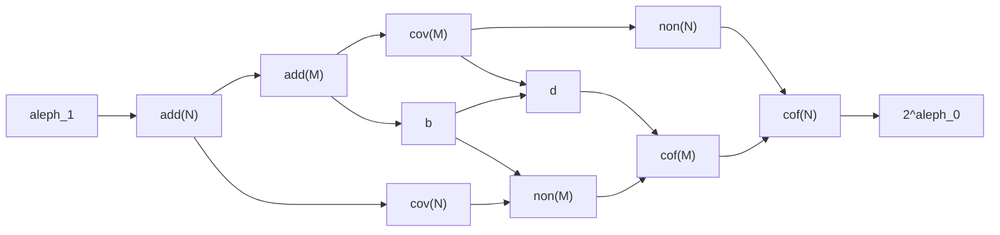

# 기수 불변량

# 개요

$\aleph_1$ 과 $2^{\aleph_0}$ 사이에 놓이는 기수들 가운데 측도와 범주에서 정의되는 것들이 있다. 이들 사이의 부등식 일부는 ZFC(Zermelo–Fraenkel set theory with choice) 에서 증명되고 나머지는 강제법으로 어느 쪽이든 만들 수 있다.

증명되는 부등식을 모아 그린 것이 Cichoń 도표다.

# 직관

실직선을 Lebesgue 영집합들의 합집합으로 덮는다. 영집합을 셀 수 있게 많이 모아 합쳐도 영집합이므로 실직선이 되지 않는다. 한 점씩 모으면 연속체만큼의 영집합으로 덮인다.

덮는 데 필요한 최소 개수는 $\aleph_1$ 이상이고 $2^{\aleph_0}$ 이하다. [연속체 가설](continuum-hypothesis.md) 아래서는 두 값이 같아 답이 정해지지만, 가설 없이는 이 최소 개수가 얼마인지 따로 물어야 한다.

같은 물음을 다르게 던질 수도 있다. 영집합이 아닌 집합 가운데 가장 작은 것의 크기는 얼마인가. 덮는 개수와 이 크기는 서로 다른 값이고 어느 쪽이 큰지도 정해져 있지 않다.

[제1범주 집합](baire-category.md)에 대해 같은 두 물음을 던지면 값이 둘 더 생긴다. 이렇게 얻은 기수들 사이의 대소 관계를 정하는 것이 문제다.

# 정의

## 아이디얼의 네 불변량

$\mathcal I$ 가 실직선의 부분집합이 이루는 $\sigma$ 아이디얼이고 실직선 자신을 담지 않을 때 네 기수를 정한다.

| 기호 | 뜻 |
| --- | --- |
| $\mathrm{add}(\mathcal I)$ | 합집합이 $\mathcal I$ 에 속하지 않는 $\mathcal I$ 의 최소 부분족 크기 |
| $\mathrm{cov}(\mathcal I)$ | 합집합이 실직선인 $\mathcal I$ 의 최소 부분족 크기 |
| $\mathrm{non}(\mathcal I)$ | $\mathcal I$ 에 속하지 않는 집합의 최소 크기 |
| $\mathrm{cof}(\mathcal I)$ | $\mathcal I$ 의 모든 원소를 담는 원소를 가진 최소 부분족 크기 |

영집합의 아이디얼을 $\mathcal N$, 제1범주 집합의 아이디얼을 $\mathcal M$ 으로 쓴다.

## 유계 수와 지배 수

$f,g\in\omega^{\omega}$ 에서 유한 개를 뺀 모든 $n$ 에 $f(n)\le g(n)$ 이면 $f\le^{\ast}g$ 로 쓴다. $\le^{\ast}$ 로 유계가 아닌 족의 최소 크기를 $\mathfrak b$, 모든 함수를 $\le^{\ast}$ 로 누르는 족의 최소 크기를 $\mathfrak d$ 라 한다.

# 성질

## Cichoń 도표

화살표는 ZFC 에서 증명되는 부등식이고 방향이 작은 쪽에서 큰 쪽이다.[^1]

여기에 두 등식이 더 성립한다.

$$
\mathrm{add}(\mathcal M)=\min(\mathfrak b,\mathrm{cov}(\mathcal M)),\qquad \mathrm{cof}(\mathcal M)=\max(\mathfrak d,\mathrm{non}(\mathcal M))
$$

## 정의에서 나오는 부등식

$\mathrm{add}(\mathcal I)\le\mathrm{cov}(\mathcal I)\le\mathrm{cof}(\mathcal I)$ 와 $\mathrm{add}(\mathcal I)\le\mathrm{non}(\mathcal I)\le\mathrm{cof}(\mathcal I)$ 는 정의를 견주면 나온다. 덮는 족은 $\mathcal I$ 에 속하지 않는 합집합을 주므로 $\mathrm{add}$ 의 후보이고, 공종족에서 덮는 족과 큰 집합을 뽑을 수 있다.

측도와 범주를 잇는 부등식은 다르다. 실직선을 영집합 하나와 제1범주 집합 하나의 합집합으로 쪼갤 수 있고, 이 분해에서 $\mathrm{cov}(\mathcal N)\le\mathrm{non}(\mathcal M)$ 과 $\mathrm{cov}(\mathcal M)\le\mathrm{non}(\mathcal N)$ 이 나온다.

## 무모순성 결과

$\mathrm{cov}(\mathcal N)$ 과 $\mathrm{non}(\mathcal N)$ 사이에는 도표의 화살표가 없고, 실제로 두 값의 대소가 ZFC 에서 정해지지 않는다. [무작위 실수 강제법](random-real-forcing.md)으로 실수를 $\aleph_2$ 개 더하면 $\mathrm{cov}(\mathcal N)=\aleph_2$ 이고 $\mathrm{non}(\mathcal N)=\aleph_1$ 이며, Cohen 실수를 같은 수만큼 더하면 두 값이 뒤바뀐다.

도표에 없는 다른 부등식들에도 같은 방식으로 양쪽 모형이 있다.

# 활용

- **강제법의 분류.** 어떤 강제법이 어느 불변량을 키우는지가 그 강제법의 성질을 요약한다. 무작위 실수는 $\mathrm{cov}(\mathcal N)$ 을, Cohen 실수는 $\mathrm{cov}(\mathcal M)$ 을 키운다.
- **Martin 공리.** [Martin 공리](martins-axiom.md)는 도표의 모든 불변량을 $2^{\aleph_0}$ 으로 만든다. 불변량 사이의 차이를 보려면 이 공리를 버려야 한다.
- **측도와 범주의 대응.** 두 아이디얼의 불변량이 도표에서 대칭인 자리에 놓이고, $\mathrm{cov}$ 와 $\mathrm{non}$ 이 서로 자리를 바꾼다. Erdős–Sierpiński 쌍대성이 이 대칭의 한 형태다.

[^1]: Tomek Bartoszyński, Haim Judah, *Set Theory: On the Structure of the Real Line*, A K Peters (1995). 도표의 모든 화살표와 두 등식의 증명, 각 화살표가 역으로 성립하지 않는 모형의 구성이 이 책에 있다.

# 연관 문서

## 선수지식

- [무작위 실수 강제법](random-real-forcing.md)

## 더 알아보기

- [Erdős–Sierpiński 쌍대성](erdos-sierpinski-duality.md)

#set_theory #measure_theory #logic
