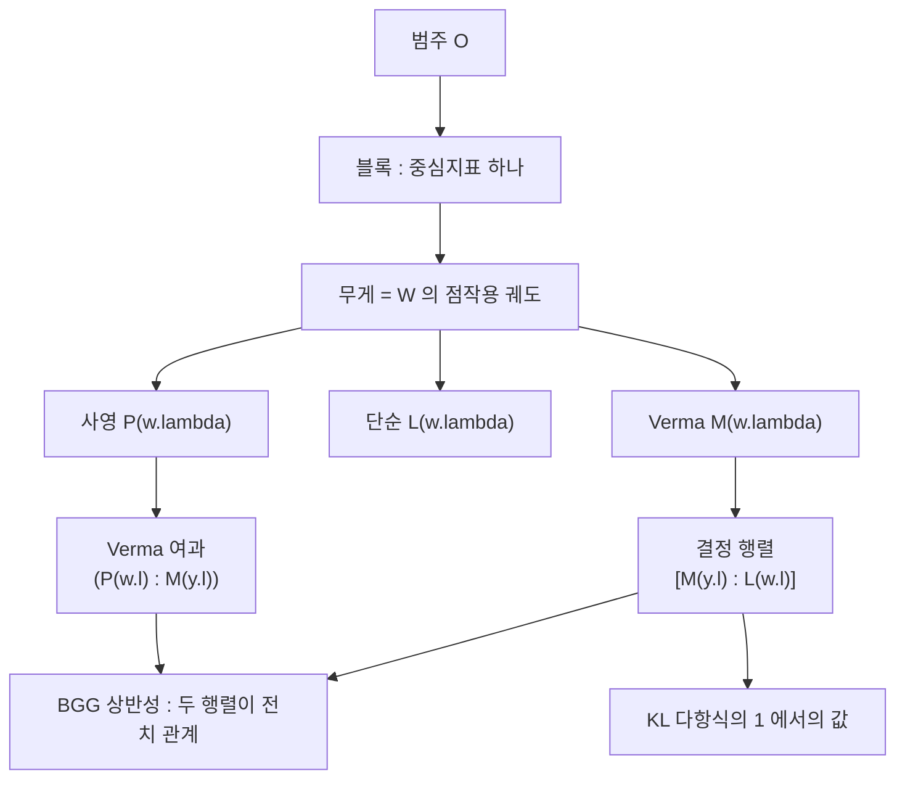

# 범주 O 와 BGG 상반성

# 개요

범주 $\mathcal O$ 는 반단순 [Lie 대수](lie-algebras.md)의 가군 가운데 무게 분해가 되고 무게 공간이 유한차원이며 Borel 부분대수의 작용이 국소적으로 유한한 것들의 범주다. Bernstein–Gelfand–Gelfand 가 1976 년에 정의했다.[^1]

유한차원 표현은 완전가약이라 분류가 최고무게 하나로 끝나지만 제한 없는 $\mathfrak g$ 가군의 범주는 거칠다. 위 세 조건이 그 중간 지대를 잘라낸다.

- 대상의 길이가 유한하므로 Jordan–Hölder 중복도를 말할 수 있다.
- 단순 대상 $L(\lambda)$ 가 최고무게 $\lambda$ 로 남김없이 분류된다.
- 사영 대상이 충분히 많고, 모든 사영 대상이 Verma 가군의 여과를 갖는다.

사영가군의 Verma 여과 중복도와 Verma 가군의 조성 중복도가 같다.

$$
\bigl(P(\lambda):M(\mu)\bigr)=\bigl[M(\mu):L(\lambda)\bigr]
$$

이것이 **BGG 상반성**이다. 좌변은 사영분해 쪽 자료이고 우변은 조성열 쪽 자료인데 두 계산이 같은 수를 주고, 그 결과 Cartan 행렬이 대칭이 된다.

우변의 계산은 [Kazhdan–Lusztig 다항식](kazhdan-lusztig.md)이 답한다. $\bigl[M(y\cdot\lambda):L(w\cdot\lambda)\bigr]=P_{w_0y,\thinspace w_0w}(1)$ 이라는 KL 추측을 Beilinson–Bernstein 과 Brylinski–Kashiwara 가 증명했고, 범주 $\mathcal O$ 가 KL 다항식이 표현론적 의미를 얻는 무대가 된다.

# 직관

## Verma 가군의 역할

최고무게 $\lambda$ 를 가진 가군 중 가장 큰 것을 Borel $\mathfrak b$ 의 1 차원 표현 $\mathbb C_\lambda$ 에서 유도한다.

$$
M(\lambda)=U(\mathfrak g)\otimes_{U(\mathfrak b)}\mathbb C_\lambda
$$

Poincaré–Birkhoff–Witt 에 의해 $M(\lambda)$ 는 음근 벡터들의 단항식을 기저로 갖는 자유 가군이고 무게 중복도는 Kostant 분할함수가 준다. 최고무게 $\lambda$ 의 가군은 모두 $M(\lambda)$ 의 몫이므로 $M(\lambda)$ 는 유일한 극대 부분가군을 갖고 그 몫이 단순가군 $L(\lambda)$ 다.

$\mathrm{ch}\thinspace M(\lambda)$ 는 Weyl 분모로 나눈 지수 하나로 닫힌 꼴이다. $\mathrm{ch}\thinspace L(\lambda)$ 를 Verma 지표의 정수결합으로 쓰면 단순가군의 지표를 안 것이 되고, 중복도 $[M(\mu):L(\lambda)]$ 가 그 결합계수다.

## 블록 분해

중심 $Z(\mathfrak g)$ 가 각 대상에 작용하므로 범주가 중심지표에 따라 갈라진다. Harish-Chandra 동형이 그 지표를 무게의 점작용 궤도로 번역한다.

$$
w\cdot\lambda=w(\lambda+\rho)-\rho
$$

같은 궤도의 무게들만 서로 얽힌다. 범주 $\mathcal O$ 는 블록의 직합으로 분해되고, 정수 정칙 무게의 블록은 Weyl 군 $W$ 와 크기가 같은 유한 집합 $\lbrace w\cdot\lambda\rbrace_{w\in W}$ 위에 놓인다. 무한차원 가군의 범주를 다루는 문제가 유한군 $W$ 위의 조합 문제로 축소된다.

## $\mathfrak{sl}_2$ 의 블록

$\lambda=0$ 의 블록에는 무게가 둘 있다. $e\cdot0=0$ 과 $s\cdot0=-2$ 다.

- $M(0)$ 은 길이 $2$ 이고 $L(0)$ 과 $L(-2)$ 를 조성인자로 갖는다.
- $M(-2)$ 는 이미 단순해 $M(-2)=L(-2)$ 다.
- $P(0)=M(0)$ 이고 Verma 여과 길이는 $1$ 이다.
- $P(-2)$ 는 길이 $2$ 의 Verma 여과를 갖는다. $M(-2)$ 와 $M(0)$ 이 한 번씩 들어가고 조성인자로 $L(-2)$ 가 두 번, $L(0)$ 이 한 번 나온다.

$\bigl(P(-2):M(0)\bigr)=1$ 이고 $\bigl[M(0):L(-2)\bigr]=1$ 로 상반성이 성립한다.

$\mathrm{ch}\thinspace L(0)=\mathrm{ch}\thinspace M(0)-\mathrm{ch}\thinspace M(-2)$ 도 여기서 읽힌다. 유한차원 가군의 지표를 Verma 지표의 교대합으로 쓰는 이 식이 일반 $\mathfrak g$ 에서 Weyl 지표 공식이다. Weyl 공식은 최고무게가 지배적일 때의 특수한 경우이고, 일반 $\lambda$ 에서 교대합의 계수를 KL 다항식이 준다.

# 정의

## 범주 $\mathcal O$

$\mathfrak g$ 를 복소 반단순 Lie 대수, $\mathfrak h\subset\mathfrak b\subset\mathfrak g$ 를 Cartan 과 Borel 이라 하자. $\mathcal O$ 의 대상은 다음 셋을 만족하는 $U(\mathfrak g)$ 가군 $M$ 이다.

1. $M$ 은 유한생성이다.
2. $M=\bigoplus_{\mu\in\mathfrak h^\ast}M_\mu$ 로 $\mathfrak h$ 무게 분해가 되고 각 $M_\mu$ 는 유한차원이다.
3. 모든 $v\in M$ 에 대해 $U(\mathfrak n^+)v$ 가 유한차원이다.

$\mathcal O$ 는 아벨 범주이고 부분가군과 몫가군과 유한 직합에 닫혀 있으며 모든 대상이 유한 길이다.

## Verma 와 단순가군

$$
M(\lambda)=U(\mathfrak g)\otimes_{U(\mathfrak b)}\mathbb C_\lambda,\qquad
L(\lambda)=M(\lambda)/\mathrm{rad}\thinspace M(\lambda)
$$

$\lbrace L(\lambda)\rbrace_{\lambda\in\mathfrak h^\ast}$ 가 $\mathcal O$ 의 단순 대상 전부이고 서로 동형이 아니다. $L(\lambda)$ 가 유한차원일 필요충분조건은 $\lambda$ 가 지배적 정수무게인 것이다.

## 블록 분해

Harish-Chandra 동형 $Z(\mathfrak g)\cong S(\mathfrak h)^{W\cdot}$ 로 중심지표 $\chi_\lambda$ 가 정해지고 $\chi_\lambda=\chi_\mu$ 는 $\mu\in W\cdot\lambda$ 와 동치다. 따라서

$$
\mathcal O=\bigoplus_{\chi}\mathcal O_\chi
$$

이고 정수 정칙 $\lambda$ 의 블록 $\mathcal O_\lambda$ 는 $|W|$ 개의 단순 대상을 갖는다.

## 사영 대상과 BGG 상반성

$\mathcal O$ 는 사영 대상을 충분히 갖는다. $L(\lambda)$ 의 사영 덮개를 $P(\lambda)$ 라 쓴다.

**정리(BGG).** 모든 $P(\lambda)$ 는 Verma 가군에 의한 여과를 갖고, 그 중복도는 무게 순서에 의존하지 않으며

$$
\bigl(P(\lambda):M(\mu)\bigr)=\bigl[M(\mu):L(\lambda)\bigr]
$$

가 성립한다. 여과의 맨 아래 항은 $M(\lambda)$ 이고 중복도 $1$ 이다.

결정 행렬 $D_{\mu\lambda}=[M(\mu):L(\lambda)]$ 와 Verma 여과 행렬 $V_{\lambda\mu}=(P(\lambda):M(\mu))$ 에 대해 $V=D^{\mathsf T}$ 이고, Cartan 행렬은

$$
C_{\lambda\nu}=\bigl[P(\lambda):L(\nu)\bigr]=\bigl(D^{\mathsf T}D\bigr)_{\lambda\nu}
$$

이라 대칭이다. 유한차원 대수에서 이런 성질을 갖는 것을 준유전 대수 또는 최고무게 범주라 하고 범주 $\mathcal O$ 의 블록이 그 원형이다.

## KL 추측

정수 정칙 블록에서 $\lambda$ 를 반지배적으로 잡고 $w_0$ 를 최장원이라 하자.

$$
\bigl[M(y\cdot\lambda):L(w\cdot\lambda)\bigr]=P_{w_0y,\thinspace w_0w}(1),
\qquad
\mathrm{ch}\thinspace L(w\cdot\lambda)=\sum_{y\ge w}(-1)^{\ell(y)-\ell(w)}P_{w_0y,\thinspace w_0w}(1)\thinspace\mathrm{ch}\thinspace M(y\cdot\lambda)
$$

Beilinson–Bernstein 과 Brylinski–Kashiwara 가 깃발다양체 위의 $D$ 가군으로 증명했다. 중복도가 교차 코호몰로지 층의 줄기 차원으로 계산되므로 양수성이 따라온다.

# 성질

## 작은 랭크의 경우

$A_1$ 과 $A_2$ 에서는 모든 KL 다항식이 $1$ 이라 중복도가 Bruhat 순서의 지시함수가 된다.

$$
\bigl[M(y\cdot\lambda):L(w\cdot\lambda)\bigr]=\begin{cases}1,&y\le w\cr 0,&\text{그 외}\end{cases}
$$

$A_3$ 부터 $1$ 이 아닌 KL 다항식이 나타나고 중복도가 $2$ 이상인 자리가 생긴다. 상반성과 Cartan 대칭성은 KL 다항식의 값과 무관하게 성립한다.

## 구조 정리

- **BGG 분해.** 유한차원 $L(\lambda)$ 의 Verma 분해가 존재한다. Weyl 지표 공식의 가군 수준 판본이다.
- **Verma 사이의 사상.** $\mathrm{Hom}(M(\mu),M(\lambda))$ 는 $0$ 또는 $1$ 차원이고, $0$ 이 아닐 필요충분조건이 $\mu\uparrow\lambda$ 이다. 사상이 있으면 항상 단사다.
- **Jantzen 여과.** $M(\lambda)$ 에 자연스러운 감소 여과가 있고 그 지표의 합이 닫힌 꼴이다. 단순성 판정과 중복도 계산의 도구다.
- **번역 함자.** 무게를 벽 쪽으로 밀고 당기는 함자들이 블록 사이의 동치와 벽 넘기 함자를 준다. 서로 다른 정칙 블록은 모두 동치다.
- **Koszul 쌍대성.** 정칙 블록의 대수는 Koszul 이고 그 Koszul 쌍대가 특이 블록 쪽과 맞물린다. KL 다항식의 계수가 등급 중복도로 해석되는 자리다.

## 국소화와 범주화

- **Beilinson–Bernstein 국소화.** $\mathcal O$ 의 블록이 깃발다양체 위 $D$ 가군의 범주와 동치이며, KL 추측의 증명이 이 동치를 타고 위상수학으로 건너간다.
- **범주화.** $\mathcal O$ 의 사영가군과 번역 함자가 Hecke 대수의 작용을 실현하고, 이것이 Soergel 쌍가군 연구의 출발점이 되었다.
- **아핀과 모듈러 판본.** 아핀 Lie 대수의 범주 $\mathcal O$ 는 정점작용소대수와 등각장론에 닿고, 양의 표수에서는 Lusztig 추측과 그 반례 이후의 $p$ KL 다항식으로 이어진다.

# 활용

## 결정 행렬에서 Cartan 행렬로

$A_1$ 과 $A_2$ 의 정수 정칙 블록에서 결정 행렬을 Bruhat 순서로 적고, BGG 상반성으로 Verma 여과 행렬을 만든 뒤 곱해 Cartan 행렬을 얻는다.

왼쪽 위 $C_{e,e}=1$ 은 $P(e\cdot\lambda)=M(e\cdot\lambda)=L(e\cdot\lambda)$ 라는 뜻이다. $e\cdot\lambda$ 는 Bruhat 순서의 맨 아래라 Verma 가 이미 단순하며 동시에 사영이다.

오른쪽 아래 $C_{w_0,w_0}=|W|$ 는 큰 사영가군의 크기다. $P(w_0\cdot\lambda)$ 는 모든 Verma 가군을 한 번씩 여과로 갖고 $L(w_0\cdot\lambda)$ 를 $|W|$ 번 포함한다. $\mathfrak{sl}_2$ 에서 $P(-2)$ 가 $L(-2)$ 를 두 번 갖던 것의 일반형이며, 이 대상이 블록의 사영생성원이자 단사 대상이다.

첫 행이 전부 $1$ 인 것은 $M(e\cdot\lambda)$ 가 블록의 모든 단순가군을 한 번씩 포함한다는 뜻이다.

$A_3$ 부터는 이 표를 Bruhat 순서만으로 채울 수 없다. 어떤 자리에서 KL 다항식 $P_{x,y}(q)$ 가 $1+q$ 가 되고 중복도가 $2$ 로 뛴다.

## 쓰이는 자리

- **지표 계산.** 무한차원 최고무게 가군의 지표를 Verma 지표의 정수결합으로 얻는 표준 절차이며, Weyl 지표 공식이 특수한 경우다.
- **Hecke 대수의 범주화.** 번역 함자와 사영가군이 Hecke 대수를 실현하므로 조합적 항등식이 함자 사이의 동형으로 올라간다.
- **기하적 표현론의 시험장.** 국소화 정리, 교차 코호몰로지, Koszul 쌍대성이 이 범주에서 먼저 확인되고 다른 곳으로 옮겨진다.
- **다른 범주의 본보기.** 최고무게 범주라는 개념이 $\mathcal O$ 를 추상화한 것이고, 대수군의 유리 표현이나 양자군의 표현이 같은 틀로 다루어진다.

[^1]: I. N. Bernstein, I. M. Gelfand, S. I. Gelfand, *A certain category of g-modules*, Funkcional. Anal. i Priložen. **10** (1976), 1–8. 범주의 정의, 사영 대상의 존재, 상반성.

[^2]: J. E. Humphreys, *Representations of Semisimple Lie Algebras in the BGG Category O*, GSM 94, AMS (2008). 이 문서의 정의와 정리 진술은 이 책의 1–8 장을 따른다.

[^3]: A. Beilinson, J. Bernstein, *Localisation de g-modules*, C. R. Acad. Sci. Paris **292** (1981), 15–18; J.-L. Brylinski, M. Kashiwara, *Kazhdan–Lusztig conjecture and holonomic systems*, Invent. Math. **64** (1981), 387–410. KL 추측의 증명.

# 연관 문서

## 선수지식

- [Kazhdan–Lusztig 다항식](kazhdan-lusztig.md)
- [Lie 대수](lie-algebras.md)

## 더 알아보기

아직 연결한 문서가 없다.

#algebra #group_theory #category_theory #combinatorics
