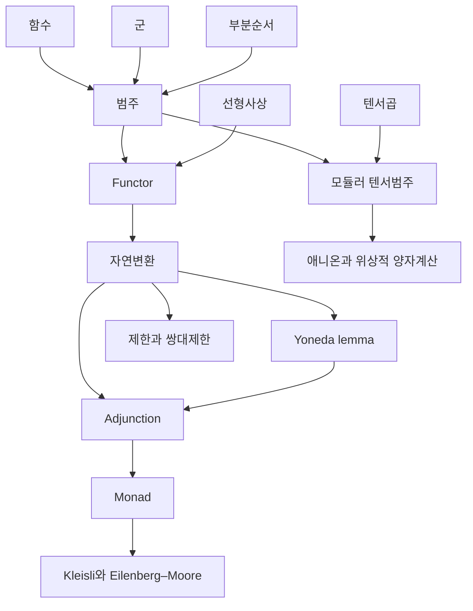

# 범주론 개관

# 개요

범주론은 대상의 내부가 아니라 대상 사이의 사상으로 구조를 기술한다. 물음은 "이 구성이 어떤 보편성질로 결정되는가" 이고, 답은 대개 표현 가능 함자나 adjunction 으로 온다. 같은 구성을 여러 분야에서 따로 발견하는 일이 보편성질 하나로 설명된다.

이 지도의 범주론 문서는 네 줄기다. 범주와 함자의 기본 언어, Yoneda lemma 에서 adjunction 으로 가는 보편성질, monad 와 그 대수, 그리고 텐서범주에서 위상적 양자계산으로 이어지는 응용이다. 호몰로지 대수 쪽 응용은 [de Rham 코호몰로지](de-rham-cohomology.md)와 [대수적 K 이론](algebraic-k-theory.md)에, 프로그래밍 언어와의 대응은 [Curry–Howard 대응](curry-howard.md)에 있다.

시작은 [범주](category.md)다. 거기서 [Functor](functors.md)와 [자연변환](natural-transformations.md)이 언어를 세우고, [Yoneda lemma](yoneda-lemma.md)가 대상을 사상으로 바꿔 읽는 원리를 준다.

# 지도

# 갈래

## 기본 언어

- [범주](category.md): 대상과 사상, 합성과 항등
- [Functor](functors.md): 범주 사이의 구조 보존 사상
- [자연변환](natural-transformations.md): 함자 사이의 사상, 함자 범주

## 보편성질

- [Yoneda lemma](yoneda-lemma.md): 대상이 그것이 받는 사상 전체로 결정된다
- [제한과 쌍대제한](limits-colimits.md): 곱, 당김, 쌍대곱을 하나의 보편성질로
- [Adjunction](adjunctions.md): 자유 구성과 망각 함자의 쌍, 단위와 쌍대단위

## Monad 와 대수

- [Monad](monads.md): adjunction 이 남기는 자기함자와 두 자연변환
- [Kleisli 범주와 Eilenberg–Moore 범주](kleisli-eilenberg-moore.md): monad 를 다시 adjunction 으로 분해하는 두 방법

## 텐서범주와 응용

- [모듈러 텐서범주와 3 차원 TQFT](modular-tensor-categories.md): 짜임과 모듈러 $S$ 행렬을 가진 범주
- [애니온과 위상적 양자계산](anyons.md): 준입자의 교환 통계가 범주의 짜임으로 기술된다

# 빈자리

- 아벨 범주와 유도 함자: 완전열, 사영·단사 분해, Ext 와 Tor. 호몰로지 대수의 기반인데 문서가 없다.
- 표현 가능 함자와 보편원소: [Yoneda lemma](yoneda-lemma.md)의 따름정리인 이 개념이 따로 없다.
- 모노이드 범주와 연접 정리: [모듈러 텐서범주](modular-tensor-categories.md)가 전제하는 층위.
- Topos 와 내부 논리: [직관주의](intuitionism.md)의 의미론이 되는 범주.
- 무한 범주와 호모토피 이론: 사상 사이의 사상까지 가진 고차 구조.
- 범주의 극한 계산 예: 당김과 밀어냄을 집합, 군, 위상공간에서 실제로 계산하는 문서.

# 연관 문서

## 선수지식

- [집합](sets.md)

## 더 알아보기

- [범주](category.md)
- [모듈러 텐서범주와 3 차원 TQFT](modular-tensor-categories.md)

#category_theory #algebra #overview
