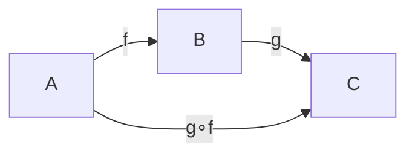

# 범주

# 개요

범주는 대상들과 그 사이의 사상들, 그리고 사상을 잇는 합성으로 이루어진 구조다. 요구하는 것은 합성이 결합적일 것과 각 대상에 항등사상이 있을 것뿐이다.

이 데이터만으로 대상의 내부 대신 대상들 사이를 오가는 사상만 보게 된다. 집합의 원소, 군의 원소, 공간의 점을 언급하지 않고 곱, 몫, 자유 구성, 동형을 정의할 수 있고, 그렇게 정의하면 분야를 옮겨도 같은 문장이 통한다. [함수](functions.md)의 합성, [부분순서](partial-orders.md)의 추이성, [군](groups.md)의 곱이 같은 공리를 만족한다.

# 직관

## 원소 없는 정의

집합에서 원소를 지우면 함수들과 그 합성만 남는다. 한원소집합에서 $A$ 로 가는 함수가 $A$ 의 원소와 일대일 대응하므로 원소도 사상으로 되살릴 수 있다. 이 전략이 통하는 곳에서는 증명이 대상의 종류에 의존하지 않아, 한 번 증명한 것을 집합, 군, 공간, 명제에 동시에 쓴다.

## 동형과 범주의 선택

범주론은 두 대상이 같은지 대신 동형인지를 묻고, 동형 여부는 어떤 사상을 허용하느냐에 달렸다. 같은 두 집합이라도 모든 함수를 허용하면 크기만 같으면 동형이고, 연속함수만 허용하면 위상까지 같아야 하며, 선형사상만 허용하면 차원이 같아야 한다.

# 정의

## 공리

범주 $C$ 는 대상들의 모임과 각 대상 쌍 $(A, B)$ 에 대한 사상들의 모임 $\mathrm{Hom}(A, B)$ 와 합성 $\mathrm{Hom}(B,C) \times \mathrm{Hom}(A,B) \to \mathrm{Hom}(A,C)$ 와 각 대상의 항등사상으로 이루어지고 다음을 만족한다.

$$
h\circ(g\circ f)=(h\circ g)\circ f,\qquad f\circ\mathrm{id}\_A=f=\mathrm{id}\_B\circ f
$$

각 $\mathrm{Hom}(A, B)$ 가 집합이면 **국소적으로 작은 범주**, 대상 전체까지 집합이면 **작은 범주**다. 모든 집합의 범주는 작지 않지만 국소적으로 작다. 사상이 반드시 함수일 필요는 없으며, 무엇을 대상으로 삼고 무엇을 합성으로 삼는지가 범주의 데이터 전부다.

## 예

| 범주 | 대상 | 사상 |
|---|---|---|
| $\mathbf{Set}$ | 집합 | 함수 |
| $\mathbf{Grp},\ \mathbf{Vect},\ \mathbf{Top}$ | 군, 벡터 공간, 위상공간 | 준동형, 선형사상, 연속함수 |
| 부분순서 집합 | 원소 | $A \le B$ 일 때 사상 하나 |
| 군 | 대상 하나 | 군의 원소, 합성은 군의 곱 |
| $C^{\mathrm{op}}$ | $C$ 의 대상 | $C$ 의 사상을 뒤집은 것 |

부분순서에서는 두 대상 사이 사상이 많아야 하나라서 결합법칙이 자동이고, 반사성이 항등사상을 추이성이 합성을 준다. 군을 대상 하나짜리 범주로 보면 모든 사상이 가역인 범주가 군이다. 반대 범주 $C^{\mathrm{op}}$ 는 모든 정의를 쌍대로 뒤집는 장치이며, 곱과 합, 시작대상과 종단대상이 그렇게 짝을 이룬다.

## 사상으로 정의되는 개념

- **동형사상.** $g \circ f = \mathrm{id}\_A$ 와 $f \circ g = \mathrm{id}\_B$ 를 만족하는 $g$ 가 있는 $f$ 다.
- **단사사상(mono).** $f \circ g = f \circ h \Rightarrow g = h$ 가 성립한다.
- **전사사상(epi).** $g \circ f = h \circ f \Rightarrow g = h$ 가 성립한다.
- **시작대상.** 모든 대상으로 가는 사상이 정확히 하나인 대상. 종단대상은 화살표를 뒤집은 것이다.

$\mathbf{Set}$ 에서 mono 는 단사함수, epi 는 전사함수와 일치하지만 모든 범주에서 그렇지는 않다. 가환환의 범주에서 정수환에서 유리수체로 가는 포함사상은 전사가 아닌데도 epi 다.

# 성질

## 가환 그림

여러 사상 사이의 등식을 그림으로 그리고 어느 경로를 따라가도 같다고 말하는 것이 가환 그림이다. 등식을 나열하는 대신 그림을 그리면 어떤 경로가 존재하는지, 무엇을 채우면 증명이 끝나는지가 드러난다.

## 보편성질

어떤 대상을 그 성질을 만족하는 것들 가운데 유일하게 경유되는 것으로 규정하는 방식이 **보편성질**이다. 시작대상과 종단대상이 가장 단순한 형태이고 곱, 몫, 자유 구성이 이 틀로 정의된다.

보편성질로 정의된 대상은 존재하면 동형을 무시하고 유일하다. 두 대상 사이에 양방향 사상이 유일하게 존재하고 그 합성이 유일성 때문에 항등사상이 된다.

## 크기 문제

모든 집합의 집합이 존재할 수 없듯이 큰 범주를 다룰 때는 크기에 주의해야 한다. 국소적으로 작음을 요구하거나 Grothendieck 우주를 도입하는 것이 표준 처방이며, [ZFC 공리계](zfc-axioms.md)(Zermelo–Fraenkel 집합론에 선택공리를 더한 것)에서 제한한 것과 같은 종류의 문제다.

# 활용

## 분야 사이의 번역

집합, 군, 공간, 명제마다 따로 적었던 구성이 같은 보편성질을 만족하는지 비교할 수 있다. 곱집합, 직접곱, 곱공간, 논리곱이 하나의 정의에서 나오므로 각각에 대해 따로 증명하던 성질이 한 번에 정리된다.

## 함자와 수반

두 범주 사이의 대응인 [함자](functors.md), 함자 사이의 비교인 자연변환, 최적 근사 관계인 수반이 범주의 공리 위에서 정의된다. 대수적 위상수학은 공간을 대수적 대상으로 옮길 때 함자를 쓰고, 프로그래밍 언어의 타입 이론은 계산의 효과를 monad 로 쓴다.[^1]

[^1]: Emily Riehl, *Category Theory in Context*, Chapter 1. 범주·사상·동형과 구체적 예시. https://math.jhu.edu/~eriehl/context/

# 연관 문서

## 선수지식

- [부분순서](partial-orders.md)
- [군](groups.md)
- [범주론 개관](category-theory-overview.md)

## 더 알아보기

- [함자](functors.md)
- [구조적 집합론과 동형 불변성](structural-set-theory.md)
- [기하학적 Satake 대응](geometric-satake.md)
- [모듈러 텐서범주와 3 차원 TQFT](modular-tensor-categories.md)

#category_theory #algebra #topology #logic
