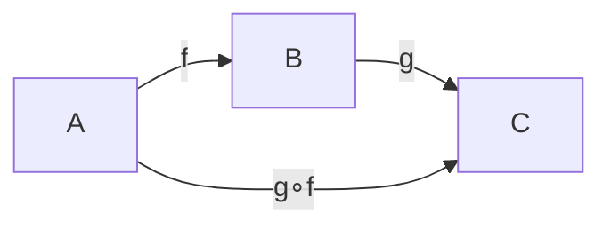

# 범주

# 개요

범주는 대상들과 그 사이의 사상들, 그리고 사상을 잇는 합성으로 이루어진 구조다. 요구하는 것은 두 가지뿐이다. 합성이 결합적일 것, 그리고 각 대상에 항등사상이 있을 것.

이 최소한의 데이터가 쓸모 있는 이유는 관점의 전환에 있다. 대상의 내부를 들여다보는 대신 대상들 사이를 오가는 사상만 본다. 집합의 원소, 군의 원소, 공간의 점을 언급하지 않고도 곱, 몫, 자유 구성, 동형 같은 개념을 정의할 수 있고, 그렇게 정의하면 분야를 옮겨도 같은 문장이 그대로 통한다. [함수](functions.md)의 합성, [부분순서](partial-orders.md)의 추이성, [군](groups.md)의 곱이 모두 같은 공리를 만족한다는 관찰이 그 출발점이다.

# 직관

## 원소를 지우고 화살표만 남기기

집합에서 "원소" 를 지워 보자. 남는 것은 함수들과 그 합성뿐이다. 놀랍게도 잃는 것이 별로 없다. 한원소집합에서 `A` 로 가는 함수가 `A` 의 원소와 일대일 대응하므로 원소조차 사상으로 되살릴 수 있다. 이 전략이 통하는 곳에서는 증명이 대상의 종류에 의존하지 않게 되고, 한 번 증명한 것을 집합·군·공간·명제에 동시에 쓸 수 있다.

## 같음이 아니라 동형

범주론은 "두 대상이 같다" 를 거의 묻지 않고 "동형인가" 를 묻는다. 그리고 동형인지는 어떤 사상을 허용하느냐에 달려 있다. 같은 두 집합이라도 모든 함수를 허용하면 크기만 같으면 동형이고, 연속함수만 허용하면 위상까지 같아야 하며, 선형사상만 허용하면 차원이 같아야 한다. 범주를 지정하지 않고 동형을 묻는 것은 질문이 덜 된 상태다.



# 정의

## 공리

범주 `C` 는 대상들의 모임, 각 대상 쌍 `(A, B)` 에 대한 사상들의 모임 `Hom(A, B)`, 합성 `Hom(B,C) × Hom(A,B) → Hom(A,C)`, 그리고 각 대상의 항등사상으로 이루어지고 다음을 만족한다.

$$
h\circ(g\circ f)=(h\circ g)\circ f,\qquad f\circ\mathrm{id}_A=f=\mathrm{id}_B\circ f
$$

각 `Hom(A, B)` 가 집합이면 국소적으로 작은 범주, 대상 전체까지 집합이면 작은 범주라 한다. 모든 집합의 범주는 작지 않지만 국소적으로 작고, 공리는 그대로 성립한다. 사상이 반드시 함수일 필요는 없다는 점이 중요하다. 무엇을 대상으로 삼고 무엇을 합성으로 삼는지가 범주의 데이터 전부다.

## 예

| 범주 | 대상 | 사상 |
|---|---|---|
| `Set` | 집합 | 함수 |
| `Grp`, `Vect`, `Top` | 군, 벡터 공간, 위상공간 | 준동형, 선형사상, 연속함수 |
| 부분순서 집합 | 원소 | `A ≤ B` 일 때 사상 하나 |
| 군 | 대상 하나 | 군의 원소, 합성은 군의 곱 |
| `C^op` | `C` 의 대상 | `C` 의 사상을 뒤집은 것 |

부분순서에서는 두 대상 사이 사상이 많아야 하나라서 결합법칙이 자동이고, 반사성이 항등사상을, 추이성이 합성을 준다. 군을 대상 하나짜리 범주로 보면 "모든 사상이 가역인 범주" 가 군이라는 정의가 된다. 반대 범주 `C^op` 를 만드는 조작은 모든 정의를 쌍대로 뒤집는 장치이며, 곱과 합, 시작대상과 종단대상이 그렇게 짝을 이룬다.

## 사상으로 정의되는 개념

- **동형사상.** `g∘f = id_A`, `f∘g = id_B` 인 `g` 가 있는 `f`.
- **단사사상(mono).** `f∘g = f∘h ⇒ g = h`. 왼쪽에서 소거할 수 있다는 뜻이다.
- **전사사상(epi).** `g∘f = h∘f ⇒ g = h`.
- **시작대상.** 모든 대상으로 가는 사상이 정확히 하나인 대상. 종단대상은 화살표를 뒤집은 것이다.

`Set` 에서 mono 는 단사함수, epi 는 전사함수와 일치하지만 모든 범주에서 그런 것은 아니다. 가환환의 범주에서 정수환에서 유리수체로 가는 포함사상은 전사가 아닌데도 epi 다.

# 성질

## 가환 그림이 증명이 된다

여러 사상 사이의 등식을 그림으로 그리고 "어느 경로를 따라가도 같다" 고 말하는 것이 가환 그림이다. 등식을 나열하는 대신 그림을 그리면 어떤 경로가 존재하는지, 무엇을 채우면 증명이 끝나는지가 눈에 보인다. 범주론의 증명이 그림 추적으로 진행되는 이유다.

## 보편성질

어떤 대상을 "그 성질을 만족하는 것들 가운데 유일하게 경유되는 것" 으로 규정하는 방식이 보편성질이다. 시작대상과 종단대상이 가장 단순한 형태이고, 곱·몫·자유 구성이 모두 이 틀로 정의된다. 보편성질로 정의된 대상은 존재하면 동형을 무시하고 유일하다. 두 대상 사이에 양방향 사상이 유일하게 존재하고 그 합성이 유일성 때문에 항등사상이 되기 때문이다.

## 크기 문제

"모든 집합의 집합" 이 존재할 수 없듯이 큰 범주를 다룰 때는 크기에 주의해야 한다. 국소적으로 작음을 요구하거나 Grothendieck 우주를 도입하는 것이 표준적인 처방이며, [ZFC 공리계](zfc-axioms.md)에서 제한한 것과 같은 종류의 문제다.

## 직접 확인

나누어떨어짐 순서를 범주로 보고 공리를 확인한 뒤, 유한집합의 범주에서 mono 가 단사함수와 같은지 전수 조사한다.

```python
from itertools import product

obj = [1, 2, 3, 6]                                    # 나누어떨어짐 부분순서
hom = [(a, b) for a in obj for b in obj if b % a == 0]  # a → b 는 a | b 일 때 하나
print(len(hom))                                       # 9
print(all((a, c) in hom for (a, b) in hom for (b2, c) in hom if b == b2),
      all((a, a) in hom for a in obj))                # True True  합성과 항등

A, B, C = [0, 1], [0, 1, 2], [0, 1]
funcs = lambda X, Y: [dict(zip(X, t)) for t in product(Y, repeat=len(X))]

for f in funcs(A, B):
    # mono: f∘g = f∘h 인데 g ≠ h 인 반례가 없다
    mono = not any(g != h and {x: f[g[x]] for x in C} == {x: f[h[x]] for x in C}
                   for g in funcs(C, A) for h in funcs(C, A))
    assert mono == (len(set(f.values())) == len(A))    # 단사와 정확히 일치
print("mono = 단사")
```

두 번째 실험이 보여 주는 것은 "원소를 보지 않고 사상만으로 단사성을 표현할 수 있다" 는 사실이다. 소거 조건은 어느 범주에서나 쓸 수 있으므로, 원소라는 개념이 없는 곳에서도 같은 질문을 던질 수 있다.

# 활용

## 분야를 가로지르는 번역

집합·군·공간·명제마다 따로 적었던 구성이 같은 보편성질을 만족하는지 비교할 수 있게 된다. 곱집합, 직접곱, 곱공간, 논리곱이 모두 하나의 정의에서 나온다는 것을 확인하는 순간, 각각에 대해 따로 증명하던 성질들도 한 번에 정리된다.

## 구조를 옮기는 도구

두 범주 사이의 대응인 [functor](functors.md), 그 사이의 비교인 자연변환, 그리고 최적 근사 관계인 adjunction 이 이 위에 차례로 쌓인다. 대수적 위상수학이 공간의 문제를 대수의 문제로 바꾸는 방식, 프로그래밍 언어가 타입과 함수를 다루는 방식이 모두 이 층위에서 서술된다.[^1]

## 주의할 점

범주론은 무엇을 계산해 주지는 않는다. 어떤 구성이 왜 자연스러운지, 무엇이 무엇의 쌍대인지, 어떤 정리가 어떤 정리와 같은 형태인지를 정리해 줄 뿐이다. 구체적인 계산과 예시가 충분히 쌓이기 전에 추상만 다루면 내용 없는 형식이 되기 쉽다.

[^1]: Emily Riehl, *Category Theory in Context*, Chapter 1. 범주·사상·동형과 구체적 예시. https://math.jhu.edu/~eriehl/context/

# 연관 문서

## 선수지식

- [함수](functions.md)
- [부분순서](partial-orders.md)
- [군](groups.md)

## 더 알아보기

- [Functor](functors.md)
- [구조적 집합론과 동형 불변성](structural-set-theory.md)
- [기하학적 Satake 대응](geometric-satake.md)

#category_theory
