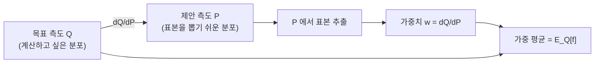

# 측도변환과 우도비

# 개요

같은 공간 위에 두 확률측도 `P` 와 `Q` 가 있을 때, `Q` 에 대한 기댓값을 `P` 에 대한 기댓값으로 바꿔 쓰는 것을 측도변환(change of measure)이라 한다. 변환의 환율이 [Radon–Nikodym 정리](radon-nikodym.md)가 보장하는 밀도

$$
\frac{dQ}{dP}
$$

이며, 통계에서는 이것을 우도비(likelihood ratio)라 부른다.

이 한 줄의 항등식이 서로 달라 보이는 세 가지를 묶는다. 통계적 가설검정에서 최적 검정통계량, 몬테카를로 계산에서 importance sampling, 확률해석에서 Girsanov 정리. 셋 다 "측정하기 편한 측도에서 표본을 뽑고 밀도로 보정한다"는 같은 기술이다.

# 직관

확률을 질량으로 보면, `P` 와 `Q` 는 같은 공간 위에 놓인 두 개의 질량 분포다. 두 분포가 서로 "같은 곳에 질량을 둔다"면(절대연속), 각 점마다 `Q` 가 `P` 보다 몇 배 무거운지를 나타내는 비율함수 하나로 `Q` 를 재구성할 수 있다. 그 비율함수가 밀도다.



실무적 동기는 단순하다. 어떤 사건의 확률을 알고 싶은데 그 사건이 `Q` 아래에서 너무 드물어 표본이 거의 잡히지 않는다고 하자. 그 사건이 자주 일어나도록 기울인 측도 `P` 에서 표본을 뽑고, 각 표본에 밀도 가중치를 곱해 되돌리면 같은 기댓값을 훨씬 적은 표본으로 추정할 수 있다. 이것이 importance sampling 이고, 이때 얼마나 이득인지는 가중치의 분산이 결정한다.

통계 쪽 직관은 다르다. 한 관측이 `P` 에서 왔는지 `Q` 에서 왔는지 판단할 때, 그 관측이 담은 정보는 전부 밀도값 하나에 들어 있다. 밀도가 크면 `Q` 쪽 증거, 작으면 `P` 쪽 증거다. Neyman–Pearson 보조정리가 말하는 바가 정확히 이것이다.

# 정의

## 절대연속과 밀도

측도공간 `(X, F)` 위의 두 측도 `Q`, `P` 에 대해, `P(A) = 0` 인 모든 가측집합 `A` 가 `Q(A) = 0` 을 만족할 때 `Q` 는 `P` 에 **절대연속**이라 하고 `Q << P` 로 쓴다. `P` 가 sigma-유한이면 [Radon–Nikodym 정리](radon-nikodym.md)에 의해 거의 어디서나 유일한 비음 가측함수 `L` 이 존재하여

$$
Q(A) = \int_A L \, dP \qquad \text{for all } A \in \mathcal{F}, \qquad L = \frac{dQ}{dP} .
$$

`Q` 와 `P` 가 서로 절대연속이면 동치(equivalent)라 하고, 이때 밀도는 거의 어디서나 양수이며

$$
\frac{dP}{dQ} = \Big( \frac{dQ}{dP} \Big)^{-1} .
$$

## 기댓값 변환 공식

핵심 항등식이다. `f` 가 `Q` 적분가능한 가측함수이면

$$
\mathbb{E}_Q[f] = \int f \, dQ = \int f \, \frac{dQ}{dP} \, dP = \mathbb{E}_P\Big[ f \, \frac{dQ}{dP} \Big] .
$$

증명은 표시함수에 대해 절대연속 정의를 그대로 쓰고, 단순함수로 선형 확장한 뒤 [단조 수렴 정리](monotone-convergence.md)로 일반 가측함수까지 올리는 표준 3단계다. 조건부 버전(Bayes 공식)은 부분 sigma-대수 `G` 에 대해

$$
\mathbb{E}_Q[f \mid \mathcal{G}] = \frac{\mathbb{E}_P[ f L \mid \mathcal{G} ]}{\mathbb{E}_P[ L \mid \mathcal{G} ]}
$$

이며, [조건부 기댓값](conditional-expectation.md)의 정의 성질로 양변에 `G` 가측 표시함수를 곱해 적분하면 바로 확인된다.

## 우도비

모수 공간에서 두 가설 `H_0` 와 `H_1` 이 각각 확률측도 `P_0`, `P_1` 을 지정하고, 공통 지배측도(counting measure 또는 Lebesgue 측도) `mu` 에 대한 밀도 `p_0`, `p_1` 이 있을 때 우도비는

$$
\Lambda(x) = \frac{p_1(x)}{p_0(x)} = \frac{dP_1}{dP_0}(x) .
$$

`n` 개 독립 관측에 대해서는 곱으로 쌓이고, 로그를 취하면 합이 된다.

$$
\log \Lambda(x_1, \dots, x_n) = \sum_{i=1}^{n} \log \frac{p_1(x_i)}{p_0(x_i)} .
$$

`P_0` 아래에서 이 합의 기댓값은 음수이고, 그 크기가 정확히 [KL divergence](kl-divergence.md)다.

$$
\mathbb{E}_{P_1}\Big[ \log \frac{dP_1}{dP_0} \Big] = D_{\mathrm{KL}}(P_1 \Vert P_0) \ \ge 0 .
$$

## Chain rule

밀도는 합성에 대해 곱으로 움직인다. `R << Q << P` 이면 거의 어디서나

$$
\frac{dR}{dP} = \frac{dR}{dQ} \cdot \frac{dQ}{dP} .
$$

[상측도](pushforward-measure.md)를 통한 변환도 같은 틀이다. 가측사상 `T` 가 `Q` 를 밀어낸 측도와 `P` 를 밀어낸 측도 사이의 밀도는 원래 밀도의 조건부 기댓값이 된다.

# 성질

## Neyman–Pearson 보조정리

유의수준을 고정했을 때 검정력을 최대화하는 검정은 우도비의 문턱값 검정이다. 즉 기각역을

$$
R = \{ x : \Lambda(x) > c \}
$$

로 잡는 것이 최적이다. 증명 스케치: 임의의 다른 기각역 $R'$ 와 비교하여 $R \setminus R'$ 에서는 $\Lambda > c$ , $R' \setminus R$ 에서는 $\Lambda \le c$ 이므로, 두 검정력 차이를 두 영역의 적분으로 쪼개면 부호가 고정된다. [가설검정](hypothesis-testing.md)에서 p-값 계산이 우도비에 의존하는 이유다.

## Importance sampling 과 분산

`E_Q[f]` 를 `P` 에서 뽑은 표본 `X_1, ..., X_n` 으로 추정한다.

$$
\hat{\theta}_n = \frac{1}{n} \sum_{i=1}^{n} f(X_i) \, L(X_i), \qquad L = \frac{dQ}{dP} .
$$

이 추정량은 불편이며([큰 수의 법칙](law-of-large-numbers.md)으로 일치), 분산은

$$
\mathrm{Var}_P\big( f L \big) = \mathbb{E}_P\big[ f^2 L^2 \big] - \big( \mathbb{E}_Q[f] \big)^2 = \mathbb{E}_Q\big[ f^2 L \big] - \big( \mathbb{E}_Q[f] \big)^2 .
$$

여기서 두 가지가 읽힌다.

- **최적 제안분포**: `f` 가 비음일 때 분산을 0 으로 만드는 `P` 는 `dP` 가 `f dQ` 에 비례하는 경우다. 정규화 상수가 바로 구하려는 값이므로 실제로 쓸 수는 없지만, "`f` 가 큰 곳에 표본을 몰아라"라는 설계 지침을 준다.
- **위험**: `L` 이 큰 곳에서 `f` 가 0 이 아니면 분산이 폭발한다. `L` 이 유계가 아니면 추정량의 분산이 무한일 수 있고, 이때 표본평균은 [중심극한정리](central-limit-theorem.md)가 적용되지 않아 신뢰구간이 거짓말을 한다. 실무에서는 유효표본크기

$$
\mathrm{ESS} = \frac{\big( \sum_i L(X_i) \big)^2}{\sum_i L(X_i)^2}
$$

를 진단 지표로 본다. 가중치가 한 표본에 몰리면 ESS 가 1 에 가까워진다. 가중치족의 [균등적분가능성](uniform-integrability.md)이 깨지는 상황이 바로 이 경우다.

## 이산 시간 Girsanov: 동전 던지기 기울이기

가장 단순한 측도변환 정리의 원형이다. `n` 번의 독립 동전 던지기 공간 위에서, 앞면 확률이 `p` 인 측도를 `P_p` 라 하자. 두 모수 `p`, `q` 가 모두 0 과 1 사이면 `P_q` 와 `P_p` 는 동치이고, 앞면 개수를 `S_n` 이라 할 때 밀도는

$$
\frac{dP_q}{dP_p}(\omega) = \Big( \frac{q}{p} \Big)^{S_n(\omega)} \Big( \frac{1-q}{1-p} \Big)^{n - S_n(\omega)} .
$$

이 밀도를 앞의 `k` 번까지의 정보로 제한한 것을 `L_k` 라 하면 `L_k` 는 `P_p` 아래에서 [martingale](martingales.md)이며 `L_0 = 1` 이다. 즉 측도변환의 밀도 과정은 언제나 원래 측도에서 평균 1 인 양의 martingale 이고, 역으로 그런 martingale 하나가 새로운 측도 하나를 정의한다.

여기서 `q` 를 `1/2` 로 고르면 `S_k - k/2` 가 새 측도에서 martingale 이 된다. "적당한 밀도를 곱해 표류(drift)를 제거하고 martingale 로 만든다"는 것이 Girsanov 정리의 내용이며, 연속시간에서는 Brown 운동의 drift 를 지우는 지수 martingale

$$
L_t = \exp\Big( \theta B_t - \tfrac{1}{2} \theta^2 t \Big)
$$

가 같은 역할을 한다.[^1] 금융에서 위험중립측도(risk-neutral measure)를 잡는 절차가 정확히 이것이다.

## 한계

`Q << P` 가 깨지면 밀도가 존재하지 않는다. 예를 들어 연속분포를 이산분포로 근사하거나 제안분포의 지지집합이 목표분포보다 좁으면 importance sampling 은 편향된다. 실무에서 "제안분포의 꼬리는 목표분포보다 두꺼워야 한다"는 규칙은 `L` 을 유계로 만들어 분산을 통제하려는 것이다.

# 활용

## Python: 희귀사건 확률 추정

표준정규 확률변수가 4 를 넘을 확률을 두 방식으로 추정한다. 직접 추정은 표본 대부분이 버려지고, 평균을 4 로 옮긴 제안분포에서 뽑아 밀도로 보정하면 훨씬 정확하다.

```python
import numpy as np
from math import erfc, sqrt

rng = np.random.default_rng(0)
n, a, mu = 200_000, 4.0, 4.0
truth = 0.5 * erfc(a / sqrt(2.0))

# 1) 직접 몬테카를로: Q = N(0,1) 에서 그대로 뽑는다.
x = rng.standard_normal(n)
direct = (x > a).mean()

# 2) importance sampling: P = N(mu,1) 에서 뽑고 L = dQ/dP 로 보정.
y = mu + rng.standard_normal(n)
L = np.exp(-mu * y + 0.5 * mu**2)          # N(0,1) 밀도 / N(mu,1) 밀도
w = (y > a) * L
imp = w.mean()

ess = w.sum() ** 2 / (w**2).sum()
print(f"truth  = {truth:.3e}")
print(f"direct = {direct:.3e}  se={(direct*(1-direct)/n)**0.5:.1e}")
print(f"impsmp = {imp:.3e}  se={w.std(ddof=1)/n**0.5:.1e}  ESS={ess:.0f}")
```

밀도 `L` 은 두 정규분포 밀도의 비를 정리한 것이다. 지수부에서 이차항이 상쇄되어 선형항만 남는다는 점이 [지수족](exponential-families.md)의 일반적 성질이며, 이 구조 덕분에 지수족 안에서의 측도변환은 자연모수의 평행이동으로 표현된다.

## 통계

- **가설검정**: 우도비 검정통계량과 Wilks 정리(로그우도비의 점근 카이제곱 분포).
- **Bayes 추론**: 사후분포를 사전분포에 대한 밀도로 쓰면 밀도가 정확히 우도이며, 정규화 상수가 증거(evidence)다. [Bayes 정리](bayes.md)의 측도론적 서술이 측도변환 공식 그 자체다.
- **정보량**: [KL divergence](kl-divergence.md)는 로그 밀도의 기댓값이고, [Shannon entropy](entropy.md)와 함께 두 측도의 구별 가능성을 정량화한다. 로그 밀도의 [martingale](martingales.md) 구조가 순차검정(SPRT)의 최적성을 준다.

## 계산

- **희귀사건 시뮬레이션**: 통신 오류율, 보험 파산확률, 대기행렬 과부하 확률. 대편차 이론(large deviations)이 최적 기울임 방향을 알려준다.
- **MCMC 와 재가중**: Metropolis–Hastings 의 수락확률이 제안분포에 대한 밀도비이며, [Markov 연쇄](markov-chains.md)의 detailed balance 조건이 그 형태를 강제한다.
- **강화학습의 off-policy 보정**: 행동 정책에서 모은 데이터로 목표 정책의 기댓값을 추정할 때 각 시점의 정책 비를 곱한다. 시간 길이에 따라 밀도가 곱으로 쌓여 분산이 지수적으로 커지는 문제가 위에서 본 ESS 붕괴와 같은 현상이다.[^2]

[^1]: Steven E. Shreve, *Stochastic Calculus for Finance II: Continuous-Time Models*, Springer, 5장 (Risk-Neutral Pricing, Girsanov), https://link.springer.com/book/10.1007/978-0-387-40101-0
[^2]: Art B. Owen, *Monte Carlo theory, methods and examples*, 9장 (Importance sampling), https://artowen.su.domains/mc/

# 연관 문서

## 선수지식

- [Radon–Nikodym 정리](radon-nikodym.md)
- [상측도와 확률분포](pushforward-measure.md)

## 더 알아보기

- [Girsanov 정리](girsanov.md)

#measure_theory #probability
