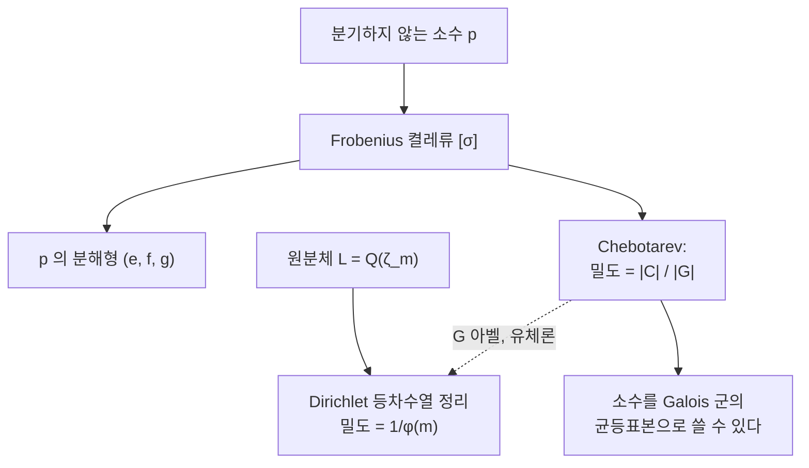

# Chebotarev 밀도 정리

# 개요

Galois 확대 $L/K$ 에서 분기하지 않는 소 아이디얼 $\mathfrak p$ 마다 Frobenius 켤레류 $\left[\frac{L/K}{\mathfrak p}\right]\subseteq\mathrm{Gal}(L/K)$ 가 정해진다. 소수를 Galois 군의 원소로 번역하는 사전이다.

이 번역이 얼마나 고르게 일어나는가. Chebotarev 의 답은 가장 단순한 형태다. **완전히 균등하다.**

$$
\delta\Big(\Big\{\mathfrak p:\Big[\tfrac{L/K}{\mathfrak p}\Big]=C\Big\}\Big)=\frac{|C|}{[L:K]}
$$

Galois 군에서 원소를 무작위로 뽑는 것과 소수를 무작위로 뽑아 Frobenius 를 보는 것이 구별되지 않는다는 뜻이다. [유체론](class-field-theory.md)이 아벨 확대에서 Frobenius가 무엇인지를 알려 주었다면, 이 정리는 그것이 어떻게 분포하는지를 알려 준다.

특수한 경우들이 이미 고전이다. $L=\mathbb Q(\zeta_m)$ 이면 $\mathrm{Gal}\cong(\mathbb Z/m\mathbb Z)^\times$ 이고 $\mathrm{Frob}_p=p\bmod m$ 이므로, 정리는 [Dirichlet 의 등차수열 정리](dirichlet-l-functions.md)가 된다. 곧 서로소인 각 잉여류에 소수가 정확히 $1/\varphi(m)$ 의 비율로 들어간다. Chebotarev 는 이것을 비아벨 확대로 넓힌 것이고, 증명의 전략도 일반 경우를 원분체 경우로 환원하는 것이다.

# 직관

## 소수를 군 원소로 번역한다

$\mathfrak p$ 위에 있는 $L$ 의 소 아이디얼 $\mathfrak P$ 를 하나 고르면, 잉여체 확대의 Frobenius 를 들어올려 $\sigma\in\mathrm{Gal}(L/K)$ 를 얻는다. $\mathfrak P$ 를 바꾸면 $\sigma$ 가 켤레로 바뀌므로, $\mathfrak p$ 에 잘 대응되는 것은 원소가 아니라 켤레류다.

이 켤레류가 $\mathfrak p$ 의 분해 양상을 전부 결정한다. 위수가 $f$ 면 잉여차수가 $f$ 이고 소 아이디얼의 개수가 $n/f$ 다. 특히 켤레류가 항등원이면 완전분해다.

그러므로 "어떤 소수가 어떻게 분해하는가" 는 "Frobenius 가 어느 켤레류에 떨어지는가" 와 같은 질문이고, Chebotarev 는 그 답이 켤레류의 크기에 정확히 비례한다고 말한다.

## 왜 균등해야 하는가

$L/K$ 가 아벨이면 Frobenius 가 광선유군의 원소가 된다. 유체론이 그 대응을 동형으로 만들어 주므로, 각 유류에 소수가 균등하게 들어간다는 주장은 각 Dirichlet 지표 $\chi\ne1$ 에 대해 $L(1,\chi)\ne0$ 이라는 사실과 같다. 소수의 분포가 한쪽으로 쏠리면 그 쏠림이 $L$ 함수의 $s=1$ 에서의 영점으로 나타나기 때문이다.

비아벨이면 Frobenius 가 켤레류라 지표를 써야 한다. 켤레불변 함수를 기약지표로 전개하고, 각 Artin $L$ 함수가 $s=1$ 에서 영점을 갖지 않음을 보이면 같은 결론이 나온다. 문제는 Artin $L$ 함수의 해석적 성질이 아직 열려 있다는 것인데, Chebotarev 는 이를 우회했다.

## Chebotarev 의 우회

핵심 착상은 순환 부분군으로 내려가는 것이다. $\sigma\in G$ 를 잡고 $H=\langle\sigma\rangle$ 로 두면 $L/L^H$ 는 순환 확대다. 순환 확대에서는 적당한 원분체를 붙여 아벨 이론과 유체론만으로 밀도를 계산할 수 있다.

그 다음 $L^H$ 에서 얻은 밀도를 $K$ 로 되돌리는데, 이 단계에서 Artin $L$ 함수의 정함수성이 필요 없다. 유도 지표의 조합으로 원하는 켤레류의 특성함수를 만들어 내면 되기 때문이다. Brauer 의 유도 정리가 나중에 이 조합 논법을 체계화했다.

# 정의

## Frobenius 켤레류

$L/K$ 가 유한 Galois 확대이고 $\mathfrak p$ 가 $K$ 의 소 아이디얼로 $L/K$ 에서 분기하지 않는다고 하자. $\mathfrak P\mid\mathfrak p$ 에 대해

$$
\mathrm{Frob}_{\mathfrak P}\in\mathrm{Gal}(L/K),\qquad
\mathrm{Frob}_{\mathfrak P}(x)\equiv x^{N\mathfrak p}\pmod{\mathfrak P}
$$

로 유일하게 정해진다. $\mathfrak P$ 를 바꾸면 $\mathrm{Frob}\_{g\mathfrak P}=g\thinspace\mathrm{Frob}\_{\mathfrak P}\thinspace g^{-1}$ 이므로 켤레류가 잘 정의되고, 이를 $\left[\frac{L/K}{\mathfrak p}\right]$ 로 쓴다.

## 밀도

소 아이디얼의 집합 $S$ 에 대해 두 가지 밀도를 쓴다.

$$
\text{자연밀도}\quad\lim_{x\to\infty}\frac{\#\{\mathfrak p\in S:N\mathfrak p\le x\}}{\#\{\mathfrak p:N\mathfrak p\le x\}},
\qquad
\text{Dirichlet 밀도}\quad\lim_{s\to1^+}\frac{\sum_{\mathfrak p\in S}N\mathfrak p^{-s}}{\log\frac1{s-1}}
$$

자연밀도가 있으면 Dirichlet 밀도도 있고 둘이 같다. 역은 일반적으로 성립하지 않는다. Chebotarev 의 원래 증명은 Dirichlet 밀도를 주었고, 이후 자연밀도로 강화되었다.

## 정리

> **Chebotarev 밀도 정리.** $L/K$ 가 유한 Galois 확대이고 $G=\mathrm{Gal}(L/K)$ 이고 $C\subseteq G$ 가 켤레류면
> $$
> \delta\Big(\Big\{\mathfrak p \text{ 불분기}:\Big[\tfrac{L/K}{\mathfrak p}\Big]=C\Big\}\Big)=\frac{|C|}{|G|}
> $$
> 이다. 자연밀도로도 성립한다.

$C=\lbrace 1\rbrace$ 인 경우가 특히 자주 쓰인다. $L$ 에서 완전분해하는 소수의 밀도가 $1/[L:K]$ 라는 것이다.

# 성질

## 특수 사례들

- **Dirichlet 등차수열 정리.** $K=\mathbb Q$ 이고 $L=\mathbb Q(\zeta_m)$ 인 경우다. 켤레류가 한원소이므로 각 $a\in(\mathbb Z/m\mathbb Z)^\times$ 에 대해 $p\equiv a\pmod m$ 인 소수의 밀도가 $1/\varphi(m)$ 이다.
- **이차체.** $L=\mathbb Q(\sqrt d)$ 면 $G\cong\mathbb Z/2$ 이고, $\left(\frac dp\right)=1$ 인 소수와 $-1$ 인 소수가 각각 절반이다.
- **다항식의 분해형.** $f\in\mathbb Z[x]$ 가 기약이고 $L$ 이 분해체일 때, $f$ 가 법 $p$ 에서 어떤 차수들의 곱으로 쪼개지는지는 $\mathrm{Frob}_p$ 의 순열 사이클형으로 결정된다. 그래서 분해형의 분포가 Galois 군 안의 사이클형 분포와 같다.
- **밀도 1 인 조건.** 거의 모든 $p$ 에서 $f$ 가 근을 가지면, 모든 Frobenius 가 어떤 근을 고정한다는 뜻이다. 유한군은 진부분군들의 켤레 합집합이 될 수 없으므로 $f$ 가 $\mathbb Q$ 에서 근을 가져야 한다. 국소 정보가 대역 정보를 강제하는 전형적인 논법이다.

## 무엇을 말해 주지 않는가

밀도는 극한이라 유한 구간에서의 오차는 말해 주지 않는다. 효과적인 형태, 곧 "밀도가 안정되기까지 얼마나 큰 $x$ 가 필요한가" 는 훨씬 어렵다. 무조건적인 결과는 판별식에 지수적으로 의존하고, 일반 Riemann 가설을 가정하면

$$
\pi_C(x)=\frac{|C|}{|G|}\mathrm{Li}(x)+O\Big(\frac{|C|}{|G|}\sqrt x\log(d_L\,x^{[L:\mathbb Q]})\Big)
$$

로 개선된다. 실제 계산에서는 이 차이가 결정적이다. 예를 들어 두 수체가 같은지 판정하려고 분해형을 비교할 때, 몇 개의 소수까지 확인해야 확신할 수 있는지가 여기에 달렸다.

Siegel 영점의 가능성 때문에 무조건적인 결과가 나빠진다는 점도 중요하다. 예외적인 실 영점 하나가 특정 유류의 소수를 오랫동안 억제할 수 있고, 이를 배제하는 것이 해석적 정수론의 오랜 난제다.

## 응용의 형태

Chebotarev 는 "충분히 많은 소수에서의 국소 정보가 대역 대상을 결정한다" 는 논법의 엔진이다.

- **Galois 군 계산.** 다항식의 분해형을 여러 소수에서 모아 사이클형의 분포를 보면 Galois 군의 후보가 좁혀진다. 계산 대수 시스템이 실제로 쓰는 방법이다.
- **표현의 구별.** 두 Galois 표현의 Frobenius 대각합이 밀도 1 의 소수에서 같으면 두 표현이 같다. 모듈러성 증명에서 "충분히 많은 $a_p$ 를 맞추면 끝" 이라는 논증이 이 사실에 기댄다.
- **Sato–Tate 와의 대비.** Chebotarev 는 유한군 안에서의 균등분포이고, Sato–Tate 는 콤팩트군 안에서의 균등분포다. 후자는 $\ell$ 진 표현의 상이 무한군이라 대각합이 연속적으로 퍼지는 경우이며, 증명에 [Langlands 함자성](langlands-program.md)이 필요하다.

# 활용

## 판별식과 이차체의 관계

$f=x^3-x-1$ 의 분해체 $L$ 은 $\mathbb Q(\sqrt{-23})$ 를 부분체로 갖는다. $S_3$ 의 교환자부분군이 3-순환들이고, 그 고정체가 판별식이 만드는 이차체이기 때문이다.

그래서 $\left(\frac{-23}p\right)=-1$ 인 소수에서는 Frobenius 가 호환이어야 하고, 분해형이 반드시 $(1,2)$ 다. 위 계산에서 $(1,2)$ 의 비율이 정확히 $1/2$ 인 것이 이 사실의 반영이다. 나머지 절반에서 $(1,1,1)$ 과 $(3)$ 이 $1:2$ 로 갈리는데, 이 갈림이 $\mathbb Q(\sqrt{-23})$ 의 유수가 3 이라는 사실과 연결된다. 힐베르트 유체가 바로 $L$ 이고, 완전분해하는 소수가 주 아이디얼에 대응하기 때문이다.

# 연관 문서

## 선수지식

- [유체론](class-field-theory.md)
- [Dirichlet 지표와 L 함수](dirichlet-l-functions.md)

## 더 알아보기

아직 연결한 문서가 없다.

#number_theory #theorem #field_theory
