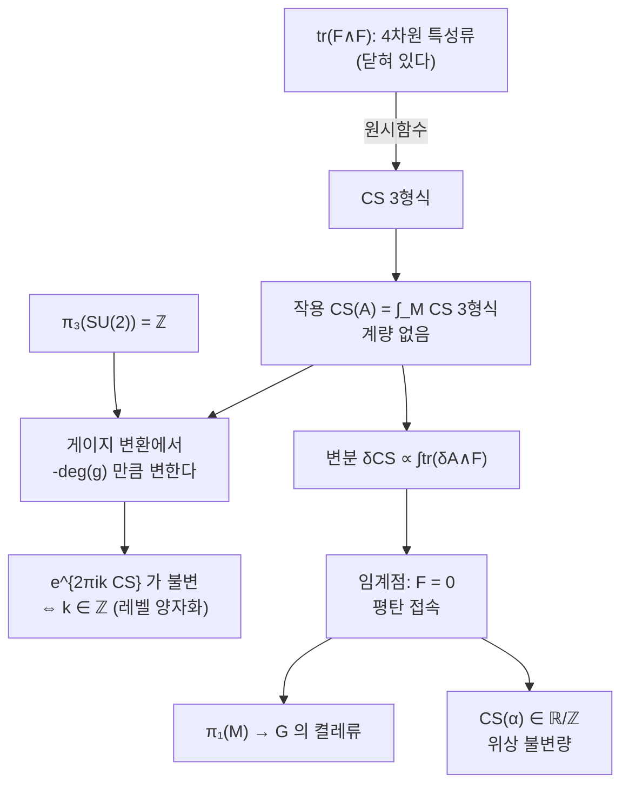

# Chern–Simons 이론과 레벨 양자화

# 개요

3 차원 다양체 $M$ 위에서 어떤 장을 놓고 작용범함수를 적으려 한다. 보통은 계량이 필요하다. $\int|F|^2$ 같은 식을 쓰려면 길이와 각도를 알아야 하고, 그러면 답이 계량에 의존해 **위상적**이지 않다.

그런데 3 차원에는 계량을 전혀 쓰지 않는 작용이 하나 있다. [미분형식](de-rham-cohomology.md)만으로 쓰이는 것이다.

$$
\mathrm{CS}(A)=\frac1{8\pi^2}\int_M\mathrm{tr}\Big(A\wedge dA+\tfrac23A\wedge A\wedge A\Big)
$$

$A$ 는 $G$ 주다발 위의 접속, 곧 [Lie 대수](lie-groups.md) 값을 갖는 1 형식이다. 3 형식을 3 차원 다양체 위에서 적분하는 것뿐이므로 계량이 들어갈 자리가 없다. 이것이 Chern–Simons 작용이고, 3 차원 위상적 장론이 존재하는 근본적인 이유다.

이 문서가 답할 물음은 셋이다.

- **어디서 왔는가.** 이 식은 우연히 눈에 띈 것이 아니라 4 차원 특성류 $\mathrm{tr}(F\wedge F)$ 를 한 차원 내려 적은 것이다.
- **왜 정수 레벨인가.** $\mathrm{CS}(A)$ 자체는 게이지 불변이 아니다. 게이지 변환에서 **정수만큼** 변하고, 그래서 $e^{2\pi ik\,\mathrm{CS}(A)}$ 가 $k\in\mathbb Z$ 일 때만 잘 정의된다.
- **무엇을 남기는가.** 임계점이 평탄 접속이고, 평탄 접속에서 $\mathrm{CS}$ 는 $\mathbb R/\mathbb Z$ 값의 위상 불변량이 된다. 이 수들이 [Witten 점근 추측](witten-asymptotics.md)에서 양자 불변량의 점근 위상으로 다시 나타난다.

# 직관

## 한 차원 내려 적기

출발점은 Chern–Weil 이론이다. 곡률 $F=dA+A\wedge A$ 에 대해 $\mathrm{tr}(F\wedge F)$ 는 4 형식이고 **닫혀 있다.** 그 코호몰로지류가 접속의 선택과 무관한 특성류, 곧 2 차 Chern 류다.

닫혀 있으면 국소적으로는 완전하다. 실제로 직접 계산하면

$$
\mathrm{tr}(F\wedge F)=d\,\mathrm{tr}\Big(A\wedge dA+\tfrac23A\wedge A\wedge A\Big)
$$

이 된다. 곧 **Chern–Simons 3 형식은 4 차원 특성류의 원시함수다.** 다발이 자명한 영역에서 $A$ 가 전역적으로 정의되므로 이 원시함수를 실제로 적을 수 있다.

여기서 모든 성질이 따라 나온다. 경계가 있는 4 차원 다양체 $W$ 로 $\partial W=M$ 이라 두면 Stokes 정리가

$$
\mathrm{CS}(A)=\frac1{8\pi^2}\int_W\mathrm{tr}(F\wedge F)
$$

를 준다. 왼쪽은 3 차원에서, 오른쪽은 4 차원에서 계산한 같은 수다. 그런데 $W$ 를 고르는 방법은 여럿이므로, **두 선택의 차이가 닫힌 4 차원 다양체 위의 $\mathrm{tr}(F\wedge F)$ 적분**이 된다. 그 값은 2 차 Chern 수이므로 정수다. 애매함이 정수뿐이라는 사실이 여기서 나온다.

## 게이지 변환과 권선수

게이지 변환 $A\mapsto g^{-1}Ag+g^{-1}dg$ 에서 작용이 어떻게 변하는지 직접 계산하면

$$
\mathrm{CS}(A^g)=\mathrm{CS}(A)-\frac1{24\pi^2}\int_M\mathrm{tr}\big((g^{-1}dg)^{\wedge3}\big)
$$

가 된다. 마지막 항은 $A$ 를 전혀 포함하지 않고 오직 사상 $g:M\to G$ 만 본다. $G=\mathrm{SU}(2)\cong S^3$ 이면 이것은 $g$ 의 **권선수**, 곧 $[g]\in\pi_3(\mathrm{SU}(2))=\mathbb Z$ 다.

$$
\mathrm{CS}(A^g)=\mathrm{CS}(A)-\deg(g)
$$

따라서 $\mathrm{CS}(A)$ 는 실수로서는 게이지 불변이 아니고, $\mathbb R/\mathbb Z$ 값으로만 잘 정의된다. 그런데 물리에서 쓰는 것은 $e^{2\pi ik\,\mathrm{CS}(A)}$ 이므로

$$
e^{2\pi ik\,\mathrm{CS}(A^g)}=e^{2\pi ik\,\mathrm{CS}(A)}e^{-2\pi ik\deg(g)}
$$

이고, $k$ 가 정수이면 마지막 인자가 1 이 되어 완전히 게이지 불변이다. **레벨이 정수여야 하는 이유가 $\pi_3(G)=\mathbb Z$ 다.** 양자화가 어떤 물리적 가정이 아니라 Lie 군의 위상에서 강제된다.



## 왜 답이 위상적인가

작용에 계량이 없으므로 분배함수도 계량에 의존하지 않을 것이다. 이 한 줄이 3 차원 TQFT 가 존재하는 이유이고, Witten 이 Jones 다항식을 설명한 방식이다. Wilson 고리

$$
W_R(K)=\mathrm{tr}_R\,\mathcal P\exp\oint_KA
$$

의 기댓값을 계산하면 매듭 불변량이 나오는데, 계량이 없으므로 그 값은 $K$ 를 연속적으로 움직여도 변하지 않는다. 곧 **동위류의 불변량**이다.

# 정의

## 접속과 곡률

$G$ 를 콤팩트 단순 Lie 군, $P\to M$ 을 주 $G$ 다발이라 하자. 3 차원 다양체 위에서 $G=\mathrm{SU}(n)$ 이면 모든 주다발이 자명하므로, 접속을 전역적으로 $\mathfrak g$ 값 1 형식 $A\in\Omega^1(M,\mathfrak g)$ 로 쓸 수 있다. 곡률은

$$
F=dA+A\wedge A\in\Omega^2(M,\mathfrak g)
$$

이고, 게이지군 $\mathcal G=\mathrm{Map}(M,G)$ 가 위에 적은 식으로 작용한다.

## 작용과 그 변분

> **정의.** $\mathrm{CS}(A)=\dfrac1{8\pi^2}\displaystyle\int_M\mathrm{tr}\big(A\wedge dA+\tfrac23A\wedge A\wedge A\big)$

변분을 계산하면 (경계가 없을 때)

$$
\delta\,\mathrm{CS}(A)=\frac1{4\pi^2}\int_M\mathrm{tr}(\delta A\wedge F)
$$

이다. 따라서 **임계점은 $F=0$, 곧 평탄 접속**이다. 평탄 접속은 홀로노미로 결정되므로, 게이지류의 모듈라이는

$$
\mathcal M(M,G)=\mathrm{Hom}(\pi_1(M),G)/\text{켤레}
$$

와 같다. 무한차원 공간 위의 범함수의 임계점 집합이 유한하거나 유한차원인 대수적 대상으로 내려온다.

## 평탄 접속의 CS 불변량

평탄 접속 $\alpha$ 에서 $\mathrm{CS}(\alpha)\in\mathbb R/\mathbb Z$ 는 게이지류만으로 정해지는 수다. 이것이 **Chern–Simons 불변량**이고 $M$ 과 $\pi_1(M)$ 의 표현이 함께 결정하는 위상 불변량이다.

렌즈 공간에서는 명시적으로 계산된다. $\pi_1(L(p,1))=\mathbb Z/p$ 의 $\mathrm{SU}(2)$ 표현은 생성원을 $\mathrm{diag}(e^{2\pi ib/p},e^{-2\pi ib/p})$ 로 보내는 것들이고, $b$ 와 $p-b$ 가 켤레라 같은 접속을 준다. 그 CS 값이

$$
\mathrm{CS}(\rho_b)=-\frac{b^2}{p}\ \ \operatorname{mod}1
$$

이다. 분모가 $p$ 인 유리수만 나온다는 점이 중요하다. 일반적으로 $M$ 이 유리 호몰로지 구면이면 CS 값은 언제나 유리수이고, 쌍곡 다양체에서는 그렇지 않을 수 있다.

# 성질

## Abel 판: 이음수

$G=\mathrm U(1)$ 이면 $A\wedge A=0$ 이라 작용이 이차식으로 단순해진다.

$$
\mathrm{CS}(A)=\frac1{8\pi^2}\int_MA\wedge dA
$$

이 경우 Wilson 고리 두 개의 상관함수를 계산하면 정확히 **이음수**가 나온다.

$$
\big\langle W_{n_1}(K_1)W_{n_2}(K_2)\big\rangle=\exp\Big(\frac{2\pi i\,n_1n_2}{k}\mathrm{lk}(K_1,K_2)\Big)
$$

이차형식의 적분이라 Gauss 적분으로 정확히 계산되고, 그 결과가 Gauss 의 이음수 적분이 된다. 비가환 $G$ 에서는 $A\wedge A\wedge A$ 항 때문에 이렇게 되지 않고, 섭동전개의 각 차수가 Vassiliev 불변량을 준다. **이음수는 그 전개의 1 차 항이다.**

이 Abel 판이 이론 전체의 성격을 압축해 보여 준다. 연속적인 적분이 정수를 낳고, 그 정수가 위상 자료다.

## 임계값의 이산성과 점근

$M$ 이 유리 호몰로지 구면이면 평탄 접속이 유한개이므로 임계값 $\mathrm{CS}(\alpha)$ 도 유한개의 유리수다. 이 사실이 [정상위상법](stationary-phase.md)과 만나면 곧바로 예측이 나온다. 경로적분

$$
Z_k(M)=\int\mathcal DA\,e^{2\pi ik\,\mathrm{CS}(A)}
$$

에서 $k\to\infty$ 의 점근은 임계점마다 한 항이고, 각 항의 위상이 $e^{2\pi ik\,\mathrm{CS}(\alpha)}$ 다. $\mathrm{CS}(\alpha)$ 가 분모 $p$ 의 유리수이므로 **그 위상은 $k$ 에 대해 주기 $p$ 로 순환한다.** 렌즈 공간의 RT 불변량이 $k$ 에 따라 진동하는 패턴이 여기서 온다.

## 경계가 있으면 등각장론이 나온다

$M$ 에 경계가 있으면 $\delta\,\mathrm{CS}$ 의 부분적분에서 경계항이 남아 작용이 게이지 불변이 아니게 된다. 이 결함을 고치려면 경계에 자유도를 두어야 하고, 그것이 Wess–Zumino–Witten 모형이다. 3 차원의 벌크와 2 차원의 경계가 짝을 이루는 이 구조가 벌크-경계 대응의 가장 오래된 예이고, Reshetikhin–Turaev 구성에서 $\Delta_+/\mathcal D=e^{2\pi ic/8}$ 의 $c$ 가 경계 등각장론의 중심 전하로 나타나는 이유이기도 하다.

## 엄밀함의 현재 상태

경로적분 자체는 수학적으로 정의되지 않았다. 측도 $\mathcal DA$ 가 없기 때문이다. 그래서 이 문서의 내용 가운데

- 작용, 게이지 변환 공식, 레벨 양자화, 평탄 접속의 CS 불변량은 **완전히 엄밀**하고,
- 분배함수와 Wilson 고리 기댓값은 **정의되지 않았다**.

후자를 대신하는 것이 Reshetikhin–Turaev 의 대수적 구성이다. 곧 물리가 예언한 답을 다른 방법으로 정의한 뒤, 그것이 물리의 예언과 맞는지를 묻는 구조다. 그 물음이 Witten 점근 추측이다.

# 활용

## 적분이 정수를 낳는다

$\mathrm U(1)$ 이론의 핵심인 Gauss 이음수 적분을 직접 계산한다.

$$
\mathrm{lk}(K_1,K_2)=\frac1{4\pi}\oint_{K_1}\oint_{K_2}\frac{(\mathbf r_1-\mathbf r_2)\cdot(d\mathbf r_1\times d\mathbf r_2)}{|\mathbf r_1-\mathbf r_2|^3}
$$

좌변은 정수이고 우변은 매끄러운 함수의 이중적분이다. 곡선을 어떻게 흔들어도 값이 변하지 않아야 한다.

```python
from math import sin, cos, pi, sqrt

def linking(c1, c2, n=300):
    """Gauss 이음수 적분. c(s) 는 (위치, 접벡터) 를 준다."""
    tot, h = 0.0, 2*pi/n
    for i in range(n):
        r1, d1 = c1((i+0.5)*h)
        for j in range(n):
            r2, d2 = c2((j+0.5)*h)
            d = [r1[k]-r2[k] for k in range(3)]
            cr = [d1[1]*d2[2]-d1[2]*d2[1],
                  d1[2]*d2[0]-d1[0]*d2[2],
                  d1[0]*d2[1]-d1[1]*d2[0]]
            tot += sum(d[k]*cr[k] for k in range(3))/sqrt(sum(x*x for x in d))**3
    return tot*h*h/(4*pi)

# Hopf 링크: 수직으로 걸린 두 원
hopf_a = lambda s: ([cos(s), sin(s), 0.0], [-sin(s), cos(s), 0.0])
hopf_b = lambda t: ([1+cos(t), 0.0, sin(t)], [-sin(t), 0.0, cos(t)])
# 떨어진 두 원
un_a = lambda s: ([cos(s), sin(s), 0.0], [-sin(s), cos(s), 0.0])
un_b = lambda t: ([5+cos(t), sin(t), 0.0], [-sin(t), cos(t), 0.0])
# 원환면 위를 두 번 감는 쌍
def torus(shift):
    return lambda s: ([(2+cos(2*s+shift))*cos(s), (2+cos(2*s+shift))*sin(s), sin(2*s+shift)],
                      [-2*sin(2*s+shift)*cos(s)-(2+cos(2*s+shift))*sin(s),
                       -2*sin(2*s+shift)*sin(s)+(2+cos(2*s+shift))*cos(s), 2*cos(2*s+shift)])

for name, a, b in [("Hopf 링크", hopf_a, hopf_b), ("떨어진 두 원", un_a, un_b),
                   ("원환면 위 두 곡선", torus(0), torus(pi))]:
    for n in [100, 300]:
        print(f"  {name:18s} n={n:4d}: lk = {linking(a, b, n):+.6f}")

#   Hopf 링크           n= 100: lk = -1.000000
#   Hopf 링크           n= 300: lk = -1.000000
#   떨어진 두 원          n= 100: lk = +0.000000
#   떨어진 두 원          n= 300: lk = +0.000000
#   원환면 위 두 곡선       n= 100: lk = -2.000000
#   원환면 위 두 곡선       n= 300: lk = -2.000000
```

값이 $-1$, $0$, $-2$ 로 소수점 여섯째 자리까지 정수다. 부호는 곡선의 방향 규약이 정한다.

주목할 것은 **격자를 100 에서 300 으로 늘려도 값이 전혀 개선되지 않는다**는 점이다. 보통의 수치적분이라면 격자를 늘릴수록 참값에 가까워지는 과정이 보인다. 여기서는 100 개 격자에서 이미 여섯째 자리까지 맞다. 피적분함수가 $|\mathbf r_1-\mathbf r_2|^{-3}$ 이라 결코 완만하지 않은데도 그렇다.

이유는 이 적분이 사실 **차수 사상의 적분 표현**이기 때문이다. 사상 $T^2\to S^2$, $(s,t)\mapsto(\mathbf r_1-\mathbf r_2)/|\mathbf r_1-\mathbf r_2|$ 가 구면의 부피형식을 당겨 온 것이 피적분함수이고, 그 적분은 사상의 차수 곧 정수다. 차수는 연속 변형에 불변이므로, 격자를 성기게 잡아 곡선을 조금 다르게 근사해도 **같은 정수**가 나온다. 수치적 안정성이 위상적 불변성의 직접적 결과다.

이것이 Chern–Simons 이론 전체가 작동하는 방식의 축소판이다. 계량이 없는 적분이 계량과 무관한 정수를 낳고, 그 정수가 위상 자료를 담는다. 비가환 $G$ 에서는 이 그림이 매듭 다항식으로 확장된다.

## 어디로 이어지는가

- 임계점의 CS 값이 양자 불변량의 점근 위상으로 나타나는 것이 Witten 점근 추측이다.
- $\pi_3(G)=\mathbb Z$ 가 레벨을 양자화하듯, 경계 이론의 레벨이 아핀 Lie 대수의 표현론을 유한하게 만든다. 모듈러 텐서범주의 단순대상이 유한개인 이유가 그것이다.
- 4 차원에서 한 차원 내려 3 차원 작용을 얻는 이 조작은 임의의 특성류에 대해 가능하고, 그렇게 얻는 부류가 2 차 특성류다.

[^1]: 원전은 S.-S. Chern–J. Simons, *Characteristic forms and geometric invariants*, Ann. of Math. 99 (1974). 물리적 해석과 매듭 이론과의 연결은 E. Witten, *Quantum field theory and the Jones polynomial*, Comm. Math. Phys. 121 (1989).
[^2]: 레벨 양자화와 게이지 변환 공식의 표준적 서술은 M. Nakahara, *Geometry, Topology and Physics* (2003), 11 장. Abel 판과 이음수의 관계는 A. Polyakov, *Fermi-Bose transmutations induced by gauge fields*, Mod. Phys. Lett. A3 (1988). 본문의 수치 계산은 직접 한 것이다.

# 연관 문서

## 선수지식

- [de Rham 코호몰로지](de-rham-cohomology.md)
- [Lie 군과 지수사상](lie-groups.md)

## 더 알아보기

- [Witten 점근 추측과 Ohtsuki 급수](witten-asymptotics.md)
- [Wess–Zumino–Witten 모형과 벌크–경계 대응](wess-zumino-witten.md)
- [Casson 불변량](casson-invariant.md)

#differential_geometry #algebraic_topology #topology
