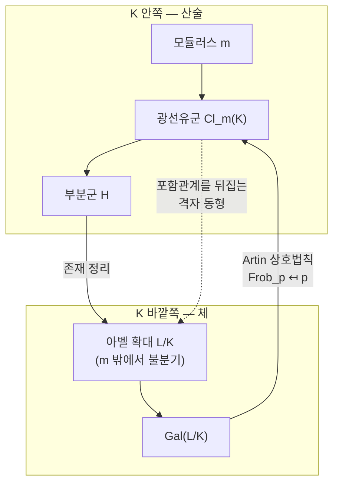

# 유체론

# 개요

[수체](algebraic-number-fields.md) `K` 의 확대체는 무수히 많다. 그중 Galois 군이 아벨군인 것만 모으면 어떻게 될까. 유체론의 답은 놀랍다. 그 확대들이 `K` 밖으로 나가지 않고 `K` 안의 데이터만으로 완전히 분류된다는 것이다.

분류를 하는 데이터가 유수군을 조금 넓힌 **광선유군**이고, 분류를 실현하는 사상이 **Artin 상호법칙**이다. `K` 의 아벨 확대 `L` 마다 광선유군의 부분군 하나가 대응하고, 그 몫이 정확히 `\mathrm{Gal}(L/K)` 와 동형이다. 확대체를 하나도 만들어 보지 않고, `K` 의 아이디얼 산술만으로 아벨 확대의 목록 전체를 읽어낼 수 있다.

$$
\mathrm{Cl}_{\mathfrak m}(K)/H \;\xrightarrow{\ \sim\ }\; \mathrm{Gal}(L/K)
$$

왜 이것이 "상호법칙" 인가. [이차 상호법칙](quadratic-reciprocity.md)은 `p` 가 법 `q` 에서 제곱수인지와 `q` 가 법 `p` 에서 제곱수인지를 잇는 정리였다. 유체론의 언어로 다시 쓰면, 소수 `p` 가 아벨 확대 `L/K` 에서 어떻게 분해하는지가 오직 `p` 의 합동조건으로 결정된다는 진술이 된다. Gauss 가 여덟 번 증명한 그 정리는 `K=\mathbb Q` 이고 `L` 이 이차체인 가장 작은 경우였다.

[대수적 수체](algebraic-number-fields.md) 문서의 마지막에서 Frobenius 원소가 아벨 확대에서는 소수 `p` 만의 함수가 된다고 했다. 유체론은 그 함수가 무엇인지를 끝까지 밀어붙인 결과다.

# 직관

## 분해법칙을 합동조건으로 읽는다

원분체가 출발점이다. `K=\mathbb Q`, `L=\mathbb Q(\zeta_m)` 일 때

$$
\mathrm{Gal}(L/\mathbb Q)\cong(\mathbb Z/m\mathbb Z)^\times,\qquad \mathrm{Frob}_p\longmapsto p\bmod m
$$

이고, `p` 가 완전분해할 조건은 `\mathrm{Frob}_p=1`, 곧 `p\equiv1\pmod m` 이다. 소수의 분해라는 대수적 질문이 나머지 계산이라는 산술 질문으로 완전히 번역되었다.

유체론의 주장은 이것이 원분체만의 우연이 아니라는 것이다. `K` 의 **모든** 아벨 확대에서 분해법칙이 이런 합동조건으로 서술된다. 무대가 `\mathbb Q` 가 아니면 "법 `m` 의 나머지" 자리에 광선유군의 원소가 들어간다.

## 왜 아벨이어야 하는가

분기하지 않는 `\mathfrak p` 위의 Frobenius 는 원래 `\mathfrak p` 위에 있는 `L` 의 소 아이디얼을 골라야 정해진다. 다른 소 아이디얼을 고르면 Galois 군의 켤레원이 나온다. 그래서 일반적으로 `\mathrm{Frob}_{\mathfrak p}` 는 원소가 아니라 켤레류다.

군이 아벨이면 켤레류가 한원소 집합이라 이 모호함이 사라진다. `\mathrm{Frob}_{\mathfrak p}` 가 `\mathfrak p` 만의 함수가 되고, 아이디얼의 곱에 대해 곱셈적으로 확장하면 아이디얼군에서 Galois 군으로 가는 준동형이 하나 생긴다. 이 사상이 있다는 것 자체가 아벨 조건의 산물이며, 유체론이 아벨 확대에서 멈추는 이유다.

비아벨로 넘어가면 켤레류 정보만 남는다. 켤레류에서 수를 뽑아내려면 [표현의 지표](group-representations.md)를 봐야 하고, 그러면 Galois 표현과 그 `L` 함수의 세계가 열린다. Langlands 강령이 여기서 시작한다.

## 세 개의 대응이 한 줄로



작은 부분군에 큰 확대가 대응한다. `H` 가 전체 광선유군이면 `L=K` 이고, `H` 가 자명군이면 `L` 은 그 모듈러스에서 가능한 가장 큰 아벨 확대인 광선유체다.

## 모듈러스는 왜 필요한가

유수군만으로는 부족하다. 유수군에 대응하는 확대는 분기가 전혀 없는 것뿐인데, `\mathbb Q(i)/\mathbb Q` 처럼 유용한 아벨 확대는 대개 어딘가에서 분기한다. `\mathbb Q` 의 유수는 1 이므로 유수군만 보면 `\mathbb Q` 에 아벨 확대가 없다는 결론이 나오고, 이는 명백히 틀렸다.

해결책은 "어디까지 분기를 허용할지" 를 미리 정해 주는 것이다. 그 지정이 모듈러스 `\mathfrak m` 이고, `\mathfrak m` 을 크게 잡을수록 더 많은 아벨 확대가 시야에 들어온다. `K=\mathbb Q`, `\mathfrak m=(m)\infty` 로 두면 광선유군이 `(\mathbb Z/m\mathbb Z)^\times` 가 되어 원분체 이야기가 그대로 복원된다.

모든 `\mathfrak m` 을 한꺼번에 다루려면 극한을 취해야 하는데, 그 극한을 깔끔하게 담는 그릇이 이델류군이다. 아래에서 다시 본다.

# 정의

## 모듈러스와 광선유군

`K` 의 **모듈러스** `\mathfrak m` 은 형식적인 곱 `\mathfrak m=\mathfrak m_0\mathfrak m_\infty` 다. `\mathfrak m_0` 는 `\mathcal O_K` 의 0 이 아닌 아이디얼, `\mathfrak m_\infty` 는 실매장들의 부분집합이다.

- `I_K^{\mathfrak m}` : `\mathfrak m_0` 와 서로소인 소 아이디얼들이 생성하는 분수 아이디얼군.
- `P_K^{\mathfrak m}` : `\alpha\equiv1\ (\mathrm{mod}^\times\mathfrak m)` 인 `\alpha` 로 생성되는 주 아이디얼 `(\alpha)` 들. 곧 `\mathfrak m_0` 의 각 소인수에서 `\alpha` 가 1 과 충분히 합동이고, `\mathfrak m_\infty` 의 각 실매장에서 `\sigma(\alpha)>0` 이다.

**광선유군**은 그 몫이다.

$$
\mathrm{Cl}_{\mathfrak m}(K)=I_K^{\mathfrak m}/P_K^{\mathfrak m}
$$

언제나 유한군이고, `\mathfrak m=1` 이면 보통의 유수군 `\mathrm{Cl}(K)` 다. 일반적으로는 다음 완전열이 크기를 결정한다.

$$
1\to\frac{\mathcal O_K^\times}{\mathcal O_{K,\mathfrak m}^\times}\to\frac{(\mathcal O_K/\mathfrak m_0)^\times\times\{\pm1\}^{\mathfrak m_\infty}}{1}\to\mathrm{Cl}_{\mathfrak m}(K)\to\mathrm{Cl}(K)\to1
$$

`K=\mathbb Q`, `\mathfrak m=(m)\infty` 인 경우를 확인해 두자. `\mathrm{Cl}(\mathbb Q)=1` 이고 `\mathbb Z^\times=\{\pm1\}` 인데 `\mathfrak m_\infty` 조건이 양수만 남기므로

$$
\mathrm{Cl}_{(m)\infty}(\mathbb Q)\cong(\mathbb Z/m\mathbb Z)^\times
$$

가 된다. 실제로 `\mathfrak m_0` 와 서로소인 분수 아이디얼은 양의 유리수 `a/b` 로 유일하게 쓰이고, `P^{\mathfrak m}` 은 `\equiv1\pmod m` 인 것들이다.

## Artin 사상

`L/K` 가 아벨 확대이고 `\mathfrak m` 이 분기하는 모든 소수를 포함한다고 하자. `\mathfrak m` 과 서로소인 소 아이디얼 `\mathfrak p` 에 대해 `\mathrm{Frob}_{\mathfrak p}\in\mathrm{Gal}(L/K)` 가 잘 정의되고, 곱셈적으로 확장해

$$
\psi_{L/K}\colon I_K^{\mathfrak m}\to\mathrm{Gal}(L/K),\qquad
\prod\mathfrak p_i^{a_i}\mapsto\prod\mathrm{Frob}_{\mathfrak p_i}^{a_i}
$$

를 얻는다. 이것이 **Artin 사상**이다. 정의만 보면 그저 Frobenius 를 모아 놓은 것인데, 아래 정리가 이 사상에 모든 내용을 싣는다.

## 유체론의 세 정리

> **Artin 상호법칙.** `L/K` 가 아벨 확대면, 적당한 모듈러스 `\mathfrak m`(분기 소수를 모두 포함) 이 있어 `\psi_{L/K}` 가 전사이고 그 핵이 정확히
> $$
> \ker\psi_{L/K}=P_K^{\mathfrak m}\cdot N_{L/K}(I_L^{\mathfrak m})
> $$
> 이다. 따라서 `\mathrm{Cl}_{\mathfrak m}(K)/N_{L/K}(\cdots)\cong\mathrm{Gal}(L/K)` 다.

그런 `\mathfrak m` 가운데 가장 작은 것을 `L/K` 의 **도체** `\mathfrak f_{L/K}` 라 하고, `\mathfrak p\mid\mathfrak f_{L/K}` 인 것과 `\mathfrak p` 가 분기하는 것이 동치다. 도체는 "이 확대를 보려면 얼마나 정밀한 합동조건이 필요한가" 를 재는 양이다.

> **존재 정리.** 거꾸로 `\mathrm{Cl}_{\mathfrak m}(K)` 의 임의의 부분군 `H` 에 대해, `\ker\psi_{L/K}` 가 `H` 의 당김과 일치하는 아벨 확대 `L/K` 가 유일하게 존재한다.

> **유일성과 격자 동형.** 두 대응은 서로 역이며 포함관계를 뒤집는다. `H_1\subseteq H_2\iff L_1\supseteq L_2` 이고, 교집합과 합성이 곱과 교집합에 대응한다.

`H` 가 자명군일 때 나오는 확대 `K_{\mathfrak m}` 를 **광선유체**라 한다. `\mathfrak m` 밖에서 불분기인 아벨 확대 전체를 품는 최대 확대이며, `\mathrm{Gal}(K_{\mathfrak m}/K)\cong\mathrm{Cl}_{\mathfrak m}(K)` 다.

## 이델류군으로 다시 쓰기

모듈러스를 하나씩 고르는 방식은 정리를 서술하기에 번거롭다. 모든 자리 `v` 를 한꺼번에 다루는 것이 이델이다.

$$
\mathbb A_K^\times=\Big\{(x_v)\in\prod_v K_v^\times : \text{거의 모든 } v \text{ 에서 } x_v\in\mathcal O_v^\times\Big\},
\qquad C_K=\mathbb A_K^\times/K^\times
$$

`C_K` 를 **이델류군**이라 한다. 열린 유한지표 부분군으로 몫을 취하면 광선유군이 나오므로, `C_K` 는 모든 `\mathrm{Cl}_{\mathfrak m}(K)` 를 동시에 담는 대상이다. 유체론은 한 줄로 압축된다.

$$
\psi_K\colon C_K\longrightarrow\mathrm{Gal}(K^{\mathrm{ab}}/K)
$$

가 연속 전사이고, 유한지표 열린 부분군과 유한 아벨 확대가 일대일 대응한다. 곧 `\mathrm{Gal}(K^{\mathrm{ab}}/K)` 는 `C_K` 의 유한완비화다.

**국소 유체론**은 각 자리에서의 대응이다. `K_v` 가 국소체면

$$
\psi_v\colon K_v^\times\longrightarrow\mathrm{Gal}(K_v^{\mathrm{ab}}/K_v)
$$

가 있어, 단원군 `\mathcal O_v^\times` 가 관성군에 대응하고 소원 `\pi` 가 Frobenius 로 간다. 대역 사상 `\psi_K` 는 국소 사상들의 곱으로 만들어지며, 국소 조건들이 대역적으로 정합적이라는 것이 상호법칙의 내용이 된다. 국소 쪽은 Lubin–Tate 형식군으로 명시적으로 구성할 수 있어, 대역 쪽보다 계산이 잘 된다.

# 성질

## 힐베르트 유체

`\mathfrak m=1` 인 경우다. 대응하는 확대 `H` 를 **힐베르트 유체**라 하고, 정의에서 바로 다음이 따른다.

- `H/K` 는 유한 소수와 무한 소수 모두에서 불분기인 최대 아벨 확대다.
- `\mathrm{Gal}(H/K)\cong\mathrm{Cl}(K)` 이므로 `[H:K]=h_K` 다.
- `\mathfrak p` 가 `H` 에서 완전분해할 조건은 `\psi(\mathfrak p)=1`, 곧 **`\mathfrak p` 가 주 아이디얼인 것**이다.

마지막 항목이 특히 강력하다. "이 아이디얼이 주 아이디얼인가" 라는 질문이 "이 소수가 어떤 체에서 완전분해하는가" 로 바뀌었고, 후자는 다항식이 법 `\mathfrak p` 에서 근을 갖는지로 판정된다.

한 걸음 더 가면 **주 아이디얼 정리**가 있다. `K` 의 모든 아이디얼은 `H` 로 올라가면 주 아이디얼이 된다. 유수군이 사라지는 것이다. 다만 `H` 자신의 유수군은 새로 생길 수 있고, 그래서 `K\subset H\subset H_2\subset\cdots` 로 유체탑을 쌓으면 언젠가 멈추는지를 묻게 된다. Golod–Shafarevich 가 1964 년에 무한히 계속되는 예를 만들어 답이 "아니오" 임을 보였다.

## Kronecker–Weber 정리

> `\mathbb Q` 의 모든 유한 아벨 확대는 어떤 원분체 `\mathbb Q(\zeta_m)` 안에 들어 있다.

유체론에서 바로 나온다. `\mathbb Q` 의 아벨 확대 `L` 의 도체를 `\mathfrak m\mid(m)\infty` 로 잡으면, `L` 이 광선유체 안에 들어가야 하는데 `\mathrm{Cl}_{(m)\infty}(\mathbb Q)\cong(\mathbb Z/m\mathbb Z)^\times` 이고 `\mathbb Q(\zeta_m)` 이 바로 그 광선유체이기 때문이다.

이 정리를 일반 `K` 로 옮기려는 것이 Hilbert 의 12 번 문제다. 곧 `K^{\mathrm{ab}}` 를 생성하는 구체적인 해석적 함수를 찾는 문제인데, `K=\mathbb Q` 에서는 `e^{2\pi ix}` 가 답이고 허수 이차체에서는 타원 모듈러 함수와 [타원곡선](elliptic-curves.md)의 복소곱셈 이론이 답을 준다. 그 밖의 수체에서는 여전히 열려 있다.

## 이차 상호법칙의 재증명

`p` 가 홀소수고 `p^*=(-1)^{(p-1)/2}p` 라 하면 `\mathbb Q(\sqrt{p^*})` 는 `\mathbb Q(\zeta_p)` 의 유일한 이차 부분체다. Galois 대응에서 `\mathrm{Gal}(\mathbb Q(\zeta_p)/\mathbb Q)\cong(\mathbb Z/p\mathbb Z)^\times` 의 지표 2 부분군, 곧 제곱잉여들이 `\mathbb Q(\sqrt{p^*})` 를 고정한다. 따라서 다른 소수 `q` 에 대해

$$
\Big(\frac{p^*}q\Big)=1
\iff \mathrm{Frob}_q \text{ 가 } \mathbb Q(\sqrt{p^*}) \text{ 를 고정}
\iff q\bmod p \text{ 가 제곱잉여}
\iff \Big(\frac qp\Big)=1
$$

이고, `\left(\frac{p^*}q\right)=\left(\frac{-1}q\right)^{(p-1)/2}\left(\frac pq\right)` 을 풀면 정확히 Gauss 의 공식이 된다. 두 Legendre 기호가 연결되는 이유가 "둘 다 같은 원분체의 Galois 군을 서로 다른 방향에서 보고 있었다" 로 설명된다.

## `p=x^2+ny^2` 의 완전한 답

[대수적 수체](algebraic-number-fields.md) 문서에서 `h=1` 이면 합동조건으로 답이 나오지만 `h>1` 이면 부족하다고 했다. 그 부족한 부분을 채우는 것이 힐베르트 유체다.

`K=\mathbb Q(\sqrt{-n})` 이고 `p` 가 `n` 을 나누지 않는 홀소수일 때(설명을 위해 `\mathcal O_K=\mathbb Z[\sqrt{-n}]` 인 경우로 둔다),

$$
p=x^2+ny^2
\iff p\mathcal O_K=\mathfrak p\bar{\mathfrak p} \text{ 이고 } \mathfrak p \text{ 가 주 아이디얼}
\iff p \text{ 가 } H \text{ 에서 완전분해}
$$

이다. `H` 를 생성하는 다항식 `f` 를 잡으면 마지막 조건이 "`\left(\frac{-n}p\right)=1` 이고 `f` 가 법 `p` 에서 근을 가짐" 이라는 완전히 구체적인 판정이 된다. 두 조건 가운데 앞의 것은 합동조건이고, 뒤의 것이 유수군이 자명하지 않을 때 추가로 필요한 정보다.

`n=5` 로 확인해 보자. `\mathrm{Cl}(\mathbb Q(\sqrt{-5}))\cong\mathbb Z/2` 이므로 `[H:K]=2` 이고, 실제로 `H=K(i)=\mathbb Q(i,\sqrt5)` 다. `\mathbb Q(i,\sqrt5)/\mathbb Q` 가 `(\mathbb Z/2)^2` 확대이므로 `p` 의 완전분해는 순수한 합동조건 `p\equiv1,9\pmod{20}` 으로 떨어진다.

```python
def primes(n):
    return [p for p in range(2, n) if all(p % d for d in range(2, int(p**0.5) + 1))]

def represented(a, b, c, p):
    """p 를 이차형식 a x² + b xy + c y² 로 나타낼 수 있는가."""
    B = int(p**0.5) + 1
    return any(a*x*x + b*x*y + c*y*y == p for x in range(-B, B+1) for y in range(-B, B+1))

def splits_in_H(p):
    """p 가 H = Q(i, √5) 에서 완전분해하는가. 곧 p ≡ 1 (4) 이고 5 가 법 p 의 제곱잉여."""
    return p % 4 == 1 and pow(5, (p - 1) // 2, p) == 1

# K = Q(√-5), Cl(K) = Z/2, 힐베르트 유체 H = K(i) = Q(i, √5)
print(" p  | 주류 x²+5y² | 비주류 2x²+2xy+3y² | H 에서 완전분해 | p mod 20")
for p in primes(50):
    if p in (2, 5): continue
    print(f"{p:3} | {str(represented(1,0,5,p)):>11} | {str(represented(2,2,3,p)):>18}"
          f" | {str(splits_in_H(p)):>14} | {p % 20:8}")

ok = all(represented(1, 0, 5, p) == splits_in_H(p)
         for p in primes(2000) if p not in (2, 5))
print("\n모든 p<2000 에서  p=x²+5y²  ⟺  p 가 H 에서 완전분해 :", ok)

# 유체가 비아벨 다항식으로 주어지는 사례. Z[√-27] 의 환유체는 Q(ζ₃, ∛2) 다.
cubic = lambda a, p: any(pow(x, 3, p) == a % p for x in range(p))
ok3 = all(represented(1, 0, 27, p) == (p % 3 == 1 and cubic(2, p))
          for p in primes(500) if p != 3)
print("모든 p<500 에서  p=x²+27y²  ⟺  p≡1 (3) 이고 2 가 법 p 의 세제곱잉여 :", ok3)

#  p  | 주류 x²+5y² | 비주류 2x²+2xy+3y² | H 에서 완전분해 | p mod 20
#   3 |       False |               True |          False |        3
#   7 |       False |               True |          False |        7
#  11 |       False |              False |          False |       11
#  13 |       False |              False |          False |       13
#  17 |       False |              False |          False |       17
#  19 |       False |              False |          False |       19
#  23 |       False |               True |          False |        3
#  29 |        True |              False |           True |        9
#  31 |       False |              False |          False |       11
#  37 |       False |              False |          False |       17
#  41 |        True |              False |           True |        1
#  43 |       False |               True |          False |        3
#  47 |       False |               True |          False |        7
#
# 모든 p<2000 에서  p=x²+5y²  ⟺  p 가 H 에서 완전분해 : True
# 모든 p<500 에서  p=x²+27y²  ⟺  p≡1 (3) 이고 2 가 법 p 의 세제곱잉여 : True
```

표의 세 번째 열과 네 번째 열이 정확히 일치한다. 왼쪽 두 열이 유수군의 두 류에 대응하고, `p\equiv11,13,17,19` 인 경우는 `p` 가 `K` 에서 아예 분해하지 않아 둘 다 `False` 다.

마지막 검증은 유수군 대신 차수의 환유군을 쓰면 대응하는 체가 아벨이 아닐 수 있음을 보여준다. `\mathbb Q(\zeta_3,\sqrt[3]2)/\mathbb Q` 는 `S_3` 확대라 `\mathbb Q` 위에서는 합동조건으로 서술되지 않지만, `\mathbb Q(\zeta_3)` 위에서는 아벨이라 유체론이 적용된다. 상호법칙을 쓰려면 올바른 밑체를 골라야 한다는 교훈이다.

## Chebotarev 밀도 정리

유체론의 해석적 짝이다. `L/K` 가 Galois 이고 `C\subseteq\mathrm{Gal}(L/K)` 가 켤레류면, `\mathrm{Frob}_{\mathfrak p}=C` 인 소 아이디얼의 밀도가 `|C|/[L:K]` 다.

아벨 확대에 적용하면 각 광선유류에 속하는 소 아이디얼의 밀도가 모두 같다는 뜻이 되고, `K=\mathbb Q` 에서는 등차수열의 소수 정리, 곧 [Dirichlet L 함수](dirichlet-l-functions.md) 문서에서 본 결과가 나온다. Frobenius 가 균등하게 분포한다는 이 사실 덕분에 "충분히 많은 `\mathfrak p` 에서 분해 양상이 같으면 두 확대가 같다" 는 식의 논증이 가능해진다.

## 증명 구조

정리의 서술은 깔끔하지만 증명은 길다. 큰 줄기는 두 개의 부등식이다.

- **제1 부등식**(`\le`): `\zeta_K(s)` 의 `s=1` 에서의 극을 비교하는 해석적 논증. 노름군의 지표가 `[L:K]` 이상임을 준다.
- **제2 부등식**(`\ge`): Herbrand 몫과 단원 계산을 쓰는 대수적 논증. 반대 방향을 준다.

둘을 합치면 지표가 정확히 `[L:K]` 이고, 남은 일은 그 몫이 Artin 사상으로 실현됨을 보이는 것이다. 현대적 서술은 이 과정을 군 코호몰로지로 정리해 `H^2(\mathrm{Gal}(L/K),C_L)\cong\frac1{[L:K]}\mathbb Z/\mathbb Z` 라는 한 줄로 압축한다. 이 군의 표준 생성원이 주는 컵곱이 바로 Artin 동형이다.

# 활용

## 비아벨로 가는 길

Frobenius 가 켤레류로만 정해진다면 무엇을 할 수 있나. 켤레류에서 수를 뽑는 방법은 표현의 지표를 취하는 것이다. Galois 표현 `\rho\colon\mathrm{Gal}(\bar K/K)\to\mathrm{GL}_n(\mathbb C)` 를 잡고

$$
L(s,\rho)=\prod_{\mathfrak p}\det\big(1-\rho(\mathrm{Frob}_{\mathfrak p})N\mathfrak p^{-s}\big)^{-1}
$$

를 만들면 `n=1` 일 때 이것이 정확히 Hecke `L` 함수이고, 유체론은 그 `L` 함수가 자기동형 `L` 함수와 일치한다는 진술이 된다.

Langlands 강령은 `n\ge2` 에서도 같은 일이 일어난다고 예측한다. `n` 차원 Galois 표현이 `\mathrm{GL}_n` 의 자기동형 표현과 대응하고 `L` 함수가 일치한다는 것이다. `n=2` 의 특별한 경우가 모듈러성 정리이며, 유리수체 위의 모든 타원곡선이 모듈러 형식에서 온다는 그 정리가 Fermat 마지막 정리의 증명을 완성했다. 유체론은 `\mathrm{GL}_1` 의 경우로 이 그림 안에 자리잡는다.

## 허수 이차체와 복소곱셈

`K` 가 허수 이차체면 `K^{\mathrm{ab}}` 를 타원 모듈러 함수의 값으로 명시할 수 있다. 특히 `j` 불변량 `j(\mathcal O_K)` 가 힐베르트 유체를 생성하고, 그 최소다항식이 유수류 개수만큼의 차수를 가진다.

`h_K=1` 인 경우 `j(\mathcal O_K)` 가 유리정수여야 하고, `j` 의 `q` 전개 `j=q^{-1}+744+196884q+\cdots` 에서 `q=-e^{-\pi\sqrt{163}}` 이 극히 작으므로 `e^{\pi\sqrt{163}}` 가 정수에 가까워진다. [대수적 수체](algebraic-number-fields.md) 문서에서 언급한 그 현상의 설명이다.

실용적으로는 CM 방법이 나온다. 원하는 위수를 갖는 타원곡선을 유한체 위에 만들어야 할 때, 적당한 허수 이차체의 힐베르트 유체 다항식을 계산해 그 근으로 `j` 불변량을 얻는다. 곡선을 무작위로 뽑아 점 개수를 세는 것보다 훨씬 빠르며, 쌍선형 사상을 쓰는 [쌍 기반 암호](pairing-based-cryptography.md)에서 특정 매장 차수를 갖는 곡선을 만들 때 사실상 유일한 수단이다.

## 계산 정수론

힐베르트 유체를 계산하는 것은 유수군을 계산하는 것과 사실상 같은 문제다. 허수 이차체에서는 축약 이차형식을 세는 고전적 방법이 그대로 쓰이고, 일반 수체에서는 아이디얼의 관계를 모아 선형대수로 푸는 방식으로 유수군과 단원군을 동시에 얻는다.

반대 방향의 활용도 있다. 어떤 정수가 노름이 될 수 있는지, 어떤 디오판토스 방정식이 국소적으로만 풀리는지 같은 질문에서 유체론은 Hasse 노름 정리 같은 도구를 준다. 순환 확대 `L/K` 에서 `a\in K^\times` 가 대역적으로 노름인 것과 모든 자리에서 국소적으로 노름인 것이 동치라는 정리인데, 순환이 아니면 깨진다. 그 깨짐을 재는 것이 Brauer 군이고 Hasse 원리의 실패를 설명하는 Brauer–Manin 장애로 이어진다.

# 연관 문서

## 선수지식

- [대수적 수체와 정수환](algebraic-number-fields.md)
- [이차 상호법칙](quadratic-reciprocity.md)

## 더 알아보기

- [Langlands 강령](langlands-program.md)
- [Chebotarev 밀도 정리](chebotarev.md)
- [국소 유체론과 Lubin–Tate 형식군](local-class-field-theory.md)
- [복소 곱셈과 허수이차체의 유체론](complex-multiplication.md)
- [Brauer 군과 Hasse 원리](brauer-groups.md)

#number_theory #field_theory #theorem
