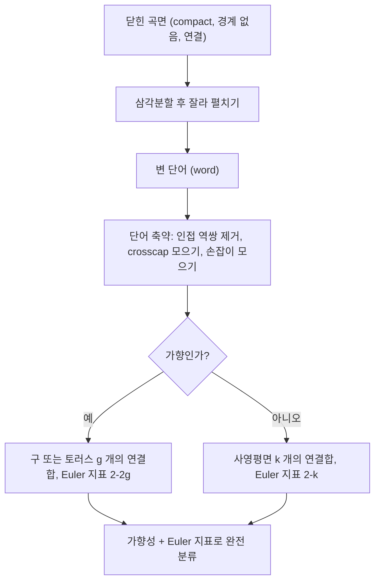

# 곡면의 분류

# 개요

닫힌 곡면(closed surface)은 완전히 분류된다. 임의의 닫힌 곡면은 구, 토러스 $g$ 개의 연결합, 사영평면 $k$ 개의 연결합 중 정확히 하나와 위상동형이며, 두 개의 수치 불변량 — 가향성(orientability)과 [Euler 지표](euler-characteristic.md) — 만으로 완전히 결정된다.

이 정리는 19세기 말 Möbius와 von Dyck의 작업에서 시작해 Radó의 삼각분할 정리(1925)로 엄밀해졌다. "모든 대상을 나열하고 서로 다름을 증명한다"는 분류 정리의 원형이며, 2차원에서만 이렇게 깔끔하다. 3차원 분류는 기하화 추측(Perelman, 2003)으로 겨우 해결되었고, 4차원 이상에서는 닫힌 다양체의 분류가 알고리즘적으로 불가능하다(군의 동형 문제로 환원된다).

두 축의 논증을 함께 쓴다. 존재 방향은 다각형 표현과 단어 축약이라는 조합적 절차이고, 구별 방향은 [기본군](fundamental-group.md)과 Euler 지표라는 대수적 불변량이다.

# 직관

곡면을 종이로 만든다고 생각하자. 삼각형으로 잘게 나눈 곡면을 가위로 잘라 평면 위에 한 장의 다각형으로 펼치면, 원래 곡면은 이 다각형의 변들을 짝지어 붙인 결과로 복원된다. 곡면에 대한 모든 위상 정보는 "어떤 변을 어떤 방향으로 붙였는가"라는 문자열 하나에 들어간다.

붙이는 방식은 두 종류뿐이다. 두 변을 서로 마주 보게(반대 방향으로) 붙이면 손잡이(handle)가 생기고, 같은 방향으로 붙이면 뒤집힘이 생겨 Möbius 띠가 박힌다(crosscap). 앞의 것만 있으면 가향 곡면, 뒤의 것이 하나라도 있으면 비가향 곡면이다.

이제 남는 질문은 "손잡이와 crosscap을 섞으면 무엇이 되는가"이다. 답은 섞이지 않는다는 것이다. crosscap이 하나라도 있으면 손잡이는 crosscap 두 개로 흡수된다(Dyck 정리). 그래서 목록이 두 줄로 끝난다. 구에 손잡이를 $g$ 개 붙인 것들, 구에 crosscap을 $k$ 개 붙인 것들.



# 정의

## 닫힌 곡면

**곡면**이란 2차원 위상 [다양체](manifolds.md), 즉 Hausdorff이고 제2가산이며 각 점이 평면의 열린원판과 위상동형인 근방을 갖는 공간이다. **닫힌 곡면**은 [compact](compactness.md)이고 경계가 없는 곡면을 말한다. 분류 정리에서는 관례상 [연결성](connectedness.md)도 가정한다. 연결이 아니면 성분별로 분류하면 된다.

## 연결합

두 곡면 $S$ 와 $T$ 의 **연결합**(connected sum)은 각각에서 열린원판 하나씩을 제거하고 생긴 두 경계원을 붙여 만든 곡면이다.

$$
S \mathbin{\#} T = \bigl( S \setminus D_S \bigr) \cup_{\partial} \bigl( T \setminus D_T \bigr) .
$$

원판 선택과 붙이는 방식에 따른 모호함은 위상동형 유형을 바꾸지 않는다(가향 곡면에서는 가향을 맞춰 붙인다). 연결합은 교환적·결합적이고 구가 항등원 역할을 한다. 즉 닫힌 곡면의 위상동형류는 연결합에 대해 가환 모노이드를 이룬다.

토러스를 $T$ 로, 사영평면을 $P$ 로 쓰고 $g$ 개의 연결합을 다음과 같이 줄여 쓴다.

$$
gT = \underbrace{T \mathbin{\#} \cdots \mathbin{\#} T}_{g}, \qquad kP = \underbrace{P \mathbin{\#} \cdots \mathbin{\#} P}_{k} .
$$

$gT$ 의 $g$ 를 **종수**(genus)라 한다.

## 다각형 표현과 단어

변의 개수가 짝수인 다각형의 변에 문자를 붙이되 각 문자가 정확히 두 번 나오게 하고, 각 변에 방향을 준다. 다각형 둘레를 한 바퀴 돌며 읽은 문자열을 **단어**(word)라 한다. 역방향 변은 지수 $-1$ 로 표시하며, 아래에서는 대문자로 쓴다. 같은 문자가 붙은 두 변을 방향이 맞도록 동일시하면 닫힌 곡면이 나온다.

기본 예는 다음과 같다.

$$
\text{구} : a a^{-1}, \qquad \text{토러스} : a b a^{-1} b^{-1}, \qquad \text{사영평면} : a a, \qquad \text{Klein 병} : a b a b^{-1} .
$$

일반형(normal form)은 다음 둘이다.

$$
\prod_{i=1}^{g} a_i b_i a_i^{-1} b_i^{-1}, \qquad \prod_{i=1}^{k} c_i c_i .
$$

앞의 것이 $gT$ 이고 뒤의 것이 $kP$ 다.

## 가향성

한 문자가 두 번 모두 같은 방향으로 나타나면(즉 지수 $-1$ 없이 두 번) 그 곡면은 **비가향**이고, 모든 문자가 한 번은 정방향 한 번은 역방향으로 나타나면 **가향**이다. 좌표 없는 정의로는, 곡면이 가향이라는 것은 국소 좌표계의 방향을 전역적으로 일관되게 고를 수 있다는 뜻이며, 동치로 Möbius 띠를 부분공간으로 포함하지 않는다는 뜻이다.

## Euler 지표

삼각분할(또는 임의의 cell 분할)의 꼭짓점·변·면 개수로 정의한다.

$$
\chi = V - E + F .
$$

[Euler 지표](euler-characteristic.md)는 분할에 의존하지 않는 위상 불변량이다. 단어로 주어진 다각형 표현에서는 면이 하나이므로, 변의 개수를 $2n$ 이라 할 때

$$
\chi = V - n + 1
$$

이고 $V$ 는 다각형 꼭짓점들이 동일시로 합쳐져 생긴 동치류의 개수다.

# 성질

## 분류 정리

**정리(닫힌 곡면의 분류).** 모든 연결된 닫힌 곡면은 다음 중 정확히 하나와 위상동형이다.

$$
S^2, \qquad gT \ (g \ge 1), \qquad kP \ (k \ge 1).
$$

두 곡면이 위상동형일 필요충분조건은 가향성이 같고 Euler 지표가 같은 것이다. 각각의 Euler 지표는 다음과 같다.

$$
\chi(S^2) = 2, \qquad \chi(gT) = 2 - 2g, \qquad \chi(kP) = 2 - k .
$$

가향 곡면의 Euler 지표는 항상 짝수이고, 비가향 곡면은 짝수·홀수를 모두 취한다. 따라서 두 목록은 겹치지 않는다.

연결합의 Euler 지표는 원판 두 개를 떼고 경계원을 붙이는 계산에서 다음 공식을 따른다.

$$
\chi(S \mathbin{\#} T) = \chi(S) + \chi(T) - 2 .
$$

## 증명 스케치: 존재

1. **삼각분할.** Radó의 정리에 의해 모든 닫힌 곡면은 삼각분할을 가진다. 이것이 증명의 유일한 비조합적 단계이며, 곡면이 [compact](compactness.md)이고 제2가산이라는 사실을 쓴다.
2. **펼치기.** 삼각형들을 변을 따라 하나씩 이어 붙여 평면 다각형 한 장으로 만든다. 남은 변 짝짓기가 단어를 준다.
3. **인접 역쌍 제거.** 단어 안에 $x x^{-1}$ 형태가 인접해 있으면 잘라내 단어를 짧게 만든다. 단어 길이가 $2$ 가 되면 구 또는 사영평면이므로 종료한다.
4. **꼭짓점 하나로 모으기.** 꼭짓점 동치류가 둘 이상이면, 자르고 붙이기(cut-and-paste)로 한 동치류의 크기를 줄여 결국 모든 꼭짓점을 한 류로 만든다.
5. **crosscap 모으기.** 같은 방향으로 두 번 나오는 문자 쌍은 잘라 붙이기로 $cc$ 형태로 인접시킨다.
6. **손잡이 모으기.** 두 반대 방향 쌍이 서로 얽혀 나타나면(문자 순서가 $a,\,b,\,a^{-1},\,b^{-1}$ 꼴) 두 번의 자르고 붙이기로 교환자 형태 $abAB$ 로 모은다.
7. **Dyck 정리로 혼합 제거.** $cc$ 와 $aba^{-1}b^{-1}$ 이 함께 있으면 다음 관계로 손잡이를 crosscap 두 개로 바꾼다.

$$
T \mathbin{\#} P \cong P \mathbin{\#} P \mathbin{\#} P .
$$

각 단계는 단어의 길이를 늘리지 않고 "정돈되지 않은 부분"을 줄이므로 절차가 종료한다. 결과가 두 일반형 중 하나다.

7번이 정리의 핵심 비대칭이다. Klein 병이 사영평면 두 개의 연결합이라는 사실과 함께 보면, 비가향 세계에서는 손잡이가 독립적인 정보를 주지 않는다.

## 증명 스케치: 구별

목록의 곡면들이 서로 다름은 불변량으로 보인다.

- **가향성**은 정의상 위상 불변량이다. Möbius 띠를 포함하는가로 판정된다.
- **Euler 지표**는 [단체 호몰로지](homology.md)의 Betti 수 교대합이므로 삼각분할 선택과 무관하다.
- 가향 곡면들끼리는 Euler 지표 $2-2g$ 가 $g$ 를 결정하고, 비가향끼리는 $2-k$ 가 $k$ 를 결정한다.

가향성을 호몰로지로도 읽을 수 있다. 최고차 호몰로지 군이 정수 계수로 무한순환군이면 가향, 자명군이면 비가향이다.

## 기본군

[기본군](fundamental-group.md)의 표시는 일반형 단어에서 직접 읽힌다. 다각형은 단연결이고 변 동일시로 1차원 복합체에 2-cell 하나를 붙인 꼴이므로, van Kampen 정리에 의해 생성원은 변, 관계식은 둘레 단어 하나다.

$$
\pi_1(gT) = \bigl\langle a_1, b_1, \dots, a_g, b_g \ \big| \ \textstyle\prod_{i=1}^{g} [a_i, b_i] = 1 \bigr\rangle ,
$$

$$
\pi_1(kP) = \bigl\langle c_1, \dots, c_k \ \big| \ c_1^2 c_2^2 \cdots c_k^2 = 1 \bigr\rangle .
$$

구의 기본군은 자명하고, 토러스는 정수 두 개의 직합, 사영평면은 위수 2의 순환군이다. 아벨화하면 1차 호몰로지가 나온다.

$$
H_1(gT) \cong \mathbb{Z}^{2g}, \qquad H_1(kP) \cong \mathbb{Z}^{k-1} \oplus \mathbb{Z}/2\mathbb{Z} .
$$

비가향 곡면에 나타나는 위수 2의 꼬임(torsion) 부분이 crosscap의 대수적 흔적이다. 실제로 기본군만으로도 닫힌 곡면이 완전히 구별된다. 구가 아닌 닫힌 곡면은 모두 비구면(aspherical) 공간이고, 기본군이 위상동형 유형을 결정한다.

## 예: Klein 병

Klein 병 $K$ 는 단어 $abab^{-1}$ 로 주어지는 비가향 닫힌 곡면이다. 성질을 정리하면 다음과 같다.

- Euler 지표가 $0$ 이고 비가향이므로 분류 정리에 따라 $K$ 는 사영평면 두 개의 연결합이다. 단어 수준에서는 $abaB$ 와 $aabb$ 가 같은 곡면을 준다.
- 기본군은 반직접곱 표시를 가진다.

$$
\pi_1(K) = \langle a, b \mid a b a b^{-1} = 1 \rangle \cong \mathbb{Z} \rtimes \mathbb{Z} .
$$

- $K$ 는 3차원 Euclid 공간에 매장(embedding)되지 않는다. 닫힌 비가향 곡면은 모두 그렇다. 4차원에서는 매장된다.
- 토러스가 $K$ 의 2겹 덮개공간이다. 덮개 차수만큼 Euler 지표가 곱해지는데 두 곡면 모두 Euler 지표가 $0$ 이므로 모순이 없다.

## 경계가 있는 곡면

경계원 $b$ 개를 가진 compact 곡면도 같은 방식으로 분류된다. 닫힌 곡면에서 원판 $b$ 개를 떼어낸 것과 위상동형이며 Euler 지표는 다음과 같다.

$$
\chi = 2 - 2g - b \quad (\text{가향}), \qquad \chi = 2 - k - b \quad (\text{비가향}).
$$

원판, 원환(annulus), Möbius 띠가 각각 $(g,b)=(0,1)$ 과 $(g,b)=(0,2)$ 와 $(k,b)=(1,1)$ 에 해당한다.

# 활용

## 계산: 단어에서 곡면 읽기

다각형 단어가 주어지면 꼭짓점 동치류를 [서로소 집합 자료구조](union-find.md)로 세어 Euler 지표를 얻고, 문자의 방향 패턴으로 가향성을 판정한다. 이 둘이 분류 정리의 완전 불변량이므로 곡면의 이름이 곧바로 결정된다.

```python
def classify(word):
    """다각형 변 단어에서 닫힌 곡면을 식별한다.
    소문자는 변의 정방향, 대문자는 역방향을 뜻한다 (예: 토러스 = 'abAB')."""
    n = len(word)
    parent = list(range(n))

    def find(x):
        while parent[x] != x:
            parent[x] = parent[parent[x]]
            x = parent[x]
        return x

    def union(x, y):
        rx, ry = find(x), find(y)
        if rx != ry:
            parent[rx] = ry

    # 변 i 의 시작 꼭짓점은 i, 끝 꼭짓점은 (i+1) % n
    for i in range(n):
        for j in range(i + 1, n):
            if word[i].lower() != word[j].lower():
                continue
            if word[i].islower() == word[j].islower():   # 같은 방향으로 붙인다
                union(i, j)
                union((i + 1) % n, (j + 1) % n)
            else:                                        # 반대 방향으로 붙인다
                union(i, (j + 1) % n)
                union((i + 1) % n, j)

    V = len({find(i) for i in range(n)})
    chi = V - n // 2 + 1                  # 면은 다각형 하나
    orientable = all(word.count(c) == 1 for c in set(word.lower()))
    if orientable:
        g = (2 - chi) // 2
        name = "구" if g == 0 else f"토러스 {g} 개의 연결합 (종수 {g})"
    else:
        k = 2 - chi
        name = f"사영평면 {k} 개의 연결합" + (" = Klein 병" if k == 2 else "")
    return {"chi": chi, "orientable": orientable, "surface": name}


for w in ["aA", "abAB", "aa", "abaB", "aabb", "abABcdCD"]:
    print(w, classify(w))

# aA       chi=2  가향    구
# abAB     chi=0  가향    토러스
# aa       chi=1  비가향  사영평면
# abaB     chi=0  비가향  Klein 병
# aabb     chi=0  비가향  Klein 병      (같은 곡면의 다른 단어)
# abABcdCD chi=-2 가향    종수 2
```

## 기하학과의 연결

Gauss–Bonnet 정리는 분류를 기하로 옮긴다. 닫힌 곡면 위의 임의의 Riemann 계량에 대해 Gauss [곡률](curvature.md)의 적분은 위상만으로 결정된다.

$$
\int_S K \, dA = 2\pi \chi(S) .
$$

따라서 구에는 평평한 계량이 없고, 토러스에는 곡률이 어디서나 양인 계량이 없다. 균일화(uniformization) 정리는 여기서 한 걸음 더 나아가, 모든 닫힌 곡면이 곡률이 상수인 계량을 가진다고 말한다. Euler 지표가 양이면 구면 기하, $0$ 이면 Euclid 기하, 음이면 쌍곡 기하다. 종수가 2 이상인 곡면이 쌍곡 평면의 몫으로 실현되는 것이 그 예이며, 자세한 도구는 [Riemann 계량과 측지선](riemannian-metrics.md)에서 다룬다.

## 그래프 이론과 조합론

- 곡면 위에 매장된 그래프에 대해 Euler 공식이 일반화된다. 연결 그래프를 종수 $g$ 인 가향 곡면에 면이 모두 원판이 되게 매장하면 $V - E + F = 2 - 2g$ 다. 평면 그래프는 $g = 0$ 인 경우다.
- 이 공식이 Heawood 수를 통해 곡면별 채색수 상한을 준다. 사영평면은 6색, 토러스는 7색으로 충분하다. 평면(4색 정리)만이 이 일반 공식에서 벗어나는 예외다.
- 그래프의 종수(매장 가능한 최소 종수)는 위상적 분류가 조합 문제에 직접 쓰이는 대표적 예다.

## 고차원과 한계

곡면 분류가 가능한 이유는 2차원의 기본군이 다루기 쉬운 표시를 갖고, Euler 지표가 완전 불변량이 되기 때문이다. 차원이 오르면 상황이 급변한다.

- 3차원: Thurston 기하화 추측이 Perelman에 의해 증명되어 분류의 골격이 마련되었지만, 목록은 훨씬 복잡하다.
- 4차원 이상: 유한 표시군은 모두 닫힌 4차원 다양체의 기본군으로 실현되고, 유한 표시군의 동형 판정은 [계산 가능성과 정지 문제](computability.md)의 의미에서 결정 불가능하다. 따라서 닫힌 4차원 다양체의 분류 알고리즘은 존재하지 않는다.

2차원의 분류 정리가 "완전한 분류"의 드문 성공 사례로 남는 이유다.

# 연관 문서

## 선수지식

- [Euler 지표](euler-characteristic.md)
- [기본군](fundamental-group.md)
- [Compactness](compactness.md)

## 더 알아보기

- [Riemann 곡면과 균일화 정리](riemann-surfaces.md)
- [Teichmüller 공간과 곡면의 모듈라이](teichmuller-space.md)

#topology #theorem
