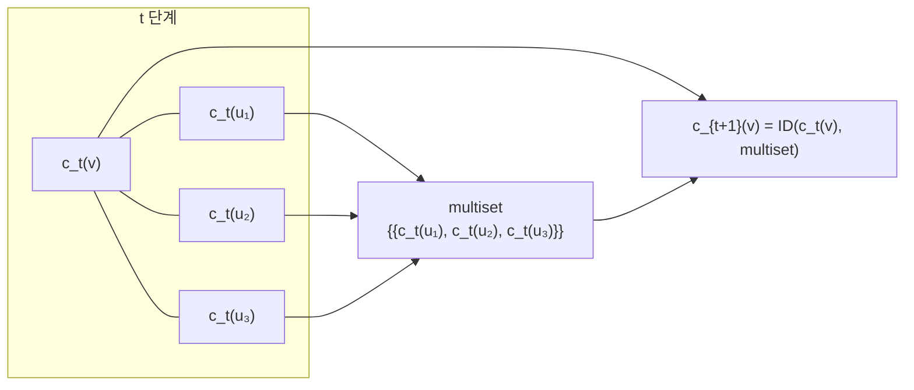
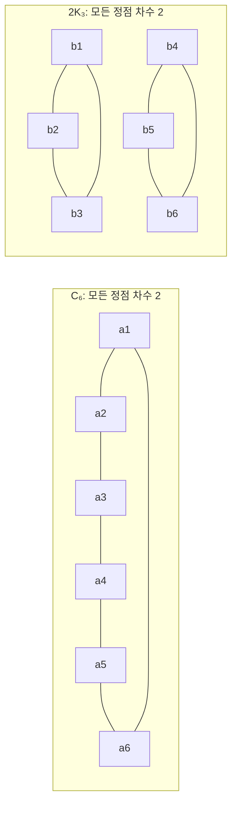

# Color refinement

# 개요

[그래프 동형](graph-isomorphism.md) 판정은 정점 이름표를 지운 뒤 두 그래프가 같은지 묻는 문제다. 모든 대응을 다 시도하면 정점 수의 계승만큼 경우가 생기므로, 실제로는 먼저 정점들을 구조적으로 구분해 대응 후보를 줄인다.

Color refinement 는 그 구분을 가장 단순한 국소 정보만으로 수행한다. 각 정점에 색을 붙이고, 이웃들이 어떤 색을 몇 개씩 가지는지를 보아 색을 쪼갠다. 이것을 더 쪼개지지 않을 때까지 반복한다. 이웃의 이웃까지 정보가 번지므로 몇 번의 반복만으로 꽤 먼 구조가 색에 반영된다.

얻는 것과 잃는 것이 모두 분명하다. 색 분포가 다르면 두 그래프는 확실히 비동형이다. 반대로 색 분포가 같다고 해서 동형은 아니다. 이 한계가 어디서 오는지가 이 문서의 핵심이고, 같은 한계가 이웃 집계로 작동하는 [그래프 신경망의 표현력](gnn-expressivity.md)에 그대로 옮겨진다.

# 직관

## 이웃의 명함을 모은다

정점 하나가 자기에 대해 아는 것은 차수뿐이다. 그런데 이웃들에게 각자의 차수를 물어보면 조금 더 알게 된다. 차수 3인 이웃 둘과 차수 1인 이웃 하나를 가진 정점은, 차수 2인 이웃 셋을 가진 정점과 구별된다. 이 질문을 한 번 더 반복하면 이웃의 이웃까지 반영된다.

색은 이 "지금까지 알아낸 것" 을 하나의 기호로 압축한 것이다. `t` 번째 색이 같다는 말은 반지름 `t` 의 이웃 구조를 다음 규칙으로 볼 때 구별되지 않는다는 뜻이다.



이웃을 집합이 아니라 multiset 으로 모으는 것이 중요하다. 같은 색 이웃이 둘인지 셋인지가 구별에 쓰이는 정보다.

## 왜 세어보기만 해서는 부족한가

이 절차가 보는 것은 결국 "각 색이 몇 개" 뿐이다. 이웃들 사이에 간선이 있는지, 두 이웃이 같은 정점을 공유하는지는 보지 않는다. 그래서 국소적으로는 똑같아 보이지만 전체 모양이 다른 그래프를 놓친다.

육각형 하나와 삼각형 두 개가 그런 예다. 모든 정점이 차수 2 이고, 모든 이웃이 차수 2 이고, 그 이웃의 이웃도 차수 2 다. 아무리 반복해도 모든 정점의 색이 같이 움직이므로 두 그래프를 구별하지 못한다. 그런데 삼각형 쪽은 길이 3 의 순환이 있고 육각형 쪽은 없다.



구별 실패는 "모른다" 이지 "같다" 가 아니다. 이 비대칭이 활용 방식을 결정한다.

# 정의

## 갱신 규칙

유한 그래프의 정점 집합을 `V`, 정점 `v` 의 이웃 집합을 `N(v)` 라 한다. `c_t(v)` 는 `t` 번째 반복에서 `v` 에 붙인 색이다. 초기 색 `c_0` 은 주어진 라벨이며, 라벨이 없으면 모든 정점에 같은 색을 준다.

$$
c_{t+1}(v)=\operatorname{ID}\left(c_t(v),\{\!\{c_t(u):u\in N(v)\}\!\}\right)
$$

$\mathrm{ID}$ 는 서로 다른 입력 쌍에 서로 다른 새 색을 배정하는 단사 함수다. 여기서 $\{\!\{\cdot\}\!\}$ 는 multiset 으로, 원소의 중복도를 보존한다.

두 그래프를 비교할 때는 반드시 같은 `ID` 규칙을 써야 한다. 구현에서는 두 그래프의 분리 합집합 위에서 색을 함께 갱신하면 자동으로 보장된다.

이 정점 단위 절차를 1-dimensional Weisfeiler–Leman refinement, 줄여서 1-WL 이라 부른다. 정점 `k` 개짜리 튜플에 색을 붙이는 `k`-WL 로 일반화되며, `k` 가 커질수록 구별력이 강해진다.

## 안정 분할

색은 `V` 의 분할을 정한다. `c_{t+1}` 이 정하는 분할이 `c_t` 의 것과 같아지면 그 이후로는 아무것도 바뀌지 않는다. 이때의 분할을 안정 분할이라 한다.

## 계산

```python
def color_refinement(adj, labels=None):
    """adj: {v: [이웃들]}. 안정 분할에 도달할 때까지 색을 갱신한다."""
    color = dict.fromkeys(adj, 0) if labels is None else dict(labels)
    while True:
        signature = {
            v: (color[v], tuple(sorted(color[u] for u in adj[v])))
            for v in adj
        }
        table = {}
        for sig in sorted(set(signature.values())):
            table[sig] = len(table)          # 같은 ID 규칙을 두 그래프에 공유
        new_color = {v: table[signature[v]] for v in adj}
        if len(set(new_color.values())) == len(set(color.values())):
            return new_color                 # 분할이 더 세분화되지 않음
        color = new_color
```

`signature` 에서 이웃 색을 정렬한 튜플이 multiset 역할을 한다. 종료 조건은 색 번호가 같아지는 것이 아니라 색 부류의 개수가 늘지 않는 것이다.

# 성질

## 분할은 세분화만 된다

이전 색 `c_t(v)` 가 갱신 입력에 포함되므로 $c_t(v) \ne c_t(w)$ 이면 $c_{t+1}(v) \ne c_{t+1}(w)$ 다. 즉 한 번 나뉜 색 부류는 다시 합쳐지지 않는다.

색 부류의 개수는 매 단계 줄지 않고 `|V|` 를 넘지 못하므로, 반복은 `|V|` 번 안에 안정 분할에 도달한다. 실제로는 분할이 실제로 세분화되는 단계가 최대 `|V|-1` 번이다.

## 동형사상은 색을 보존한다

$\varphi: G \to H$ 가 동형사상이면 모든 $t$ 와 모든 $v$ 에 대해 $c_t(v) = c_t(\varphi(v))$ 다.

$t$ 에 대한 귀납으로 보인다. $t=0$ 은 초기 라벨이 대응한다는 가정이다. $t$ 에서 성립하면, $\varphi$ 가 $N(v)$ 를 $N(\varphi(v))$ 로 전단사로 옮기므로 이웃 색의 multiset 이 같고, 같은 $\mathrm{ID}$ 를 쓰므로 $c_{t+1}$ 도 같다.

따라서 다음 대우가 성립하고, 이것이 이 절차를 쓰는 이유다.

$$
\exists t:\ \{\!\{c_t(v):v\in V(G)\}\!\}\ \ne\ \{\!\{c_t(v):v\in V(H)\}\!\}\quad\Longrightarrow\quad G\not\cong H
$$

## 역은 성립하지 않는다

$C_6$ 와 $2K_3$ 는 모든 정점이 초기 색이 같고 차수가 2 다. 귀납적으로 모든 단계에서 두 그래프의 모든 정점이 같은 색을 가지므로 색 분포가 영원히 일치한다. 그런데 $C_6$ 는 연결되어 있고 $2K_3$ 는 아니므로 비동형이다.

더 일반적으로, 같은 차수수열을 가진 정칙 그래프는 1-WL 로 전혀 구별되지 않는다. 모든 정점이 처음부터 끝까지 같은 색이기 때문이다.

## 구별력의 정확한 성격

1-WL 이 구별하지 못하는 두 그래프는 정확히 "같은 개수의 나무형 부분구조를 가지는" 그래프다. 즉 각 나무 $T$ 에 대해 $T$ 에서 $G$ 로 가는 준동형의 개수가 두 그래프에서 일치한다. 순환을 세는 정보는 여기에 들어오지 않으며, 그래서 $C_6$ 와 $2K_3$ 가 걸러지지 않는다.

## 비용

각 단계에서 모든 간선을 상수 번 보고 서명을 정렬하므로 한 단계가 `O(m log n)` 이다. 단계 수를 곱하면 소박하게는 `O(nm log n)` 이지만, 크기가 작은 색 부류만 처리하는 Hopcroft 식 기법으로 전체를 `O(m log n)` 에 끝낼 수 있다[^1].

## 색칠과의 구분

여기서의 색은 인접 정점에 서로 다른 색을 배정하는 [그래프 색칠](graph-coloring.md)과 목적이 다르다. 이웃끼리 같은 색이어도 아무 문제가 없다. 여기서 색은 "구조적으로 구별되지 않는 정점들의 부류" 라는 이름표일 뿐이다.

# 활용

## 동형 판정의 전처리

실용적인 동형 판정기는 먼저 color refinement 로 정점을 색 부류로 나눈다. 색 분포가 다르면 즉시 비동형으로 판정하고 끝낸다. 같으면 대응 후보를 같은 색끼리로 제한한 뒤 역추적으로 실제 대응을 찾는다. 무작위 그래프에서는 대부분 색 부류가 한 정점씩으로 쪼개지므로 후보가 거의 남지 않는다.

구별에 실패했다는 결과가 동형의 증명서가 아니라는 점은 계속 유효하다. 안정 분할은 후보를 줄일 뿐이다.

## 정준 형식

안정 분할이 정점을 부류로 나누면, 부류를 정해진 순서로 나열해 그래프의 정준 라벨링을 만드는 데 쓴다. 정준 형식이 같은지 비교하면 그래프를 해시 가능한 값으로 다룰 수 있다.

## 구조적 특징

색 분포 자체가 그래프의 특징 벡터다. 반복 횟수 `t` 를 고정하고 색 히스토그램을 만들면 Weisfeiler–Leman 커널이 되어 그래프 분류에 쓰인다.

## 표현력의 상한

이웃의 정보를 모아 자기 표현을 갱신하는 모든 구조는 1-WL 보다 강할 수 없다. 갱신 함수가 단사가 아니면 오히려 약해진다. 이것이 [그래프 신경망의 표현력](gnn-expressivity.md)을 규정하는 핵심 결과이고, 이웃 집계를 multiset 에 대한 단사 함수로 설계해야 한다는 지침이 여기서 나온다.

[^1]: Berkholz, Bonsma, Grohe, *Tight Lower and Upper Bounds for the Complexity of Canonical Colour Refinement* (2015), https://arxiv.org/abs/1509.08251. 안정 분할과 정준적 refinement 의 정확한 복잡도.

# 연관 문서

## 선수지식

- [그래프 동형](graph-isomorphism.md)

## 더 알아보기

- [논문: How Powerful are Graph Neural Networks?](gnn-expressivity.md)

#graph_theory #algorithms
