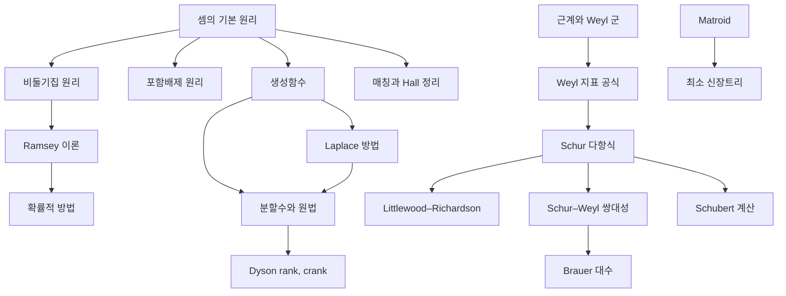

# 조합론 개관

# 개요

조합론은 유한한 대상을 세고, 배열하고, 극단적인 구성이 존재하는지 묻는 분야다. 기본 물음은 "몇 개인가" 이지만 답하는 방식이 갈래를 만든다. 직접 세는 대신 생성함수로 세고, 존재를 보이는 대신 확률로 보이고, 개별 대상 대신 대칭군의 표현으로 센다. 조합론의 갈래는 네 줄기다. 세기의 기초, 극단·확률 조합론, 그래프와 매트로이드, 그리고 표현론과 맞닿은 대수적 조합론이다.

시작점은 [셈의 기본 원리](counting-principles.md)다. 거기서 [비둘기집 원리](pigeonhole-principle.md)로 가면 [Ramsey 이론](ramsey-theory.md)과 [확률적 방법](probabilistic-method.md)이 이어지고, [생성함수](generating-functions.md)로 가면 [분할수](partitions.md)를 거쳐 모듈러 형식과 만난다. 대수적 조합론은 [근계](root-systems.md)와 [Weyl 지표 공식](weyl-character-formula.md)에서 [Schur 다항식](schur-polynomials.md)으로 내려온다.

# 지도

# 갈래

## 세기의 기초

- [셈의 기본 원리](counting-principles.md): 합·곱 법칙, 이중 계산, 전단사 논법
- [비둘기집 원리](pigeonhole-principle.md), [포함배제 원리](inclusion-exclusion.md): 존재와 개수의 두 기본 도구
- [생성함수](generating-functions.md) → [분할수와 원법](partitions.md): 수열을 함수로 바꿔 세기
- [Pólya 세기 정리](polya-enumeration.md): 대칭을 무시한 색칠의 개수
- [Laplace 방법과 안장점](laplace-method.md): 세는 수의 점근

## 극단 조합론과 확률적 방법

- [Ramsey 이론](ramsey-theory.md): 충분히 크면 질서가 강제된다
- [Dilworth 정리](dilworth-theorem.md): 사슬 덮개와 반사슬의 최소최대 정리, Erdős–Szekeres 정리
- [Sperner 정리](sperner-theorem.md): 부분집합 격자의 최대 반사슬과 LYM 부등식
- [Erdős–Ko–Rado 정리](erdos-ko-rado.md): 교차족의 최대 크기, Katona 의 순환 배열 세기
- [Littlewood–Offord 문제](littlewood-offord.md): 부호합의 반집중, 반사슬 논법이 주는 상한
- [Stirling 수](stirling-numbers.md): 집합 분할과 순열의 순환을 세는 수, 거듭제곱과 내림 계승의 기저 변환
- [조합적 설계](block-designs.md): 원소쌍이 고르게 나타나는 블록족, Fisher 부등식과 유한 사영평면
- [Latin 방진](latin-squares.md): 직교하는 방진의 최대 개수, Euler 추측의 반증
- [확률적 방법](probabilistic-method.md): 무작위 대상이 존재를 증명한다
- [Erdős–Rényi 랜덤 그래프](erdos-renyi-graphs.md): 문턱 현상, 연결성과 거대 성분
- [부울 함수의 Fourier 해석](boolean-fourier.md): 초입방체 위의 조화해석, 복잡도 이론의 도구

## 그래프와 매트로이드

그래프 자체는 [그래프](graphs.md) 문서와 그 자식들이 다룬다. 여기는 조합 구조 쪽이다.

- [매칭과 Hall 정리](matchings.md): 이분 그래프의 완전 매칭 조건
- [Matroid](matroids.md): 독립성의 공리화, 탐욕 알고리즘이 통하는 이유
- [완전그래프와 강한 완전그래프 정리](perfect-graphs.md): 색칠수와 클릭수가 일치하는 그래프

## 대수적 조합론

대칭군과 일반선형군의 표현이 조합적 대상(분할, 표, 격자경로)으로 세어진다.

- [근계와 Weyl 군](root-systems.md) → [Weyl 지표 공식](weyl-character-formula.md) → [Schur 다항식과 대칭함수](schur-polynomials.md)
- [Littlewood–Richardson 규칙](littlewood-richardson.md), [Schubert 계산](schubert-calculus.md): Schur 다항식의 곱을 세기
- [Schur–Weyl 쌍대성](schur-weyl-duality.md) → [Brauer 대수](brauer-algebras.md)
- [Kazhdan–Lusztig 다항식](kazhdan-lusztig.md) → [범주 O](category-o.md), [MV 순환](mv-cycles.md)(Mirkovic–Vilonen), [Casselman–Shalika 공식](casselman-shalika.md): 표현론 깊은 곳의 조합론

## 격자, 부호, 설계

- [구 채우기와 E8, Leech 격자](sphere-packing.md) → [Niemeier 격자](niemeier-lattices.md) → [Schellekens 목록](schellekens-list.md)
- [Mathieu 군과 Golay 부호](mathieu-groups.md): 부호와 산재 단순군
- [theta 급수](theta-series.md), [Siegel–Weil 공식](siegel-weil.md): 격자 벡터 세기와 모듈러 형식
- [Mock 모듈러 형식](mock-modular-forms.md), [Dyson 의 rank 와 crank](dyson-rank-crank.md): 분할수의 합동

# 연관 문서

## 선수지식

- [집합](sets.md)

## 더 알아보기

- [셈의 기본 원리](counting-principles.md)
- [Matroid](matroids.md)

#combinatorics #overview
