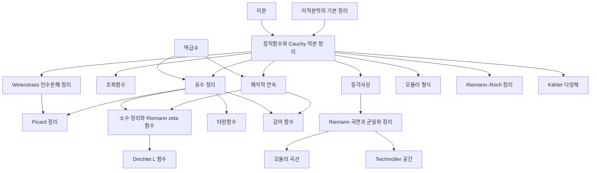

# 복소해석 개관

# 개요

복소해석은 복소평면의 열린집합에서 복소 미분가능한 함수를 다룬다. 물음은 "방향을 가리지 않는 미분가능성이 함수에 무엇을 강제하는가" 이고, 답은 강성으로 나온다. 한 번 복소 미분가능하면 무한 번 미분 가능하고, 멱급수로 전개되며, 경계값이 내부값을 결정하고, 작은 집합 위의 값이 함수 전체를 결정한다.

복소해석의 갈래는 네 줄기다. 정칙함수와 그 실수판인 조화함수, 멱급수와 Laurent 급수로 특이점을 다루는 유수 계산, 영점의 위치가 함수를 결정하는 인수분해와 값 분포, 그리고 정의역을 넓히거나 영역을 바꿔치는 해석적 연속과 등각사상이다. 이 도구들을 가장 많이 쓰는 곳은 해석적 정수론이고, 그쪽 문서는 [정수론 개관](number-theory-overview.md)에 있다.

시작은 [정칙함수와 Cauchy 적분 정리](holomorphic-functions.md)다. 거기서 [유수 정리](residue-theorem.md)로 가면 특이점과 실적분 계산이 나오고, [해석적 연속](analytic-continuation.md)으로 가면 감마 함수와 zeta 함수의 정의역 확장이 나오며, [등각사상](conformal-mapping.md)에서 [Riemann 곡면](riemann-surfaces.md)으로 갈라진다.

# 지도

# 갈래

## 정칙함수와 조화함수

- [정칙함수와 Cauchy 적분 정리](holomorphic-functions.md): Cauchy–Riemann 방정식, Goursat 논법, 적분 공식, Liouville 정리, 대수학의 기본정리
- [조화함수](harmonic-functions.md): Laplace 방정식과 조화 켤레, 평균값 성질, 최대 원리, Poisson 적분 공식, Harnack 부등식
- [Dirichlet 문제](dirichlet-problem.md): 경계값을 갖는 조화함수의 존재, Perron 구성과 장벽

## 급수와 특이점

- [멱급수](power-series.md): 수렴반지름, 항별 미분, 해석함수
- [유수 정리](residue-theorem.md): 고립 특이점의 분류, 유수 계산, 실적분으로의 응용
- [타원함수](elliptic-functions.md): 이중주기 유리형함수, Weierstrass 페 함수와 그 미분방정식, 복소 원환면

## 영점과 값 분포

- [Weierstrass 인수분해 정리](weierstrass-factorization.md): 기본 인수와 무한곱, 지정한 영점을 갖는 전해석함수, 위수와 Hadamard 인수분해
- [Picard 정리](picard-theorems.md): Casorati–Weierstrass 정리, 두 값을 피할 수 없다는 작은·큰 Picard, Montel 정리와 정규족

## 확장과 사상

- [해석적 연속](analytic-continuation.md): 함수 요소와 경로를 따른 연속, 항등정리와 유일성, 단일가치 정리, 자연 경계
- [등각사상](conformal-mapping.md): Möbius 변환, Schwarz 보조정리, Riemann 사상정리, Schwarz–Christoffel 공식
- [Riemann 곡면과 균일화 정리](riemann-surfaces.md): 다가함수를 단일가치로 만드는 곡면, 구면·평면·원판의 삼분법

## 해석적 수론

- [감마 함수](gamma-function.md): 함수방정식을 거꾸로 읽어 얻는 유리형 확장과 점근전개
- [Riemann zeta 함수](riemann-zeta.md): Euler 곱, 함수방정식, 임계띠의 영점
- [소수 정리](prime-number-theorem.md): 직선 $\mathrm{Re}\thinspace s=1$ 위의 비영점성이 주는 소수 계수 함수의 점근
- [Dirichlet L 함수](dirichlet-l-functions.md): 등차수열의 소수 정리
- [모듈러 형식](modular-forms.md): 상반평면 위의 변환 규칙을 가진 정칙함수
- [Riemann–Roch 정리](riemann-roch.md): 곡면 위 유리형함수 공간의 차원
- [Kähler 다양체](kahler-manifolds.md): 조화형식으로 읽는 코호몰로지

# 연관 문서

## 선수지식

- [집합](sets.md)

## 더 알아보기

- [정칙함수와 Cauchy 적분 정리](holomorphic-functions.md)

#complex_analysis #analysis #number_theory #overview
