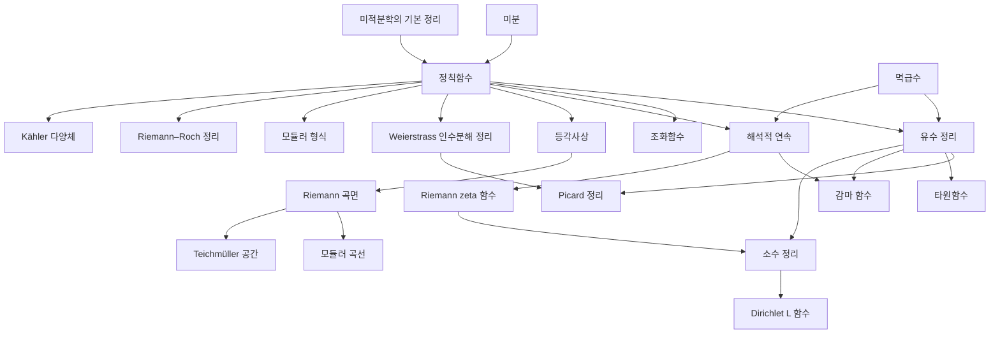

# 복소해석 개관

# 개요

복소해석(complex analysis)은 복소평면의 열린집합에서 복소 미분가능한 함수를 다룬다. 물음은 "방향을 가리지 않는 미분가능성이 함수에 무엇을 강제하는가" 이고, 답은 강성으로 나온다. 한 번 복소 미분가능하면 무한 번 미분 가능하고, 멱급수로 전개되며, 경계값이 내부값을 결정하고, 작은 집합 위의 값이 함수 전체를 결정한다.

복소해석의 갈래는 정칙함수와 그 실수판인 조화함수, 멱급수와 Laurent 급수로 특이점을 다루는 유수 계산, 영점의 위치가 함수를 결정하는 인수분해와 값 분포, 정의역을 넓히거나 영역을 바꿔치는 해석적 연속과 등각사상이다. 이 도구들을 가장 많이 쓰는 곳은 해석적 정수론이다. 복소해석에서 바로 이어지는 문서는 해석적 수론 갈래에 모았고, 나머지는 [정수론 개관](number-theory-overview.md)에 있다.

시작은 [정칙함수](holomorphic-functions.md)다. 거기서 [유수 정리](residue-theorem.md)로 가면 특이점과 실적분 계산이 나오고, [해석적 연속](analytic-continuation.md)으로 가면 [감마 함수](gamma-function.md)와 [Riemann zeta 함수](riemann-zeta.md)의 정의역 확장이 나오며, [등각사상](conformal-mapping.md)에서 [Riemann 곡면](riemann-surfaces.md)으로 갈라진다.

# 지도

```mermaid
graph TD
  DV["미분"] --> HF["정칙함수"]
  FC["미적분학의 기본 정리"] --> HF
  PS["멱급수"] --> RT["유수 정리"]
  HF --> RT
  HF --> HM["조화함수"]
  PS --> AC["해석적 연속"]
  HF --> AC
  HF --> CM["등각사상"]
  HF --> WF["Weierstrass 인수분해 정리"]
  WF --> PC["Picard 정리"]
  RT --> PC
  CM --> RS["Riemann 곡면"]
  RS --> MC["모듈러 곡선"]
  RS --> TS["Teichmüller 공간"]
  RT --> EF["타원함수"]
  RT --> GF["감마 함수"]
  AC --> GF
  AC --> RZ["Riemann zeta 함수"]
  RZ --> PNT["소수 정리"]
  RT --> PNT
  PNT --> DL["Dirichlet L 함수"]
  HF --> MF["모듈러 형식"]
  HF --> RR["Riemann–Roch 정리"]
  HF --> KM["Kähler 다양체"]
```

# 갈래

처음 읽는 사람은 정칙함수와 조화함수, 급수와 특이점, 영점과 값 분포의 순서로 읽는다. 그 뒤는 두 방향으로 갈린다. 확장과 사상은 정의역을 넓히거나 영역을 바꿔치는 쪽이고 복소역학이 그 뒤에 온다. 해석적 수론은 급수와 특이점만 읽고도 들어갈 수 있다.

## 정칙함수와 조화함수

먼저 읽을 것: [미분](derivative.md)(해석 개관). 시작 문서: [정칙함수](holomorphic-functions.md).

- [정칙함수](holomorphic-functions.md): Cauchy–Riemann 방정식, Goursat 논법, 적분 공식, Liouville 정리, 대수학의 기본정리
- [조화함수](harmonic-functions.md): Laplace 방정식과 조화 켤레, 평균값 성질, 최대 원리, Poisson 적분 공식, Harnack 부등식
  - [Dirichlet 문제](dirichlet-problem.md): 경계값을 갖는 조화함수의 존재, Perron 구성과 장벽

## 급수와 특이점

먼저 읽을 갈래: 정칙함수와 조화함수. 시작 문서: [멱급수](power-series.md).

- [멱급수](power-series.md): 수렴반지름, 항별 미분, 해석함수
- [유수 정리](residue-theorem.md): 고립 특이점의 분류, 유수 계산, 실적분으로의 응용
- [해석적 연속](analytic-continuation.md): 함수 요소와 경로를 따른 연속, 항등정리와 유일성, 단일가치 정리, 자연 경계
  - [타원함수](elliptic-functions.md): 이중주기 유리형함수, Weierstrass 페 함수와 그 미분방정식, 복소 원환면

## 영점과 값 분포

먼저 읽을 갈래: 급수와 특이점. 먼저 읽을 것: [Arzelà–Ascoli 정리](arzela-ascoli.md)(함수해석 개관). 시작 문서: [Weierstrass 인수분해 정리](weierstrass-factorization.md).

- [Weierstrass 인수분해 정리](weierstrass-factorization.md): 기본 인수와 무한곱, 지정한 영점을 갖는 전해석함수, 위수와 Hadamard 인수분해
  - [Picard 정리](picard-theorems.md): Casorati–Weierstrass 정리, 두 값을 피할 수 없다는 작은 Picard 와 큰 Picard
- [Hurwitz 정리](hurwitz-theorem.md): 국소 균등수렴에서 영점 개수의 보존, 영점 없음과 단사성의 보존, Rouché 정리와의 관계
- [Montel 정리](montel-theorem.md): 국소 유계인 정칙함수족의 정규성, 두 값을 생략하는 족

## 확장과 사상

먼저 읽을 갈래: 영점과 값 분포. 먼저 읽을 것: [덮개공간](covering-spaces.md)(위상 개관). 시작 문서: [등각사상](conformal-mapping.md).

- [등각사상](conformal-mapping.md): Möbius 변환, Schwarz 보조정리, 원판의 자기동형군
- [Riemann 사상정리](riemann-mapping-theorem.md): 단순연결 영역과 원판의 등각동치, 극값 문제로 가는 증명과 Carathéodory 경계 확장
- [Riemann 곡면](riemann-surfaces.md): 다가함수를 단일가치로 만드는 곡면, 구면과 평면과 원판의 삼분법
  - [Riemann–Hurwitz 공식](riemann-hurwitz-formula.md): 정칙사상의 차수와 분기지수로 두 곡면의 종수를 잇는 등식, 초타원곡선과 Fermat 곡선의 종수, 자기동형군의 84(g−1) 상계
  - [초타원곡선](hyperelliptic-curves.md): y² = f(x) 로 쓰이는 곡선, 초타원 대합과 정칙 미분의 기저, 종수 2 곡선이 전부 초타원이라는 것
- [준등각 사상](quasiconformal-maps.md): 왜곡을 유계로 묶은 동형사상, Beltrami 방정식과 가측 Riemann 사상 정리
  - [Riemann–Roch 정리](riemann-roch.md): 곡면 위 유리형함수 공간의 차원
  - [Jacobi 다양체](jacobian-variety.md): 주기 격자로 나눈 복소 토러스, Abel 정리가 주는 주 divisor 판정
  - [Kähler 다양체](kahler-manifolds.md): 조화형식으로 읽는 코호몰로지
  - [곡선의 모듈라이 공간](moduli-of-curves.md): 종수 $g$ 곡선의 동형류가 이루는 차원 $3g-3$ 의 공간, 안정곡선을 더한 Deligne–Mumford 콤팩트화와 Torelli 사상

## 복소역학

먼저 읽을 갈래: 확장과 사상. 시작 문서: [Julia 집합](julia-set.md).

- [Julia 집합](julia-set.md): 반복합성이 초기값에 민감한 점의 집합, Fatou 집합과의 분할, 반복 전사성
- [Fatou 성분의 분류](fatou-components.md): 성분이 모두 최종 주기적이라는 Sullivan 정리와 주기 성분의 네 유형
- [Mandelbrot 집합](mandelbrot-set.md): 임계점 궤도가 유계인 매개변수, 연결성 이분법과 쌍곡 성분

## 해석적 수론

먼저 읽을 갈래: 급수와 특이점. 먼저 읽을 것: [소수](primes.md)(정수론 개관). 시작 문서: [Riemann zeta 함수](riemann-zeta.md).

- [Riemann zeta 함수](riemann-zeta.md): Euler 곱, 함수방정식, 임계띠의 영점
  - [감마 함수](gamma-function.md): 함수방정식을 거꾸로 읽어 얻는 유리형 확장과 점근전개
- [소수 정리](prime-number-theorem.md): 직선 $\mathrm{Re}\thinspace s=1$ 위의 비영점성이 주는 소수 계수 함수의 점근
- [Dirichlet L 함수](dirichlet-l-functions.md): 등차수열의 소수 정리
  - [모듈러 형식](modular-forms.md): 상반평면 위의 변환 규칙을 가진 정칙함수

# 연관 문서

## 선수지식

- [집합](sets.md)

## 더 알아보기

- [정칙함수](holomorphic-functions.md)

#complex_analysis #analysis #number_theory #overview
