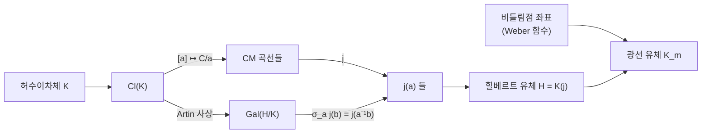

# 복소 곱셈과 허수이차체의 유체론

# 개요

[유체론](class-field-theory.md)은 수체 $K$ 의 아벨확대를 아이디얼류 자료로 분류하지만 그 확대를 생성하는 원소를 주지는 않는다. $K=\mathbb Q$ 에서는 Kronecker–Weber 정리가 모든 아벨확대를 $\zeta_n=e^{2\pi i/n}$ 로 생성한다.

$K$ 가 허수이차체일 때 지수함수의 자리를 타원곡선의 특수값이 대신한다. [타원곡선](elliptic-curves.md) $\mathbb C/\Lambda$ 가운데 자기준동형환이 $\mathbb Z$ 보다 큰 것을 복소 곱셈(complex multiplication)을 가진다고 하고, 이때

$$
\mathrm{End}(\mathbb C/\Lambda)\cong\mathcal O\subset K
$$

가 된다. 복소 곱셈론의 주정리는 다음과 같다.

> $j(\mathcal O_K)$ 는 $K$ 의 힐베르트 유체 $H$ 를 생성하고, $\mathrm{Gal}(H/K)\cong\mathrm{Cl}(K)$ 의 작용은 아이디얼류의 곱셈으로 주어진다. 비틀림점의 좌표까지 붙이면 $K$ 의 모든 아벨확대가 나온다.

$\zeta_n$ 이 하던 일을 $j$ 와 비틀림점이 한다. Kronecker 가 "청춘의 꿈"(Jugendtraum)이라 부른 그림이고, Hilbert 의 열두 번째 문제는 이를 일반 수체로 확장하라는 요구다. 허수이차체 바깥에서는 아벨확대를 생성하는 함수가 알려져 있지 않다[^2].

# 직관

## 이차무리수 격자

$\Lambda=\mathbb Z+\mathbb Z\tau\subset\mathbb C$ 에 대해 $\alpha\Lambda\subseteq\Lambda$ 인 복소수 $\alpha$ 가 $\mathbb C/\Lambda$ 의 자기준동형을 준다. $\alpha\cdot1=a+b\tau$ 와 $\alpha\cdot\tau=c+d\tau$ 를 정수로 쓰면 $\alpha$ 는 정수 행렬의 고유값이므로 이차 대수적 정수다. $\alpha\notin\mathbb Z$ 이려면 $\tau$ 가 이차무리수여야 한다.

$$
A\tau^2+B\tau+C=0,\qquad A,B,C\in\mathbb Z,\ \gcd(A,B,C)=1,\ D=B^2-4AC\lt 0
$$

이면 $\mathrm{End}(\mathbb C/\Lambda)=\mathbb Z[A\tau]$ 가 판별식 $D$ 의 순서환이다. $\tau$ 가 초월수이거나 삼차 이상이면 자기준동형은 정수뿐이다.

## CM 곡선의 개수와 유수

판별식 $D$ 인 순서환 $\mathcal O$ 를 고정하면 $\mathcal O$ 를 자기준동형환으로 갖는 곡선 $\mathbb C/\mathfrak a$ 는 아이디얼류 $[\mathfrak a]\in\mathrm{Cl}(\mathcal O)$ 로 분류되고, 그 개수는 $h(D)$ 다. 유수는 축소된 이차형식을 세면 계산된다.

```javascript
// 판별식 D<0 의 유수: 축소된 원시 이차형식 (a,b,c), |b| ≤ a ≤ c 의 개수
function classNumber(D) {
  const gcd = (x, y) => (y ? gcd(y, x % y) : x);
  let h = 0;
  for (let b = D % 2 === 0 ? 0 : 1; b * b <= -D / 3; b += 2) {
    const t = (b * b - D) / 4;
    for (let a = Math.max(b, 1); a * a <= t; a++) {
      if (t % a !== 0) continue;
      const c = t / a;
      if (gcd(gcd(a, b), c) !== 1) continue;
      h += (a === b || a === c || b === 0) ? 1 : 2;   // b 와 -b 가 같은 류인 경우
    }
  }
  return h;
}
```

$h(D)$ 개의 곡선은 서로 동형이 아니고 그 $j$ 값들은 서로 켤레인 대수적 수다. 최소다항식이 힐베르트 유체 다항식

$$
H_D(X)=\prod_{[\mathfrak a]\in\mathrm{Cl}(\mathcal O)}\bigl(X-j(\mathfrak a)\bigr)\in\mathbb Z[X]
$$

이고 차수는 $h(D)$ 다. 복소해석적으로 정의한 $j$ 값들의 대칭식이 정수 계수를 갖는다.

## 유수 1 이 만드는 거의 정수

$h(D)=1$ 이면 $H_D(X)=X-j$ 라 $j$ 가 정수다. $j$ 의 $q$ 전개

$$
j(\tau)=\frac1q+744+196884\thinspace q+\cdots,\qquad q=e^{2\pi i\tau}
$$

에 $\tau=\frac{1+\sqrt D}{2}$ 를 넣으면 $q=-e^{-\pi\sqrt{|D|}}$ 이므로

$$
-e^{\pi\sqrt{|D|}}+744-196884\thinspace e^{-\pi\sqrt{|D|}}+\cdots=j\in\mathbb Z
$$

이고, $|D|$ 가 크면 셋째 항부터는 무시할 수 있다. 따라서 $e^{\pi\sqrt{|D|}}$ 가 정수 $744-j$ 에 지수적으로 가깝다.

$$
e^{\pi\sqrt{43}}=884736743.9997\ldots,\qquad e^{\pi\sqrt{67}}=147197952743.9998\ldots
$$

$$
e^{\pi\sqrt{163}}=262537412640768743.99999999999925\ldots
$$

$e^{\pi\sqrt{163}}$ 이 정수에 가까운 것은 $h(-163)=1$ 의 따름이다. $h(D)=1$ 인 기본판별식은 아홉 개다.

$$
D=-3,-4,-7,-8,-11,-19,-43,-67,-163
$$

이 목록이 완전하다는 것이 Heegner–Stark–Baker 정리이고, 증명은 초월수론과 $L$ 함수의 비소실을 쓴다.

## 아이디얼 곱셈으로서의 Galois 작용

$H=K(j(\mathcal O_K))$ 는 $K$ 의 아벨확대이고 Artin 사상이

$$
\mathrm{Cl}(K)\thickspace\xrightarrow{\ \sim\ }\thickspace\mathrm{Gal}(H/K),\qquad [\mathfrak a]\mapsto\sigma_{\mathfrak a}
$$

를 준다. 이 동형 아래에서

$$
\sigma_{\mathfrak a}\bigl(j(\mathfrak b)\bigr)=j(\mathfrak a^{-1}\mathfrak b)
$$

이다. Galois 군의 원소가 격자에 아이디얼을 곱하는 조작으로 실현된다. $\mathbb Q$ 위의 $\sigma_a(\zeta_n)=\zeta_n^{a}$ 와 같은 종류의 명시성이고, [Heegner 점](heegner-points.md)의 구성이 이 등식에 의존한다.



## 광선 유체와 비틀림점

$H$ 는 $K$ 의 최대 비분기 아벨확대다. 분기를 허용하는 광선 유체에는 재료가 하나 더 필요하고 그것이 비틀림점이다. $E$ 가 $\mathcal O_K$ 로 복소 곱셈을 가질 때 $\mathfrak m$ 등분점 $E[\mathfrak m]$ 의 좌표를 자기동형으로 정규화한 Weber 함수 $\mathfrak h$ 의 값을 $H$ 에 붙이면 도체 $\mathfrak m$ 의 광선 유체가 나온다. $\zeta_n$ 이 곱셈군 $\mathbb G_m$ 의 $n$ 등분점이었던 자리에 타원곡선의 등분점이 들어간다.

# 정의

## 순서환과 복소 곱셈

허수이차체 $K$ 의 정수환을 $\mathcal O_K$ 라 하고, 지휘자 $f\ge1$ 에 대한 $\mathcal O=\mathbb Z+f\mathcal O_K$ 를 순서환이라 하자. 판별식은 $D=f^2 d_K$ 다. 타원곡선 $E/\mathbb C$ 가 $\mathcal O$ 에 의한 **복소 곱셈**을 가진다는 것은

$$
\mathrm{End}(E)\cong\mathcal O
$$

를 뜻한다. $E\cong\mathbb C/\mathfrak a$ 로 쓸 수 있고 $\mathfrak a$ 는 $\mathcal O$ 의 가역 아이디얼이며, 두 곡선의 동형은 아이디얼류가 같은 것과 동치다.

$$
\lbrace\mathcal O\ \text{에 의한 CM 곡선}\rbrace/\cong\thickspace\longleftrightarrow\thickspace\mathrm{Cl}(\mathcal O),\qquad \char35{}=h(D)
$$

## 제1 주정리

$\mathcal O=\mathcal O_K$ 인 경우다.

1. $j(\mathfrak a)$ 는 대수적 정수다.
2. $H=K(j(\mathcal O_K))$ 는 $K$ 의 힐베르트 유체다. $[H:K]=h(K)$ 이고 $H/K$ 는 최대 비분기 아벨확대다.
3. $[\mathbb Q(j):\mathbb Q]=h(K)$ 이고 $H_D$ 는 $\mathbb Q$ 위에서 기약이다.
4. Artin 동형 아래 $\sigma_{\mathfrak a}(j(\mathfrak b))=j(\mathfrak a^{-1}\mathfrak b)$ 이다.

## 제2 주정리와 Shimura 상호법칙

$E/H$ 를 $\mathcal O_K$ 로 CM(complex multiplication) 을 갖는 곡선, $\mathfrak h\colon E\to E/\mathrm{Aut}(E)\cong\mathbb P^1$ 를 Weber 함수라 하자. [아이디얼](ideals-quotient-rings.md) $\mathfrak m$ 에 대해

$$
K_{\mathfrak m}=H\bigl(\mathfrak h(P)\thinspace:\thinspace P\in E[\mathfrak m]\bigr)
$$

가 도체 $\mathfrak m$ 의 광선 유체이고, 이들의 합집합이 $K^{\mathrm{ab}}$ 다. 아델 언어에서는 이데일 $s\in\mathbb A_K^\times$ 의 작용을 격자 위 곱셈으로 기술하는 Shimura 상호법칙이 되며, 이 형태가 [모듈러 곡선](modular-curves.md) 위 CM 점의 Galois 작용 계산에 쓰인다.

## 유리수체 위의 CM 곡선

$h(D)=1$ 이면 $j\in\mathbb Z$ 이므로 CM 곡선을 $\mathbb Q$ 위에서 정의할 수 있다.

$$
D=-4:\ y^2=x^3-x\ (j=1728),\qquad D=-3:\ y^2=x^3+1\ (j=0)
$$

$\mathrm{End}$ 는 $\mathbb Q$ 위에서 $\mathbb Z$ 이고 $K$ 로 기저확대해야 $\mathcal O_K$ 전체가 보인다. 그래서 $\mathbb Q$ 위 CM 곡선의 [Galois 표현](galois-representations.md)은 기약이 아니라 $K$ 의 Hecke 지표 $\psi$ 에서 유도된 것이다.

$$
\rho_{E,\ell}\cong\mathrm{Ind}\_{G_K}^{G_{\mathbb Q}}\psi
$$

CM 곡선의 $L$ 함수가 Hecke $L$ 함수와 같다는 Deuring 의 정리가 여기서 따라오고, 모듈러성이 CM 경우에만 먼저 알려졌던 것도 이 때문이다.

# 성질

## Deuring 의 환원 이분법

$E$ 가 $\mathcal O_K$ 로 CM 을 갖고 $p$ 에서 좋은 환원을 가지면 환원 $\tilde E/\mathbb F_p$ 의 유형은 $p$ 의 분해로 결정된다.

| $K$ 에서 $p$ 의 분해 | 환원 $\tilde E$ | Frobenius |
|---|---|---|
| 분열 $p=\pi\bar\pi$ | 보통(ordinary) | $\pi\in\mathcal O_K$ 로 주어짐, $a_p=\pi+\bar\pi$ |
| 비활성 | 초특이(supersingular) | $a_p=0$ 이고 $\mathrm{End}$ 가 사원수 대수 |
| 분기 | 보통 또는 초특이 ($D$ 에 따름) | — |

분열하는 경우 $p=\pi\bar\pi=N(\pi)$ 이므로 $p$ 를 $K$ 의 노름으로 쓰는 것과 점 개수 $\char35{}\tilde E(\mathbb F_p)=p+1-(\pi+\bar\pi)$ 는 같은 자료다. $p=x^2+ny^2$ 꼴 표현 문제가 CM 이론으로 풀린다. $p=x^2+27y^2$ 인 것은 $p\equiv1\pmod3$ 이고 $2$ 가 $\bmod\thinspace p$ 세제곱잉여인 것과 동치이며, $h(-108)=3$ 인 순서환의 유체 다항식 $X^3-2$ 가 이를 설명한다.

초특이 쪽은 [초특이 등원사상 그래프](supersingular-isogeny-graphs.md)로 이어진다. CM 곡선을 여러 소수에서 환원하는 것이 그 그래프의 정점을 얻는 표준 방법이다.

## 유수 1 판별식의 유한성

$h(D)=1$ 인 판별식이 유한하다는 것은 Siegel 의 하계 $h(D)\gg|D|^{1/2-\epsilon}$ 에서 나오지만 그 증명은 비유효적이다. 목록을 아홉 개로 확정하는 데는 유효 하계가 필요했고, Heegner 가 모듈러 함수의 항등식으로, Baker 가 로그의 일차형식 하계로, Stark 가 CM 이론으로 각각 채웠다.

## 명시성의 한계

Hilbert 12 번 문제는 임의의 수체 $K$ 의 $K^{\mathrm{ab}}$ 를 해석함수의 특수값으로 생성하라는 요구다. 완전한 답이 있는 것은 $\mathbb Q$ 와 허수이차체뿐이다. 총실체에서는 Hilbert [모듈러 형식](modular-forms.md)과 Stark 추측이 부분적인 후보를 주고, CM 체에서는 아벨다양체를 쓰는 Shimura–Taniyama 이론이 유비를 잇지만 광선 유체 전체를 생성하지는 못한다. 허수이차체는 단위원군이 유한해 격자가 이산적으로 정돈되는데, 실 자리를 가진 체에서는 그 성질이 없다.

# 활용

- CM 방법은 위수를 지정해 곡선을 만든다. 원하는 위수 $N=p+1-a$ 에 대해 $4p-a^2=|D|y^2$ 를 만족하는 작은 $|D|$ 를 찾고, $H_D(X)$ 의 $\bmod\ p$ 근 $j_0$ 를 구하고, $j_0$ 를 불변량으로 갖는 곡선을 쓴다. 위수를 [Schoof–Elkies–Atkin](sea-algorithm.md) 으로 세는 대신 지정하는 것이며, 소수판정 **ECPP**(elliptic curve primality proving)도 같은 원리로 증명서를 만든다. $|D|$ 가 커지면 $H_D$ 의 계수가 폭발하므로 $|D|$ 를 작게 유지하거나 Weber 함수 같은 더 작은 불변량을 쓴다.
- [Heegner 점](heegner-points.md)은 $X_0(N)$ 위의 CM 점을 모듈러 파라미터화로 옮긴 것이다. 그 점이 $H$ 위에서 정의되는 것과 Galois 궤도가 유군으로 명시되는 것이 제1 주정리이고, 그래서 자취 $\mathrm{Tr}\_{H/K}$ 로 $K$ 유리점을 얻을 수 있다. Gross–Zagier 공식의 우변에 $\sqrt{|D|}$ 와 $u=|\mathcal O_K^\times|/2$ 가 나타나는 것도 이 구성 때문이다.
- Deuring 의 정리는 $\mathrm{GL}\_2$ 의 Galois 표현이 $\mathrm{GL}\_1$ 에서 유도된 자기동형 대상과 짝지어진다는 진술이다. [Langlands 강령](langlands-program.md)의 함자성이 확인된 첫 비자명한 사례다.[^1]

[^1]: M. Deuring, *Die Typen der Multiplikatorenringe elliptischer Funktionenkörper*, Abh. Math. Sem. Hamburg **14** (1941). 표준 교재는 J. Silverman, *Advanced Topics in the Arithmetic of Elliptic Curves* (1994) 2 장과 D. Cox, *Primes of the Form* $x^2+ny^2$ (1989). 후자는 유수 1 목록과 $p=x^2+27y^2$ 예제를 CM 이론으로 다룬다.
[^2]: R. P. Langlands, *Some contemporary problems with origins in the Jugendtraum*, Mathematical Developments Arising from Hilbert Problems, Proc. Sympos. Pure Math. **28** (1976), 401–418. 유리수체와 허수 이차체 밖에서 Hilbert 의 12 번 문제가 풀리지 않은 채임을 전제로 그 너머의 접근을 논한다.

# 연관 문서

## 선수지식

- [타원곡선](elliptic-curves.md)
- [유체론](class-field-theory.md)

## 더 알아보기

- [Heegner 점과 Gross–Zagier 공식](heegner-points.md)

#number_theory #field_theory #construction
