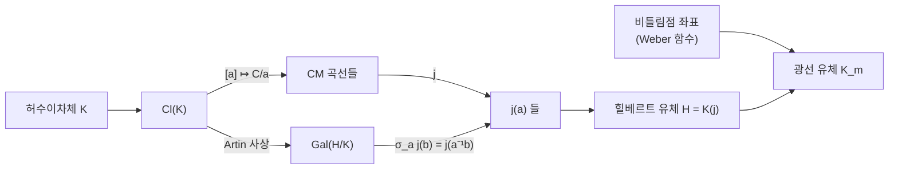

# 복소 곱셈과 허수이차체의 유체론

# 개요

[유체론](class-field-theory.md)은 수체 $K$ 의 아벨확대를 $K$ 내부의 아이디얼류 자료로 완전히 분류한다. 그런데 분류는 **어떤 확대가 있는지**를 말할 뿐, 그 확대를 생성하는 원소를 손에 쥐여 주지 않는다. $K=\mathbb Q$ 에서는 Kronecker–Weber 정리가 그 빈자리를 메운다. 모든 아벨확대가 $\zeta_n=e^{2\pi i/n}$ 로 생성되므로, 지수함수의 특수값 하나가 아벨확대 전체를 만들어 낸다.

$K$ 가 허수이차체일 때 지수함수의 자리를 대신하는 것이 **타원곡선의 특수값**이다. [타원곡선](elliptic-curves.md) $\mathbb C/\Lambda$ 가운데 자기준동형환이 $\mathbb Z$ 보다 큰 것들이 있고, 그런 곡선을 복소 곱셈(complex multiplication)을 가진다고 한다. 이때

$$
\mathrm{End}(\mathbb C/\Lambda)\cong\mathcal O\subset K
$$

가 되어 격자 자체가 $K$ 의 산술을 지고 있다. 복소 곱셈론의 주정리는 이렇게 말한다.

> $j(\mathcal O_K)$ 는 $K$ 의 힐베르트 유체 $H$ 를 생성하고, $\mathrm{Gal}(H/K)\cong\mathrm{Cl}(K)$ 의 작용은 아이디얼류의 곱셈으로 주어진다. 비틀림점의 좌표까지 붙이면 $K$ 의 모든 아벨확대가 나온다.

$\zeta_n$ 이 하던 일을 $j$ 와 비틀림점이 한다. 이것이 Kronecker 가 자신의 "청춘의 꿈"(Jugendtraum)이라 부른 그림이고, Hilbert 의 열두 번째 문제는 이 그림을 일반 수체로 확장하라는 요구다. 허수이차체 바깥에서는 여전히 대체로 열려 있다.

# 직관

## 격자가 정수보다 많은 곱셈을 가질 때

$\Lambda=\mathbb Z+\mathbb Z\tau\subset\mathbb C$ 를 격자라 하자. 복소수 $\alpha$ 가 $\alpha\Lambda\subseteq\Lambda$ 를 만족하면 $\alpha$ 는 $\mathbb C/\Lambda$ 의 자기준동형을 준다. $\alpha=n\in\mathbb Z$ 는 언제나 가능하다. 그 밖의 $\alpha$ 가 있으려면 무엇이 필요한가.

$\alpha\cdot1=a+b\tau$, $\alpha\cdot\tau=c+d\tau$ 를 $a,b,c,d\in\mathbb Z$ 로 쓰면 $\alpha$ 는 정수 행렬의 고유값이므로 이차 대수적 정수다. 그리고 $\alpha\notin\mathbb Z$ 이려면 $\tau$ 가 이차무리수여야 한다. 즉

$$
A\tau^2+B\tau+C=0,\qquad A,B,C\in\mathbb Z,\ \gcd(A,B,C)=1,\ D=B^2-4AC<0
$$

이면 $\mathrm{End}(\mathbb C/\Lambda)=\mathbb Z[A\tau]$ 가 판별식 $D$ 의 순서환이 된다. 복소 곱셈은 **격자가 이차무리수에서 왔다**는 사실의 다른 이름이다. $\tau$ 가 초월수이거나 삼차 이상이면 자기준동형은 정수뿐이다.

## 곡선의 개수가 유수다

판별식 $D$ 인 순서환 $\mathcal O$ 를 고정하면, $\mathcal O$ 를 자기준동형환으로 갖는 곡선 $\mathbb C/\mathfrak a$ 는 아이디얼류 $[\mathfrak a]\in\mathrm{Cl}(\mathcal O)$ 로 분류된다. 그러니 그런 곡선은 **정확히 $h(D)$ 개**다. 유수를 축소된 이차형식으로 세면 곧바로 계산된다.

```javascript
// 판별식 D<0 의 유수: 축소된 원시 이차형식 (a,b,c), |b| ≤ a ≤ c 의 개수
function classNumber(D) {
  const gcd = (x, y) => (y ? gcd(y, x % y) : x);
  let h = 0;
  for (let b = D % 2 === 0 ? 0 : 1; b * b <= -D / 3; b += 2) {
    const t = (b * b - D) / 4;
    for (let a = Math.max(b, 1); a * a <= t; a++) {
      if (t % a !== 0) continue;
      const c = t / a;
      if (gcd(gcd(a, b), c) !== 1) continue;
      h += (a === b || a === c || b === 0) ? 1 : 2;   // b 와 -b 가 같은 류인 경우
    }
  }
  return h;
}

console.log([-3, -4, -7, -11, -15, -23, -71, -163].map(D => `${D}:${classNumber(D)}`).join('  '));
// -3:1  -4:1  -7:1  -11:1  -15:2  -23:3  -71:7  -163:1
```

$h(D)$ 개의 곡선은 서로 동형이 아니지만 $j$ 값들이 **서로 켤레인 대수적 수**다. 그 최소다항식이 힐베르트 유체 다항식

$$
H_D(X)=\prod_{[\mathfrak a]\in\mathrm{Cl}(\mathcal O)}\bigl(X-j(\mathfrak a)\bigr)\in\mathbb Z[X]
$$

이고 차수가 $h(D)$ 다. 계수가 **정수**라는 사실이 이미 놀랍다. 복소해석적으로 정의한 $j$ 값들의 대칭식이 정수로 떨어진다.

## 유수 1 이 만드는 거의 정수

$h(D)=1$ 이면 $H_D(X)=X-j$ 라 $j$ 자체가 정수다. $j$ 의 $q$ 전개

$$
j(\tau)=\frac1q+744+196884\,q+\cdots,\qquad q=e^{2\pi i\tau}
$$

에 $\tau=\frac{1+\sqrt D}{2}$ 를 넣으면 $q=-e^{-\pi\sqrt{|D|}}$ 이므로

$$
-e^{\pi\sqrt{|D|}}+744-196884\,e^{-\pi\sqrt{|D|}}+\cdots=j\in\mathbb Z
$$

가 되고, $|D|$ 가 크면 셋째 항부터는 사실상 $0$ 이다. 결론은 $e^{\pi\sqrt{|D|}}$ 가 정수 $744-j$ 에 지수적으로 가깝다는 것이다.

```javascript
console.log(Math.exp(Math.PI * Math.sqrt(67)).toFixed(4));   // 147197952743.9998
console.log(Math.exp(Math.PI * Math.sqrt(43)).toFixed(4));   // 884736743.9998
// D = -163 은 값이 2.6e17 이라 배정도 부동소수점의 유효자릿수를 넘는다.
// 다중정밀 계산으로는 262537412640768743.99999999999925 이고, 여기서도 소수부가 거의 1 이다.
```

$e^{\pi\sqrt{163}}$ 이 정수에 가깝다는 유명한 사실은 신비가 아니라 $h(-163)=1$ 의 따름이다. 그리고 $h(D)=1$ 인 기본판별식은 아홉 개뿐이다.

$$
D=-3,-4,-7,-8,-11,-19,-43,-67,-163
$$

이 목록이 완전하다는 것이 Heegner–Stark–Baker 정리이며, 증명은 초월수론과 $L$ 함수의 비소실을 동원한다.

## Galois 작용이 아이디얼 곱셈으로 보인다

가장 중요한 대목이다. $H=K(j(\mathcal O_K))$ 라 두면 $H/K$ 는 아벨확대이고 Artin 사상이

$$
\mathrm{Cl}(K)\;\xrightarrow{\ \sim\ }\;\mathrm{Gal}(H/K),\qquad [\mathfrak a]\mapsto\sigma_{\mathfrak a}
$$

를 준다. 주정리는 이 동형 아래에서

$$
\sigma_{\mathfrak a}\bigl(j(\mathfrak b)\bigr)=j(\mathfrak a^{-1}\mathfrak b)
$$

가 성립한다고 말한다. 추상적인 Galois 군의 원소가 **격자에 아이디얼을 곱하는 조작**으로 실현된다. $\mathbb Q$ 위에서 $\sigma_a(\zeta_n)=\zeta_n^{a}$ 가 성립하는 것과 정확히 같은 종류의 명시성이고, [Heegner 점](heegner-points.md)의 구성이 통째로 이 한 줄에 의존한다.



## $j$ 만으로는 부족하다

$H$ 는 $K$ 의 최대 **비분기** 아벨확대다. 분기를 허용하는 광선 유체까지 얻으려면 재료가 하나 더 필요하고, 그것이 비틀림점이다. $E$ 가 $\mathcal O_K$ 로 복소 곱셈을 가질 때 $\mathfrak m$ 등분점 $E[\mathfrak m]$ 의 좌표를 자기동형으로 정규화한 것(Weber 함수 $\mathfrak h$)을 $H$ 에 붙이면 도체 $\mathfrak m$ 의 광선 유체가 나온다. $\mathbb Q$ 쪽에서 $\zeta_n$ 이 $\mathbb G_m$ 의 $n$ 등분점이었다는 것을 떠올리면 유비가 정확하다. **곱셈군의 등분점 자리에 타원곡선의 등분점이 들어간다.**

# 정의

## 순서환과 복소 곱셈

허수이차체 $K$ 의 정수환을 $\mathcal O_K$ 라 하고, $\mathcal O=\mathbb Z+f\mathcal O_K$ ($f\ge1$, 지휘자)를 순서환이라 하자. 판별식은 $D=f^2 d_K$ 다. 타원곡선 $E/\mathbb C$ 가 **$\mathcal O$ 에 의한 복소 곱셈을 가진다**는 것은

$$
\mathrm{End}(E)\cong\mathcal O
$$

를 뜻한다. $E\cong\mathbb C/\mathfrak a$ 로 쓸 수 있고 $\mathfrak a$ 는 $\mathcal O$ 의 가역 아이디얼이며, 두 곡선이 동형인 것은 아이디얼류가 같은 것과 같다. 따라서

$$
\{\mathcal O\ \text{에 의한 CM 곡선}\}/\cong\;\longleftrightarrow\;\mathrm{Cl}(\mathcal O),\qquad \#=h(D)
$$

## 제1 주정리

$\mathcal O=\mathcal O_K$ 인 경우를 적는다.

1. $j(\mathfrak a)$ 는 대수적 정수다.
2. $H=K(j(\mathcal O_K))$ 는 $K$ 의 힐베르트 유체다. 특히 $[H:K]=h(K)$ 이고 $H/K$ 는 비분기 아벨확대이며 최대다.
3. $[\mathbb Q(j):\mathbb Q]=h(K)$ 이고 $H_D$ 는 $\mathbb Q$ 위에서 기약이다.
4. Artin 동형 아래 $\sigma_{\mathfrak a}(j(\mathfrak b))=j(\mathfrak a^{-1}\mathfrak b)$.

## 제2 주정리와 Shimura 상호법칙

$E/H$ 를 $\mathcal O_K$ 로 CM 을 갖는 곡선, $\mathfrak h\colon E\to E/\mathrm{Aut}(E)\cong\mathbb P^1$ 를 Weber 함수라 하자. 아이디얼 $\mathfrak m$ 에 대해

$$
K_{\mathfrak m}=H\bigl(\mathfrak h(P)\,:\,P\in E[\mathfrak m]\bigr)
$$

가 도체 $\mathfrak m$ 의 광선 유체다. 이들의 합집합이 $K^{\mathrm{ab}}$ 이므로 허수이차체의 아벨확대가 모두 나온다. 아델 언어로 정리하면 이데일 $s\in\mathbb A_K^\times$ 의 작용을 격자 위 곱셈으로 기술하는 Shimura 상호법칙이 되고, 이 형태가 [모듈러 곡선](modular-curves.md) 위 CM 점의 Galois 작용을 계산할 때 실제로 쓰인다.

## 유리수체 위로 내려온 CM 곡선

$h(D)=1$ 이면 $j\in\mathbb Z$ 이므로 CM 곡선을 $\mathbb Q$ 위에서 정의할 수 있다. 예를 들어

$$
D=-4:\ y^2=x^3-x\ (j=1728),\qquad D=-3:\ y^2=x^3+1\ (j=0)
$$

이다. 다만 $\mathrm{End}$ 는 $\mathbb Q$ 위에서는 $\mathbb Z$ 이고, $K$ 로 기저확대해야 $\mathcal O_K$ 전체가 보인다. 그래서 $\mathbb Q$ 위 CM 곡선의 Galois 표현은 기약이 아니라 $K$ 의 지표에서 유도된 것이 된다.

$$
\rho_{E,\ell}\cong\mathrm{Ind}_{G_K}^{G_{\mathbb Q}}\psi
$$

$\psi$ 는 Hecke 지표다. CM 곡선의 $L$ 함수가 Hecke $L$ 함수와 같다는 Deuring 의 정리가 여기서 나오고, 이것이 모듈러성이 일반적으로 증명되기 훨씬 전에 CM 경우만 먼저 알려졌던 이유다.

# 성질

## 소수의 환원: Deuring 의 이분법

$E$ 가 $\mathcal O_K$ 로 CM 을 갖고 $p$ 에서 좋은 환원을 가진다고 하자. 환원 $\tilde E/\mathbb F_p$ 의 유형은 $p$ 가 $K$ 에서 어떻게 분해되는지로 완전히 결정된다.

| $K$ 에서 $p$ 의 분해 | 환원 $\tilde E$ | Frobenius |
|---|---|---|
| 분열 $p=\pi\bar\pi$ | 보통(ordinary) | $\pi\in\mathcal O_K$ 로 주어짐, $a_p=\pi+\bar\pi$ |
| 비활성 | 초특이(supersingular) | $a_p=0$, $\mathrm{End}$ 가 사원수 대수 |
| 분기 | 보통 또는 초특이 ($D$ 에 따름) | — |

분열하는 경우 $p=\pi\bar\pi=N(\pi)$ 이므로 **$p$ 를 $K$ 의 노름으로 쓰는 것**과 곡선의 점 개수 $\#\tilde E(\mathbb F_p)=p+1-(\pi+\bar\pi)$ 가 같은 자료다. $p=x^2+ny^2$ 꼴 표현 문제가 CM 이론으로 풀리는 것이 이 때문이다. 예컨대 $p=x^2+27y^2$ 인 것은 $p\equiv1\pmod3$ 이고 $2$ 가 $\bmod\,p$ 세제곱잉여인 것과 같은데, 이는 $h(-108)=3$ 인 순서환의 유체 다항식 $X^3-2$ 로 설명된다.

초특이 쪽은 [초특이 등원사상 그래프](supersingular-isogeny-graphs.md)로 이어진다. CM 곡선을 여러 소수에서 환원해 초특이 곡선을 만드는 것이 그 그래프의 정점을 얻는 표준 방법이다.

## 왜 아홉 개뿐인가

$h(D)=1$ 인 판별식이 유한하다는 것은 Siegel 이 $h(D)\gg|D|^{1/2-\epsilon}$ 로 증명했지만 그 증명은 비유효적이다. 목록이 정확히 아홉 개임을 확정하려면 유효 하계가 필요했고, Heegner 가 1952 년에 모듈러 함수의 항등식으로, Baker 가 로그의 일차형식 하계로, Stark 가 다시 CM 이론으로 각각 채웠다. 서로 다른 세 방향이 같은 지점에서 만난 사례다.

## $\mathbb Q$ 를 벗어난 명시성의 한계

Hilbert 12 번 문제는 임의의 수체 $K$ 에 대해 $K^{\mathrm{ab}}$ 를 해석함수의 특수값으로 만들라는 요구다. 지금까지 완전히 답이 있는 것은 $\mathbb Q$ (지수함수)와 허수이차체(타원 모듈러 함수)뿐이다. 총실체에서는 Hilbert 모듈러 형식과 Stark 추측이 부분적인 후보를 주고, CM 체에서는 아벨다양체를 쓰는 Shimura–Taniyama 이론이 유비를 이어 가지만 광선 유체 전체를 명시적으로 생성하지는 못한다. 유비가 막히는 이유는 단위원군의 계수다. 허수이차체는 단위원이 유한해서 격자가 이산적으로 잘 정돈되는데, 그 성질이 실 자리를 가진 체에서는 사라진다.

# 활용

## 위수를 지정해 곡선을 만든다 (CM 방법)

암호에서는 $\#E(\mathbb F_p)$ 가 큰 소인수를 갖거나, 쌍선형 사상을 위해 특정한 매장 차수를 갖는 곡선이 필요하다. 무작위 곡선을 뽑아 [Schoof–Elkies–Atkin](sea-algorithm.md) 으로 위수를 세는 방법은 비싸다. CM 방법은 반대로 간다.

1. 원하는 위수 $N=p+1-a$ 를 정하고 $4p-a^2=|D|y^2$ 를 만족하는 작은 $|D|$ 를 찾는다.
2. 힐베르트 유체 다항식 $H_D(X)$ 를 계산하고 $\bmod\ p$ 로 근 $j_0$ 를 구한다.
3. $j_0$ 를 불변량으로 갖는 곡선을 쓰면 위수가 정확히 $N$ 이다.

위수를 세지 않고 **지정한다**는 점이 요점이고, 소수판정 알고리즘 ECPP 도 같은 원리로 증명서를 만든다. $|D|$ 가 커지면 $H_D$ 의 계수가 폭발하므로 실무에서는 $|D|$ 를 작게 유지하거나 Weber 함수 같은 더 작은 불변량을 쓴다.

## Heegner 점의 토대

[Heegner 점](heegner-points.md)은 $X_0(N)$ 위의 CM 점을 모듈러 파라미터화로 옮긴 것이다. 그 점이 $H$ 위에서 정의된다는 사실과 $\mathrm{Gal}(H/K)$ 의 작용이 아이디얼 곱셈이라는 사실이 모두 위 주정리다. 자취 $\mathrm{Tr}_{H/K}$ 를 취해 $K$ 유리점으로 내리는 조작이 가능한 것도 Galois 궤도가 유군으로 명시되기 때문이다. Gross–Zagier 공식의 우변에 $\sqrt{|D|}$ 와 단위원 개수 $u=|\mathcal O_K^\times|/2$ 가 등장하는 것도 이 구성의 흔적이다.

## Langlands 강령의 가장 오래된 사례

CM 곡선의 $L$ 함수가 Hecke 지표의 $L$ 함수와 같다는 Deuring 의 정리는, $\mathrm{GL}_2$ 의 Galois 표현이 $\mathrm{GL}_1$ 에서 유도된 자기동형 대상과 짝지어진다는 진술이다. 이는 [Langlands 강령](langlands-program.md)의 함자성이 실제로 확인된 첫 비자명한 경우이며, 유도 표현이라는 가장 단순한 함자 사상이 무엇을 해 주는지 보여 주는 표본이다. 일반 타원곡선의 모듈러성이 증명되기까지 반세기가 더 걸렸다는 사실이 CM 경우가 얼마나 특별히 다루기 쉬운지를 말해 준다.[^1]

[^1]: M. Deuring, *Die Typen der Multiplikatorenringe elliptischer Funktionenkörper*, Abh. Math. Sem. Hamburg **14** (1941). 표준 교재는 J. Silverman, *Advanced Topics in the Arithmetic of Elliptic Curves* (1994) 2 장과 D. Cox, *Primes of the Form* $x^2+ny^2$ (1989). 후자는 유수 1 목록과 $p=x^2+27y^2$ 예제를 CM 이론으로 다루는 과정을 처음부터 끝까지 따라간다. 본문의 유수 계산과 수치는 직접 한 것이다.

# 연관 문서

## 선수지식

- [타원곡선과 군 구성](elliptic-curves.md)
- [유체론](class-field-theory.md)

## 더 알아보기

- [Heegner 점과 Gross–Zagier 공식](heegner-points.md)

#number_theory #field_theory #construction
