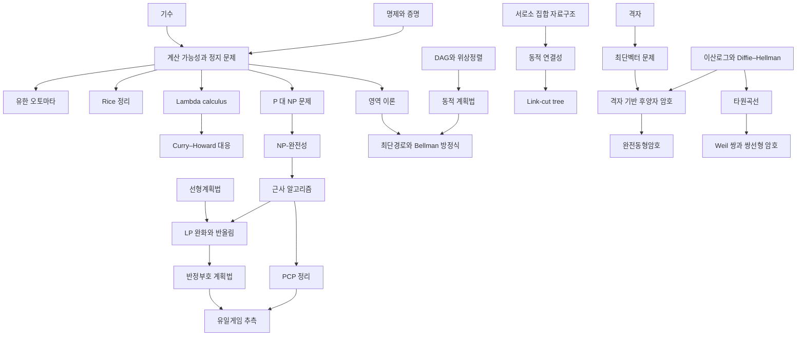

# 계산 개관

# 개요

계산 이론은 기계가 무엇을 풀 수 있는지, 풀 수 있다면 얼마나 빨리 푸는지를 묻는다. 두 물음이 층위를 나눈다. 첫째 층위는 가부이고, 정지 문제가 알고리즘으로 풀리지 않는다는 대각선 논법이 답한다. 둘째 층위는 비용이고, $\mathrm P$ 와 $\mathrm{NP}$ 의 분리 여부와 NP-완전 문제의 근사 한계가 답한다.

계산 이론의 갈래는 다섯 줄기다. 계산 모형과 결정 불가능성, 복잡도류와 환원, 구체적 알고리즘 설계, 그 알고리즘이 쓰는 자료구조, 그리고 계산 난해성을 안전성의 근거로 삼는 암호다. 최적화 쪽의 완화와 쌍대성은 [최적화 개관](optimization-overview.md)에, 논리 쪽의 대응은 [수학기초론 개관](foundations-overview.md)에 있다.

시작은 [계산 가능성과 정지 문제](computability.md)다. 거기서 [P 대 NP 문제](p-np.md)로 가면 [NP-완전성](np-completeness.md)과 [근사 알고리즘](approximation-algorithms.md)을 거쳐 근사 불가능성으로 이어지고, [유한 오토마타](finite-automata.md)와 [Lambda calculus](lambda-calculus.md)로는 계산 모형의 두 갈래가 갈라진다.

# 지도

# 갈래

## 계산가능성과 계산 모형

- [계산 가능성과 정지 문제](computability.md): Turing 기계, 대각선 논법, 결정 불가능성
- [Turing 차수](turing-degrees.md): 결정 불가능성의 정도를 재는 순서, 도약과 Post 문제
- [Rice 정리](rice-theorem.md): 자명하지 않은 의미론적 성질은 모두 결정 불가능
- [유한 오토마타와 정규언어](finite-automata.md): 유한 상태 모형, Myhill–Nerode 정리, 펌핑 보조정리
- [Lambda calculus](lambda-calculus.md): 함수 적용만으로 세운 계산 모형, $\beta$ 축약과 Church–Rosser 정리
- [Curry–Howard 대응](curry-howard.md): 증명과 프로그램, 명제와 타입의 대응
- [영역 이론과 Kleene 고정점 정리](domain-theory.md): 재귀 정의의 의미를 최소 고정점으로
- [추상해석과 정적 분석의 건전성](abstract-interpretation.md): Galois 연결로 맺은 구체와 추상 의미, 고정점 근사
- [애니온과 위상적 양자계산](anyons.md): 꼬임군의 표현으로 만드는 결맞음 오류에 강한 계산 모형

## 복잡도와 근사 한계

- [P 대 NP 문제](p-np.md): 다항시간 판정과 다항시간 검증의 분리 문제
- [NP-완전성과 Cook–Levin 정리](np-completeness.md): 환원과 완전성, SAT(satisfiability) 의 보편성
- [근사 알고리즘](approximation-algorithms.md): 최적해 대신 보장된 비율의 해
- [PCP 정리와 근사 불가능성](pcp-theorem.md): PCP(probabilistically checkable proof), 곧 상수 개의 비트만 읽는 검증과 근사 하한
- [부울 함수의 Fourier 해석](boolean-fourier.md): 초입방체 위의 Fourier 전개, 영향력과 잡음 안정성
- [유일게임 추측과 2-to-2 정리](unique-games.md): 최적 근사 비율을 결정하는 추측
- [그래프 동형](graph-isomorphism.md): $\mathrm P$ 와 NP-완전 사이에 놓인 문제, 준다항시간 알고리즘
- [최단벡터 문제](shortest-vector-problem.md): 근사율에 따라 갈리는 난해성, 최악 경우에서 평균 경우로 가는 환산

## 알고리즘

- [동적 계획법](dynamic-programming.md): 부분문제의 DAG(directed acyclic graph) 위에서 값을 위상순으로 채운다
- [최단경로와 Bellman 방정식](shortest-paths.md): Bellman–Ford, Dijkstra, 고정점으로서의 최단거리
- [LP 완화와 반올림](lp-rounding.md): LP(linear programming) 완화로 정수 제약을 푼 뒤 해를 되돌리는 근사 설계
- [고속 Fourier 변환과 합성곱](fft.md): 분할정복으로 $O(n\log n)$ 에 이산 Fourier 변환
- [오류정정부호](error-correcting-codes.md): 부호의 구성과 복호 알고리즘, 거리와 한계
- [Schoof–Elkies–Atkin 알고리즘](sea-algorithm.md): 유한체 위 타원곡선의 점 개수를 다항시간에 센다
- [Kedlaya 알고리즘과 p 진 점 세기](kedlaya-algorithm.md): Monsky–Washnitzer 코호몰로지로 Frobenius 자취를 계산한다
- [Todd–Coxeter 알고리즘](todd-coxeter.md): 군의 표시에서 잉여류를 열거해 부분군의 지표를 구한다

## 자료구조

- [서로소 집합 자료구조](union-find.md): 경로 압축과 랭크 병합, 역 Ackermann 함수 상한
- [동적 연결성](dynamic-connectivity.md): 간선 삽입과 삭제 아래에서 연결성 질의
- [Link-cut tree](link-cut-trees.md): splay 트리로 구현한 동적 숲, 경로 질의

## 정보이론

- [Shannon 엔트로피](entropy.md): 부호화 길이의 하한이 되는 불확실성의 척도
- [무손실 부호화 정리](source-coding.md): 압축률의 한계가 엔트로피다
- [채널 부호화 정리](channel-coding.md): 잡음 있는 채널의 용량과 신뢰 전송
- [KL divergence](kl-divergence.md): KL(Kullback–Leibler) divergence, 두 분포의 부호화 손실과 그 결합 형태

## 생성모형

- [변분 오토인코더](variational-autoencoder.md): ELBO(evidence lower bound)와 재매개화로 잠재변수 모형을 학습한다
- [확산모형](diffusion-models.md): 잡음을 더하는 과정을 되돌려 표본을 만든다
- [흐름 정합](flow-matching.md): 확률 경로의 속도장을 회귀로 학습한다

## 암호

- [RSA 암호](rsa-cryptosystem.md): RSA(Rivest–Shamir–Adleman), 소인수분해의 난해성 위에 세운 공개키 암호
- [이산로그와 Diffie–Hellman](discrete-logarithm.md): 순환군의 이산로그 문제와 키 교환
- [쌍선형 암호](pairing-based-cryptography.md): 타원곡선의 쌍선형 사상과 신원 기반 암호
- [격자 기반 후양자 암호](post-quantum-cryptography.md): LWE(learning with errors)와 SIS(short integer solution), 양자 알고리즘에 견디는 가정
- [완전동형암호](homomorphic-encryption.md): 암호문 위에서 덧셈과 곱셈, 잡음 관리와 부트스트래핑
- [초특이 동종사상 그래프와 SIDH](supersingular-isogeny-graphs.md): SIDH(supersingular isogeny Diffie–Hellman), 동종사상 그래프 위의 걷기를 어려운 문제로 삼는 가정

# 연관 문서

## 선수지식

- [명제와 증명](proofs.md)

## 더 알아보기

- [계산 가능성과 정지 문제](computability.md)
- [동적 계획법](dynamic-programming.md)

#computation #complexity #algorithms #cryptography #overview
