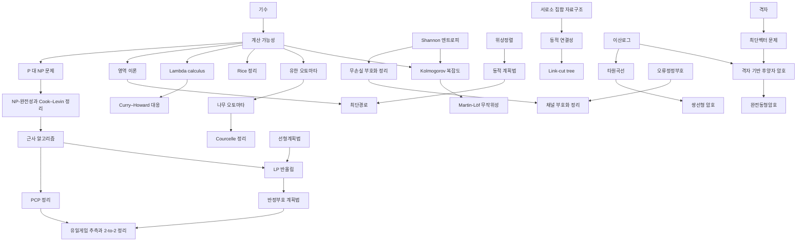

# 계산 개관

# 개요

계산 이론(theory of computation)은 기계가 무엇을 풀 수 있는지, 풀 수 있다면 얼마나 빨리 푸는지를 묻는다. 두 물음이 층위를 나눈다. 첫째 층위는 가부이고, [정지 문제](halting-problem.md)가 알고리즘으로 풀리지 않는다는 대각선 논법이 답한다. 둘째 층위는 비용이고, $\mathrm P$ 와 $\mathrm{NP}$ 의 분리 여부와 NP(nondeterministic polynomial time)-완전 문제의 근사 한계가 답한다.

계산 이론의 갈래는 계산 모형과 결정 불가능성, 복잡도류와 환원, 알고리즘 설계와 그 알고리즘이 쓰는 자료구조, 계산 난해성을 안전성의 가정으로 삼는 암호, 유한체와 격자 위의 대수적 계산, 부호화 길이로 불확실성과 무작위성을 재는 정보이론, 분포를 학습해 표본을 만드는 생성모형이다. 최적화 쪽의 완화와 쌍대성은 [최적화 개관](optimization-overview.md)에, 논리 쪽의 대응은 [수학기초론 개관](foundations-overview.md)에 있다.

시작은 [계산 가능성](computability.md)이다. 거기서 [P 대 NP 문제](p-np.md)로 가면 [NP-완전성](np-completeness.md)과 [근사 알고리즘](approximation-algorithms.md)을 거쳐 근사 불가능성으로 이어지고, [유한 오토마타](finite-automata.md)와 [Lambda calculus](lambda-calculus.md)로는 계산 모형의 두 갈래가 갈라진다.

# 지도

```mermaid
graph TD
  CA["기수"] --> CB["계산 가능성"]
  CB --> KC["Kolmogorov 복잡도"]
  EN["Shannon 엔트로피"] --> KC
  KC --> MLR["Martin-Löf 무작위성"]
  CB --> FA["유한 오토마타"]
  FA --> TA["나무 오토마타"]
  TA --> CT["Courcelle 정리"]
  CB --> RT["Rice 정리"]
  CB --> LC["Lambda calculus"]
  CB --> DT["영역 이론"]
  LC --> CH["Curry–Howard 대응"]
  CB --> PN["P 대 NP 문제"]
  PN --> NPC["NP-완전성과 Cook–Levin 정리"]
  NPC --> AA["근사 알고리즘"]
  AA --> LPR["LP 반올림"]
  AA --> PCP["PCP 정리"]
  PCP --> UG["유일게임 추측과 2-to-2 정리"]
  LP["선형계획법"] --> LPR
  LPR --> SDP["반정부호 계획법"]
  SDP --> UG
  TS["위상정렬"] --> DP["동적 계획법"]
  DP --> SP["최단경로"]
  DT --> SP
  UF["서로소 집합 자료구조"] --> DC["동적 연결성"]
  DC --> LCT["Link-cut tree"]
  DL["이산로그"] --> PQ["격자 기반 후양자 암호"]
  LA["격자"] --> SVP["최단벡터 문제"]
  SVP --> PQ
  PQ --> HE["완전동형암호"]
  DL --> EC["타원곡선"]
  EC --> PBC["쌍선형 암호"]
  ECC["오류정정부호"] --> CC["채널 부호화 정리"]
  EN --> SC["무손실 부호화 정리"]
  SC --> CC
```

# 갈래

처음 읽는 사람은 계산 가능성과 계층, 계산 모형과 의미론, 복잡도와 근사 한계의 순서로 읽는다. 그 뒤는 설계와 응용으로 갈린다. 알고리즘 설계와 자료구조는 다항시간 안에서 비용을 줄이는 방법을 다루고, 암호는 복잡도의 난해성을 안전성의 가정으로 쓰고, 대수와 수론의 계산은 유한체와 격자 위에서 수를 세는 알고리즘을 다루고, 정보이론과 무작위성은 부호화 길이로 불확실성과 무작위성을 재고, 생성모형은 분포를 학습해 표본을 만든다.

## 계산 가능성과 계층

먼저 읽을 것: [기수](cardinality.md)(기초 개관). 시작 문서: [계산 가능성](computability.md).

- [계산 가능성](computability.md): Turing 기계, 대각선 논법, 결정 불가능성
  - [재귀함수](recursive-functions.md): 합성, 원시 재귀, 최소화로 정의한 함수족, Ackermann 함수와 Kleene 정규형
- [정지 문제](halting-problem.md): 프로그램이 멈추는지 판정하는 알고리즘이 없다는 Turing 의 정리, 계산 가능하게 열거 가능한 집합 가운데 완전성과 바쁜 비버 함수
  - [Post 대응 문제](post-correspondence-problem.md): 도미노를 늘어놓아 위아래 문자열을 같게 만드는 문제의 결정 불가능성, 문맥 자유 문법과 행렬 곱으로의 환원
  - [Hilbert 의 10번 문제](hilberts-tenth-problem.md): 계산 가능하게 열거 가능한 집합이 다항방정식의 해 존재로 정의된다는 MRDP 정리와 정수해 판정 알고리즘의 부재
  - [Wang 타일](wang-tiles.md): 색칠한 정사각형으로 평면을 덮는 도미노 문제의 결정 불가능성(Berger 정리)과 비주기 타일 집합
- [Kleene 재귀 정리](kleene-recursion-theorem.md): 계산 가능한 전함수마다 같은 부분함수를 계산하는 고정점 번호가 있다는 정리, 자기 번호를 쓰는 프로그램
- [Rice 정리](rice-theorem.md): 자명하지 않은 의미론적 성질은 모두 결정 불가능
  - [Rice–Shapiro 정리](rice-shapiro-theorem.md): 인식 가능한 의미론적 성질은 유한 조각으로 확인되는 것뿐
- [Turing 차수](turing-degrees.md): 결정 불가능성의 정도를 재는 순서, 도약과 Post 문제
  - [Arslanov 완비성 판정법](arslanov-completeness-criterion.md): 계산 가능하게 열거 가능한 집합이 정지 집합을 계산하는 것과 고정점 없는 함수를 계산하는 것의 동치
- [산술적 계층](arithmetical-hierarchy.md): 한정기호 교대 횟수로 매긴 층, Post 정리와 각 층의 완전 집합
- [해석적 계층](analytical-hierarchy.md): 함수 한정기호로 올린 층, Kleene 정리와 사영 계층
- [초산술적 계층](hyperarithmetical-hierarchy.md): 계산가능한 서수까지 밀어 올린 도약, Kleene 의 $\mathcal O$ 와 $\Delta^1_1$
  - [Σ¹₁ 경계 정리](sigma11-boundedness.md): 정렬근거 나무의 $\Sigma^1_1$ 집합에서 순위의 상한이 $\omega_1^{\mathrm{CK}}$ 미만
- [Π⁰₁ 부류](pi01-classes.md): 계산가능한 나무의 가지 집합, 기저 정리와 PA(Peano arithmetic) 차수
  - [PA 차수](pa-degrees.md): Peano 산술의 완전한 확장을 계산하는 차수, 최소 원소의 부재와 Scott 집합

## 계산 모형과 의미론

먼저 읽을 갈래: 계산 가능성과 계층. 먼저 읽을 것: [Galois 연결](galois-connections.md)(순서론 개관). 시작 문서: [유한 오토마타](finite-automata.md).

- [유한 오토마타](finite-automata.md): 유한 상태 모형, Myhill–Nerode 정리, 펌핑 보조정리
  - [문맥 자유 문법](context-free-grammars.md): 변수 하나를 바꾸는 규칙으로 생성하는 언어, 푸시다운 오토마타와의 동치, CYK(Cocke–Younger–Kasami) 판정과 결정 불가능한 문제
- [Knuth–Morris–Pratt 알고리즘](knuth-morris-pratt.md): 패턴의 가장 긴 경계를 적은 실패 함수로 본문을 되읽지 않고 $O(n+m)$ 시간에 검색한다. 문자열 검색 오토마타와 주기
- [나무 오토마타](tree-automata.md): 순위 나무를 받는 유한 상태 기계, 닫힘 연산 네 가지와 단항 2차 논리와의 대응
- [Lambda calculus](lambda-calculus.md): 함수 적용만으로 세운 계산 모형, $\beta$ 축약과 Church–Rosser 정리
  - [Curry–Howard 대응](curry-howard.md): 증명과 프로그램, 명제와 타입의 대응
- [Church–Turing 논제](church-turing-thesis.md): 효과적 계산 가능성을 Turing 기계로 정의하는 주장, 세 정의의 동치와 Turing 의 분석
- [영역 이론](domain-theory.md): 재귀 정의의 의미를 최소 고정점으로
  - [추상해석](abstract-interpretation.md): Galois 연결로 맺은 구체와 추상 의미, 고정점 근사
  - [애니온](anyons.md): 꼬임군의 표현으로 만드는 결맞음 오류에 강한 계산 모형

## 복잡도와 근사 한계

먼저 읽을 갈래: 계산 가능성과 계층. 시작 문서: [P 대 NP 문제](p-np.md).

- [P 대 NP 문제](p-np.md): 다항시간 판정과 다항시간 검증의 분리 문제
  - [무작위 복잡도 부류](randomized-complexity-classes.md): 한쪽 오류의 RP 와 coRP, 오류 없는 ZPP, 양쪽 유계 오류의 BPP, 반복으로 오류 줄이기와 Adleman 정리
  - [불 회로](boolean-circuits.md): 게이트의 방향 비순환 그래프로 계산하는 모형, 크기와 깊이, P/poly 와 Shannon 의 세기 하한, 상수 깊이 회로의 홀짝 하한
  - [Håstad 스위칭 보조정리](switching-lemma.md): 무작위 제한 뒤 폭이 작은 DNF 가 얕은 결정 나무가 될 확률의 상한, 층 바꾸기로 증명하는 홀짝 함수의 상수 깊이 지수 하한과 Linial–Mansour–Nisan 의 Fourier 집중
  - [Razborov–Smolensky 정리](razborov-smolensky.md): 법 p 게이트를 더한 상수 깊이 회로가 법 q 함수를 계산하지 못한다는 하한, 회로의 낮은 차수 다항식 근사와 홀짝 함수의 근사 불가능
  - [단조 회로](monotone-circuits.md): AND 와 OR 만으로 된 회로, 해바라기로 근사자를 줄이는 Razborov 의 클리크 하한, 완전 매칭으로 본 단조 크기와 일반 크기의 간격, Karchmer–Wigderson 정리
  - [양자 회로](quantum-circuits.md): 큐비트의 텐서곱 공간 위 유니터리 게이트와 측정, 보편 게이트 집합과 BQP(bounded-error quantum polynomial time)
  - [Shor 알고리즘](shor-algorithm.md): 위수 찾기와 양자 Fourier 변환으로 소인수분해와 이산로그를 다항 시간에 푸는 양자 알고리즘
  - [시간 계층 정리](time-hierarchy-theorem.md): 시간을 더 주면 판정되는 언어가 늘어난다는 대각선 논법, P ≠ EXPTIME, 게으른 대각선 논법과 간격 정리, 상대화와 Baker–Gill–Solovay 정리
  - [Pratt 증명서](pratt-certificate.md): 곱셈군의 생성원과 p − 1 의 인수분해를 재귀적으로 모은 소수의 짧은 증명서, 소수 판정이 NP ∩ coNP 에 든다는 것
- [NP-완전성과 Cook–Levin 정리](np-completeness.md): 환원과 완전성, SAT(satisfiability) 의 보편성
  - [다항 계층](polynomial-hierarchy.md): 다항 길이 한정사를 번갈아 쓴 술어의 층 Σₖ 와 Πₖ, 한정 불 논리식의 완전성, 붕괴 정리와 Karp–Lipton 정리
- [Ladner 정리](ladner-theorem.md): P ≠ NP 이면 P 에도 NP-완전에도 들지 않는 NP 언어가 있다는 정리, 느리게 자라는 덧붙이기와 중간 차수의 조밀성
- [셈 복잡도](counting-complexity.md): 해의 수를 세는 함수의 부류 #P, 해 보존 환원과 #SAT 의 완전성, 판정이 쉬운 문제의 세기와 근사 세기
- [공간 복잡도](space-complexity.md): 작업 테이프 칸 수로 잰 비용, L 과 NL 과 PSPACE, Savitch 정리와 Immerman–Szelepcsényi 정리, 한정 불 논리식의 PSPACE-완전성
- [근사 알고리즘](approximation-algorithms.md): 최적해 대신 보장된 비율의 해
  - [외판원 문제](traveling-salesman-problem.md): 최소 가중치 Hamilton 순환, 일반 판본의 근사 불가능성과 Held–Karp 점화식, 최소 신장트리의 2-근사와 Christofides 의 3/2-근사
- [LP 반올림](lp-rounding.md): LP(linear programming) 완화로 정수 제약을 푼 뒤 정수해로 반올림하는 근사 설계
- [PCP 정리](pcp-theorem.md): PCP(probabilistically checkable proof), 곧 상수 개의 비트만 읽는 검증과 근사 하한
- [부울 함수의 Fourier 해석](boolean-fourier.md): 초입방체 위의 Fourier 전개, 영향력과 잡음 안정성
  - [민감도 정리](sensitivity-theorem.md): 차수가 민감도의 제곱 이하라는 Huang 의 정리, 초입방체의 부호 붙은 인접 행렬과 Cauchy 끼움 정리, 블록 민감도와 결정 나무 깊이
  - [Aanderaa–Karp–Rosenberg 추측](evasiveness-conjecture.md): 자명하지 않은 단조 그래프 성질은 간선을 모두 물어야 판정된다는 추측, 짝홀 균형과 Sylow 부분군으로 증명하는 Rivest–Vuillemin 정리, 소수 거듭제곱 n 에서의 Kahn–Saks–Sturtevant 정리
- [유일게임 추측과 2-to-2 정리](unique-games.md): 최적 근사 비율을 결정하는 추측
- [최단벡터 문제](shortest-vector-problem.md): 근사율에 따라 갈리는 난해성, 최악 경우에서 평균 경우로 가는 환산
- [그래프 동형](graph-isomorphism.md): $\mathrm P$ 와 NP-완전 사이에 놓인 문제, 준다항시간 알고리즘
- [Schwartz–Zippel 보조정리](schwartz-zippel-lemma.md): 0 이 아닌 차수 d 다항식이 무작위 점에서 0 이 될 확률이 d/|S| 이하라는 상한, 다항식 항등 판정의 단측 오류 무작위 알고리즘과 Tutte 행렬의 완전 매칭 판정
  - [고립 보조정리](isolation-lemma.md): 무작위 무게 아래 최소 무게 집합이 하나뿐일 확률이 1 − m/N 이상이라는 정리, 행렬식으로 완전 매칭을 찾는 병렬 알고리즘
- [Reingold 정리](reingold-theorem.md): 무방향 연결성이 결정적 로그 공간에 든다는 정리, 거듭제곱과 지그재그 곱으로 성분을 expander 로 바꾸는 변환, SL = L
- [교대 Turing 기계](alternating-turing-machines.md): 존재 상태와 전칭 상태를 번갈아 쓰는 기계, AL = P 와 AP = PSPACE 와 APSPACE = EXPTIME, 교대 횟수로 본 다항 계층
- [통신 복잡도](communication-complexity.md): 입력을 나눠 가진 두 사람이 주고받는 비트 수, 단색 직사각형과 계수 하한, 동등 판정의 무작위 규칙과 서로소 판정의 선형 하한, Karchmer–Wigderson 정리
- [NC 계층](nc-hierarchy.md): 다항 크기 polylog 깊이 균일 회로로 본 병렬 계산, NC¹ ⊆ L ⊆ NL ⊆ AC¹ 의 포함, 회로 값 문제의 P-완전성
  - [Barrington 정리](barrington-theorem.md): NC¹ 이 폭 5 의 다항 길이 분지 프로그램과 같다는 정리, S₅ 의 교환자로 계산하는 논리곱과 가해군의 한계
- [대화형 증명](interactive-proofs.md): 무작위 질문과 대답으로 하는 검증, 합 검사 프로토콜과 $\mathrm{IP}=\mathrm{PSPACE}$
  - [Goldwasser–Kalai–Rothblum 프로토콜](gkr-protocol.md): 층마다 합 검사를 돌려 깊이가 작은 회로의 출력을 다시 계산하지 않고 검증하는 계산 위임, 다중선형 확장과 배선 술어
  - [MIP = NEXP 정리](mip-nexp.md): 통신하지 못하는 두 증명자의 대화형 증명이 비결정적 지수 시간과 같다는 정리, 신탁 검증과 다중선형 검사와 합 검사, NEXP ⊆ P/poly 이면 NEXP = MA

## 알고리즘 설계

먼저 읽을 갈래: 계산 모형과 의미론, 복잡도와 근사 한계. 먼저 읽을 것: [위상정렬](topological-sort.md)(그래프 개관). 시작 문서: [동적 계획법](dynamic-programming.md).

- [동적 계획법](dynamic-programming.md): 부분문제의 DAG(directed acyclic graph) 위에서 값을 위상순으로 채운다
  - [편집 거리](edit-distance.md): 삽입, 삭제, 교체의 최소 횟수를 앞부분 쌍의 표로 $O(mn)$ 시간에 계산한다. 거리 공리와 최장 공통 부분수열, 이차 시간의 하한
  - [Courcelle 정리](courcelle-theorem.md): 단항 2차 논리로 쓴 그래프 성질이 나무폭으로 묶인 그래프에서 선형 시간에 판정된다는 정리, 나무 오토마타로의 번역
- [배낭 문제](knapsack-problem.md): 용량과 가치에 대한 두 표, 의사다항 시간과 NP-완전성, 가치 반올림의 FPTAS(fully polynomial-time approximation scheme)
  - [부분합 문제](subset-sum.md): 합이 정확히 $K$ 인 부분집합의 판정, NP-완전성과 $O(nK)$ 표, 절반씩 나눈 열거와 저밀도 실례의 격자 축소
- [비교 정렬](comparison-sorting.md): 비교 횟수의 하한 $\lceil\log_2 n!\rceil$ 과 병합 정렬, 무작위 quicksort 의 기대 비교 횟수 $2n\ln n+O(n)$
  - [Yao 최소최대 원리](yao-minimax-principle.md): 무작위 알고리즘의 최악 기대 비용이 입력 분포 위 결정적 알고리즘의 평균 비용 이상이라는 부등식, von Neumann 최소최대 정리로 본 등식, 무작위 정렬과 페이지 교체의 하한
  - [Impagliazzo 하드코어 보조정리](hardcore-lemma.md): 조금 어려운 함수의 어려움이 입력의 δ 비율인 집합에 모인다는 정리, 최소최대 정리와 다수결로 하는 Nisan 의 증명, Yao XOR 보조정리
  - [이진 탐색](binary-search.md): 정렬된 배열에서 범위를 반씩 줄여 $\lceil\log_2(n+1)\rceil$ 번의 비교로 찾는다. 단조 술어의 이분법과 지수 탐색
  - [기수 정렬](radix-sort.md): 자릿수마다 안정한 계수 정렬을 되풀이해 비교 없이 $O(d(n+b))$ 시간에 정렬한다
  - [선택 알고리즘](selection-algorithm.md): $k$ 번째로 작은 원소를 정렬 없이 찾는다. 무작위 quickselect 의 기대 비교 횟수와 중앙값의 중앙값의 최악 선형 시간
- [마스터 정리](master-theorem.md): 분할 정복 점화식 $T(n)=aT(n/b)+f(n)$ 의 차수를 $f(n)$ 과 $n^{\log_b a}$ 의 비교로 정하는 세 경우, 재귀 트리의 증명과 Akra–Bazzi 정리
  - [Strassen 알고리즘](strassen-algorithm.md): 블록 곱 일곱 번으로 $\Theta(n^{\log_2 7})$ 시간에 행렬을 곱한다. 행렬 곱셈 지수 $\omega$ 와 텐서 계수
- [Karatsuba 곱셈](karatsuba-multiplication.md): 절반 자리 곱 세 번으로 $\Theta(n^{\log_2 3})$ 시간에 정수를 곱한다. 다항식 보간으로 본 꼴과 Toom–Cook 곱셈
- [최단경로](shortest-paths.md): Bellman–Ford, Dijkstra, 고정점으로서의 최단거리
- [고속 Fourier 변환](fft.md): 분할정복으로 길이 $n$ 수열의 Fourier 계수를 $O(n\log n)$ 에 계산한다
  - [Schönhage–Strassen 알고리즘](schonhage-strassen.md): 조각의 합성곱을 $\mathbb Z/(2^K+1)\mathbb Z$ 위의 고속 Fourier 변환으로 계산해 $N$ 비트 정수를 $O(N\log N\log\log N)$ 에 곱한다
  - [Gauss 구적](gaussian-quadrature.md): 노드와 가중치를 함께 풀어 함수 호출 $n$ 번으로 차수 $2n-1$ 까지 정확한 적분

## 자료구조

먼저 읽을 갈래: 알고리즘 설계. 시작 문서: [분할상환 분석](amortized-analysis.md).

- [분할상환 분석](amortized-analysis.md): 연산 여러 번의 총비용으로 연산 하나의 비용을 정한다. 총합 방법, 회계 방법, 퍼텐셜 방법
- [서로소 집합 자료구조](union-find.md): 경로 압축과 랭크 병합, 역 Ackermann 함수 상한
- [균형 이진 탐색 트리](balanced-binary-search-trees.md): 회전으로 높이를 로그로 유지하는 조건과 분할상환 분석
  - [B 트리](b-trees.md): 마디마다 키를 $t-1$ 개에서 $2t-1$ 개 두어 높이를 $\log_t n$ 으로 묶고 블록 읽기 $O(\log_B n)$ 번에 찾는다. 외부 메모리 하한과 2-3-4 트리
- [van Emde Boas 트리](van-emde-boas-trees.md): 비트를 위아래 절반으로 갈라 재귀해 정수의 다음 원소 찾기를 $O(\log\log u)$ 시간에 한다
- [Splay 트리](splay-trees.md): 접근한 노드를 zig-zig 와 zig-zag 회전으로 뿌리까지 올리는 이진 탐색 트리, 접근 보조정리와 정적 최적성, 동적 최적성 추측
- [이진 힙](binary-heaps.md): 부모의 키가 자식의 키 이하인 완전 이진 트리를 배열에 두어 우선순위 큐를 구현한다. 선형 시간 구성과 힙 정렬
  - [Fibonacci 힙](fibonacci-heaps.md): 정리를 최솟값 삭제까지 미뤄 키 감소를 분할상환 상수 시간에 한다. 연쇄 자르기와 차수의 상한
- [스킵 리스트](skip-lists.md): 동전 던지기로 높이를 정한 정렬 목록의 층으로 찾기와 삽입을 기대 로그 시간에 한다
- [세그먼트 트리](segment-trees.md): 배열을 반씩 나눈 구간마다 결합적 연산의 값을 저장해 구간 질의와 갱신을 $O(\log n)$ 에 한다. 지연 전파와 Fenwick 트리
- [트라이](tries.md): 간선마다 글자를 붙인 트리로 문자열을 그 길이만큼의 단계에 찾는다. 압축 트라이와 접미사 트리, 무작위 트라이의 깊이 $\log_2 n+O(1)$
  - [Aho–Corasick 알고리즘](aho-corasick.md): 트라이에 실패 링크를 두어 패턴 여러 개를 본문 한 번 읽기로 $O(L+n+z)$ 시간에 찾는다
- [접미사 배열](suffix-arrays.md): 접미사를 사전순으로 정렬한 시작 위치의 배열, 접두사 배가로 만들기와 선형 시간 LCP(longest common prefix) 배열
  - [Burrows–Wheeler 변환](burrows-wheeler-transform.md): 정렬한 순환 이동의 마지막 글자를 모은 가역 변환, LF 사상으로 하는 역변환과 역방향 검색
- [범용 해시족](universal-hashing.md): 무작위로 고른 함수의 충돌 확률이 $1/m$ 이하인 족, Carter–Wegman 족과 완전 해싱
  - [Count-Min 스케치](count-min-sketch.md): 해시 함수 $d$ 개의 계수기 표에서 최솟값을 읽어 스트림의 빈도를 고정된 메모리로 추정한다
  - [Rabin–Karp 알고리즘](rabin-karp.md): 무작위 밑의 다항식 해시를 창마다 상수 시간에 굴려 패턴을 기대 $O(n+m)$ 시간에 찾는다. 충돌 확률 $(m-1)/p$
  - [Bloom 필터](bloom-filters.md): 비트 배열과 해시 함수 $k$ 개로 원소 여부에 답한다. 거짓 양성 확률과 최적의 $k$, 공간의 하한
- [해시 테이블](hash-tables.md): 체이닝과 개방 주소법, 균등 해싱에서 탐사 횟수의 기댓값 $1/(1-\alpha)$ 와 선형 탐사, 크기 두 배 늘리기의 분할상환 비용
  - [뻐꾸기 해싱](cuckoo-hashing.md): 키마다 두 칸 가운데 하나에만 두어 찾기를 최악의 경우에도 두 번의 조회로 끝낸다. 뻐꾸기 그래프와 적재율의 문턱
  - [y-fast 트라이](y-fast-tries.md): 접두사를 길이별 해시 테이블에 두고 길이에 대해 이진 탐색해, 공간 $O(n)$ 에서 다음 원소를 $O(\log\log u)$ 에 찾는다
- [동적 연결성](dynamic-connectivity.md): 간선 삽입과 삭제 아래에서 연결성 질의
  - [Link-cut tree](link-cut-trees.md): splay 트리로 구현한 동적 숲, 경로 질의

## 암호

먼저 읽을 갈래: 복잡도와 근사 한계. 먼저 읽을 것: [Fermat–Euler 정리](fermat-euler-theorem.md), [중국인의 나머지 정리](chinese-remainder-theorem.md)(정수론 개관). 시작 문서: [RSA 암호](rsa-cryptosystem.md).

- [RSA 암호](rsa-cryptosystem.md): RSA(Rivest–Shamir–Adleman), 소인수분해의 난해성 위에 세운 공개키 암호
- [이산로그](discrete-logarithm.md): 순환군의 이산로그 문제와 키 교환
- [일방향 함수](one-way-functions.md): 무작위 입력의 역산이 무시할 만한 확률로만 성공하는 함수, 하드코어 비트
- [유사난수 생성기](pseudorandom-generators.md): 다음 비트 예측 불가능성, 혼성 논증, 일방향 함수와의 동치
  - [약속 방식](commitment-schemes.md): 숨김성과 구속성, Pedersen 약속과 Naor 약속
  - [영지식 증명](zero-knowledge-proofs.md): 참이라는 사실 말고는 아무것도 넘기지 않는 대화형 증명, Schnorr 프로토콜
  - [암호 해시 함수](cryptographic-hash-functions.md): 충돌 저항성과 생일 한계, Merkle–Damgård 구성
  - [전자서명](digital-signatures.md): 선택 메시지 공격에 대한 위조 불가능성, Lamport 서명과 Schnorr 서명
  - [의미론적 안전성](semantic-security.md): 구별 불가능성 게임, 결정적 암호화의 불가능성, ElGamal 암호
  - [Nisan–Wigderson 생성기](nisan-wigderson-generator.md): 어려운 함수와 조합적 설계로 만든 생성기, 회로 하한에서 BPP = P 로 가는 탈무작위화
  - [쉬운 증거 보조정리](easy-witness-lemma.md): NEXP 가 다항 크기 회로를 가지면 NEXP 검증기의 증거가 작은 회로의 진리표로 쓰인다는 정리, 어려운 증거로 하는 MA 의 탈무작위화와 NEXP = MA 동치
  - [Williams 정리](williams-theorem.md): NEXP 가 ACC⁰ 에 들지 않는다는 하한, 전수 조사보다 빠른 회로 충족 가능성 판정과 비결정적 시간 계층의 모순, 대칭 함수와 AND 의 꼴로 바꾸는 ACC⁰ 구조 정리
  - [자연 증명](natural-proofs.md): 구성적이고 넓은 성질로 하는 회로 하한 논증, 유사난수 함수가 있으면 다항 크기 회로 하한을 줄 수 없다는 Razborov–Rudich 정리
- [격자 기반 후양자 암호](post-quantum-cryptography.md): LWE(learning with errors)와 SIS(short integer solution), 양자 알고리즘에 견디는 가정
  - [완전동형암호](homomorphic-encryption.md): 암호문 위에서 덧셈과 곱셈, 잡음 관리와 부트스트래핑
  - [쌍선형 암호](pairing-based-cryptography.md): 타원곡선의 쌍선형 사상과 신원 기반 암호
  - [초특이 동종사상 그래프](supersingular-isogeny-graphs.md): SIDH(supersingular isogeny Diffie–Hellman), 동종사상 그래프 위의 걷기를 어려운 문제로 삼는 가정

## 대수와 수론의 계산

먼저 읽을 갈래: 암호. 시작 문서: [오류정정부호](error-correcting-codes.md).

- [오류정정부호](error-correcting-codes.md): 부호의 구성과 복호 알고리즘, 거리와 한계
- [선형 되먹임 자리이동 레지스터](linear-feedback-shift-registers.md): 칸을 밀며 일차결합을 되먹이는 장치, 원시 특성다항식이 주는 최대 주기 qⁿ − 1 과 최대 길이 수열의 균형과 자기상관
- [Berlekamp–Massey 알고리즘](berlekamp-massey.md): 수열을 만족하는 가장 짧은 선형 점화식을 불일치 보정으로 찾는다. 길이 정리와 처음 2L 항의 유일성
  - [Wiedemann 알고리즘](wiedemann-algorithm.md): 스칼라 수열 uᵀAⁱb 의 최소 점화식으로 희소 선형계를 행렬-벡터 곱만으로 푼다. 블록판과 인수분해의 선형대수
- [Schoof–Elkies–Atkin 알고리즘](sea-algorithm.md): 유한체 위 타원곡선의 점 개수를 다항시간에 센다
  - [Kedlaya 알고리즘](kedlaya-algorithm.md): Monsky–Washnitzer 코호몰로지로 Frobenius 대각합을 계산한다
- [Todd–Coxeter 알고리즘](todd-coxeter.md): 군의 표시에서 잉여류를 열거해 부분군의 지표를 구한다
- [Barvinok 알고리즘](barvinok-algorithm.md): 유리 다면체의 격자점 개수를 뿔의 생성함수로 바꾸어 고정 차원에서 다항시간에 센다

## 정보이론과 무작위성

먼저 읽을 갈래: 대수와 수론의 계산. 시작 문서: [Shannon 엔트로피](entropy.md).

- [Shannon 엔트로피](entropy.md): 부호화 길이의 하한이 되는 불확실성의 척도
- [무손실 부호화 정리](source-coding.md): 압축률의 한계가 엔트로피다
- [채널 부호화 정리](channel-coding.md): 잡음 있는 채널의 용량과 신뢰 전송
  - [KL divergence](kl-divergence.md): KL(Kullback–Leibler) divergence, 두 분포의 부호화 손실과 그 결합 형태
- [Kolmogorov 복잡도](kolmogorov-complexity.md): 문자열 하나를 적는 가장 짧은 프로그램의 길이, 압축 불가능성과 계산 불가능성
  - [Martin-Löf 무작위성](martin-lof-randomness.md): 실효적 영집합을 피하는 수열, Schnorr 정리와 Chaitin 상수
- [무작위성 추출기](randomness-extractors.md): 최소 엔트로피가 있는 분포에서 짧은 씨로 균등에 가까운 비트를 뽑는다. 잔여 해시 보조정리와 엔트로피 손실의 하한
- [Valiant–Vazirani 정리](valiant-vazirani.md): 쌍마다 독립인 일차 해시 제약으로 충족 가능한 논리식을 확률 1/(8n) 이상으로 해가 하나뿐인 논리식으로 바꾸는 무작위 환원, NP = RP 조건과 Toda 정리의 첫 단계
  - [Toda 정리](toda-theorem.md): 다항 계층 전체가 해의 수를 세는 신탁 하나로 다항시간에 판정된다는 정리, 홀짝 부류를 거치는 두 단계 증명

## 생성모형

먼저 읽을 갈래: 정보이론과 무작위성. 먼저 읽을 것: [변분 추론](variational-inference.md)(기계학습 개관). 시작 문서: [변분 오토인코더](variational-autoencoder.md).

- [변분 오토인코더](variational-autoencoder.md): ELBO(evidence lower bound)와 재매개화로 잠재변수 모형을 학습한다
- [확산모형](diffusion-models.md): 잡음을 더하는 과정의 역과정으로 표본을 만든다
  - [흐름 정합](flow-matching.md): 확률 경로의 속도장을 회귀로 학습한다

# 연관 문서

## 선수지식

- [증명](proofs.md)

## 더 알아보기

- [계산 가능성](computability.md)
- [동적 계획법](dynamic-programming.md)
- [분할상환 분석](amortized-analysis.md)

#computation #complexity #algorithms #cryptography #overview
