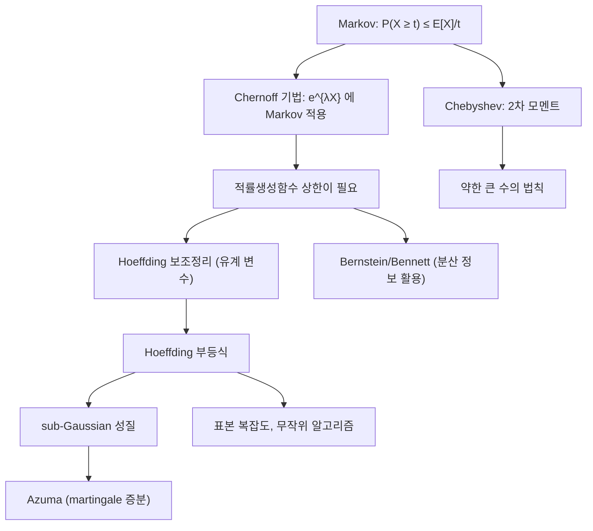

# 집중부등식

# 개요

집중부등식(concentration inequality)은 확률변수가 자기 기댓값에서 크게 벗어날 확률의 상한을 주는 부등식이다. [큰 수의 법칙](law-of-large-numbers.md)은 표본평균이 기댓값으로 수렴한다고 말하지만 "얼마나 빨리", "표본이 몇 개면 충분한지"는 말해 주지 않는다. 집중부등식은 그 정량적 답을 준다. 독립인 유계 확률변수 $n$ 개의 평균은 기댓값으로부터 대략 $1/\sqrt n$ 규모 안에 갇히며, 그 바깥으로 벗어날 확률은 $\exp(-c n t^2)$ 처럼 지수적으로 작다.

전개 순서는 거의 고정되어 있다. Markov 부등식에서 출발해 2차 모멘트를 쓰면 Chebyshev 부등식이 되고, 지수 모멘트를 쓰면 Chernoff 기법이 된다. Chernoff 기법을 실제로 쓰려면 적률생성함수의 상한이 필요한데, 그 상한을 유계 확률변수에 대해 제공하는 것이 Hoeffding 보조정리이고 결과가 Hoeffding 부등식이다. 이 구조를 추상화한 것이 sub-Gaussian 개념이다.

이 부등식들은 무작위 알고리즘의 성공 확률 증폭, 해싱과 부하 분산 분석, [확률적 방법](probabilistic-method.md)의 존재 증명, 통계적 학습이론의 표본 복잡도 경계, [유효저항](effective-resistance.md) 기반 스펙트럼 희소화의 오차 분석 등에서 도구가 아니라 전제로 쓰인다.

# 직관

기댓값 하나만 알면 할 수 있는 말은 거의 없다. 비음 확률변수 $X$ 의 평균이 1 이라면 값이 100 이상일 확률은 최대 1/100 이다. 이것이 Markov 부등식이고, 이보다 나은 결론은 정보가 더 없이는 불가능하다(한 점에 몰린 분포가 등호를 달성한다).

정보를 더 넣으면 꼬리가 급격히 얇아진다. 분산을 알면 $1/t^2$ 꼴로 떨어지고(Chebyshev), 적률생성함수 $E[e^{\lambda X}]$ 를 알면 지수적으로 떨어진다. 지수 모멘트가 강력한 이유는 독립합에서 곱으로 분해되기 때문이다.

$$
E\big[e^{\lambda \sum_i X_i}\big] \;=\; \prod_i E\big[e^{\lambda X_i}\big].
$$

한 항의 상한을 $n$ 제곱하면 합 전체의 상한이 되고, 여기에 Markov 부등식을 적용한 뒤 $\lambda$ 를 최적화하면 지수 꼬리가 나온다. 합의 개수 $n$ 이 지수의 어깨에 올라탄다는 점이 결정적이다.

기하적으로는 "고차원에서 평균은 거의 상수"라는 현상이다. 각 항이 $[0, 1]$ 에 갇혀 있으면 합의 변동 폭은 최악의 경우 $n$ 이지만 전형적인 변동은 $\sqrt n$ 에 불과하다. 서로 다른 방향으로 흔들리는 독립 성분들이 상쇄되기 때문이며, 이 상쇄를 지수 모멘트로 정량화한 것이 아래의 부등식들이다.

# 정의

## Markov 와 Chebyshev

**Markov 부등식.** 비음 확률변수 $X$ 와 $t>0$ 에 대해

$$
P(X \ge t) \;\le\; \frac{E[X]}{t}.
$$

증명은 한 줄이다. $X \ge t \cdot \mathbf 1\lbrace X \ge t\rbrace$ 의 양변에 기댓값을 취하면 된다([확률변수와 기댓값](random-variables.md)의 단조성).

**Chebyshev 부등식.** $\operatorname{Var}(X) < \infty$ 이면

$$
P\big(|X - E[X]| \ge t\big) \;\le\; \frac{\operatorname{Var}(X)}{t^2}.
$$

$(X - E[X])^2$ 에 Markov 부등식을 적용한 결과다. 일반적으로 비감소 비음 함수 $\varphi$ 에 대해 $P(X \ge t) \le E[\varphi(X)] / \varphi(t)$ 가 성립하며, $\varphi$ 의 선택이 부등식의 이름을 결정한다.

## Chernoff 기법

$\lambda > 0$ 에 대해 $\varphi(x) = e^{\lambda x}$ 를 택하면

$$
P(X \ge t) \;\le\; e^{-\lambda t} \, E\big[e^{\lambda X}\big]
\quad\Longrightarrow\quad
P(X \ge t) \;\le\; \exp\Big(-\sup_{\lambda > 0} \big(\lambda t - \log E[e^{\lambda X}]\big)\Big).
$$

우변의 지수는 누율생성함수 $\psi(\lambda) = \log E[e^{\lambda X}]$ 의 Legendre 변환이며, 이 최적화를 수행하는 절차 전체를 Chernoff 기법이라 부른다. 독립합에서는 $\psi$ 가 항별로 더해지므로 계산이 항 단위로 분해된다.

독립 Bernoulli 합 $S = \sum X_i$ 와 $\mu = E[S]$ 에 대한 고전적 결과는 다음과 같다.

$$
P\big(S \ge (1+\delta)\mu\big) \;\le\; \Big(\frac{e^{\delta}}{(1+\delta)^{1+\delta}}\Big)^{\mu}
\;\le\; \exp\!\Big(-\frac{\delta^2 \mu}{2 + \delta}\Big), \qquad \delta > 0 .
$$

## Hoeffding 보조정리와 부등식

**Hoeffding 보조정리.** 확률변수 $Y$ 가 $E[Y] = 0$ 이고 $a \le Y \le b$ 이면 모든 실수 $\lambda$ 에 대해

$$
E\big[e^{\lambda Y}\big] \;\le\; \exp\!\Big(\frac{\lambda^2 (b-a)^2}{8}\Big).
$$

*증명 스케치.* $\psi(\lambda) = \log E[e^{\lambda Y}]$ 는 매끄럽고 $\psi(0) = 0$ 이며 $\psi'(0) = E[Y] = 0$ 이다. $\psi''(\lambda)$ 는 밀도를 $e^{\lambda y}$ 로 기울인 새 분포에 대한 분산이고, 그 분포는 $[a, b]$ 에 지지되므로 Popoviciu 부등식에 의해 $\psi''(\lambda) \le (b-a)^2/4$ 이다. Taylor 전개 $\psi(\lambda) = \psi(0) + \lambda\psi'(0) + \lambda^2\psi''(\xi)/2$ 에 대입하면 결론이 나온다.

**Hoeffding 부등식.** $X_1, \dots, X_n$ 이 독립이고 $a_i \le X_i \le b_i$ 이며 $S_n = \sum X_i$ 일 때

$$
P\big(S_n - E[S_n] \ge t\big) \;\le\; \exp\!\left(-\frac{2 t^2}{\sum_{i=1}^{n} (b_i - a_i)^2}\right).
$$

*증명.* 중심화한 항에 Chernoff 기법을 적용하고 독립성으로 곱 분해한 뒤 보조정리를 각 항에 쓰면 상한은 $\exp(\lambda^2 \sum (b_i - a_i)^2 / 8 - \lambda t)$ 이다. $\lambda = 4t / \sum (b_i - a_i)^2$ 에서 최소화하면 된다. 양쪽 꼬리를 합치면 우변이 두 배가 된다.

특히 $X_i \in [0, 1]$ 이고 표본평균을 볼 때

$$
P\big(|\bar{X}_n - \mu| \ge \varepsilon\big) \;\le\; 2 \exp\big(-2 n \varepsilon^2\big)
$$

이다. Chebyshev 가 주는 $1/(4n\varepsilon^2)$ 와 비교하면 꼬리 감소 속도가 다항에서 지수로 바뀐다.

## sub-Gaussian

중심화된 확률변수 $X$ 가 어떤 $\sigma > 0$ 에 대해

$$
E\big[e^{\lambda X}\big] \;\le\; \exp\!\Big(\frac{\lambda^2 \sigma^2}{2}\Big) \quad \text{for all } \lambda \in \mathbb{R}
$$

를 만족하면 매개변수 $\sigma$ 의 sub-Gaussian 이라 한다. Hoeffding 보조정리는 "$[a, b]$ 에 갇힌 중심화 변수는 $\sigma = (b-a)/2$ 의 sub-Gaussian"이라는 진술로 읽힌다. 정의에서 곧바로

$$
P(X \ge t) \le \exp\!\Big(-\frac{t^2}{2\sigma^2}\Big), \qquad
P(|X| \ge t) \le 2\exp\!\Big(-\frac{t^2}{2\sigma^2}\Big)
$$

가 따르고, 역으로 이런 꼬리 경계를 갖는 변수는 상수배 매개변수의 sub-Gaussian 이다. 꼬리 경계, 적률생성함수 경계, 모멘트 증가 속도 $(E\lvert X \rvert^p)^{1/p} = O(\sqrt p)$ 와 Orlicz 노름 유한성이 모두 동치라는 사실이 이 개념을 편리하게 만든다. 독립 sub-Gaussian 의 합은 매개변수의 제곱이 더해지는 sub-Gaussian 이므로, 합에 대한 집중은 정의만으로 즉시 나온다.

분산이 작지만 꼬리가 두꺼운 변수(예: 드문 사건의 지시함수 합)에는 sub-Gaussian 대신 sub-exponential 조건과 Bernstein 부등식

$$
P\big(S_n - E[S_n] \ge t\big) \;\le\;
\exp\!\left(-\frac{t^2}{2\big(\sum_i \operatorname{Var}(X_i) + bt/3\big)}\right)
$$

를 쓴다. 작은 편차에서는 분산이 지배해 Gaussian 꼴, 큰 편차에서는 유계 상수 $b$ 가 지배해 지수 꼴이 된다[^1].

# 성질

## 큰 수의 법칙의 정량화

약한 [큰 수의 법칙](law-of-large-numbers.md)은 Chebyshev 부등식 한 줄로 나온다. $\operatorname{Var}(X_i) = \sigma^2$ 이면

$$
P\big(|\bar{X}_n - \mu| \ge \varepsilon\big) \;\le\; \frac{\sigma^2}{n \varepsilon^2} \;\to\; 0 .
$$

유계성을 추가하면 Hoeffding 이 지수 경계를 주고, 이때 우변이 합 가능하므로 Borel–Cantelli 보조정리에 의해 **강한** 수렴까지 바로 얻는다. 즉 유계 경우에는 집중부등식이 강한 큰 수의 법칙의 짧은 증명을 제공한다.

정밀도를 역으로 읽으면 표본 크기 공식이 된다. 오차 $\varepsilon$ 와 신뢰수준 $1 - \delta$ 를 원하면

$$
n \;\ge\; \frac{1}{2\varepsilon^2} \log \frac{2}{\delta}
$$

이면 충분하다. $\delta$ 에 로그로만 의존한다는 점이 실용적 핵심이다. 신뢰도를 1000 배 높이는 비용이 표본 7 배 정도에 불과하다.

## 중심극한정리와의 관계

[중심극한정리](central-limit-theorem.md)는 $\sqrt n (\bar X_n - \mu)$ 가 정규분포로 수렴한다고 말하므로 "전형적 편차는 $\sigma/\sqrt n$ 이다"라는 같은 규모를 준다. 차이는 두 가지다. 첫째, 중심극한정리는 점근적 근사이고 유한 $n$ 에서의 오차를 스스로 통제하지 않는다(Berry–Esseen 이 필요하다). 둘째, 편차가 $n$ 과 함께 커지는 큰 편차 영역에서는 정규 근사가 무너지지만 Chernoff 경계는 그대로 유효하다. 집중부등식은 모든 $n$ 에서 성립하는 비점근적 진술이라는 점에서 실용 분석의 기본 도구가 된다.

## 독립성을 넘어서

독립성이 본질적인 곳은 적률생성함수의 곱 분해 한 곳뿐이다. 그 자리를 [조건부 기댓값](conditional-expectation.md)으로 대체하면 같은 논증이 [Martingale](martingales.md) 증분에 대해 작동한다. 결과가 Azuma–Hoeffding 부등식이고, 여기서 유계 차분 조건을 가진 함수에 대한 McDiarmid 부등식이 따라 나온다. 함수 $f$ 가 각 좌표를 바꿀 때 $c_i$ 이하로 변하면

$$
P\big(f(X_1, \dots, X_n) - E[f] \ge t\big) \;\le\; \exp\!\left(-\frac{2t^2}{\sum_i c_i^2}\right)
$$

이다. 합이 아닌 복잡한 통계량(최댓값, 그래프의 색수, 경험 과정의 상한 등)에 집중을 적용할 수 있게 해 주는 다리이며, 엔트로피 방법과 로그-Sobolev 부등식은 이 방향을 더 밀고 간 현대적 기법이다[^2].

## 한계

집중부등식이 주는 상수는 대개 최적이 아니다. 예컨대 Hoeffding 은 분산을 전혀 쓰지 않으므로 실제 분산이 매우 작은 경우 심하게 느슨하다(이때는 Bernstein 이 낫다). 또한 유계성이나 sub-Gaussian 가정이 깨지면(예: 두꺼운 꼬리 분포) 지수 경계 자체가 거짓이 되고 다항 꼬리만 가능하다. 마지막으로 여러 사건에 대해 합집합 경계를 쓰는 순간 $\log(\text{개수})$ 만큼 손해가 발생하므로, 개수가 지수적으로 많으면 chaining 같은 더 정교한 기법이 필요하다.

# 활용

## 무작위 알고리즘

- **성공 확률 증폭.** 성공 확률이 $2/3$ 인 판정 알고리즘을 $k$ 번 독립 실행하고 다수결을 취하면 오류 확률이 $\exp(-\Theta(k))$ 로 떨어진다. 다수결 실패는 성공 횟수가 $k/2$ 이하인 사건이므로 Chernoff 경계가 바로 적용된다.
- **부하 분산.** $n$ 개의 공을 $n$ 개의 상자에 무작위로 넣으면 최대 부하가 높은 확률로 $\Theta(\log n / \log\log n)$ 이다. 상한은 한 상자의 부하에 Chernoff 를 적용하고 상자 개수만큼 합집합 경계를 쓰는 표준 논증이다.
- **차원 축소.** Johnson–Lindenstrauss 보조정리는 무작위 사영이 거리의 제곱을 $1 \pm \varepsilon$ 안에서 보존함을 주장하며, 증명의 핵심이 카이제곱 꼴 확률변수에 대한 지수 집중이다. [유효저항](effective-resistance.md) 계산과 스펙트럼 희소화의 오차 분석도 같은 유형의 행렬 Chernoff 부등식을 쓴다.

## 학습이론의 표본 복잡도

가설 $h$ 의 경험 오차와 실제 오차의 차이는 유계 확률변수 $n$ 개의 평균 문제이므로 Hoeffding 이 적용된다. 유한 가설류 $H$ 에 대해 모든 가설에 동시에 성립시키려면 합집합 경계를 쓰고

$$
n \;\ge\; \frac{1}{2\varepsilon^2}\Big(\log |\mathcal{H}| + \log \frac{2}{\delta}\Big)
$$

이면 충분하다. 가설 개수에 로그로만 의존한다는 결론이 PAC 학습 가능성의 출발점이다. 무한 가설류에서는 $\log|H|$ 자리에 VC 차원이나 Rademacher 복잡도가 들어가고, 경험 과정 전체의 상한에 McDiarmid 부등식을 적용해 집중을 보장한다. [가설검정과 p-값](hypothesis-testing.md)이나 [신뢰구간](confidence-intervals.md)에서 분포 가정 없이 유한 표본 보장을 얻고 싶을 때도 같은 부등식을 쓴다.

[^1]: Gábor Lugosi, Concentration-of-measure inequalities (lecture notes), https://www.upf.edu/documents/298368705/0/anu.pdf

[^2]: Rick Durrett, Probability: Theory and Examples (5th ed.), https://sites.math.duke.edu/~rtd/PTE/PTE5_011119.pdf

# 연관 문서

## 선수지식

- [확률변수와 기댓값](random-variables.md)
- [큰 수의 법칙](law-of-large-numbers.md)

## 더 알아보기

아직 연결한 문서가 없다.

#probability
