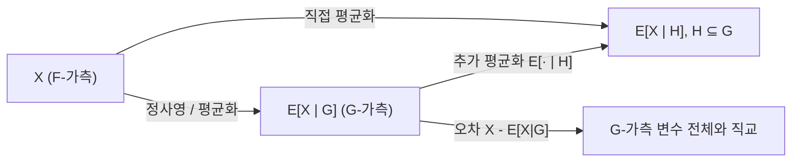

# 조건부 기댓값

# 개요

조건부 기댓값은 "부분적인 정보만 주어졌을 때 확률변수의 최선의 예측값"을 수학적으로 정식화한 것이다. 초등적인 확률론에서는 사건 `B` 에 대해

$$
E[X \mid B] = \frac{E[X \mathbf{1}_B]}{P(B)}, \qquad P(B) > 0
$$

로 정의하지만, 이 정의는 `P(B) = 0` 인 사건에 대해 무력하고, "관측할 정보 전체"를 하나의 대상으로 다루지 못한다. 현대적인 정의는 조건을 거는 대상을 사건이 아니라 **σ-대수** `G` 로 잡고, 조건부 기댓값을 `G`-가측 확률변수로 정의한다.

핵심은 두 줄로 요약된다. 조건부 기댓값 `E[X | G]` 는 (1) `G`-가측이며 (2) `G` 안의 모든 사건 위에서 `X` 와 같은 적분값을 갖는 확률변수다. 존재성과 거의 확실한 유일성은 [Radon–Nikodym 정리](radon-nikodym.md)가 보장한다. 이 정의가 있어야 [Markov 연쇄](markov-chains.md)의 연속시간·일반상태 버전, [Martingale](martingales.md), 그리고 [상측도와 확률분포](pushforward-measure.md) 위의 조건부 분포 이론이 성립한다.

# 직관

정보를 σ-대수로 부호화한다는 발상이 출발점이다. 확률공간 `(Ω, F, P)` 에서 부분 σ-대수 `G ⊆ F` 는 "지금 알 수 있는 질문들의 모음"이다. `G` 에 속한 사건 `A` 에 대해서는 `ω` 가 `A` 에 들어 있는지 여부를 관측으로 판정할 수 있고, `G` 에 없는 사건은 판정할 수 없다.

가장 투명한 경우는 `G` 가 가산 분할 `Ω = B_1 ⊔ B_2 ⊔ ...` 로 생성될 때다. 이때 관측이 알려주는 것은 "지금 어느 조각 안에 있는가" 뿐이므로, 예측값은 각 조각 위에서 상수여야 하고 그 상수는 조각 위의 평균이어야 한다.

$$
E[X \mid \mathcal{G}](\omega) \;=\; \sum_{k} \frac{E[X \mathbf{1}_{B_k}]}{P(B_k)} \, \mathbf{1}_{B_k}(\omega).
$$

"조각 위에서 상수"가 곧 `G`-가측성이고, "조각 위의 평균"이 곧 적분 일치 조건이다. 일반적인 `G` 에는 분할이 없지만 두 조건은 그대로 살아남는다. 그래서 정의는 공식이 아니라 **특성화**의 형태를 띤다.

두 번째 직관은 기하다. 제곱적분 가능한 확률변수들의 공간은 [내적 공간](inner-product-spaces.md)이고 사실 완비, 즉 [Hilbert 공간](hilbert-spaces.md)이다. `G`-가측 원소들은 닫힌 부분공간을 이루고, `E[X | G]` 는 `X` 를 그 부분공간 위로 내린 **정사영**이다. 오차 `X - E[X | G]` 가 모든 `G`-가측 변수와 직교한다는 사실이 적분 일치 조건과 같은 말이다.



세 번째 직관은 예측이다. 제곱오차를 최소화하는 `G`-가측 예측기가 정확히 `E[X | G]` 이다. [최대가능도 추정](maximum-likelihood.md)이나 [선형회귀](linear-regression.md)에서 "회귀함수"라고 부르는 대상이 바로 이것이다.

# 정의

## 조건부 기댓값

확률공간 `(Ω, F, P)`, 부분 σ-대수 `G ⊆ F`, 그리고 적분 가능한 확률변수 `X` (즉 `E|X| < ∞`)를 고정한다. 확률변수 `Y` 가 다음 두 조건을 만족하면 `Y` 를 `G` 에 대한 `X` 의 조건부 기댓값이라 하고 `Y = E[X | G]` 로 쓴다.

1. `Y` 는 `G`-[가측함수](measurable-functions.md)이고 적분 가능하다.
2. 모든 `A ∈ G` 에 대하여

$$
\int_A Y \, dP \;=\; \int_A X \, dP .
$$

조건 2를 부분적분 등식(partial averaging property)이라 부른다. `A = Ω` 를 넣으면 특히 `E[Y] = E[X]` 다.

확률변수 `Z` 에 대한 조건부 기댓값은 `Z` 가 생성하는 σ-대수를 쓴 약속이다.

$$
E[X \mid Z] \;:=\; E[X \mid \sigma(Z)], \qquad \sigma(Z) = \{Z^{-1}(B) : B \in \mathcal{B}(\mathbb{R})\}.
$$

Doob–Dynkin 보조정리에 의해 `σ(Z)`-가측 확률변수는 어떤 Borel 함수 `g` 에 대해 `g(Z)` 의 꼴이므로, `E[X | Z] = g(Z)` 인 함수 `g` 가 존재한다. 이 `g` 를 회귀함수라 부른다.

조건부 확률은 지시함수의 조건부 기댓값으로 정의한다.

$$
P(A \mid \mathcal{G}) \;:=\; E[\mathbf{1}_A \mid \mathcal{G}].
$$

## 존재성과 유일성

**정리.** `E|X| < ∞` 이면 `E[X | G]` 가 존재하고, 거의 확실하게 유일하다.

*유일성.* `Y`, `Y'` 가 둘 다 조건을 만족한다고 하자. `A = {Y - Y' > ε} ∈ G` 에 대해 두 부분적분 등식을 빼면 `∫_A (Y - Y') dP = 0` 이고, 피적분함수가 `A` 위에서 `ε` 보다 크므로 `ε P(A) ≤ 0`, 즉 `P(A) = 0` 이다. `ε ↓ 0` 과 역할을 바꾼 논증으로 `Y = Y'` 거의 확실하게 성립한다. 따라서 조건부 기댓값은 **버전**(version)까지만 결정되며, 등식은 모두 "거의 확실하게"로 읽어야 한다.

*존재성.* 먼저 `X ≥ 0` 라 하자. `G` 위에서 유한측도

$$
\nu(A) \;=\; \int_A X \, dP, \qquad A \in \mathcal{G}
$$

를 정의한다. `P(A) = 0` 이면 `ν(A) = 0` 이므로 `ν ≪ P|_G` 이고, [Radon–Nikodym 정리](radon-nikodym.md)에 의해 `G`-가측 밀도 `Y = dν / d(P|_G)` 가 존재한다. 이 `Y` 가 정의의 두 조건을 그대로 만족한다. 일반 `X` 는 `X = X⁺ - X⁻` 로 분해하고 선형으로 결합한다. 존재성 증명의 전부가 Radon–Nikodym 이라는 점이 이 개념의 측도론적 위치를 말해 준다.

## L2 정사영으로서의 정의

`E[X²] < ∞` 인 경우에는 측도론 없이도 구성할 수 있다. `L²(Ω, F, P)` 는 내적

$$
\langle U, V \rangle \;=\; E[UV]
$$

를 가진 [Hilbert 공간](hilbert-spaces.md)이고, `L²(Ω, G, P)` 는 그 닫힌 부분공간이다. 정사영 정리에 의해 `X` 에 가장 가까운 원소 `Y` 가 유일하게 존재하며, 최적성의 1차 조건은

$$
E[(X - Y) W] = 0 \quad \text{for all } W \in L^2(\Omega, \mathcal{G}, P)
$$

이다. `W = 1_A` 로 두면 부분적분 등식이 되므로 이 `Y` 가 조건부 기댓값이다. 즉 `L²` 에서 조건부 기댓값은 정사영 연산자이며, 특히 멱등(`E[E[X|G]|G] = E[X|G]`)이고 작용소 노름이 1이다. 일반적인 `L¹` 의 경우는 `L²` 가 `L¹` 에서 조밀하다는 사실과 아래의 수축성(contraction) 성질로 확장해 얻을 수도 있다.

## 이산 경우와의 일치

`G = σ(B_1, B_2, ...)` 가 양의 확률을 갖는 가산 분할로 생성되면, `G`-가측 변수는 각 `B_k` 위에서 상수다. `Y = Σ_k c_k 1_{B_k}` 를 `A = B_k` 에 대한 부분적분 등식에 넣으면 `c_k P(B_k) = E[X 1_{B_k}]` 이므로

$$
c_k \;=\; \frac{E[X \mathbf{1}_{B_k}]}{P(B_k)} \;=\; E[X \mid B_k]
$$

가 되어 초등적 정의와 일치한다. [유한 확률 공간](probability.md)에서 배우는 조건부 기댓값과 [Bayes 정리](bayes.md)의 계산은 모두 이 특수 경우다.

# 성질

아래에서 `X`, `Y` 는 적분 가능하고 등식은 거의 확실한 의미다.

## 기본 연산 성질

**선형성.** 상수 `a`, `b` 에 대해

$$
E[aX + bY \mid \mathcal{G}] \;=\; a\,E[X \mid \mathcal{G}] + b\,E[Y \mid \mathcal{G}].
$$

증명은 우변이 `G`-가측이고 부분적분 등식을 만족함을 확인한 뒤 유일성을 쓰면 끝난다. 이후 성질들도 대부분 같은 전략을 따른다.

**단조성.** `X ≤ Y` 이면 `E[X | G] ≤ E[Y | G]`. 실제로 `A = {E[X|G] - E[Y|G] > ε}` 위에서 적분하면 모순이 나온다. 따름정리로 `|E[X | G]| ≤ E[ |X| | G ]` 가 성립하고, 따라서 조건부 기댓값은 `L¹` 위의 수축이다.

$$
E\big[\,\big|E[X \mid \mathcal{G}]\big|\,\big] \;\le\; E[\,|X|\,].
$$

**탑 성질 (tower property).** `H ⊆ G ⊆ F` 이면

$$
E\big[\,E[X \mid \mathcal{G}] \,\big|\, \mathcal{H}\,\big] \;=\; E[X \mid \mathcal{H}].
$$

증명: 좌변은 `H`-가측이다. `A ∈ H ⊆ G` 에 대해 `∫_A E[E[X|G]|H] dP = ∫_A E[X|G] dP = ∫_A X dP` 이며, 첫 등식은 `H` 에 대한 정의, 둘째 등식은 `A ∈ G` 이므로 `G` 에 대한 정의다. 유일성으로 결론이 난다. "정보를 적게 가진 쪽이 이긴다"는 이 성질이 [Martingale](martingales.md) 이론 전체의 계산 엔진이다.

**끌어내기 (taking out what is known).** `W` 가 `G`-가측이고 `XW` 가 적분 가능하면

$$
E[XW \mid \mathcal{G}] \;=\; W \, E[X \mid \mathcal{G}].
$$

지시함수 `W = 1_B` (`B ∈ G`)에 대해 직접 확인한 뒤 단순함수, 단조극한([단조 수렴 정리](monotone-convergence.md))의 순서로 확장한다.

**독립성.** `X` 가 `G` 와 독립이면 `E[X | G] = E[X]` 다. 상수는 `G`-가측이고, `A ∈ G` 에 대해 `E[X 1_A] = E[X] P(A)` 이기 때문이다. 반대 극단으로 `X` 가 `G`-가측이면 `E[X | G] = X` 다.

## 수렴 정리와 Jensen

조건 없는 적분의 수렴 정리들은 모두 조건부 버전을 갖는다. `0 ≤ X_n ↑ X` 이면 `E[X_n | G] ↑ E[X | G]` (조건부 단조수렴), `|X_n| ≤ Z` 이고 `X_n → X` 이면 `E[X_n | G] → E[X | G]` ([지배 수렴 정리](dominated-convergence.md)의 조건부 버전), `X_n ≥ 0` 이면 `E[liminf X_n | G] ≤ liminf E[X_n | G]` (조건부 Fatou).

**조건부 Jensen 부등식.** `φ` 가 [볼록](convexity.md)이고 `X`, `φ(X)` 가 적분 가능하면

$$
\varphi\big(E[X \mid \mathcal{G}]\big) \;\le\; E[\varphi(X) \mid \mathcal{G}].
$$

*증명 스케치.* 볼록함수는 자신의 접선(지지선)들의 상한이다. 유리수 매개변수로 가산 집합 `{(a_n, b_n)}` 을 골라 `φ(x) = sup_n (a_n x + b_n)` 로 쓸 수 있다. 각 `n` 에 대해 `φ(X) ≥ a_n X + b_n` 이므로 단조성과 선형성으로 `E[φ(X)|G] ≥ a_n E[X|G] + b_n` 이고, 가산 상한을 취하면 영집합이 가산 번만 합쳐지므로 부등식이 거의 확실하게 유지된다.

`φ(x) = |x|^p` 를 넣으면 조건부 기댓값이 모든 `L^p`(`p ≥ 1`)에서 수축임이 따라 나온다. 이 사실은 [균등적분성](uniform-integrability.md)과 결합해 martingale 수렴 이론의 `L¹` 수렴 판정에 쓰인다.

## 분산 분해와 최적 예측

`E[X²] < ∞` 일 때 조건부 분산을 `Var(X | G) = E[X² | G] - E[X | G]²` 로 정의하면 전분산 공식이 성립한다.

$$
\operatorname{Var}(X) \;=\; E\big[\operatorname{Var}(X \mid \mathcal{G})\big] \;+\; \operatorname{Var}\big(E[X \mid \mathcal{G}]\big).
$$

Pythagoras 정리의 확률적 표현이다. 또한 임의의 `G`-가측 제곱적분 가능 `W` 에 대해

$$
E\big[(X - W)^2\big] \;=\; E\big[(X - E[X \mid \mathcal{G}])^2\big] + E\big[(E[X \mid \mathcal{G}] - W)^2\big]
$$

이므로 제곱오차를 최소화하는 예측기는 `W = E[X | G]` 이다. 통계학에서 "조건부 평균이 최적 예측"이라는 표어가 이것이며, 추정량의 개선을 다루는 Rao–Blackwell 정리도 같은 항등식의 따름이다[^1].

## 정칙 조건부 분포

각 `ω` 마다 `A ↦ P(A | G)(ω)` 가 진짜 확률측도가 되도록 버전을 고를 수 있는가는 자명하지 않다. 가산가법성을 요구하는 영집합이 사건마다 다르기 때문이다. 상태공간이 Polish 공간(완비 가분 거리공간)이면 정칙 조건부 분포가 존재한다는 것이 표준 정리이며[^2], 이 결과 덕분에 "조건부로 분포를 갖는다"는 서술이 안전해진다. 조건부 독립, Markov 성질, 그리고 [Bayes 추론](bayesian-inference.md)의 사후분포가 모두 이 위에서 정의된다.

# 활용

## Martingale 과 확률과정

시간 축을 가진 σ-대수의 증가열 `F_0 ⊆ F_1 ⊆ ...` (filtration)을 두면 `E[X_{n+1} | F_n]` 은 "현재까지의 정보로 본 다음 값의 예측"이다. 이 예측이 현재 값과 같으면 [Martingale](martingales.md)이다. 탑 성질은 곧바로 `E[X_n] = E[X_0]` 를 주고, 여기서 선택적 정지 정리, Doob 부등식, martingale 수렴 정리가 뻗어 나온다. [Markov 연쇄](markov-chains.md)의 Markov 성질도 `E[f(X_{n+1}) | F_n] = (Pf)(X_n)` 라는 조건부 기댓값 등식으로 쓰는 것이 표준이다.

## 통계와 기계학습

회귀 문제에서 목표는 특징 `Z` 로부터 반응 `X` 를 예측하는 것이고, 제곱오차 기준의 정답은 회귀함수 `E[X | Z]` 다. [선형회귀](linear-regression.md)는 이 정사영을 `Z` 의 아핀 함수들이 이루는 부분공간으로 제한한 근사이며, 비모수 회귀는 `E[X | Z]` 자체를 추정한다. [최대가능도 추정](maximum-likelihood.md)의 EM 알고리즘에서 E-단계는 문자 그대로 잠재변수에 대한 조건부 기댓값 계산이고, [KL 발산](kl-divergence.md)의 연쇄법칙도 조건부 분포에 대한 기댓값으로 표현된다.

## 계산 예제

이산 경우의 조건부 기댓값이 정말 "조각 위 평균"임을 확인하는 짧은 시뮬레이션이다. 주사위 두 개의 합 `S` 에 대해 첫 주사위 `X` 를 조건으로 `E[S | X]` 를 계산한다. 정답은 `X + 3.5` 다.

```python
import itertools, statistics
from collections import defaultdict

outcomes = list(itertools.product(range(1, 7), repeat=2))   # 균등 확률
groups = defaultdict(list)
for x, y in outcomes:
    groups[x].append(x + y)                                  # sigma(X) 의 원자별로 분류

cond = {x: statistics.fmean(vals) for x, vals in groups.items()}
print(cond)                       # {1: 4.5, 2: 5.5, ..., 6: 9.5}  =  x + 3.5

# 탑 성질: E[E[S|X]] = E[S]
print(statistics.fmean(cond[x] for x, _ in outcomes),
      statistics.fmean(x + y for x, y in outcomes))          # 7.0 7.0
```

조건이 연속 변수인 경우에는 원자가 없으므로 이런 분할 계산이 불가능하고, 밀도를 통해

$$
E[X \mid Z = z] \;=\; \frac{\int x \, f(x, z) \, dx}{\int f(x, z) \, dx}
$$

로 계산한다. 이 표현이 정당한 이유는 우변이 `Z` 의 Borel 함수이고 Fubini 정리로 부분적분 등식을 만족하기 때문이며, 분모가 0 인 `z` 들의 집합은 `Z` 의 분포에 대해 영집합이다. 조건이 영확률 사건이라는 사실과 무관하게 정의가 작동한다는 점이 측도론적 정의의 실질적인 이득이다.

[^1]: Rick Durrett, Probability: Theory and Examples (5th ed.), Chapter 4, https://sites.math.duke.edu/~rtd/PTE/PTE5_011119.pdf
[^2]: Russell Lyons and Yuval Peres, Probability on Trees and Networks, https://rdlyons.pages.iu.edu/prbtree/book.pdf

# 연관 문서

## 선수지식

- [확률변수와 기댓값](random-variables.md)
- [Radon–Nikodym 정리](radon-nikodym.md)

## 더 알아보기

- [Martingale](martingales.md)

#probability #measure_theory
