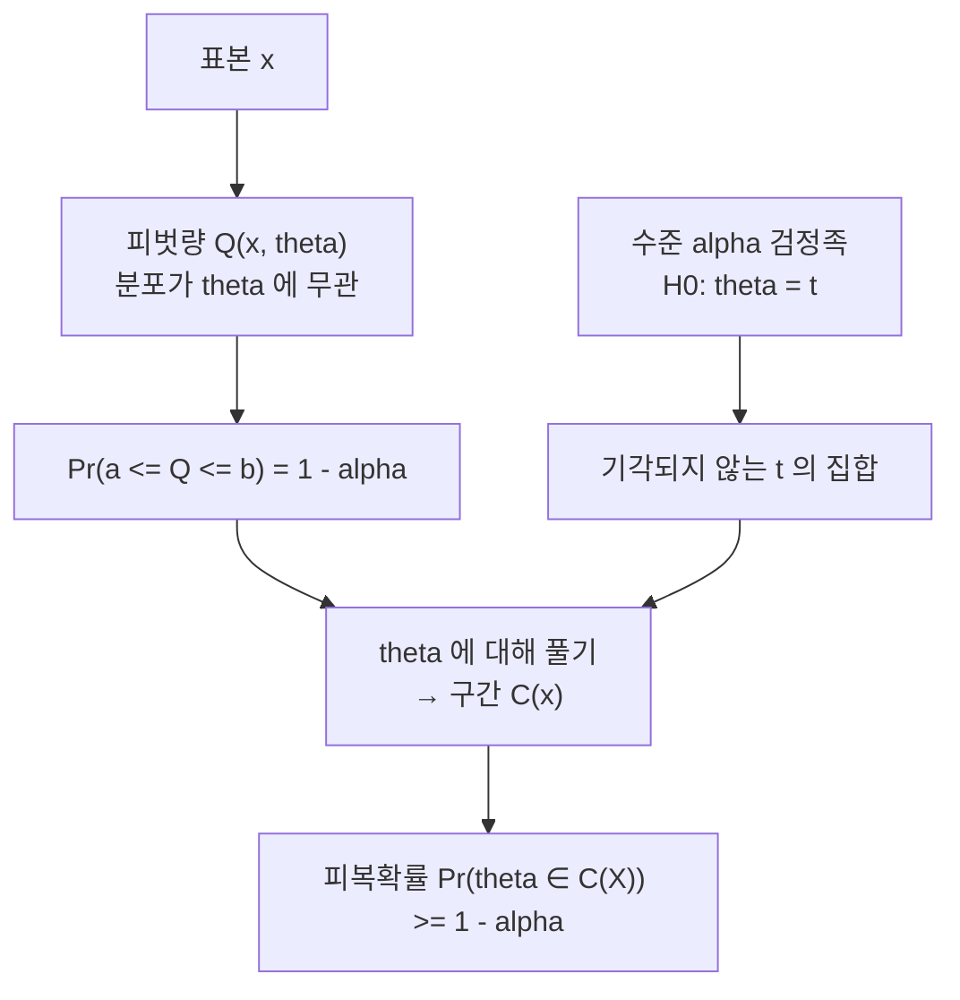

# 신뢰구간

# 개요

신뢰구간(confidence interval)은 점추정값 하나 대신 데이터로부터 구간을 만들되, 그 구간을 만드는 **절차**가 참값을 포함할 확률이 미리 정한 수준 이상이 되도록 설계한 것이다. Neyman 이 1937년에 형식화했다.[^1]

핵심은 확률이 붙는 대상이다. 모수는 고정된 미지수이고, 확률변수는 데이터이며, 따라서 구간이 확률변수다. "이 구간이 참값을 포함할 확률이 95%"가 아니라 "이 방법으로 구간을 계속 만들면 그 중 95%가 참값을 포함한다"가 정확한 진술이다.

구성 방법은 대개 두 갈래다. 분포가 모수에 의존하지 않는 피벗량을 뒤집거나, [가설검정과 p-값](hypothesis-testing.md)의 기각역을 뒤집는다. 두 방법은 같은 것의 두 얼굴이다. 대표본에서는 [중심극한정리](central-limit-theorem.md)가 근사 피벗량을 공짜로 준다.

# 직관

모수 $\theta$ 는 벽에 박힌 못이고, 구간은 데이터를 볼 때마다 던지는 고리다. 고리의 위치와 크기는 표본마다 달라진다. 95% 신뢰수준이란 고리 100개 중 약 95개가 못에 걸린다는 뜻이다. 이미 던져 놓은 고리 하나를 보고 "이 고리가 걸렸을 확률이 95%"라고 말하는 것은 범주 오류다. 걸렸거나 걸리지 않았거나 둘 중 하나이고, 우리가 모를 뿐이다.

구성의 직관은 뒤집기다. 표본평균이 참평균 주위에 어떻게 흩어지는지 안다면("평균에서 표준오차의 1.96배 안에 들어올 확률이 95%"), 그 진술을 부등식으로 옮겨 참평균을 가운데에 놓을 수 있다. 흩어짐이 모수에 의존하지 않는 형태로 표준화될 때 이 뒤집기가 깔끔하게 된다. 그것이 피벗량이다.



# 정의

## 피복확률과 신뢰구간

모수 $\theta$ 를 갖는 모형에서 데이터 $X$ 의 함수로 정해지는 확률집합 $C(X) \subseteq \Theta$ 를 생각한다. 피복확률(coverage probability)은

$$
\mathrm{cov}(\theta) \;=\; \Pr_{\theta}\big(\theta \in C(X)\big)
$$

이다. $C$ 가 수준 $1 - \alpha$ 의 신뢰집합이라는 것은 모든 $\theta$ 에 대해

$$
\Pr_{\theta}\big(\theta \in C(X)\big) \;\ge\; 1 - \alpha
$$

가 성립한다는 뜻이다. 등호가 모든 $\theta$ 에서 성립하면 정확(exact), 부등호로만 성립하면 보수적(conservative)이다. $C(X)$ 가 구간이면 신뢰구간이라 부른다.

## 피벗량

함수 $Q(X, \theta)$ 가 피벗량(pivotal quantity)이라는 것은 그 분포가 $\theta$ 에 의존하지 않는다는 뜻이다. 그러면 $\theta$ 와 무관한 상수 $a, b$ 를 골라

$$
\Pr_{\theta}\big(a \le Q(X, \theta) \le b\big) = 1 - \alpha
$$

로 만들 수 있고, 부등식을 $\theta$ 에 대해 풀면 신뢰구간이 나온다.

## 정규 평균: z 구간과 t 구간

$X_1, \dots, X_n$ 이 $N(\mu, \sigma^2)$ 에서 독립이라 하자. 분산을 알 때

$$
Q = \frac{\bar{X} - \mu}{\sigma/\sqrt{n}} \sim N(0,1)
$$

가 피벗량이고, 표준정규분포의 상위 $\alpha/2$ 분위수를 $z$ 로 쓰면

$$
\bar{X} \pm z_{\alpha/2}\,\frac{\sigma}{\sqrt{n}}
$$

가 정확한 $1-\alpha$ 구간이다. 분산을 모를 때는 표본표준편차 $s$ 로 바꾸고, 이때

$$
T = \frac{\bar{X} - \mu}{s/\sqrt{n}} \sim t_{n-1}
$$

이 자유도 $n-1$ 의 t 분포를 따르므로 구간은

$$
\bar{X} \pm t_{n-1,\,\alpha/2}\,\frac{s}{\sqrt{n}}
$$

이다. t 분위수가 z 분위수보다 크므로 구간이 넓어진다. 그 차이가 분산을 추정했다는 사실의 비용이다. 분산 자체에 대해서는 $(n-1)s^2/\sigma^2$ 이 카이제곱 피벗량이 되며 비대칭 구간이 나온다.

## 대표본 근사 구간

피벗량이 없으면 [중심극한정리](central-limit-theorem.md)로 근사 피벗량을 만든다. [최대가능도 추정](maximum-likelihood.md)의 점근정규성

$$
\sqrt{n}\,(\hat\theta_n - \theta) \;\xrightarrow{d}\; N\!\big(0,\; I(\theta)^{-1}\big)
$$

을 쓰면 Wald 구간

$$
\hat\theta_n \pm z_{\alpha/2}\,\widehat{\mathrm{se}}(\hat\theta_n)
$$

를 얻는다. 피복확률은 $n \to \infty$ 에서만 $1-\alpha$ 로 가고, 유한 표본에서는 보장되지 않는다.

## 비율의 구간

$X \sim \mathrm{Binomial}(n, p)$ 이고 $\hat p = X/n$ 일 때 Wald 구간은

$$
\hat{p} \pm z_{\alpha/2}\sqrt{\frac{\hat{p}(1-\hat{p})}{n}}
$$

이다. 간단하지만 성능이 나쁘다. 표준화량을 뒤집되 분산을 참값 $p$ 로 두고 푸는 Wilson 점수구간

$$
\frac{\hat{p} + \dfrac{z^2}{2n}}{1 + \dfrac{z^2}{n}} \;\pm\; \frac{z}{1 + \dfrac{z^2}{n}}\sqrt{\frac{\hat{p}(1-\hat{p})}{n} + \frac{z^2}{4n^2}}
$$

가 훨씬 낫다.[^2] 중심이 $1/2$ 쪽으로 당겨지고, $\hat p=0$ 이나 $1$ 에서도 폭이 0 이 되지 않는다.

# 성질

## 검정과의 쌍대성

수준 $\alpha$ 검정족과 수준 $1-\alpha$ 신뢰집합은 서로를 결정한다. 각 $t \in \Theta$ 마다 $H_0: \theta = t$ 의 기각역 $R(t)$ 가 주어져 있으면

$$
C(x) \;=\; \{\, t \in \Theta \;:\; x \notin R(t) \,\}
$$

로 정의한다. 그러면

$$
\Pr_{\theta}\big(\theta \in C(X)\big) = \Pr_{\theta}\big(X \notin R(\theta)\big) \ge 1 - \alpha
$$

이므로 $C$ 는 신뢰집합이다. 역방향도 같다. 신뢰집합이 주어지면 $t \notin C(x)$ 일 때 $H_0: \theta = t$ 를 기각하는 검정이 수준 $\alpha$ 다.

따라서 **신뢰구간은 기각되지 않는 모수값들의 집합**이다. 이 관점의 실용적 귀결이 두 가지다. 첫째, 95% 구간이 0 을 포함하지 않는 것과 양측 p-값이 0.05 미만인 것은 같은 말이다. 둘째, 구간은 p-값 하나보다 많은 정보를 준다. 기각 여부뿐 아니라 어떤 값들이 데이터와 양립하는지, 그 범위가 실질적으로 의미 있는 크기인지를 보여 준다.

## 폭과 표본크기

정규 평균 구간의 폭은

$$
2 z_{\alpha/2}\frac{\sigma}{\sqrt{n}}
$$

로 $n$ 의 제곱근에 반비례한다. 폭을 절반으로 줄이려면 표본을 네 배로 늘려야 한다. 목표 폭 $w$ 에 필요한 표본크기는 $n \approx (2 z \sigma / w)^2$ 다.

## 근사구간의 실제 피복률

Wald 이항구간의 피복률은 $n$ 에 대해 매끄럽게 수렴하지 않고 톱니처럼 진동하며, $n$ 이 수백이어도 명목 95%에 못 미치는 $p$ 값이 흔하다. 특히 $p$ 가 0 이나 1 에 가까우면 심하다. Brown–Cai–DasGupta 는 이 현상을 정리하고 Wilson 구간이나 Agresti–Coull 구간(성공 2개와 실패 2개를 더한 뒤 Wald 를 쓰는 것)을 권한다.[^2] 교훈은 일반적이다. 근사구간은 만들 때가 아니라 시뮬레이션으로 피복률을 확인할 때 검증된다.

## 흔한 오해

- **"참값이 이 구간에 있을 확률이 95%"**: 빈도주의 틀에서 $\theta$ 는 확률변수가 아니므로 이 문장에는 의미가 없다. 이런 형태의 진술을 원하면 [Bayes 추론과 사후분포](bayesian-inference.md)의 신용구간을 써야 한다. 둘은 큰 표본에서 대개 수치적으로 가깝지만 해석이 다르다.
- **"표본의 95%가 구간 안에 들어간다"**: 구간은 모수에 대한 것이지 개별 관측에 대한 것이 아니다. 관측값에 대한 구간은 예측구간이고 훨씬 넓다.
- **"두 구간이 겹치면 차이가 유의하지 않다"**: 겹침과 차이에 대한 검정은 다른 계산이다. 겹치면서도 차이가 유의할 수 있다.
- **"구간 안의 값들은 모두 똑같이 그럴듯하다"**: 피복확률은 집합에 대한 성질이고, 구간 내부의 값들도 가능도는 제각각이다.

## 병리적 사례

피복확률만 요구하면 이상한 구간도 만들 수 있다. 확률 $1-\alpha$ 로 전체 $\Theta$ 를, 확률 $\alpha$ 로 공집합을 내놓는 절차는 정확히 $1-\alpha$ 의 피복률을 갖지만 쓸모가 없다. 그래서 실제로는 기대길이 최소화, 불편성, 동변성(equivariance) 같은 부가 조건을 함께 요구한다. 또한 피복률은 $\theta$ 마다 정의된 성질이므로, 관측된 데이터의 특징에 조건을 걸면 해석이 달라질 수 있다(조건부 추론의 논점).

## 동시신뢰구간

$k$ 개의 모수 각각에 95% 구간을 만들면, 모두가 동시에 참값을 덮을 확률은 95%보다 작다. 동시 피복을 원하면 Bonferroni 보정으로 각 구간을 $1 - \alpha/k$ 수준으로 만들거나(보수적), Scheffé 방법처럼 기하적으로 정확한 동시영역을 쓴다.

# 활용

## 피복률을 시뮬레이션으로 확인하기

신뢰구간의 주장은 반복표집에 대한 것이므로 그대로 시뮬레이션할 수 있다. 정규 평균의 t 구간과 이항비율의 두 구간을 비교한다.

```python
import numpy as np
from scipy import stats

rng = np.random.default_rng(0)
z = stats.norm.ppf(0.975)

def coverage_t(n, mu=0.0, sigma=1.0, reps=20000):
    x = rng.normal(mu, sigma, size=(reps, n))
    m, s = x.mean(1), x.std(1, ddof=1)
    half = stats.t.ppf(0.975, n - 1) * s / np.sqrt(n)
    return np.mean((m - half <= mu) & (mu <= m + half))

def coverage_binom(n, p, kind, reps=20000):
    x = rng.binomial(n, p, size=reps)
    ph = x / n
    if kind == "wald":
        half = z * np.sqrt(ph * (1 - ph) / n)
        lo, hi = ph - half, ph + half
    else:  # wilson
        c = (ph + z**2 / (2*n)) / (1 + z**2 / n)
        half = z / (1 + z**2 / n) * np.sqrt(ph*(1-ph)/n + z**2/(4*n**2))
        lo, hi = c - half, c + half
    return np.mean((lo <= p) & (p <= hi))

print("정규 t 구간 n=10 :", round(coverage_t(10), 4))       # 약 0.95
print("정규 t 구간 n=100:", round(coverage_t(100), 4))      # 약 0.95
for p in (0.5, 0.1, 0.02):
    print("n=50, p=%.2f  Wald %.4f  Wilson %.4f"
          % (p, coverage_binom(50, p, "wald"), coverage_binom(50, p, "wilson")))
```

t 구간은 정규가정이 맞으므로 모든 $n$ 에서 0.95 근처에 붙는다. 이항에서는 $p$ 가 0 에 가까울수록 Wald 의 피복률이 0.95 아래로 크게 내려가는 반면 Wilson 은 훨씬 안정적이다. 정규가정을 깨서(예: 지수분포 표본) 같은 실험을 돌리면 작은 $n$ 에서 t 구간의 피복률도 무너지는 것을 볼 수 있다. 이것이 "CLT 기반 근사"의 유효 범위를 눈으로 확인하는 방법이다.

## 다른 곳으로의 연결

- **회귀**: [선형회귀와 최소제곱법](linear-regression.md)의 계수 추정량은 정규오차 아래 정확히 정규분포를 따르므로 각 계수에 t 구간이 붙는다. 예측값에는 평균에 대한 신뢰구간과 개별 관측에 대한 예측구간이 따로 있다.
- **부트스트랩**: 피벗량을 해석적으로 못 구할 때 재표본으로 추정량의 분포를 근사한다. 백분위수 구간, BCa 구간 등이 있고, 여기서도 실제 피복률 확인이 필수다.
- **가능도비**: [최대가능도 추정](maximum-likelihood.md)에서 $2(\ell(\hat\theta) - \ell(\theta))$ 가 점근적으로 카이제곱을 따른다는 사실을 뒤집으면 가능도비 구간이 나온다. Wald 구간과 달리 재매개변수화에 불변이고 비대칭 모양을 허용한다.
- **비모수와 순서통계량**: 중앙값에 대한 구간은 이항분포만으로 만들 수 있어 분포 가정이 필요 없다.
- **보고 관행**: 효과 크기와 그 구간을 함께 보고하는 것이 p-값만 보고하는 것보다 정보량이 많다는 것이 여러 분야의 통계 보고 지침의 공통 권고다.

[^1]: J. Neyman, "Outline of a Theory of Statistical Estimation Based on the Classical Theory of Probability", Philosophical Transactions of the Royal Society A 236 (1937), 333–380, https://doi.org/10.1098/rsta.1937.0005
[^2]: L. D. Brown, T. T. Cai, A. DasGupta, "Interval Estimation for a Binomial Proportion", Statistical Science 16(2) (2001), 101–133, https://doi.org/10.1214/ss/1009213286

# 연관 문서

## 선수지식

- [중심극한정리](central-limit-theorem.md)
- [가설검정과 p-값](hypothesis-testing.md)

## 더 알아보기

아직 연결한 문서가 없다.

#statistics
