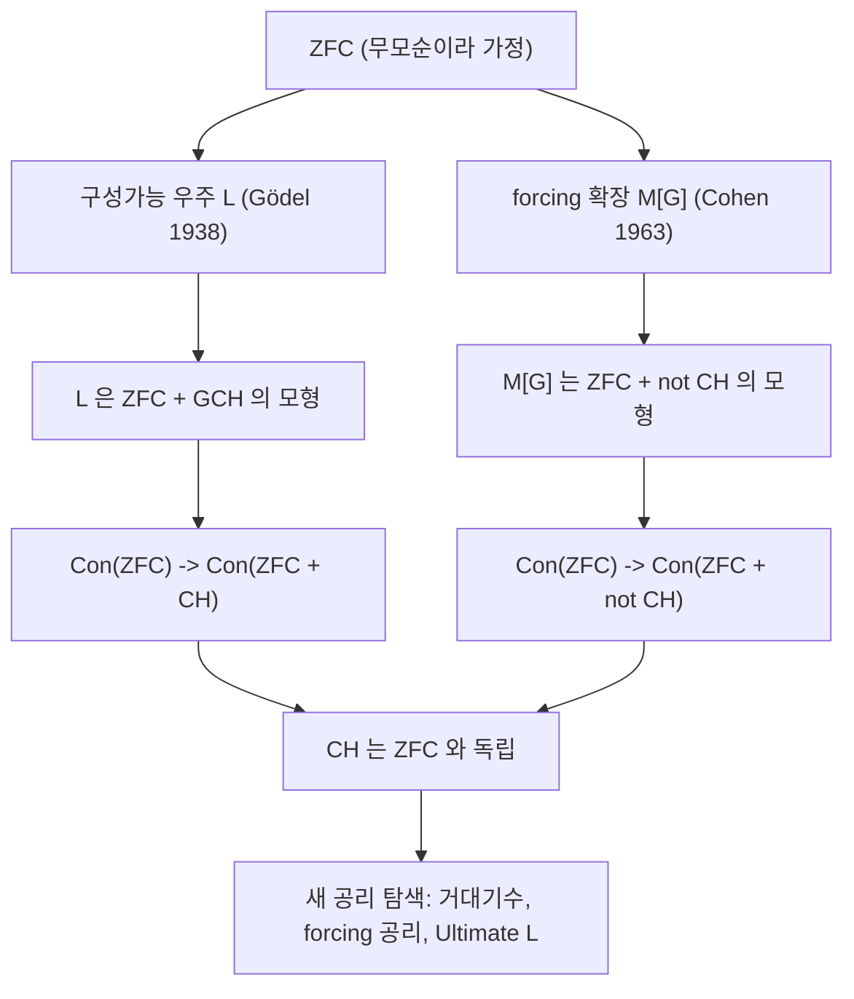

# 연속체 가설과 독립성

# 개요

Cantor 는 실수 집합이 자연수 집합보다 진짜로 크다는 것을 보인 뒤, 그 사이에 다른 크기가 있는지 물었다. 없다는 주장이 연속체 가설(CH)이다.

이 질문은 Hilbert 가 1900년에 제시한 23개 문제 중 첫 번째였고, 60여 년 뒤 예상 밖의 방식으로 결말이 났다. Gödel 은 1938년에 CH 를 반증할 수 없음을 보였고, Cohen 은 1963년에 증명할 수도 없음을 보였다. [ZFC 공리계](zfc-axioms.md)는 CH 에 대해 아무 말도 하지 않는다.

독립성은 "답이 없다"는 뜻이 아니라 "이 공리들로는 답이 정해지지 않는다"는 뜻이다. 그래서 논의는 끝나지 않고 방향을 바꾸었다. 어떤 새 공리를 받아들일 것인가, 그리고 그런 선택에 객관적 근거가 있는가 하는 물음이 남았다.

# 직관

[가산성과 비가산성](cardinality.md)에서 보듯 실수는 자연수보다 많다. 그러면 실수의 부분집합 중 자연수보다는 크고 실수 전체보다는 작은 것이 있을까. 구체적으로 만나는 실수 집합들은 이 질문에 답을 주지 못한다. 닫힌집합이나 Borel 집합처럼 "적당히 착한" 집합은 가산이거나 완전집합을 포함해 연속체 크기이고, 중간 크기가 나오지 않는다. 이것이 CH 가 참이리라는 인상을 준다.

그러나 이 인상은 착한 집합들에만 해당한다. 임의의 부분집합을 허용하면 상황을 통제할 수단이 없어진다. 문제의 뿌리는 멱집합 연산이다. ZFC 는 멱집합이 존재한다고 말할 뿐 그 안에 정확히 무엇이 들어 있는지 규정하지 않는다.

독립성 증명 둘은 이 자유도를 정반대로 이용한다. Gödel 은 멱집합을 "정의 가능한 것만" 남기도록 최대한 좁혀 CH 가 성립하는 우주를 만들었다. Cohen 은 반대로 바깥에서 새 실수를 계획적으로 밀어 넣어 실수의 개수를 원하는 만큼 늘렸다. 두 조작 모두 ZFC 의 공리를 온전히 지킨다.



# 정의

## 연속체 가설

[서수](ordinals.md)를 써서 무한 기수를 차례로 이름 붙인다. 가장 작은 무한 기수가 알레프 영이고, 그다음이 알레프 일이다. 실수 집합의 크기는 자연수 집합의 멱집합의 크기와 같다.

$$
|\mathbb{R}| \;=\; 2^{\aleph_0}
$$

**정의(CH).** 연속체 가설은 다음 등식이다.

$$
2^{\aleph_0} = \aleph_1
$$

동치로, 실수의 모든 무한 부분집합은 자연수 집합과 대등하거나 실수 전체와 대등하다. 즉 중간 크기가 없다.

**정의(GCH).** 일반화 연속체 가설은 모든 무한 기수에 대해 다음이 성립한다는 주장이다. 여기서 $\kappa$ 의 오른쪽 위 첨자는 바로 다음 기수를 뜻한다.

$$
2^{\kappa} = \kappa^{+}
$$

GCH 는 CH 를 포함하며 훨씬 강하다. GCH 를 가정하면 [선택공리](axiom-of-choice.md)가 따라 나온다는 Sierpiński 의 결과도 있다.

## 구성가능 우주

**정의.** 집합 `X` 에 대해 `Def(X)` 를 "`X` 를 논의 영역으로 하는 1차 논리식으로 매개변수를 써서 정의되는 `X` 의 부분집합 전체"라 하자. 초한 재귀로 다음을 정의한다.

$$
L_0 = \varnothing, \qquad L_{\alpha+1} = \mathrm{Def}(L_\alpha), \qquad L_\lambda = \bigcup_{\alpha < \lambda} L_\alpha
$$

모든 서수에 걸친 합집합이 구성가능 우주 `L` 이다. 일반 멱집합 대신 정의 가능한 부분집합만 취한다는 점이 핵심이다.

## forcing

**정의.** `M` 을 ZFC 의 가산 추이 모형, `P` 를 `M` 안의 부분순서(조건들의 모임)라 하자. `M` 안의 모든 조밀 부분집합과 만나는 `P` 의 필터 `G` 를 `M` 위의 일반(generic) 필터라 한다. `M` 과 `G` 로부터 생성되는 최소의 ZFC 모형을 `M[G]` 로 쓴다.

`M` 이 가산이므로 조밀집합도 가산 개이고, Rasiowa–Sikorski 보조정리에 의해 일반 필터가 존재한다. 이 존재성이 [하향 Löwenheim–Skolem 정리](lowenheim-skolem.md)에 의존한다는 점이 두 주제를 잇는다.

CH 를 깨는 데 쓰는 `P` 는 유한 조건들의 순서다. 조건은 두 번째 성분이 자연수 쌍인 유한 부분함수이며, 값은 0 또는 1 이다.

$$
P = \{\, p : p \text{ is a finite partial function}, \ \mathrm{dom}(p) \subseteq \kappa \times \omega, \ \mathrm{ran}(p) \subseteq \{0,1\} \,\}
$$

일반 필터는 이 조각들을 이어 붙여 $\kappa$ 개의 새 실수를 만들어 낸다.

# 성질

## Gödel 의 결과

**정리(Gödel, 1938).** ZF 에서 `L` 이 ZFC 와 GCH 를 만족함을 증명할 수 있다. 따라서 ZF 가 무모순이면 ZFC + GCH 도 무모순이다.

*증명 스케치.* $L$ 은 추이적이고 모든 서수를 포함하므로 ZF 의 공리들이 상대화되어 성립한다. 선택공리는 $L$ 의 원소들이 구성 순서에 따라 정의 가능하게 잘 정렬되기 때문에 나온다. GCH 는 응축 보조정리(condensation)에서 나온다. $L_\alpha$ 의 기본 부분구조를 잡아 추이 붕괴하면 다시 어떤 $L_\beta$ 가 되고, 이 성질에서 $L$ 안의 $\kappa$ 의 부분집합들이 모두 $L$ 의 낮은 단계에 이미 나타남을 얻어 개수 상한이 정해진다.

이로써 CH 는 ZFC 에서 반증 불가능하다. 뒤집어 말하면 "중간 크기 집합이 존재한다"는 주장을 ZFC 로는 증명할 수 없다.

## Cohen 의 결과

**정리(Cohen, 1963).** ZFC 가 무모순이면 ZFC + CH 의 부정도 무모순이다[^1].

*증명 스케치.* 가산 추이 모형 $M$ 에서 시작해 위의 $P$ 로 확장을 만든다. $\kappa$ 를 $M$ 이 알레프 둘이라고 여기는 기수로 잡으면, 일반 필터가 서로 다른 $\kappa$ 개의 실수를 준다. "서로 다르다"는 것은 임의의 두 첨자에 대해 어느 자리에서 값이 갈리도록 만드는 조건들의 모임이 조밀하기 때문이다.

남는 문제는 기수가 붕괴하지 않는지다. 조건이 유한이므로 이 `P` 는 가산 반사슬 조건을 만족하고, 그로부터 `M` 의 기수가 `M[G]` 에서도 기수로 남음을 보인다. 따라서 `M[G]` 에서 실수는 적어도 알레프 둘 개이고 CH 는 거짓이다.

forcing 은 이후 집합론의 표준 기법이 되었다. Boolean 값 모형으로 다시 쓰면 [Boolean algebra](boolean-algebras.md) 위의 값매김으로 정리할 수 있고, 이 형태가 forcing 을 순수 대수적으로 이해하는 길을 준다.

## 연속체의 크기는 얼마나 자유로운가

CH 가 독립이라는 사실은 시작일 뿐이다. 실제로 연속체의 크기는 거의 임의로 조절된다.

**정리(Easton).** 정칙 기수들 위에서 멱집합 함수는 단조성과 König 의 부등식만 지키면 무엇이든 될 수 있다. König 의 부등식은 공종도(cofinality)에 대한 제약이다.

$$
\mathrm{cf}\big(2^{\kappa}\big) > \kappa
$$

예를 들어 연속체의 크기가 알레프 오메가가 되는 일은 불가능하다. 그 기수의 공종도가 알레프 영이기 때문이다. 반면 알레프 둘, 알레프 열일곱, 알레프 오메가 플러스 일 등은 모두 가능하다.

특이 기수에서는 사정이 다르다. Silver 의 정리는 비가산 공종도의 특이 기수에서 GCH 가 처음 깨질 수 없다고 말하고, Shelah 의 pcf 이론은 특이 기수의 멱집합 크기에 ZFC 만으로 증명되는 상한을 준다. 즉 자유도는 정칙 기수 쪽에 몰려 있다.

## 거대기수로는 해결되지 않는다

Gödel 은 새 공리, 특히 거대기수 공리가 CH 를 결정해 주기를 기대했다. 그러나 Levy–Solovay 정리가 이 희망을 차단한다. 크기가 작은 forcing 은 거대기수의 성질을 보존하므로, 거대기수를 가정한 상태에서도 CH 를 참으로도 거짓으로도 만드는 확장이 항상 있다.

거대기수 공리가 무력한 것은 아니다. 그것들은 실수의 "착한" 부분집합들에 대해서는 많은 것을 결정한다. 예를 들어 충분한 거대기수가 있으면 사영 집합들은 모두 Lebesgue [측도](measure.md) 가측이고 완전집합 성질을 가진다. 결정되지 않는 것은 임의의 부분집합에 관한 질문, 즉 CH 자체다.

## 이후의 논쟁

논쟁은 "CH 에 진리값이 있는가"라는 물음으로 옮겨졌다.

**다중우주 관점.** 집합론적 우주는 하나가 아니며, CH 는 어떤 우주에서는 참이고 어떤 우주에서는 거짓이라는 입장이다. 이 관점에서 독립성은 문제의 해소이지 미해결이 아니다. [수학적 구조주의](mathematical-structuralism.md)와 친화적이다.

**유일 우주 관점.** 집합 개념은 하나의 우주를 의도하며, 우리는 아직 옳은 공리를 못 찾았을 뿐이라는 입장이다. [수학적 플라톤주의](mathematical-platonism.md)가 여기에 해당한다.

Woodin 은 후자의 입장에서 오랫동안 작업해 왔다. 2000년 전후에는 Omega-논리의 틀에서 연속체의 크기가 알레프 둘이어야 한다는 논거를 제시했다[^2]. 이후에는 Ultimate L 이라 불리는 내부 모형 계획으로 방향을 바꾸었는데, 그 계획이 성공한다면 CH 는 참이 된다. Foreman 과 Magidor 쪽에서는 Martin 의 최대 원리 같은 강한 forcing 공리를 지지하며, 이 공리는 연속체의 크기가 알레프 둘임을 함의한다.

어느 쪽도 결정적 합의에 이르지 못했다. 논쟁의 성격이 수학적 증명이 아니라 공리 선택의 정당화라는 점이 이 문제의 특징이다[^3].

## 계산 예

forcing 자체는 계산할 수 없지만, 조건들의 조작은 유한하므로 직접 다룰 수 있다. 새 실수들을 분리시키는 조밀집합을 만나는 과정을 흉내 내 본다.

```python
def decide(p, i, n, bit):
    """조밀집합 D(i,n) = {q : (i,n) in dom q} 를 만나도록 확장한다."""
    q = dict(p)
    q.setdefault((i, n), bit)
    return q

def separate(p, i, j):
    """i 번째 실수와 j 번째 실수가 달라지도록 확장한다."""
    q = dict(p)
    n = 0
    while True:
        a, b = q.get((i, n)), q.get((j, n))
        if a is not None and b is not None:
            if a != b:
                return q                 # 이미 분리됨
            n += 1
            continue
        if a is None and b is None:
            q[(i, n)], q[(j, n)] = 0, 1
        elif a is None:
            q[(i, n)] = 1 - b
        else:
            q[(j, n)] = 1 - a
        return q

p = {}
for i in range(3):
    for n in range(5):
        p = decide(p, i, n, bit=(i * i + n) % 2)   # 유한 조각을 하나 만든다
for i in range(3):
    for j in range(i + 1, 3):
        p = separate(p, i, j)

for i in range(3):
    bits = [p.get((i, n), "?") for n in range(6)]
    print(f"실수 {i}:", "".join(str(b) for b in bits))
print("조건의 크기(유한):", len(p))
```

각 단계는 유한한 정보만 확정하지만, 모든 조밀집합을 만나는 필터를 취하면 무한 비트열이 완성된다. 첨자를 알레프 둘 개 준비하면 새 우주의 실수는 알레프 둘 개 이상이 되고 CH 가 깨진다. 조건이 유한이라는 점이 기수 붕괴를 막는 기술적 장치다.

# 활용

## 독립성 증명의 표준 도구

forcing 은 CH 만을 위한 기법이 아니다. Suslin 가설, Whitehead 문제, Borel 집합 밖의 측도 관련 문제 등 수많은 명제가 같은 방법으로 ZFC 와 독립임이 밝혀졌다. 집합론에서 "증명해 보려 했으나 안 된다"는 상황이 오면 독립성부터 의심하는 것이 이제 표준 절차다.

## 해석학과 위상수학으로의 파급

CH 는 순수 집합론 밖에서도 결과를 낳는다. CH 를 가정하면 Lebesgue 측도가 0 이면서 비가산인 특이한 집합들이 구성되고, Banach 공간론에서 특정 반례가 만들어진다. 반대로 Martin 의 공리처럼 CH 를 부정하는 방향의 공리를 가정하면 위상공간의 여러 성질이 깔끔해진다. 어떤 공리 아래에서 작업하는지가 정리의 참거짓을 바꾸는 드문 사례들이다.

## 기초론에서의 위치

CH 의 독립성은 [Gödel 불완전성 정리](godel-incompleteness.md)와 자주 함께 언급되지만 성격이 다르다. 불완전성 정리는 어떤 충분히 강한 체계에도 결정 불가능한 문장이 있다는 일반적 사실이고, 대각화로 만든 문장은 인위적으로 보인다. CH 는 인위적이지 않은, 수학자가 실제로 묻고 싶어 한 질문이 결정되지 않는다는 구체적 사례다. [형식주의와 Hilbert 프로그램](formalism-hilbert-program.md)이 기대한 "완결된 공리화"가 왜 어려운지를 가장 선명하게 보여 준다.

## 공리 선택의 방법론

CH 논쟁은 수학에서 공리를 고르는 기준이 무엇인가라는 물음을 남겼다. 내적 정합성, 다른 정리들과의 풍부한 연결, 직관적 자명성, 결과의 유용성 등이 후보로 제시된다. 이 논의는 수학적 대상의 존재를 어떻게 볼 것인가 하는 입장 차이와 분리되지 않으며, 그래서 수리철학의 여러 입장이 여기서 실제 수학적 결과와 부딪친다.

[^1]: Paul J. Cohen, "The Independence of the Continuum Hypothesis", PNAS 50 (1963), https://www.pnas.org/doi/10.1073/pnas.50.6.1143
[^2]: W. Hugh Woodin, "The Continuum Hypothesis, Part I", Notices of the AMS 48 (2001), https://www.ams.org/notices/200106/fea-woodin.pdf
[^3]: Stanford Encyclopedia of Philosophy, "The Continuum Hypothesis", https://plato.stanford.edu/entries/continuum-hypothesis/

# 연관 문서

## 선수지식

- [가산성과 비가산성](cardinality.md)
- [ZFC 공리계](zfc-axioms.md)
- [서수와 초한귀납법](ordinals.md)

## 더 알아보기

아직 연결한 문서가 없다.

#set_theory #foundations
