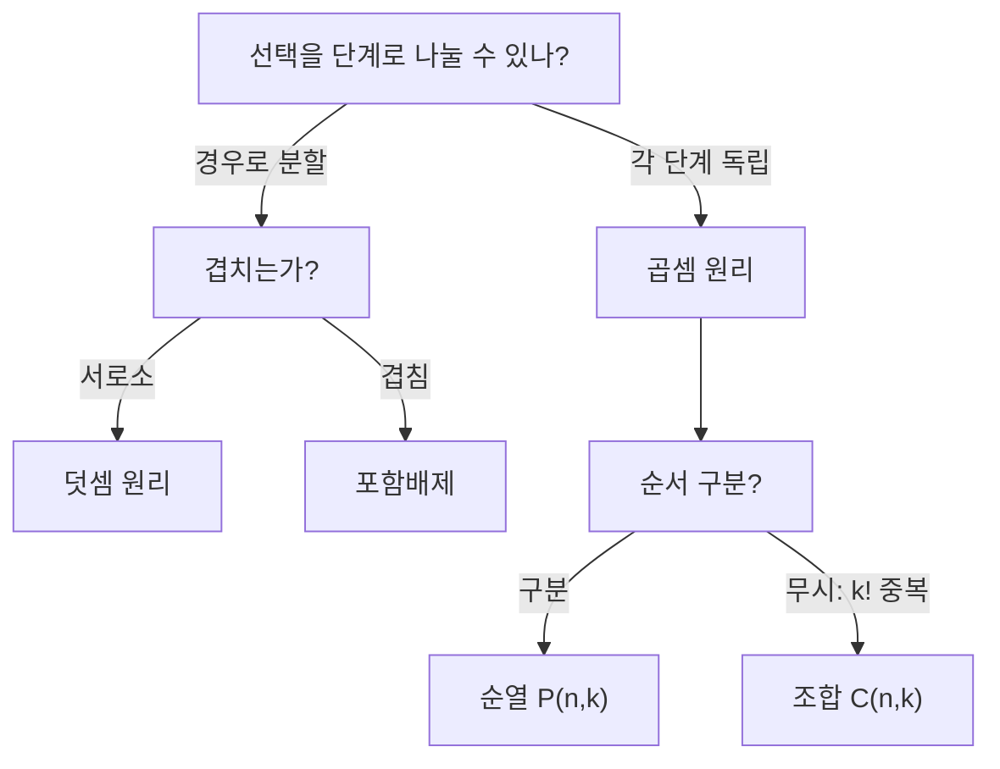

# 셈의 기본 원리

# 개요

셈(counting)은 유한집합의 원소 개수를 직접 열거하지 않고 구조로부터 결정하는 기술이다. 모든 계산은 두 개의 원리로 환원된다. 서로소인 경우로 쪼개면 개수를 더하고(덧셈 원리), 독립적인 선택을 이어 붙이면 개수를 곱한다(곱셈 원리). 여기서 순열, 조합, 이항계수, 다항계수가 차례로 유도된다.

셈의 증명 기법은 두 가지다. 하나는 같은 집합을 두 방식으로 세어 등식을 얻는 이중 계산(double counting), 다른 하나는 개수를 아는 집합과의 전단사를 만드는 전단사 증명(bijective proof)이다. 전단사 증명은 등식을 확인하는 데 그치지 않고 왜 성립하는지를 구조로 설명한다.

[유한 확률 공간](probability.md)에서 균등분포의 확률은 곧 경우의 수의 비이므로, 셈은 확률의 계산 도구이기도 하다.

# 직관

세 종류의 셔츠와 네 종류의 바지로 만드는 옷차림은 $3\times4=12$ 가지다. 선택을 단계로 나누고 각 단계의 가짓수를 곱한다. 반면 "셔츠 하나만 입거나 바지 하나만 입는" 방식은 $3+4=7$ 가지다. 두 경우가 겹치지 않으므로 더한다.

곱셈과 덧셈의 차이는 "그리고"와 "또는"의 차이다. 겹침이 있으면 단순히 더할 수 없고 [포함배제 원리](inclusion-exclusion.md)가 필요하다.



조합이 순열을 k!로 나눈 값인 이유는 "순서를 무시한 선택 하나"가 정확히 k!개의 순열에 대응하기 때문이다. 각 섬유(fiber)의 크기가 같은 사상으로 세는 이 방식이 나눗셈 원리다.

# 정의

유한집합 $A$ 의 원소 개수를 다음과 같이 쓴다.

$$
|A| = \char35{}A \in \mathbb{Z}_{\ge 0}
$$

## 덧셈 원리와 곱셈 원리

집합족이 서로소이면 합집합의 크기는 크기의 합이다. 곱집합의 크기는 크기의 곱이다.

$$
A_i\cap A_j=\varnothing\ (i\ne j)\ \Longrightarrow\ \Bigl|\bigcup_{i=1}^{m}A_i\Bigr|=\sum_{i=1}^{m}|A_i|,
\qquad |A_1\times\cdots\times A_m|=\prod_{i=1}^{m}|A_i|
$$

나눗셈 원리는 사상 버전이다. 전사함수 $f\colon A\to B$ 의 모든 섬유가 같은 크기 $d$ 를 가지면 다음이 성립한다.

$$
|A| = d\thinspace|B|
$$

## 순열, 조합, 이항계수

n개 원소에서 k개를 순서를 구분해 뽑는 방법의 수(k-순열)와, 순서를 무시해 뽑는 방법의 수(k-조합)를 각각 다음과 같이 정의한다.

$$
P(n,k)=\frac{n!}{(n-k)!}=n(n-1)\cdots(n-k+1),
\qquad
\binom{n}{k}=\frac{P(n,k)}{k!}=\frac{n!}{k!\thinspace(n-k)!}
$$

k가 0보다 작거나 n보다 크면 이항계수는 0으로 정의한다. 이항계수는 n원소 집합의 k원소 부분집합의 개수이며, 동시에 0과 1로 이루어진 길이 n의 열 중 1이 k개인 것의 개수다.

## 다항계수

$n$ 개의 대상을 크기가 각각 $k_1,\dots,k_m$ 인 이름 붙은 상자에 나누어 담는 방법의 수를 다항계수라 한다. 여기서 $k_1+\cdots+k_m=n$ 이다.

$$
\binom{n}{k_1,\dots,k_m}=\frac{n!}{k_1!\thinspace k_2!\cdots k_m!}
$$

같은 문자가 반복되는 문자열의 서로 다른 배열 수가 정확히 이 값이다. MISSISSIPPI(M 1개, I 4개, S 4개, P 2개)의 배열 수는 11!/(1!4!4!2!)=34650이다.

# 성질

## 이항정리

가환환에서 다음이 성립한다[^1].

$$
(x+y)^n=\sum_{k=0}^{n}\binom{n}{k}x^{k}y^{\thinspace n-k}
$$

증명은 전개항을 세는 것이다. 곱 $(x+y)(x+y)\cdots(x+y)$ 를 분배법칙으로 펼치면 각 인자에서 $x$ 또는 $y$ 를 고르는 모든 방법이 한 항씩 나타난다. $x$ 를 고른 인자의 집합이 $k$ 원소일 때 항은 $x^ky^{n-k}$ 이고, 그런 집합의 개수가 이항계수다.

다항정리는 같은 논증의 일반형이다.

$$
(x_1+\cdots+x_m)^n=\sum_{k_1+\cdots+k_m=n}\binom{n}{k_1,\dots,k_m}\thinspace x_1^{k_1}\cdots x_m^{k_m}
$$

## Pascal 점화식과 대칭성

$$
\binom{n}{k}=\binom{n-1}{k-1}+\binom{n-1}{k},
\qquad
\binom{n}{k}=\binom{n}{n-k}
$$

첫 식의 전단사 증명: n원소 집합의 k원소 부분집합을, 특정 원소 x를 포함하는 것과 포함하지 않는 것으로 분할한다. 전자는 나머지 n-1개에서 k-1개를 고르는 것과, 후자는 n-1개에서 k개를 고르는 것과 각각 일대일 대응한다. 두 번째 식은 부분집합을 여집합으로 보내는 사상이 전단사이기 때문이다.

## 이중 계산으로 얻는 항등식

부분집합 전체를 크기별로 분류하면 다음을 얻는다. 이항정리에 x=y=1을 넣은 것과 같다.

$$
\sum_{k=0}^{n}\binom{n}{k}=2^{n}
$$

Vandermonde 항등식은 m+n원소를 두 덩어리로 나눠 놓고 총 r개를 뽑을 때, 첫 덩어리에서 몇 개를 뽑는지로 경우를 나눈 결과다.

$$
\binom{m+n}{r}=\sum_{k=0}^{r}\binom{m}{k}\binom{n}{r-k}
$$

## 중복조합과 막대-별 대응

$n$ 종류에서 중복을 허용해 $k$ 개를 뽑는 방법, 곧 $x_1+\cdots+x_n=k$ 의 음이 아닌 정수해의 개수는 다음과 같다.

$$
\left(\negthinspace\negthinspace\binom{n}{k}\negthinspace\negthinspace\right)=\binom{n+k-1}{k}
$$

$k$ 개의 별과 $n-1$ 개의 막대를 일렬로 배열하는 것과의 전단사로 증명한다. 막대가 별들을 $n$ 개의 구간으로 나누고, $i$ 번째 구간의 별 개수가 $x_i$ 다. 전체 $n+k-1$ 개의 자리에서 막대 자리를 고르는 방법의 수가 곧 개수다.

## 주의점

"구분되는가"를 명시하지 않으면 답이 갈린다. 공을 상자에 넣는 문제는 공의 구분, 상자의 구분, 빈 상자 허용 여부에 따라 12가지 조합(twelvefold way)으로 나뉘고, 상자가 구분되지 않는 경우는 분할수나 Stirling 수가 등장해 닫힌 형태가 없다. 상자가 구분되지 않는 수 분할의 개수는 [생성함수](generating-functions.md)로 다룬다.

# 활용

## 확률 계산

균등분포 표본공간에서 사건의 확률은 경우의 수의 비다. 52장에서 5장을 뽑아 정확히 한 쌍(one pair)이 나올 확률은 다음과 같다.

$$
\frac{\binom{13}{1}\binom{4}{2}\binom{12}{3}4^{3}}{\binom{52}{5}}=\frac{1098240}{2598960}\approx 0.4226
$$

숫자 하나를 골라 그 숫자의 무늬 둘을 고르고, 남은 세 장은 서로 다른 세 숫자에서 무늬를 각각 하나씩 고른다.

## 대수와 정수론

[군](groups.md)의 Lagrange 정리는 잉여류가 같은 크기라는 나눗셈 원리다. [군 작용](group-actions.md)에서 궤도-안정자 정리도 같은 형태이며, Burnside 보조정리는 대칭을 무시한 셈에 쓰인다. [정수의 합동](modular-arithmetic.md)에서 이항계수의 소수 나눗셈 성질(Kummer, Lucas 정리)이 나온다.

## 계산

이항계수는 팩토리얼을 직접 계산하면 오버플로가 쉽게 발생하므로 점화식이나 축약 곱으로 계산한다.

```python
from math import comb

def binom(n, k):
    if k < 0 or k > n:
        return 0
    k = min(k, n - k)          # 대칭성으로 항 수를 줄인다
    result = 1
    for i in range(k):
        result = result * (n - i) // (i + 1)   # 각 단계에서 나누어떨어진다
    return result

assert all(binom(n, k) == comb(n, k) for n in range(40) for k in range(-1, n + 2))
```

각 단계의 부분곱이 이항계수 C(n-k+i+1, i+1)의 정수배임이 보장되므로 정수 나눗셈이 정확한다.

[^1]: MIT OpenCourseWare, Mathematics for Computer Science (6.042J), Chapter 15 "Cardinality Rules". https://ocw.mit.edu/courses/6-042j-mathematics-for-computer-science-spring-2015/

# 연관 문서

## 선수지식

- [집합](sets.md)
- [함수](functions.md)
- [조합론 개관](combinatorics-overview.md)

## 더 알아보기

- [생성함수](generating-functions.md)
- [포함배제 원리](inclusion-exclusion.md)
- [비둘기집 원리](pigeonhole-principle.md)
- [매칭과 Hall 정리](matchings.md)

#combinatorics #probability #group_theory
