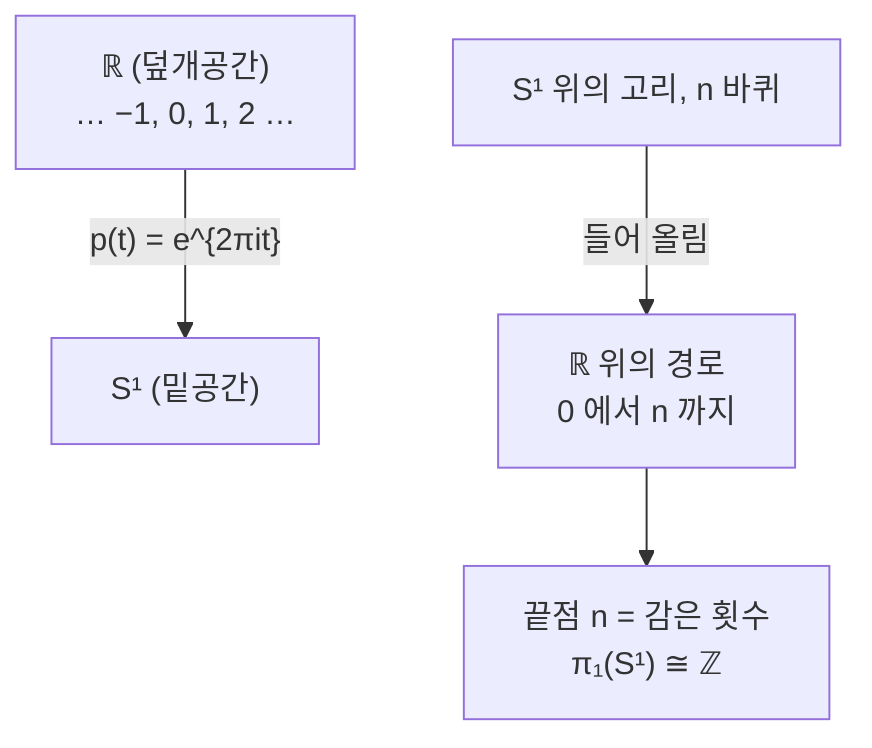

# 덮개공간

# 개요

[기본군](fundamental-group.md)은 고리를 연속변형으로 분류해 공간의 구멍을 센다. 원 $S^1$ 의 기본군이 $\mathbb Z$ 라는 것은 고리가 몇 바퀴 감겼는지가 유일한 불변량이라는 뜻이다.

이 "몇 바퀴" 를 눈으로 보는 방법이 있다. 실직선을 나선처럼 감아 원 위로 보내면, 원 위의 한 점 위에 정수만큼의 점이 놓인다. 원 위의 고리를 이 나선 위로 들어 올리면 시작점과 끝점의 차이가 정확히 감은 횟수다. 기본군의 원소가 들어 올림의 끝점으로 실현된다.

이것이 덮개공간의 아이디어다. 위에서 국소적으로는 아래와 똑같이 생겼지만 전체적으로는 여러 겹으로 쌓여 있는 공간을 두고, 아래의 위상 정보를 위의 기하로 바꿔 읽는다. 결과는 강력한 대응이다. 한 공간의 덮개들이 그 기본군의 부분군들과 정확히 일대일로 대응하며, 이것이 [Galois 이론](galois-theory.md)의 대응과 같은 모양을 가진다.

# 직관

## 나선이 원을 덮는다

$p:\mathbb R\to S^1$, $p(t)=e^{2\pi it}$ 를 보자. 원 위의 각 점 위에는 정수만큼 떨어진 점들이 놓이고, 원의 작은 호를 뒤집어 보면 실직선의 서로 겹치지 않는 구간들이 하나씩 대응한다.

이 구조에서 고리를 들어 올릴 수 있다. $S^1$ 에서 $n$ 바퀴 도는 고리를 $\mathbb R$ 로 들어 올리면 $0$ 에서 시작해 $n$ 에서 끝나는 경로가 된다. 고리는 닫혀 있었지만 들어 올린 경로는 닫히지 않으며, 그 벌어진 정도가 감은 횟수다.

$\mathbb R$ 이 단순연결이라는 것이 핵심이다. 위에는 고리가 없으므로 아래의 고리들이 전부 위에서 벌어지고, 그 벌어짐이 기본군을 그대로 그려 낸다.

## 부분군은 어디까지 닫히는가

들어 올린 경로가 닫히는 고리도 있다. $\mathbb R$ 대신 원을 두 겹으로 감는 $z\mapsto z^2$ 를 덮개로 쓰면, 두 바퀴 도는 고리는 위에서도 닫히지만 한 바퀴 도는 고리는 닫히지 않는다.

즉 덮개마다 "위에서도 닫히는 고리들" 이 정해지고, 그것이 기본군의 부분군을 이룬다. 덮개가 클수록 이 부분군이 작아진다. 이 대응이 전단사라는 것이 이 이론의 중심 정리다.

## 갑판 변환이 군 작용을 준다

덮개 위에서 각 층을 다른 층으로 옮기는 자기동형사상들을 갑판 변환이라 한다. $\mathbb R\to S^1$ 에서는 정수만큼의 평행이동이며, 이것이 $\mathbb Z$ 의 [군 작용](group-actions.md)이다.

그래서 덮개 이론은 군 작용 이론과 같은 것이 된다. 좋은 성질의 작용으로 몫을 취하면 덮개가 나오고, 덮개에서 갑판 변환을 모으면 작용이 나온다.

# 정의

## 덮개사상

연속 전사 $p:\tilde X\to X$ 가 덮개사상이라는 것은, 각 $x\in X$ 가 열린 이웃 $U$ 를 가져 $p^{-1}(U)$ 가 서로소인 열린집합들의 합집합이고 각각이 $p$ 에 의해 $U$ 와 위상동형이라는 뜻이다. 그런 $U$ 를 고르게 덮인 이웃이라 한다.

$X$ 가 연결이면 $|p^{-1}(x)|$ 가 $x$ 에 무관하며 이를 덮개의 겹 수라 한다.

## 들어 올림

경로 들어 올림 성질이 덮개사상의 핵심이다. 경로 $\gamma:[0,1]\to X$ 와 점 $\tilde x_0\in p^{-1}(\gamma(0))$ 가 주어지면 $\tilde\gamma(0)=\tilde x_0$ 인 들어 올림 $\tilde\gamma$ 가 유일하게 존재한다.

호모토피도 들어 올려진다. 따라서 서로 호모토픽한 두 고리의 들어 올림은 같은 끝점을 가진다.

## 기본군의 상

밑점을 고정하면 $p_*:\pi_1(\tilde X,\tilde x_0)\to\pi_1(X,x_0)$ 이 단사이고, 그 상이 위에서 말한 "위에서도 닫히는 고리들" 의 부분군이다.

## 보편덮개

$\tilde X$ 가 단순연결인 덮개를 보편덮개라 한다. 이때 대응하는 부분군은 자명군이다.

$X$ 가 연결, 국소 경로연결이고 준국소 단순연결이면 보편덮개가 존재하며 동형을 무시하면 유일하다. 마지막 조건은 각 점이 이웃을 가져 그 안의 고리가 $X$ 안에서 수축한다는 것으로, 무한히 작은 구멍이 쌓이는 병적인 공간을 배제한다. 하와이 귀걸이가 이 조건을 어긴다.

# 성질

## Galois 대응

$X$ 가 위 조건을 만족하면, 밑점을 가진 연결 덮개들의 동형류와 $\pi_1(X,x_0)$ 의 부분군들 사이에 전단사가 있다.

$$
(\tilde X,\tilde x_0)\ \longmapsto\ p_*\pi_1(\tilde X,\tilde x_0)\ \le\ \pi_1(X,x_0)
$$

이 대응이 포함관계를 뒤집어 보존한다.

| 덮개 | 부분군 |
|---|---|
| 보편덮개 | 자명군 |
| $X$ 자신 | 전체 |
| $n$ 겹 덮개 | 지수 $n$ 인 부분군 |
| 정규 덮개 | 정규부분군 |
| 덮개 사이의 사상 | 부분군의 포함 |

[Galois 이론](galois-theory.md)의 체 확대와 부분군의 대응과 형태가 같다. 실제로 두 이론은 Grothendieck 의 Galois 이론이라는 하나의 틀로 통합된다.

## 갑판 변환과 정규 덮개

갑판 변환군 $\mathrm{Deck}(p)$ 는 $p\circ h=p$ 인 위상동형 $h$ 들의 군이다. 이 군은 각 층에 자유롭게 작용한다.

덮개가 정규라는 것은 갑판 변환군이 층 위에 추이적으로 작용한다는 뜻이고, 대응 부분군 $H$ 가 정규라는 것과 동치다. 그때 다음이 성립한다.

$$
\mathrm{Deck}(p)\cong\pi_1(X,x_0)/H
$$

보편덮개에서는 $H$ 가 자명하므로 $\mathrm{Deck}(p)\cong\pi_1(X,x_0)$ 다. 기본군이 보편덮개 위의 대칭군으로 실현된다는 이 사실이 이론에서 가장 아름다운 부분이다.

## 몫으로서의 덮개

군 $G$ 가 공간 $Y$ 에 적절히 불연속적으로 작용하면, 즉 각 점이 이웃 $U$ 를 가져 $gU\cap U\ne\emptyset$ 인 $g$ 가 항등원뿐이면, 몫사상 $Y\to Y/G$ 가 정규 덮개이고 갑판 변환군이 $G$ 다.

이것이 덮개를 만드는 표준적인 방법이다.

| 작용 | 덮개 | 기본군 |
|---|---|---|
| $\mathbb Z$ 가 $\mathbb R$ 에 평행이동 | $\mathbb R\to S^1$ | $\mathbb Z$ |
| $\mathbb Z^2$ 가 $\mathbb R^2$ 에 | $\mathbb R^2\to T^2$ | $\mathbb Z^2$ |
| $\mathbb Z/2$ 가 $S^n$ 에 대척점 | $S^n\to\mathbb{RP}^n$ | $\mathbb Z/2$ ($n\ge2$) |
| 자유군이 나무에 | 나무 $\to$ 꽃다발 | 자유군 |

## 응용: 원의 기본군

$\mathbb R$ 이 단순연결이고 $\mathbb R\to S^1$ 이 덮개이므로 이것이 보편덮개다. 갑판 변환군이 $\mathbb Z$ 이므로 $\pi_1(S^1)\cong\mathbb Z$ 다.

직접 세어도 같다. 고리의 들어 올림의 끝점이 정수이고, 이 대응이 잘 정의되며 준동형이고 전단사임을 확인하면 된다. 이 결과에서 Brouwer 고정점 정리와 대수학의 기본정리가 따라온다.

## 응용: Nielsen–Schreier 정리

자유군의 모든 부분군은 자유군이다. 위상적 증명이 짧다.

계수 $n$ 인 자유군은 원 $n$ 개를 한 점에서 붙인 꽃다발의 기본군이다. 그래프의 덮개공간은 다시 그래프이고, 그래프의 기본군은 항상 자유군이다. 부분군이 어떤 덮개에 대응하므로 자유군이 된다.

유한 지수 $k$ 인 부분군의 계수까지 나온다. $k$ 겹 덮개 그래프의 Euler 지표가 $k$ 배이므로 계수는 $k(n-1)+1$ 이다. 순수 대수적 증명보다 훨씬 투명하다.

## 들어 올림 판정

연결, 국소 경로연결 공간 $Y$ 와 사상 $f:Y\to X$ 에 대해, $f$ 가 $\tilde X$ 로 들어 올려질 필요충분조건은 다음이다.

$$
f_*\pi_1(Y,y_0)\subseteq p_*\pi_1(\tilde X,\tilde x_0)
$$

$Y$ 가 단순연결이면 조건이 자동으로 만족되므로 항상 들어 올려진다. 이것이 경로와 호모토피 들어 올림의 일반화다.

# 활용

## 기본군 계산

보편덮개를 찾으면 기본군이 갑판 변환군으로 바로 나온다. 위 표의 사례들이 그 방식이고, 특히 대칭성이 뚜렷한 공간에서 효율적이다. 반대로 기본군을 알면 어떤 덮개들이 존재하는지가 부분군을 세는 문제가 된다.

## Riemann 곡면과 단일화

$\log z$ 나 $\sqrt z$ 처럼 여러 값을 가지는 함수는 정의역을 덮개로 바꾸면 한 값을 가지는 함수가 된다. Riemann 곡면이 이 착상에서 나왔다.

단일화 정리는 모든 단순연결 Riemann 곡면이 구, 복소평면, 단위원판 중 하나와 동형이라고 말한다. 임의의 곡면이 이 셋 중 하나의 몫으로 나오므로, 곡면의 기하가 구면기하, 유클리드 기하, 쌍곡기하 셋 중 하나로 분류된다.

## 군론의 위상적 도구

군을 공간의 기본군으로 실현하고 그 덮개를 다루는 방식이 기하적 군론의 기본 전략이다. Nielsen–Schreier 정리 외에도 Kurosh 부분군 정리, 그래프의 군 이론이 같은 방식으로 증명된다. Bass–Serre 이론은 나무 위의 작용으로 군의 분해를 읽는다.

## 물리에서의 쓰임

배위공간이 단순연결이 아니면 보편덮개 위에서 상태를 기술해야 하는 상황이 생긴다. $SO(3)$ 의 보편덮개가 $SU(2)$ 이고 두 겹이라는 사실이 스핀 $1/2$ 입자가 $2\pi$ 회전에서 부호를 바꾸는 이유다. 2 차원에서 입자 배위공간의 기본군이 땋임군이 되는 것이 애니온의 근거다.

# 연관 문서

## 선수지식

- [기본군](fundamental-group.md)
- [군 작용](group-actions.md)

## 더 알아보기

- [Lie 군과 지수사상](lie-groups.md)

#algebraic_topology #topology #group_theory
