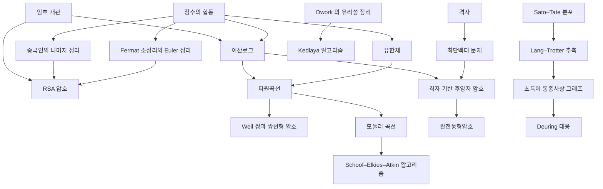

# 암호 개관

# 개요

암호는 계산의 비대칭 위에 선다. 한 방향은 다항시간에 계산되고 역방향은 알려진 알고리즘으로 지수시간이 걸리는 함수를 고른다. 어느 함수가 그런 비대칭을 가지는지는 증명된 것이 아니라 가정이다.

[정수의 합동](modular-arithmetic.md)에서 시작한다. 여기서 두 갈래가 나온다. 합성수의 소인수분해가 어렵다는 가정에서 [RSA](rsa-cryptosystem.md)(Rivest–Shamir–Adleman)가 나오고, 유한군에서 지수를 되찾기 어렵다는 가정에서 [이산로그](discrete-logarithm.md)와 Diffie–Hellman 키 합의가 나온다. 이산로그를 [유한체](finite-fields.md)의 곱셈군 대신 [타원곡선](elliptic-curves.md)의 점군에서 걸면 지표 계산법이 통하지 않아 같은 안전성을 훨씬 작은 키로 얻는다.

Shor 알고리즘이 두 가정을 함께 무너뜨린다. 두 문제가 모두 유한 아벨군의 숨은 부분군 문제이므로 대체 가정은 그 환원을 피해야 한다. [격자](lattices.md)의 근사 최단벡터 문제가 가장 유력한 후보이고, [격자 기반 후양자 암호](post-quantum-cryptography.md)가 그 위에 선다. 그 잡음 구조에서 [완전동형암호](homomorphic-encryption.md)가 나온다. [초특이 동종사상 그래프](supersingular-isogeny-graphs.md)가 또 다른 후보다.

# 지도

# 갈래

## 산술 기반

- [정수의 합동](modular-arithmetic.md) — 공개키 방식이 실제로 계산하는 자리. 반복 제곱과 확장 유클리드 알고리즘
- [군](groups.md) — 이산로그를 정의하는 데 필요한 것은 연산 하나와 위수뿐이다
- [유한체](finite-fields.md) — 위수 $q=p^k$ 의 체. 곱셈군이 순환군이므로 이산로그를 여기에 건다

## 공개키의 두 가정

- [RSA 암호](rsa-cryptosystem.md) — 소인수분해의 어려움. Euler 정리가 지수의 주기를 주고 중국인의 나머지 정리가 복호를 가속한다
- [이산로그](discrete-logarithm.md) — 유한군에서 $g^x$ 로부터 $x$ 를 되찾는 문제. Pohlig–Hellman 환산과 지표 계산법이 안전한 군의 조건을 정한다

## 타원곡선 암호

- [타원곡선](elliptic-curves.md) — 곡선 위의 점에 현과 접선으로 군 구조를 준다. 준지수 시간 알고리즘이 없어 키 길이가 짧다
- [쌍선형 암호](pairing-based-cryptography.md) — 비틀림점 위의 쌍선형 사상. MOV(Menezes–Okamoto–Vanstone) 환산의 공격 도구이자 신원 기반 암호의 구성 도구
- [Schoof–Elkies–Atkin 알고리즘](sea-algorithm.md) — 곡선의 점 개수를 $\log p$ 의 다항시간에 센다. 곡선을 고른 뒤 위수가 큰 소인수를 가지는지 확인하는 단계
- [Kedlaya 알고리즘](kedlaya-algorithm.md) — 초타원곡선의 zeta 함수를 $p$ 진 코호몰로지로 계산한다

## 격자 기반 암호

- [격자](lattices.md) — 같은 점집합을 짧고 거의 직교하는 기저와 길고 거의 평행한 기저가 함께 나타낸다. 기저 축소와 Minkowski 정리
- [최단벡터 문제](shortest-vector-problem.md) — 근사율 $\gamma$ 에 따라 난해성이 갈리고, 암호는 $\gamma$ 가 다항식인 구간을 쓴다
- [격자 기반 후양자 암호](post-quantum-cryptography.md) — 무작위로 뽑은 사례가 최악의 사례만큼 어렵다는 환산이 파라미터 선택의 근거가 된다
- [완전동형암호](homomorphic-encryption.md) — 암호문을 복호하지 않고 덧셈과 곱셈을 수행한다. 연산마다 커지는 잡음을 재부팅으로 초기화한다

## 동종사상 암호

- [Lang–Trotter 추측과 초특이 소수](lang-trotter.md) — 고정된 곡선을 여러 소수로 환원할 때 초특이가 되는 빈도
- [초특이 동종사상 그래프](supersingular-isogeny-graphs.md) — 초특이 $j$ 불변량을 정점으로 하는 정규 그래프. 그 위의 무작위 걸음이 SIDH(supersingular isogeny Diffie–Hellman)의 가정이다
- [Deuring 대응](deuring-correspondence.md) — 초특이 곡선의 자기준동형환이 사원수대수의 극대차수와 대응한다. 이 대응의 계산이 동종사상 문제의 난이도를 결정한다

# 연관 문서

## 선수지식

- [집합](sets.md)

## 더 알아보기

- [이산로그](discrete-logarithm.md)
- [RSA 암호](rsa-cryptosystem.md)

#cryptography #number_theory #computation #overview
