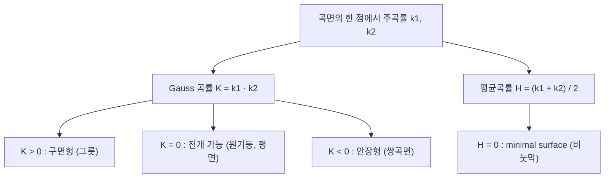

# 곡률

# 개요

곡률은 어떤 대상이 직선이나 평면에서 얼마나 벗어나는지를 재는 미분 불변량이다. 평면곡선에서는 단위접벡터가 회전하는 속도로, 공간곡선에서는 곡률과 비틀림 두 숫자로, 곡면에서는 두 주곡률의 곱과 평균으로 나타난다. 결정적인 사실은 곡면의 Gauss 곡률이 외부 공간에 어떻게 놓였는지와 무관하게 곡면 내부에서 측정한 길이만으로 결정된다는 것이다(Gauss의 Theorema Egregium). 이 내재성 덕분에 곡률은 일반상대성이론과 [다양체](manifolds.md) 위의 기하학으로 확장된다. Gauss–Bonnet 정리는 곡률의 총합이 위상적 불변량이 됨을 말한다.

# 직관

곡선을 자동차의 경로로, 매개변수를 시간으로 보자. 속도의 크기를 1로 고정하면 가속도는 방향 변화만을 나타내고, 그 크기가 곡률이다. 반지름 r인 원을 일정한 속력으로 돌면 곡률은 r의 역수다. 직선은 방향이 변하지 않으므로 곡률이 0이다.

곡면에서는 한 점에서 방향을 하나 고르고, 그 방향과 법선이 만드는 평면으로 곡면을 자른다. 잘린 곡선의 곡률을 normal curvature라 하고, 방향을 한 바퀴 돌리면 최대·최소가 생긴다. 이 둘이 주곡률이다.



부호의 의미가 중요하다. 두 주곡률이 같은 쪽으로 휘면 점 근처의 곡면은 접평면의 한쪽에 놓이고 Gauss 곡률이 양수다. 반대쪽으로 휘면 안장 모양이고 음수다. 종이(평면)를 구부려 원기둥을 만들 때 한 주곡률은 0이므로 곱은 여전히 0이다. 그래서 종이는 찢지 않고 원기둥으로 말 수 있지만 구면으로는 만들 수 없다. 이것이 Theorema Egregium의 일상적 표현이며, 피자 조각을 반으로 접으면 앞으로 처지지 않는 이유와 같다.

# 정의

## 평면곡선과 공간곡선

R의 3차 곱공간의 곡선을 호길이로 매개화하여 속도의 크기가 항상 1이 되게 하자. 단위접벡터 T, 주법선 N, 종법선 B를 쓰면 곡률과 비틀림은 다음으로 정의된다.

$$
T=\gamma',\qquad \kappa=\lVert T'\rVert,\qquad N=\frac{T'}{\kappa},\qquad B=T\times N
$$

곡률이 어디서도 0이 아닐 때 이 세 벡터는 각 점에서 정규직교기저를 이루고([내적공간](inner-product-spaces.md)의 정규직교성), 그 도함수는 자기 자신들로 표현된다. 이것이 Frenet–Serret 공식이다[^1].

$$
\begin{pmatrix}T'\\ N'\\ B'\end{pmatrix}
=\begin{pmatrix}0&\kappa&0\\ -\kappa&0&\tau\\ 0&-\tau&0\end{pmatrix}
\begin{pmatrix}T\\ N\\ B\end{pmatrix}
$$

계수행렬이 반대칭인 것은 기저가 정규직교임을 미분한 결과다. 여기서 τ가 비틀림(torsion)이며, 곡선이 한 평면에서 벗어나는 정도를 잰다.

호길이가 아닌 일반 매개변수에서는 다음 공식을 쓴다.

$$
\kappa=\frac{\lVert \gamma'\times\gamma''\rVert}{\lVert\gamma'\rVert^{3}},\qquad
\tau=\frac{(\gamma'\times\gamma'')\cdot\gamma'''}{\lVert\gamma'\times\gamma''\rVert^{2}}
$$

## 곡면의 두 기본형식

곡면의 국소 매개화를 쓰면 접벡터의 길이를 재는 first fundamental form과 법선 방향으로 휘는 정도를 재는 second fundamental form이 나온다. 단위법벡터를 n이라 하면

$$
\mathrm{I}=\begin{pmatrix}E&F\\ F&G\end{pmatrix},\quad E=r_u\cdot r_u,\ F=r_u\cdot r_v,\ G=r_v\cdot r_v
$$

$$
\mathrm{II}=\begin{pmatrix}e&f\\ f&g\end{pmatrix},\quad e=r_{uu}\cdot n,\ f=r_{uv}\cdot n,\ g=r_{vv}\cdot n
$$

주곡률은 I의 역행렬과 II의 곱(shape operator)의 eigenvalue이며, Gauss 곡률과 평균곡률은 각각 그 행렬식과 대각합의 절반이다.

$$
K=k_1k_2=\frac{eg-f^{2}}{EG-F^{2}},\qquad H=\frac{k_1+k_2}{2}
$$

# 성질

## Theorema Egregium

Gauss 곡률은 first fundamental form과 그 편도함수만으로 표현된다. 즉 K는 곡면의 내재적(intrinsic) 양이며, 주변 공간에 어떻게 매장되었는지에 의존하지 않는다[^2]. 직교 매개화(F=0)에서는 다음 형태가 된다.

$$
K=-\frac{1}{2\sqrt{EG}}\left[\frac{\partial}{\partial u}\!\left(\frac{G_u}{\sqrt{EG}}\right)+\frac{\partial}{\partial v}\!\left(\frac{E_v}{\sqrt{EG}}\right)\right]
$$

따라서 길이를 보존하는 사상(local isometry)은 K를 보존한다. 평면의 K는 0이므로 K가 0이 아닌 구면의 어떤 조각도 평면과 등거리동형이 될 수 없다. 지도 제작에서 각과 거리와 면적을 동시에 보존하는 투영이 존재하지 않는 이유가 이것이다. 반면 평균곡률 H는 내재적이 아니다. 평면과 원기둥은 국소적으로 등거리동형이지만 H는 각각 0과 0이 아닌 값이다.

## Gauss–Bonnet

R를 곡면 위의 조각으로, 그 경계가 조각마다 매끄러운 닫힌 곡선이고 외각이 주어졌다고 하자. 그러면 다음이 성립한다[^3].

$$
\iint_{R}K\,dA+\oint_{\partial R}\kappa_g\,ds+\sum_i \alpha_i=2\pi\chi(R)
$$

여기서 κ_g는 경계의 geodesic curvature, α_i는 꼭짓점에서의 외각, χ는 [Euler 지표](euler-characteristic.md)다. 경계가 없는 compact 방향지음 가능 곡면에서는 경계항이 사라지고

$$
\iint_{M}K\,dA=2\pi\chi(M)=2\pi(2-2g)
$$

가 된다. 구면은 오른쪽이 4π이고, 반지름 r의 구면은 K가 r의 제곱의 역수이고 면적이 4π의 r 제곱배이므로 좌변도 4π다. 원환면은 χ가 0이므로 총 곡률이 0이다. 곡률을 어떻게 일그러뜨려도 총합은 변하지 않는다는 것이 이 정리의 요지다.

## 따름정리

- 구면 삼각형의 내각의 합은 π보다 크고, 초과분이 넓이에 비례한다. 세 변이 geodesic이면 κ_g가 0이므로 Gauss–Bonnet이 직접 넓이 공식을 준다.
- 원환면에는 곡률이 어디서도 양수인 metric이 없다. 총 곡률이 0이어야 하기 때문이다.
- K가 항상 0이면 곡면은 국소적으로 평면과 등거리동형이다(전개 가능 곡면).

# 활용

- 일반상대성이론: Riemann 곡률 tensor가 조석력을, 그 축약이 Einstein 방정식의 좌변을 이룬다. 2차원에서는 이 정보가 Gauss 곡률 하나로 압축된다.
- 이산기하와 그래픽: 삼각망의 꼭짓점에서 각도 결손을 모으면 이산 Gauss 곡률이 되고, 그 총합이 정확히 2π의 χ배가 되어 Gauss–Bonnet의 이산판이 성립한다.
- minimal surface: 평균곡률이 0인 곡면은 면적의 임계점이며 비눗막의 모양이다.
- 데이터 해석: 곡선의 곡률은 경로 평활화와 모서리 검출에, 곡면의 주곡률은 형상 분류에 쓰인다.

나선의 곡률과 비틀림 계산 예다.

```python
import numpy as np

# helix: gamma(t) = (a cos t, a sin t, b t)
a, b = 2.0, 1.0
# 호길이 매개화 후 kappa = a/(a^2+b^2), tau = b/(a^2+b^2)
kappa = a / (a**2 + b**2)
tau = b / (a**2 + b**2)
print(kappa, tau)   # 0.4 0.2 : 둘 다 상수

# 반지름 r 구면: K = 1/r^2, 총 곡률 = (1/r^2)(4 pi r^2) = 4 pi = 2 pi * chi(S^2)
r = 3.0
print((1 / r**2) * 4 * np.pi, 2 * np.pi * 2)
```

[^1]: Frenet–Serret 공식과 일반 매개변수 공식. Wolfram MathWorld, "Frenet Formulas". https://mathworld.wolfram.com/FrenetFormulas.html
[^2]: Theorema Egregium: Gauss 곡률이 Riemann metric의 불변량이라는 Gauss(1827)의 결과. 개요와 Brioschi 공식은 O. Jaïbi, "Gaussian Curvature and The Gauss–Bonnet Theorem", Leiden bachelor thesis, §2. https://math.leidenuniv.nl/scripties/JaibiBach.pdf
[^3]: Gauss–Bonnet 공식의 경계·꼭짓점 항을 포함한 진술. Wolfram MathWorld, "Gauss-Bonnet Formula". https://mathworld.wolfram.com/Gauss-BonnetFormula.html

# 연관 문서

## 선수지식

- [미분](derivative.md)
- [내적 공간](inner-product-spaces.md)

## 더 알아보기

- [Riemann 계량과 측지선](riemannian-metrics.md)
